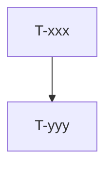

# Roadmap: <slug> epics (единый канон)

**Дата:** YYYY-MM-DD  
**Роль:** BACK PLAN | FRONT PLAN | INTEG PLAN  
**Назначение:** карта «что за чем»; **не** заменяет полные `plan-<epic_id>-*.md`.  
**Machine queue (slug, источник):** [`roadmap-<slug>-epics.queue.yaml`](roadmap-<slug>-epics.queue.yaml)  
**Loop canon (после MERGE):** [`roadmap-epics.queue.yaml`](roadmap-epics.queue.yaml) — @.cursor/rules/shared/workflow-roadmap-merge.mdc  
Пути по роли:
- BACK → `memory-bank/back/plan/`
- FRONT → `memory-bank/front/plan/`
- INTEG → `memory-bank/integration/plan/`  
Шаблоны: @.cursor/templates/roadmap-epics.md · @.cursor/templates/roadmap-queue.yaml

---

## 0. Epic cut

| Порядок | ID | План | Суть | In scope | Out of scope |
|---------|-----|------|------|----------|--------------|
| 1 | T-xxx | [plan-T-xxx-….md](plan-T-xxx-….md) | … | … | … |

---

## 1. Зависимости

| От | К | Тип | Почему |
|----|---|-----|--------|
| T-xxx | T-yyy | hard | … |

`hard` → обязательно в `.queue.yaml` `deps`. soft/recommend — только здесь (narrative).

---

## 2. Порядок выполнения (канон)

Один эпик за раз. Машинный порядок = `.queue.yaml` `queue[]`.

1. **T-xxx** → QA  
2. **T-yyy** → QA  

---

## 3. Статус (human mirror)

| Артефакт | Статус |
|----------|--------|
| **Этот roadmap** | active |
| **`.queue.yaml`** | machine canon для loop |
| plan-T-xxx | PLAN done · next DECOMPOSE |

Done для loop = QA pass + REFLECT (+ queue), не текст этой таблицы.

---

## 4. Handoff

- Next: `* PLAN` **сам** merge → затем `* DECOMPOSE` первого из **canon** `roadmap-epics.queue.yaml`
- Loop chain: `EPIC_CHAIN_ROADMAP=1` → `roadmap-advance` читает **только** canon `.queue.yaml`
