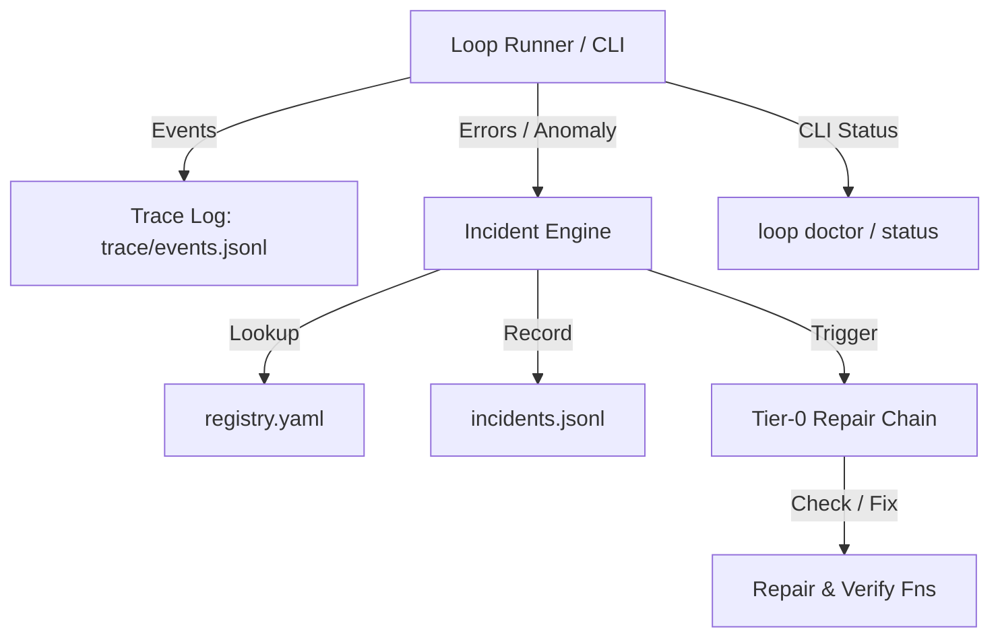

# System loop — автоцикл (вне memory-bank)

Каталог **`loop/`** — автоматизация ролей. `memory-bank/` — артефакты. The source of truth is `activeContext.md` plus the decompose index.

**Канон переходов:** `memory-bank/activeContext.md` + `plan/decompose-*/index.yaml` + implement step.  
**Очередь эпиков (loop canon):** `memory-bank/back/plan/roadmap-epics.queue.yaml` (sibling `.md`; loop не грузит md). Opt-in: `EPIC_CHAIN_ROADMAP=1` → `roadmap-advance`. Default `0` — stop / optional DAG fanout.  
MULTI-EPIC PLAN пишет slug `roadmap-<slug>-epics.queue.yaml`; **`* PLAN` сам** вызывает CLI `context_loop.py roadmap-merge` в той же сессии. Ручной `BACK|FRONT|INTEG ROADMAP MERGE` — ops, если канон устарел без PLAN. Templates: roadmap-epics.md · roadmap-queue.yaml.  
Для cross-epic journey runner использует runner-owned `loop/dag/*.yaml`: манифест `loop-dag/v2`, dependency-ready узлы выбираются последовательно и стабильно. `GAP_FANOUT` в текущем checkout запускается вручную через `./loop/loop.sh --phase GAP_FANOUT`; он не является автоматическим переходом `loop.sh`.  
Следующий шаг и режим выбираются по activeContext; DAG только переключает эпики. Durable checkpoint cursor не принадлежит `state.json`: `state.json` — телеметрическая проекция checkpoint, а конфликт checkpoint/index останавливается fail-closed.  
Runner владеет сессией, bounded timeout/retry и status evidence; агент владеет содержимым шага, Handoff и state mutation только через канонические артефакты.

DAG-команды:

```bash
./loop/loop.sh --dag-generate portal
./loop/loop.sh --phase GAP_FANOUT
./loop/loop.sh --status
```

Phase C canary (локальная evidence-проверка, без запуска runner):

```bash
timeout 300s .venv/bin/pytest loop/tests/test_dag_canary.py loop/tests/test_finish_integrity.py -q
```

Canary проверяет `canary-finish-integrity`: только последовательную цепочку `validate_finish → check_after → prepare_session`, completion artifact и integrity gate. Для rollback не удаляйте checkpoint evidence; восстановите последний валидированный cursor или `resume_from_step` и используйте помеченный manual fallback.

Манифест — YAML `loop-dag/v2` с `pipeline.id`, `source`, `execution` и `nodes[]`; каждый узел содержит `id`, `decompose`, опциональный `role_dir` и `depends_on`. Совместимый v1-манифест читается только через явный адаптер/диагностику, не как silent fallback.

| | |
|--|--|
| **Курсор/переходы** | `memory-bank/activeContext.md` + decompose index |
| **Transition Engine** | `loop/epic_transition.py` (Unified Phase API) |
| **Гайд** | [`WORKFLOW.md`](WORKFLOW.md) |
| **CLI** | `loop/context_loop.py` |
| **Runner** | `./loop/loop.sh` |
| **Тесты** | `.venv/bin/pytest loop/tests -q` |
| **FINISH** | `.cursor/rules/shared/finish-block.mdc` |

## Observability & Incident Diagnostics

The loop subsystem features structured telemetry, trace recording, incident management, and automated Tier-0 repairs.



### Key Components

- **Incidents Event Log (`incidents.jsonl`)**: Structured record of all reported incidents, diagnostic codes, timestamps, and Tier-0 resolution outcomes.
- **Trace Event Stream (`events.jsonl`)**: Event stream recording state transitions, session starts, and step executions.
- **Metrics Aggregator (`metrics.json`)**: Real-time aggregation of session durations, incident counts, and repair success rates.
- **Loop Doctor CLI (`python3 loop/context_loop.py doctor`)**: Diagnostic command to scan system health, audit locks, verify activeContext shape, check finish integrity, and trigger Tier-0 repairs manually or automatically (`--auto-repair`). Optional preflight execution in `loop.sh` is controlled via `EPIC_LOOP_DOCTOR_PREFLIGHT=1` (default 0).
- **Tier-0 Auto-Repair Chain**: Automated diagnostic and repair routines invoked during session `check_after` or via `doctor`. Handles deterministic issues such as lock staleness, activeContext formatting, and transient runtime state cleanup. If Tier-0 repair cannot auto-resolve an incident, escalation follows the Tier-0 → Tier-1 alert and routing pipeline (see T-HUB-018 specification).
- **Traceability Verification (`EPIC_TRACEABILITY_CHECK`)**: Traceability verification runs by default (ON) during DECOMPOSE promotion to ensure requirement coverage before execution. Set `EPIC_TRACEABILITY_CHECK=0` to opt-out.
- **Loop Status Extensions (`python3 loop/context_loop.py status`)**: Reports active epic, current step, open incidents, and metric summaries.

For incident registry specification, environment flags (`EPIC_INCIDENT_TRACE`, `EPIC_INCIDENT_METRICS`), and runbooks, see [`loop/incidents/README.md`](incidents/README.md).

## Episodes & Package Artifacts

Loop execution sessions publish structured episode packages under `runtime/<slug>/episodes/<episode_id>/`.

```
runtime/<slug>/episodes/<episode_id>/
├── manifest.json         # EpisodeManifest (schema: loop-episode/v1)
├── log.md                # Execution session log transcript
└── artifacts/            # Copied artifact snapshot files
```

### Manifest Schema & CLI

The `manifest.json` conforms to `EpisodeManifest` (`loop-episode/v1` schema) containing `episode_id`, `started_at`, `ended_at`, `epic_id`, `role`, `armed_step`, `decide`, `halt_reason`, `incident_ids`, `load_now_paths`, `load_now_sha256`, and `artifact_refs`.

Inspect episodes using CLI commands:

```bash
# List recent episodes summary table
python3 loop/context_loop.py episode-list --last 10

# Show detailed manifest and artifacts bundle for an episode
python3 loop/context_loop.py episode-show 20260831_120000_thub031_abcd
```

### Retention & Disk Growth

To prevent unbounded disk growth, episodes are pruned based on retention policy:

```bash
# Set episode retention period in days (default: 30)
export EPIC_EPISODE_RETENTION_DAYS=30

# Python programmatic retention prune:
# loop.episodes.retention.prune_episodes(cwd, days=30)
```

## Production contract

`.claude/project.env` is the checkout canon for runtime and permission values; `.claude/project.env.local` is the only local override. Do not create or synchronize values to a hypothetical example file.

- **Bash output cap (`.claude/hooks/bash-output-cap.py`):**
  Summarizes large tool call outputs using an LLM summary pass. Supported env vars in `.claude/project.env`:
  | Env Variable | Default / Description |
  |--------------|-----------------------|
  | `PROJECT_OUTPUT_SUMMARY` | `1` — enable summary pass (0=disabled) |
  | `PROJECT_OUTPUT_SUMMARY_STRUCTURED` | `1` — use `pydantic-ai` structured output (`BashCapSummary` schema); `0` — legacy free-text prompt |
  | `PROJECT_OUTPUT_SUMMARY_URL` | OpenAI-compatible API base URL (e.g. `http://localhost:20128/v1`) |
  | `PROJECT_OUTPUT_SUMMARY_MODEL` | Primary model for output summarization |
  | `PROJECT_OUTPUT_SUMMARY_FALLBACK_MODEL` | Fallback model if primary model fails |
  | `PROJECT_OUTPUT_SUMMARY_TIMEOUT` | Timeout in seconds (default `120`) |
  | `PROJECT_OUTPUT_SUMMARY_RETRIES` | Max retries (default `2`) |
  | `PROJECT_OUTPUT_SUMMARY_BACKOFF` | Backoff delay between retries in seconds |

  *Structured output note:* When `PROJECT_OUTPUT_SUMMARY_STRUCTURED=1`, `pydantic-ai` enforces validation of `BashCapSummary` (summary text, error signal detection, line counts) before returning output to Claude Code context.

- **Structured Gate Output Contract (`loop-gate-verdict/v1`):**
  Subagents (such as `@verify` and `@reviewer`) emit gate decisions as fenced JSON blocks. Gate validation hooks expect a valid JSON object wrapped in ```json block matching the `loop-gate-verdict/v1` schema:
  ```json
  {
    "schema": "loop-gate-verdict/v1",
    "agent_id": "verify",
    "verdict": "PASS",
    "step_id": "s12",
    "session_id": "session-12345",
    "epic_id": "T-HUB-023",
    "recorded_at": "2026-08-31T12:00:00Z",
    "evidence_sha256": "e3b0c44298fc1c149afbf4c8996fb92427ae41e4649b934ca495991b7852b855"
  }
  ```
  Valid `verdict` values are `PASS`, `FAIL`, or `BLOCKED`.

- **Hooks LLM Fallbacks Configuration:**
  Opt-in LLM fallback parsing for hooks when regex parsing encounters malformed or complex agent output. Configured in `.claude/project.env`:
  | Env Variable | Default / Description |
  |--------------|-----------------------|
  | `PROJECT_HOOKS_LLM_FALLBACK` | `0` — Master switch for hook LLM fallbacks (1=enabled, 0=disabled) |
  | `PROJECT_HOOKS_LLM_HANDOFF` | `0` — Enable LLM fallback parsing for `activeContext.md` Handoff section |
  | `PROJECT_HOOKS_LLM_VERDICT` | `0` — Enable LLM fallback parsing for subagent gate verdicts (`loop-gate-verdict/v1`) |
  | `PROJECT_HOOKS_LLM_ABORT` | `0` — Enable LLM fallback analysis for subagent abort signals |
  | `PROJECT_HOOKS_LLM_MODEL` | `antigravity/gemini-3.1-flash-lite` — Model used for LLM fallback calls |
  | `PROJECT_HOOKS_LLM_TIMEOUT` | `30` — Timeout in seconds for LLM fallback requests |
  | `PROJECT_HOOKS_LLM_MIN_CHARS` | `200` — Minimum prompt length required to trigger fallback |
  | `PROJECT_HOOKS_LLM_CONFIDENCE` | `0.7` — Minimum confidence threshold score (0.0 to 1.0) required to accept verdict |
  | `PROJECT_HOOKS_LLM_DEBUG` | `0` — Set to `1` to enable detailed debug logging for fallback executions |

  *Debugging gate & fallback hooks:* Set `PROJECT_HOOKS_LLM_DEBUG=1` in `.claude/project.env` or export it in your shell session to inspect fallback triggers, LLM prompts, structured parsing attempts, and confidence score evaluations in stderr/logs.

- **Runner bounds:** `EPIC_SESSION_TIMEOUT_SEC` (3600), `EPIC_SESSION_KILL_GRACE_SEC` (30), `EPIC_TRANSIENT_RETRY_MAX` (30), `EPIC_DEGRADED_MAX` (3), `EPIC_SESSION_LOG_LIMIT_BYTES` (10000000), `EPIC_SESSION_LOG_KEEP` (10; prune older `session-*.log` each outer iteration), `EPIC_STATUS_HEARTBEAT_SEC` (30; empty = disabled), `EPIC_STREAM_IDLE_TIMEOUT_SEC` (300; empty = disabled; idle = no `tool_use`/`tool_result`, not stream silence), `EPIC_CHAIN_ROADMAP` (0 = stop after EPIC_DONE; 1 = arm next from roadmap Queue). Zero/unlimited mode is not supported; invalid values fail closed with `invalid_runtime_config`.
- **Checkpoint:** durable cursor, `resume_from_step`, lifecycle (`pending` → `active` → `completed`/`BLOCKED`/`NEED_HUMAN`) and the decompose index are the recovery boundary. `state.json` mirrors checkpoint telemetry and must not be edited by an agent. Checkpoint/index conflicts halt fail-closed.
- **Recovery:** after timeout or process death, inspect `HUB_ROOT/runtime/<slug>/epic/last-session.json` (same epic dir as `state.json`); resume only from the validated `resume_from_step`. A transient retry cap is bounded; degraded status is observable and does not silently reset the cursor. Manual fallback must be labelled manual and never masquerade as autonomous projection authority. Do not auto-delete product runtime dirs.
- **Scheduler:** dependency-ready nodes run one at a time in stable order; parallel fanout and distributed-lock claims are out of scope. One checkout is the operational limitation.
- **Gates:** runner owns timeout/session/status evidence; the agent owns the step artifact and Handoff; seed-implement then flush checkpoints during work; verify PASS precedes `mark-index-status`; QA PASS and REFLECT precede `EPIC_DONE`; T-034 policy remains a boundary, not an implicit override.

## Rollout and rollback

- **Phase A — observe:** enable status evidence and compare v1 compatibility diagnostics without changing the durable cursor.
- **Phase B — shadow:** generate v2 manifests and validate dependency/order/checkpoint contracts in read-only mode.
- **Phase C — canary:** run one dependency chain sequentially with bounded timeout, retry and degraded caps.
- **Phase D — expand:** roll out to remaining chains only after restart-after-timeout, process-death and `BLOCKED`/`NEED_HUMAN` resume evidence passes.
- **Phase E — enforce:** reject malformed manifests and checkpoint/index conflicts fail-closed; keep rollback available.
- **Rollback:** stop new scheduling, preserve event/checkpoint evidence, restore the last validated cursor or `resume_from_step`, and use a labelled manual fallback. Never delete `state.json` or reset to the first pending step to hide a conflict.

```bash
./loop/loop.sh gpt
./loop/loop.sh decompose-T-033-concurrent-jobs-outbox gpt implement
./loop/loop.sh --status
```

## Phase verify agents

Таблица взаимодействия автоцикла с специализированными агентами проверки (`phase → agent → verdict → notes`):

| Phase | Agent | Verdict | Alias / Notes |
|-------|-------|---------|---------------|
| IMPLEMENT | `verify-implement` | `PASS` / `FAIL` | Canonical verifier for IMPLEMENT phase (pre-FINISH gate). Legacy `@verify` is an alias mapping to `verify-implement`. |
| BUGFIX | `verify-bugfix` | `PASS` / `FAIL` | Mandatory pre-FINISH verify gate for BUGFIX when code changed. |
| QA | `verify-qa` | `PASS` / `FAIL` | Reviewer gate for BACK QA. Legacy `@reviewer` is an alias mapping to `verify-qa`. |
| DECOMPOSE | `verify-decompose` | `PASS` / `FAIL` | Coverage-semantic verifier for DECOMPOSE phase. |

### Migration Note
Алиасы `@verify` и `@reviewer` мигрированы на специализированные типы агентов `@verify-implement` и `@verify-qa` соответственно. Вызовы устаревших алиасов автоматически нормализуются в соответствующие canonical verify agents.

## Weekly janitor cron

Автоматический запуск периодического сканирования мусора/устаревших артефактов (`janitor-scan`):

```bash
# Weekly janitor scan cron example (every Monday at 9:00 AM)
0 9 * * 1 cd $PROJECT_ROOT && python3 .claude/hooks/epic_resolve.py janitor-scan --cwd . > /tmp/janitor-report.txt
```

## DSH Runtime (opt-in, developer preview)

> **Note:** DSH Runtime is currently in developer preview and is not the production default.

The system loop supports an alternative runtime execution engine powered by DSH (`EPIC_RUNTIME=dsh`). For pilot setup, configuration, and execution instructions, see [`docs/runbooks/dsh-loop-pilot.md`](../docs/runbooks/dsh-loop-pilot.md) and [`dsh/README.md`](../dsh/README.md).

## Board sync enrichments & Epic-level board

Board projection enriches tasks with structured card metadata, full description body loaders, phase-aware status mapping, and epic-level projection.

- **Epic-level board**: Task boards project 1 epic card per epic instead of individual `sNN` step cards (`card_kind: epic`).
- **Footer Delimiter**: Task descriptions append structured metadata after a `---` delimiter (`_FOOTER_DELIMITER`). Meta section is parsed with `parse_metadata(card.description)`.
- **Backlog Column**: Pre-implementation phases (`PLAN`, `DECOMPOSE`, `CLARIFY`, `ANALYZE`, `ROADMAP`) or queued epics map card status to `backlog`. Active epics/steps map to `running`, completed/done epics map to `todo`.
- **Sunset step cards**: Step cards from step-era projection are automatically archived upon sync.
