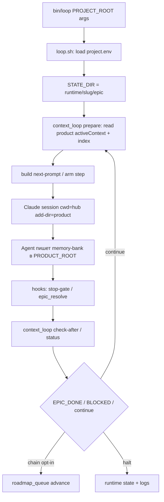

# Data flow — dev-hub

**Last refresh:** 2026-08-16 · BACK VAN

## A. Подключение продукта к хабу (`hub-link`)

```mermaid
sequenceDiagram
  participant Dev
  participant Link as bin/hub-link
  participant Hub as DEV_HUB
  participant Prod as PROJECT_ROOT
  Dev->>Link: hub-link [product]
  Link->>Hub: resolve rules/templates/agents/hooks
  Link->>Prod: symlink .cursor/rules, .agents, CLAUDE.md, .claude/*
  Link->>Prod: write/refresh AGENTS.md stub
```

1. Проверка наличия hub `.cursor/rules` и (warn) product `memory-bank/`.
2. Symlink ключевых деревьев из хаба в product.
3. Локальные `runtime/` / `worktrees/` под `.claude` в product создаются как dirs (не symlink содержимого hub runtime).

## B. Автоцикл эпика (`bin/loop` → session)



**Данные на стороне хаба:** только `HUB_ROOT/runtime/<slug>/` — epic STATE_DIR = `runtime/<slug>/epic/` (`state.json`, `last-session.json`, checkpoint, locks, session log, `next-prompt.txt`).  
**Данные на стороне продукта:** `memory-bank/**` (читает/пишет агент + hooks при `PROJECT_ROOT`).  
**Legacy (без hub env):** `PROJECT_ROOT/.claude/runtime/epic/` — fallback в `epic_paths.epic_dir`; не primary канон loop. Autodelete product runtime dirs — запрещён.

## C. Role command без loop (Cursor/Claude chat)

1. Пользователь пишет `BACK VAN` / `BACK IMPLEMENT` …
2. Router: `.cursor/rules/mainrule.mdc` → role workflow
3. Артефакты пишутся в **текущий** `memory-bank/` открытого корня (для этой сессии VAN — `dev-hub/memory-bank/`)

## D. DAG / canary (loop)

- Manifests: `loop/dag/*.yaml` (`loop-dag/v2`)
- Команды: `loop.sh --dag-generate`, `--phase GAP_FANOUT` (manual), `--status`
- Canary evidence: pytest `loop/tests/test_dag_canary.py`, `test_finish_integrity.py`

## Не потоки хаба

- ETL / sample→store бизнес-данных
- Product HH/TG/browser pipelines (вне scope)
