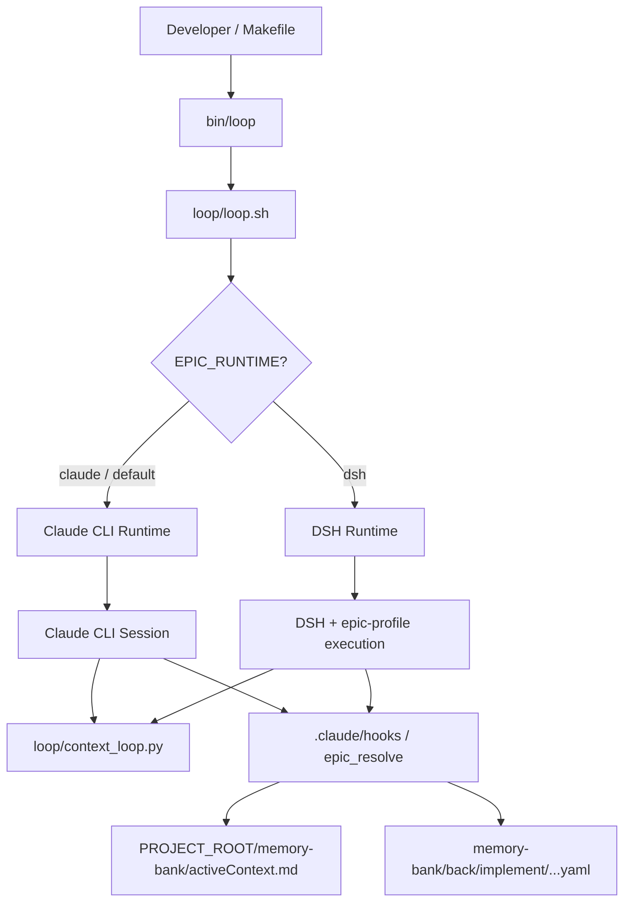

# Architecture Shard: DSH Runtime (dev-hub)

> ⚠️ **DSH runtime — developer preview. Default: EPIC_RUNTIME=claude. Breaking changes expected.**

**Last refresh:** 2026-08-30  
**Refreshed by:** BACK IMPLEMENT T-HUB-009 s01  
**Status:** current (developer preview)  

---

## Overview

Хаб `dev-hub` поддерживает двойной runtime (dual-runtime execution) для выполнения эпиков в автономном цикле `loop/loop.sh`.
Первичным и продуктовым runtime по умолчанию является `claude` (Claude CLI). Альтернативный runtime `dsh` предоставляет подсистемное выполнение автономных шагов через DSH (DeepSeek / Cordis runner) с использованием встроенных профилей `dsh/profiles/epic-*`.

Выбор runtime осуществляется через переменную окружения `EPIC_RUNTIME` (`claude` или `dsh`) и обрабатывается как на уровне обвязки `loop/loop.sh`, так и в Python-хуках `dev-hub` через `RuntimeConfig` в `.claude/hooks/_lib.py`.

---

## Dual-Runtime Diagram

---

## Env Table

| Переменная | Тип / Допустимые значения | Default | Назначение |
|------------|---------------------------|---------|------------|
| `EPIC_RUNTIME` | `claude` \| `dsh` | `claude` | Флаг переключения runtime в `loop.sh` и Python-хуках (`_lib.py`). |
| `DSH_HOME` | Absolute / relative path | `~/.dsh` | Директория профилей и конфигурации DSH. Используется при старте `dsh` профилей (`dsh/profiles/epic-*`). |
| `DEEPSEEK_API_KEY` | Secret string | `n/a` | API-ключ для вызовов DeepSeek API (обязателен при `EPIC_RUNTIME=dsh`). |
| `PROJECT_LOOP_IMPLEMENT_MODEL` | String | `n/a` (модель по умолчанию) | Опциональный override модели для шага `implement` в автономном цикле. |
| `NODE_VERSION` | Version specifier | `22+` | Требуемая версия Node.js для работы pnpm и компонентов DSH bridge (`dsh/plugins/mb-bridge`). |

---

## Runtime Selection Logic

1. **Инициализация:** При старте `bin/loop` считывается конфигурация окружения из `project.env` и переменных процесса.
2. **Валидация хуками:** В `.claude/hooks/_lib.py` функция `resolve_runtime_config()` считывает `EPIC_RUNTIME`. Разрешены только значения `claude` и `dsh`. Любое другое значение вызывает ошибку `RuntimeConfigError`.
3. **Ветвление в `loop/loop.sh`:**
   - Если `EPIC_RUNTIME=claude` (или значение не задано): Запускается стандартная Claude CLI сессия.
   - Если `EPIC_RUNTIME=dsh`: `loop.sh` загружает профили из `dsh/profiles/epic-*` и перенаправляет исполнение в DSH runner.
4. **Идемпотентность хуков:** Общие гейты (`epic_resolve.py`, `activeContext.md`, validate/finalize шаги) работают единообразно независимо от выбравшего runtime.

---

## Failure Modes

| Failure Mode | Симптом / Лог | Причина | Способ обработки / Восстановление |
|--------------|---------------|---------|-----------------------------------|
| **Missing DSH binary** | Exit code `127` в `loop.sh` | Команда `dsh` не найдена в `PATH` при `EPIC_RUNTIME=dsh`. | Установите DSH или переключитесь на `EPIC_RUNTIME=claude`. |
| **Profile not found** | Предупреждение `DSH_HOME warn` / missing profile | Отсутствует нужный профиль `epic-*` в `DSH_HOME` или `dsh/profiles/`. | Проверьте путь `DSH_HOME` и наличие собранных профилей (`dsh/profiles/epic-*`). |
| **Gate deny** | Otказ от `@verify` / hook exit non-zero | Нарушены проверки `epic_resolve` (незакрытые cp, gaps, pending verification). | Одинаковое поведение для обоих runtime: исправить checkpoint/evidence и перезапустить validate-step. |
| **API 429 / Rate Limit** | Ошибка HTTP 429 в логах DSH session | Превышен лимит запросов к DeepSeek API при работе DSH. | Переждите backoff окно или временно переключите runtime на `claude`. |
| **EPIC_RUNTIME invalid** | `RuntimeConfigError: Invalid EPIC_RUNTIME=...` | В `EPIC_RUNTIME` передано недопустимое значение (например, `EPIC_RUNTIME=gpt`). | Задайте корректное значение `EPIC_RUNTIME=claude` или `EPIC_RUNTIME=dsh`. |
