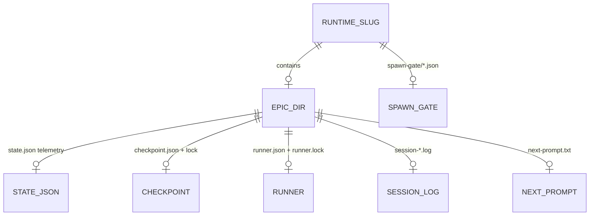

# ERD — dev-hub

**Last refresh:** 2026-08-16 · BACK VAN  
**erd:** `n/a` — в хабе нет SQLAlchemy/Alembic/Postgres/доменной БД.

## Обоснование

Tooling hub хранит состояние runner в JSON-файлах под `runtime/`. Доменные сущности продуктов не моделируются здесь.

## File-store map (runtime)

| Store | Path (under hub) | Назначение |
|-------|------------------|------------|
| Loop state | `runtime/<slug>/epic/state.json` | Телеметрия (`loop-state/v2`); не agent-owned cursor |
| Checkpoint | `runtime/<slug>/epic/checkpoint.json` (+ `.lock`) | Durable cursor / resume |
| Runner lock | `runtime/<slug>/epic/runner.lock` / `runner.json` | Single runner ownership |
| Session log | `runtime/<slug>/epic/session-*.log` | Вывод сессии |
| Next prompt | `runtime/<slug>/epic/next-prompt.txt` | Текст следующего шага |
| Spawn gate | `runtime/<slug>/spawn-gate/*.json` | Gate artifacts |
| Hub MB | `memory-bank/**` | Артефакты workflow **этого** репо (VAN/tasks) |
| Product MB | вне репо | `PROJECT_ROOT/memory-bank/**` — не часть ERD хаба |

## Obs / SQL

Нет SQLite/events store в коде хаба (в отличие от некоторых продуктов).
