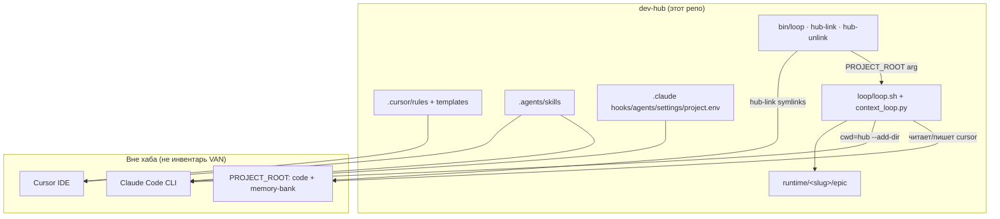

# Overview — dev-hub (as-built)

**Last refresh:** 2026-08-16  
**Refreshed by:** BACK VAN  
**Mode:** brownfield  
**graphify:** CLI недоступен (нет `.venv/bin/graphify`) — карта по README + исходникам хаба.

## Продукт

- **Назначение:** единый tooling-хаб для ролевых workflow (BACK/FRONT/INTEG/…), skills, Claude/Cursor hooks и автоцикла эпиков (`loop/`).
- **In:** `.cursor/`, `.claude/`, `.agents/`, `loop/`, `bin/`, `make/`, `runtime/`, `workspaces/` (файлы-заготовки multi-root), тесты хаба.
- **Out:** application-код продуктов и их `memory-bank/` (отдельные репозитории; VAN хаба их не читает).
- **Версии:** semver пакета нет; контракты loop — `loop-state/v2`, DAG `loop-dag/v2`.

## Actors

| Actor | Роль |
|-------|------|
| Разработчик | Пишет/правит rules, hooks, loop; запускает `bin/loop` / `make hub-link` из продукта |
| Cursor IDE | Грузит `.cursor/rules`, Cursor hooks |
| Claude Code CLI | Сессии агента: cwd=hub, product `--add-dir` |
| Loop runner (`loop.sh` + `context_loop.py`) | Готовит prompt, bounds сессии, checkpoint telemetry, status |
| Gate subagents | `explorer` / `verify` / `reviewer` (`.claude/agents/`) |
| Epic hooks | `epic_resolve.py` и связанные hooks — seed/validate/finalize implement shards **в PROJECT_ROOT** |

## Высокоуровневая схема

## Rules & role-command SoT

- **SoT rules** = `.cursor/rules/`; role-command SoT = `.claude/skills/role-command/SKILL.md`, зеркало → `.agents/skills/role-command/SKILL.md`
- Rules canonical source: `.cursor/rules/` (Cursor) / `.claude/rules/` (Claude Code)
- role-command SoT: `.claude/skills/role-command/SKILL.md` (зеркало: `.agents/skills/role-command/SKILL.md`)
- Обновлять `.agents` одновременно с `.claude` (не расходиться)

## Источники правды

- **Код:** `loop/**`, `bin/**`, `.claude/hooks/**`, `.cursor/hooks/**`
- **Docs:** `README.md`, `loop/README.md`, `loop/WORKFLOW.md`, `CLAUDE.md`
- **Config:** `.claude/project.env` (+ optional `.local`)
- **Compose:** отсутствует
- **Не source of truth для VAN хаба:** содержимое product repos / follow `workspaces/*.code-workspace` paths

## Complexity snapshot

Map-only хаба: **L3** (много процессов: runner + hooks + IDE + CLI; file IPC runtime; без ORM/compose).  
Next после VAN: по задаче хаба — `BACK PLAN` (если есть scope) или стоп до явной задачи.
