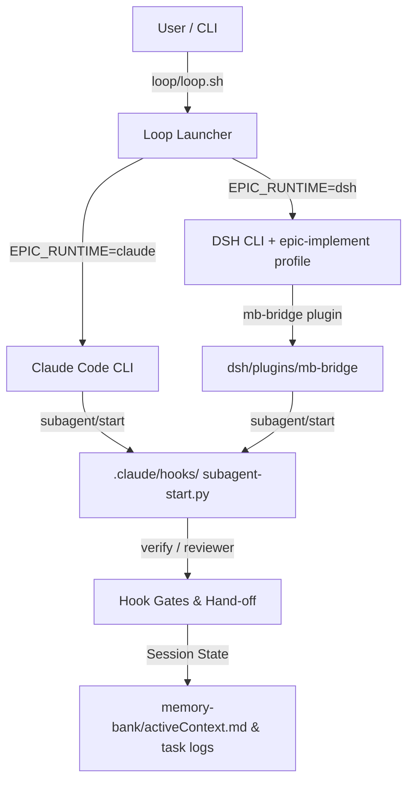

# Services and Data Flow — DSH Dual-Runtime

**Last updated:** 2026-08-30  
**Refreshed by:** BACK BUGFIX T-HUB-009-dsh-rollout-docs  
**Scope:** Architectural overview of service interaction and data flow for Claude Code and DSH dual-runtime.

## Overview

This document unifies the service architecture (`services.md`) and data flow (`data-flow.md`) specs for dev-hub, focusing on the DSH runtime integration (T-HUB-006..008).

## Service Interaction Map

## Data Flow Summary

1. **Launcher Dispatch:** `loop/loop.sh` evaluates `EPIC_RUNTIME`. If `dsh`, it launches `dsh --profile epic-implement`.
2. **Bridge Hook Ingestion:** `mb-bridge` forwards DSH phase lifecycle events to `.claude/hooks/subagent-start.py`.
3. **Verdict & State Mirroring:** Session state and verdicts write back to `memory-bank/activeContext.md` and task logs.

## Detailed References

- [`services.md`](services.md) — Main service interaction topology.
- [`data-flow.md`](data-flow.md) — Core data flow pipeline details.
- [`dsh-runtime.md`](dsh-runtime.md) — Complete DSH runtime specification.
