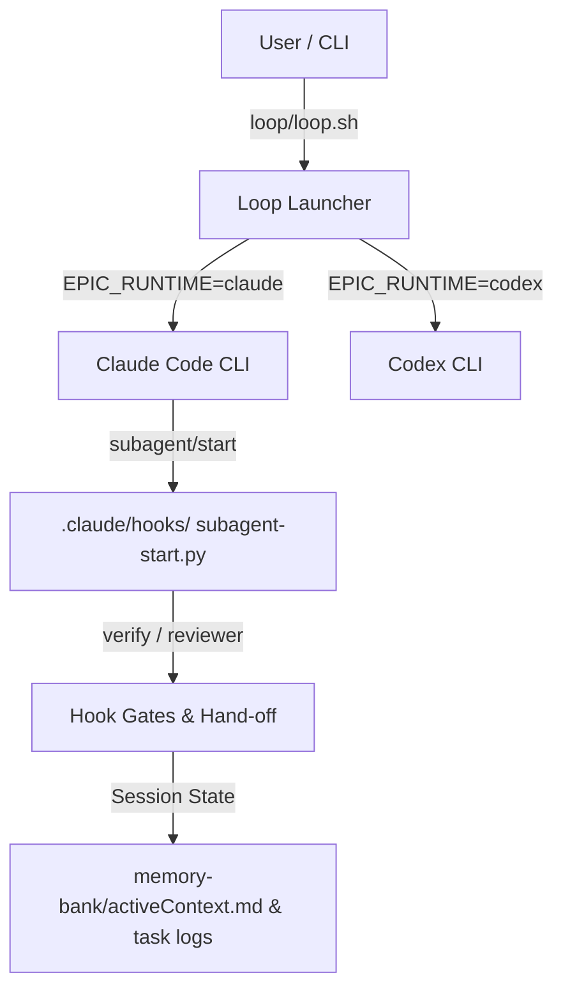

# Services and Data Flow — Multi-Runtime Architecture

**Last updated:** 2026-09-16  
**Scope:** Architectural overview of service interaction and data flow for Claude Code and Codex runtime engines.

## Overview

This document unifies the service architecture (`services.md`) and data flow (`data-flow.md`) specs for dev-hub.

## Service Interaction Map

## Data Flow Summary

1. **Launcher Dispatch:** `loop/loop.sh` evaluates `EPIC_RUNTIME`. It launches either Claude Code CLI or Codex CLI.
2. **Hook Ingestion:** Lifecycle events are processed via `.claude/hooks/` and `.codex/hooks.json`.
3. **Verdict & State Mirroring:** Session state and verdicts write back to `memory-bank/activeContext.md` and task logs.

## Detailed References

- [`services.md`](services.md) — Main service interaction topology.
- [`data-flow.md`](data-flow.md) — Core data flow pipeline details.
