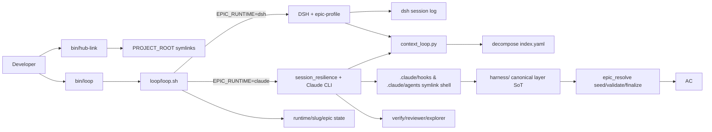

# Services — dev-hub

**Last refresh:** 2026-08-16 · BACK VAN

## Каталог процессов / модулей

| ID | Entrypoint | Тип | Назначение |
|----|------------|-----|------------|
| S-LOOP-BIN | `bin/loop` | bash CLI | Резолв `HUB_ROOT`/`PROJECT_ROOT`, exec `loop/loop.sh` |
| S-LOOP-SH | `loop/loop.sh` | bash runner | Env из `project.env`, state dir `runtime/<slug>/epic`, запуск Claude session + context_loop |
| S-CTX | `loop/context_loop.py` | Python CLI | prepare / check-after / status / DAG helpers; читает product `activeContext` + decompose |
| S-DAG | `loop/dag.py` + `loop/dag/*.yaml` | library + manifests | `loop-dag/v2` scheduling helpers / canary manifests |
| S-RQ | `loop/roadmap_queue.py` | Python | roadmap queue advance (opt-in `EPIC_CHAIN_ROADMAP`) |
| S-HUB-LINK | `bin/hub-link` | bash | Symlink rules/templates/agents/hooks/skills/CLAUDE.md → product |
| S-HUB-RUNTIME-SYNC | `bin/runtime-sync` | Python CLI | registry-backed runtime materialization and `--check` drift; consumed by doctor runtime checks; registry: `loop/runtime_registry.yaml` |
| S-HUB-UNLINK | `bin/hub-unlink` | bash | Снять symlinks |
| S-MAKE | `make/product.mk` | Make include | `hub-link`, `loop`, `loop-epic`, `loop-status` для product Makefile |
| S-DSH | `dsh/profiles/epic-*` | DSH profile | Опциональный DSH session executor для loop (`EPIC_RUNTIME=dsh`), подробности в [dsh-runtime.md](dsh-runtime.md) |
| S-HARNESS-SoT | `harness/` | canonical layer | Canonical Python hooks, agents, and package harness layer (SoT); `.claude/hooks` and `.claude/agents` are symlink shells |
| S-HOOKS-CC | `.claude/hooks/*.py` | symlink shell | Claude hooks shell (symlinks → `harness/hooks/`); pre/post tool, stop-gate, session, epic_resolve, stream filter, … |
| S-HOOKS-CUR | `.cursor/hooks/*.py` / `hooks.json` | Cursor hooks | unwired / N/A for epic gates; wiring = out of scope T-HUB-003 (follow-up эпик); as-built: before_submit / after_edit / on_stop |
| S-AGENTS | `harness/agents/*.md` (`.claude/agents/` shell) | subagent defs | Gate agents для codebase search / phase verify / BACK QA (с алиасами @verify → verify-implement, @reviewer → verify-qa) |
| S-RULES | `.cursor/rules/**` | workflow router | `mainrule.mdc` → role workflows |

## Взаимодействие

## Контракты (as-built)

| Контракт | Где |
|----------|-----|
| `PROJECT_ROOT` обязателен для loop | `bin/loop`, `loop/loop.sh` |
| Claude cwd = hub | `loop/loop.sh` `cd "$HUB_ROOT"` |
| Product visibility | `--add-dir "$PROJECT_ROOT"` |
| Runtime state | `HUB_ROOT/runtime/$PROJ_SLUG/epic/` |
| Implement FINISH order | finish-block + `epic_resolve` (seed → validate → verify → finalize) |
| Test timeout | 300s external (`test-timeout.mdc`); loop README ссылается на pytest |

## Отсутствует в хабе

- HTTP API / FastAPI app
- Docker Compose services
- Message broker
- Product business services
