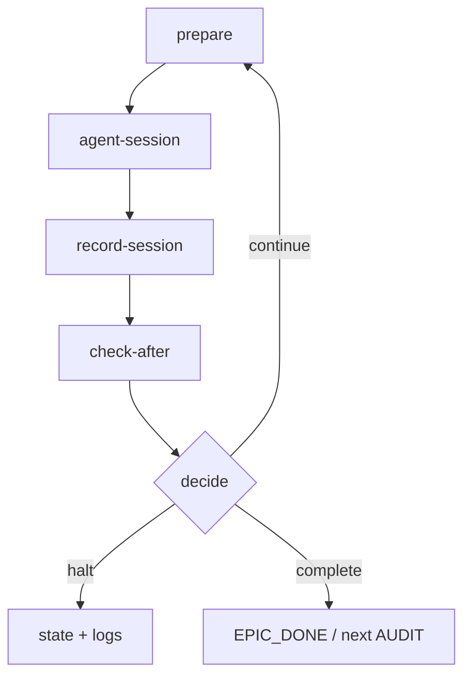

# Workers — dev-hub

**Last refresh:** 2026-08-22 · BACK IMPLEMENT T-HUB-003 s05  
**Status:** current (loop sessions as workers; нет queue broker)

## Overview

В хабе нет Celery/RQ/queue broker. **Worker** = одна Claude Code (или Cursor) session, запущенная `bin/loop` / `loop/loop.sh` для одного эпика продукта.

Каждая итерация автоцикла занимает один runtime-slot эпика и проходит lifecycle prepare → agent-session → check-after → halt|continue|complete.

## Runtime slot

Каждый worker занимает каталог `epic_dir()` (`HUB_ROOT/runtime/<slug>/epic/` при `HUB_ROOT`/`DEV_HUB`; иначе legacy `PROJECT_ROOT/.claude/runtime/epic/`):

| Файл | Роль |
|------|------|
| `state.json` | состояние эпика / halt / continue |
| `last-session.json` | итог последней session (для recovery) |
| `checkpoint.json` | checkpoint шага |
| `runner.lock` / `runner.json` | flock: один concurrent runner на epic |

`STATE_DIR` в `loop.sh` = тот же slot. Product `memory-bank/**` — не slot worker; туда пишет агент через `--cwd` / `--add-dir`.

## Lifecycle

1. **prepare** — `context_loop` читает product `activeContext` + decompose index, собирает next-prompt / arm step.
2. **agent-session** — Claude session (cwd=hub, product via `--add-dir`); артефакты → `$PROJECT_ROOT/memory-bank`.
3. **record-session** — hooks пишут `last-session.json` в epic slot.
4. **check-after** — `decide_after_action` / epic_resolve: halt | continue | complete.
5. **halt|continue|complete** — обновление state; continue → снова prepare.

Service interaction: **n/a** (internal host processes; см. `services.md` / `data-flow.md` §B).

## Constraints

- **Single concurrent worker per epic** — `flock` на `runner.lock` в `STATE_DIR`.
- Нет внешней queue / worker pool / broker.
- `model_substitution` / policy halt — out-of-scope этого shard (см. `loop/WORKFLOW.md`).
- Autodelete product runtime dirs — запрещён (см. `data-flow.md`).

## Related

- [data-flow.md](data-flow.md) §B — flowchart автоцикла
- [services.md](services.md) — каталог процессов хаба
- [index.md](index.md) — карта shards
- `loop/WORKFLOW.md`, `.claude/instructions/epic-loop.md`
