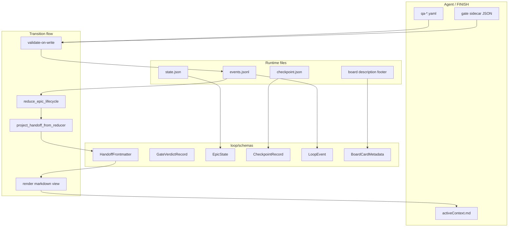

# [T-HUB-022 | runtime-pydantic-schemas] PLAN

**Дата:** 2026-08-30 (rev. 2026-08-30 — loop transition contracts spike)  
**Режим:** BACK PLAN  
**Уровень:** L3–L4  
**Статус:** active  
**Roadmap:** [roadmap-pydantic-reliability-epics.md](roadmap-pydantic-reliability-epics.md)  
**Queue:** [roadmap-pydantic-reliability-epics.queue.yaml](roadmap-pydantic-reliability-epics.queue.yaml)  
**Deps:** нет hard. Soft: T-HUB-017 incidents may consume `state_schema_invalid` / `drift_*` diagnostics (if merged).

**Skills:** writing-plans · architecture-patterns · python-testing-patterns · python-design-patterns

→ [decompose-T-HUB-022-runtime-pydantic-schemas/index.md](decompose-T-HUB-022-runtime-pydantic-schemas/index.md) — **после DECOMPOSE**

**Spike (pre-DECOMPOSE, 2026-08-30):** частично в коде уже есть `loop/schemas/{handoff,gate_verdict,active_context}.py`, `loop/gate_verdict_store.py`, `project_handoff_from_reducer()`, frontmatter render в `build_post_implement_active_context` / `arm_active_context_from_decompose`. Эпик **добивает** strict validate-on-write, runtime schemas, drift metrics, sunset `repair_*`, index yaml-only — не переписывает spike с нуля.

---

## Контекст

- **req:** единый Pydantic слой для **всех machine-readable границ loop** — runtime persistence + transition contracts — validate-on-read / validate-before-write; markdown/prose только view.
- **gap (as-built до spike):** `LLM markdown ──regex──► runner state ──repair_*──► continue` — несколько SoT (activeContext Handoff, events, state.json, transcript VERDICT, index.yaml↔index.md); каждый edge case → новый `repair_*` или regex.
- **gap (после spike):** frontmatter + gate sidecar есть, но FINISH soft (legacy AC без frontmatter OK), `repair_*` ещё на hot path, runtime JSON без Pydantic, нет drift counters, index dual-write.
- **target flow:** `typed artifact ──validate──► event ──reduce──► projection ──render──► markdown для следующей сессии`.
- **refs:** `.claude/hooks/epic/core.py`; `.claude/hooks/epic_events.py`; `.claude/hooks/stop-gate.py`; `loop/context_loop.py`; `loop/gate_verdict_store.py`; `loop/schemas/**`; `loop/board_sync/card_model.py`; `epic_yaml.py` (pattern reference).

### Зафиксированные решения

| Тема | Решение |
|------|---------|
| Package layout | **`loop/schemas/`** — все runtime + transition schemas; thin re-export из hooks |
| **Transition — Handoff** | **`loop-handoff/v1`** YAML frontmatter в `memory-bank/activeContext.md` (`role`, `mode`, `epic_id`, `step_id?`, `reason_code?`, `projection_hash?`). Runner **генерирует**; агент **сохраняет** при FINISH. Prose Handoff — narrative only |
| **Transition — phase SoT** | **`reduce_epic_lifecycle()` + events.jsonl** — единственный вычислитель post-implement phase. **`project_handoff_from_reducer()`** проецирует в AC; `handoff_post_implement_phase()` читает frontmatter, regex — legacy fallback до sunset |
| **Transition — gate verdict** | **`loop-gate-verdict/v1`** JSON sidecar `.claude/runtime/epic/gates/{agent_id}.json`. **`extract_verdict(cwd=)`** — sidecar first, transcript regex legacy |
| **Validate-on-write** | FINISH/stop-gate: reject invalid frontmatter / prose drift / invalid gate sidecar. QA/implement shards — уже `epic_yaml` Pydantic; 022 wire strict FINISH paths |
| **Strict handoff flag** | **`PROJECT_LOOP_HANDOFF_STRICT=0`** default (migration). `=1` → FINISH block без valid `loop-handoff/v1`; prepare всё равно auto-project для legacy |
| State schema | **`loop-state/v2`** → `EpicState` + nested `runtime` / `projection` / `dag` / **`drift_counters`** |
| Checkpoint | **`loop-checkpoint/v1`** → `CheckpointRecord` aligned with `validate_checkpoint` |
| Events | **`loop-event/v2`** per line in `events.jsonl` (align `epic_events.EVENT_SCHEMA`) |
| Board | **`mb-board-card/v1`** → Pydantic models replace/extend `StepCard`/`GateCard` dataclasses |
| Index canon | **`index.yaml` only write path** для status; `index.md` — **generated mirror** (runner/CLI), агент не пишет status в md |
| **`repair_*` sunset** | `repair_post_implement_handoff_drift` → alias `project_handoff_from_reducer` (done). **`repair_index_mirror`**, **`repair_fingerprint_stall`**, **`repair_finish_desync`** → log `drift_*` counter + one-shot project; удалить auto-rewrite после green migration suite |
| Drift observability | `EpicState.drift_counters`: `handoff_projected`, `index_mirror_repair`, `fingerprint_stall_repair`, `gate_verdict_regex_fallback`, `schema_invalid` |
| Migration read | **Fail-soft read:** invalid → diagnostic + safe defaults (preserve today) |
| Migration write | **Strict write:** `save_*` validates before atomic write |
| Backward compat | `model_validator(mode='before')` coerces legacy keys; unknown keys stripped on write |
| Single source | Schemas imported by hooks AND loop tests — no duplicate definitions |
| **Not in 022** | pydantic-ai / LLM fallbacks → T-HUB-021 / T-HUB-023 |
| CREATIVE | нет |

**CREATIVE need:** нет.

---

## Цель

Любая запись на machine boundary hub (runtime JSON, gate sidecar, handoff frontmatter, board metadata) проходит Pydantic validation; phase transitions идут **artifact → event → reduce → render**, без regex-repair как штатного пути.

---

## Продуктовая спека (WHAT)

### User Stories

| # | Story | Priority | Independent Test |
| :--- | :--- | :--- | :--- |
| US-001 | Как loop runner, я хочу fail-closed diagnostic при corrupt `state.json`, чтобы `loop status` показывал `state_schema_invalid`. | P0 | Fixture corrupt JSON → load → diagnostic + safe defaults |
| US-002 | Как hook author, я хочу единую `CheckpointRecord` модель, чтобы checkpoint resume не расходился с validator. | P0 | Invalid cp field → `validate_checkpoint` returns code |
| US-003 | Как board_sync, я хочу валидировать footer metadata YAML перед HTTP upsert. | P1 | Invalid `mb-board-card` → sync error with field path |
| US-004 | Как auditor, я хочу schema_version на каждом persisted artifact. | P1 | Saved state always has `state_schema_version: loop-state/v2` |
| US-005 | Как loop operator, я хочу phase из reducer, а не regex по Handoff prose, чтобы не латать drift `repair_*`. | P0 | Stale Handoff BUGFIX + qa pass → `project_handoff_from_reducer` → frontmatter `mode: REFLECT` |
| US-006 | Как verify gate, я хочу typed verdict sidecar, чтобы stop-gate не зависел от transcript tail. | P0 | Sidecar PASS + transcript FAIL → `extract_verdict(cwd=)` returns PASS |
| US-007 | Как operator, я хочу `PROJECT_LOOP_HANDOFF_STRICT=1` блокировать FINISH без frontmatter. | P1 | Legacy AC без `---` → stop-gate block when strict |
| US-008 | Как auditor, я хочу `drift_counters` в state/status при каждом legacy repair/fallback. | P1 | Call `repair_index_mirror` → counter incremented, logged |
| US-009 | Как implement agent, я хочу писать status только в `index.yaml`, md — generated. | P1 | `mark_index_step_status` updates yaml; md mirror read-only for agent |

#### Acceptance Scenarios — US-001

- **Given:** `state.json` with wrong type for `active` (string)
- **When:** `load_epic_state(cwd)`
- **Then:** returns usable state; `_state_diagnostics` contains `state_schema_invalid`; no exception to caller

#### Acceptance Scenarios — US-002

- **Given:** checkpoint missing required `plan_id`
- **When:** `validate_checkpoint(path)`
- **Then:** non-zero / structured error code (existing contract preserved)

#### Acceptance Scenarios — US-005

- **Given:** implement queue exhausted; qa `verdict: pass`; activeContext Handoff says BUGFIX; no frontmatter
- **When:** `prepare_session(cwd)`
- **Then:** AC contains `schema: loop-handoff/v1` + `mode: REFLECT`; `handoff_post_implement_phase` returns REFLECT from frontmatter

#### Acceptance Scenarios — US-006

- **Given:** `.claude/runtime/epic/gates/verify.json` verdict PASS for current step
- **When:** `extract_verdict(transcript_with_FAIL, cwd=cwd)`
- **Then:** PASS (sidecar wins)

#### Acceptance Scenarios — US-007

- **Given:** `PROJECT_LOOP_HANDOFF_STRICT=1`; FINISH with valid load_now+Handoff but no frontmatter
- **When:** stop-gate on epic FINISH
- **Then:** block with `handoff_frontmatter` diagnostic; no silent allow

#### Acceptance Scenarios — US-008

- **Given:** index.yaml/md drift
- **When:** legacy repair path runs
- **Then:** `state.drift_counters.index_mirror_repair += 1`; structured log line; optional T-HUB-017 event if merged

### Functional Requirements (FR-###)

**Runtime persistence (original scope)**

- **FR-001:** `loop/schemas/state.py` — `EpicState`, `EpicRuntime`, `EpicProjection`, `DriftCounters` nested models.
- **FR-002:** `loop/schemas/checkpoint.py` — `CheckpointRecord`, `CheckpointShardRef`.
- **FR-003:** `loop/schemas/events.py` — `LoopEvent` line model; align with `epic_events.build_event` / `EVENT_SCHEMA`.
- **FR-004:** `loop/schemas/board_card.py` — `BoardCardMetadata`, `StepCardMeta`, `GateCardMeta`.
- **FR-005:** `epic/core.py`: `load_epic_state` uses `EpicState.model_validate` with fallback; `save_epic_state` uses `model_dump`.
- **FR-006:** `epic_events.py`: validate on append; reject line missing required fields.
- **FR-007:** `board_sync/card_model.py`: migrate to Pydantic or delegate to `loop/schemas/board_card.py`.
- **FR-008:** Fixture corpus: valid/invalid golden files under `loop/tests/fixtures/schemas/`.
- **FR-009:** No behavior change on **valid** existing fixtures from `loop/tests/test_context_loop.py`.
- **FR-010:** Document all schema ids in `loop/schemas/README.md`.

**Transition contracts (spike → production)**

- **FR-011:** Consolidate spike `loop/schemas/handoff.py` + `active_context.py` — single `HandoffFrontmatter` export; unit tests for parse/render/validate.
- **FR-012:** Consolidate `loop/schemas/gate_verdict.py` + `loop/gate_verdict_store.py` — validate on write; wire `mirror_gate_verdict` for verify+reviewer (spike done; add strict read validation).
- **FR-013:** **`project_handoff_from_reducer`** — canonical post-implement path; `repair_post_implement_handoff_drift` remains alias until s15 purge.
- **FR-014:** **`epic_complete_allowed`** — reducer SoT only (no Handoff prose override); covered by regression tests.
- **FR-015:** stop-gate: block invalid frontmatter / `handoff_frontmatter_prose_drift`; respect `PROJECT_LOOP_HANDOFF_STRICT` for missing frontmatter.
- **FR-016:** **`validate_qa_finish_handoff`** — compare qa `verdict` (via `epic_yaml` or `parse_qa_verdict`) with frontmatter `mode` (BUGFIX vs REFLECT).
- **FR-017:** **`fingerprint_context`** hashes frontmatter + load_now (spike done); document in README.
- **FR-018:** Increment **`drift_counters`** on: handoff project, index mirror repair, fingerprint stall repair, finish desync repair, regex verdict fallback, schema_invalid.
- **FR-019:** **`PROJECT_LOOP_HANDOFF_STRICT`** + **`PROJECT_LOOP_REPAIR_LEGACY=1`** (default on until s15) — when legacy repair runs, log + counter; when `=0`, repair returns diagnostic-only (no silent rewrite) except `project_handoff_from_reducer`.
- **FR-020:** **index yaml-only writes:** `mark_index_step_status` / `finalize-step` mutate yaml; `mirror_status_to_md` / `rebuild_md_queue_from_yaml` — runner-only; agent prompts forbid md status edits.
- **FR-021:** **`resolve_pipeline_identity`** — frontmatter epic_id + handoff heading fallback when load_now lacks decompose (spike done; add tests in 022 suite).
- **FR-022:** Sunset checklist: grep zero hot-path callers for regex-only handoff phase without frontmatter fallback metric = 0 for N sessions (document in AUDIT step).

### Success Criteria (SC-###)

| ID | Измеримый результат | Проверка | Type |
| :--- | :--- | :--- | :--- |
| SC-001 | 100% existing state fixtures still load | pytest regression | outcome |
| SC-002 | Invalid fixture → diagnostic code | pytest | outcome |
| SC-003 | Round-trip save/load identity on golden state | pytest | outcome |
| SC-004 | board_sync tests green | pytest subset | outcome |
| SC-005 | Handoff projection tests green (`test_handoff_projection.py` + phase gates) | pytest | outcome |
| SC-006 | Strict handoff FINISH block when env on | pytest stop-gate subset | outcome |
| SC-007 | `drift_counters` round-trip in state save/load | pytest | outcome |
| SC-008 | index status write touches yaml only in mark-index path | pytest epic_index | outcome |

### Assumptions

- `state_schema_version: loop-state/v2` already written by `save_epic_state` — model enforces, does not rename.
- Extra unknown keys in old state files are dropped on next save (acceptable migration).
- `epic_yaml` product shard schemas stay separate (different domain) — но QA FINISH gate **uses** `epic_yaml` for verdict validate-on-write (FR-016).
- Spike code (2026-08-30) treated as s11–s13 partial deliverable — DECOMPOSE marks `[spike]` on completed items.

### Clarifications

- Session: 2026-08-30 — Tier 3 from pydantic reliability analysis.
- Session: 2026-08-30 (rev) — loop transition architecture chat: regex→repair anti-pattern; spike merged pre-plan.
- Independent from pydantic-ai (021); LLM regex fallback stays 023.

### [НУЖНО УТОЧНИТЬ]

- n/a CRITICAL. Soft: default `PROJECT_LOOP_HANDOFF_STRICT` flip to `1` — отдельный rollout после 2 green weeks with counters near zero.

---

## AC

### AC+

1. `loop/schemas/` — runtime modules (state, checkpoint, events, board) **+** transition modules (handoff, gate_verdict, active_context) documented in README
2. `load_epic_state` / `save_epic_state` use Pydantic without breaking loop tests
3. Checkpoint validation uses shared model
4. Events append validates required fields
5. Board metadata parse raises clear error on invalid YAML footer
6. Golden fixtures + invalid fixtures in tests
7. **`project_handoff_from_reducer` canonical; drift counters wired**
8. **`PROJECT_LOOP_HANDOFF_STRICT` + stop-gate FINISH validation**
9. Gate verdict sidecar validate-on-read/write
10. index yaml-only write path; md generated mirror
11. Legacy `repair_*` — counter + env-gated rewrite (migration)

### AC−

1. Не менять `epic-implement/v1` shard models in `epic_yaml.py` (reuse for validate)
2. Не strict-fail **read** on production hot path without diagnostic (no new HALT solely from schema read)
3. Не мигрировать product `memory-bank` YAML shards beyond validate-on-FINISH hooks
4. Не добавлять pydantic-ai / LLM (021/023)
5. Не breaking change `BoardTask` HTTP contract field names
6. Не удалять regex fallback paths in same epic — only metric + strict env (sunset s15)
7. Не менять Claude/DSH agent orchestration

---

## Техника / архитектура (HOW)

### Стек

- Pydantic v2 (existing hub `.venv`)
- Python 3.11+
- No new runtime dependencies beyond pydantic (already present)

### Layout

| Path | Action |
|------|--------|
| `loop/schemas/__init__.py` | Exists (spike) — extend exports |
| `loop/schemas/handoff.py` | Exists (spike) — consolidate |
| `loop/schemas/gate_verdict.py` | Exists (spike) — consolidate |
| `loop/schemas/active_context.py` | Exists (spike) — consolidate |
| `loop/gate_verdict_store.py` | Exists (spike) — strict validate |
| `loop/schemas/state.py` | Create |
| `loop/schemas/checkpoint.py` | Create |
| `loop/schemas/events.py` | Create |
| `loop/schemas/board_card.py` | Create |
| `loop/schemas/README.md` | Exists (spike) — extend |
| `.claude/hooks/epic/core.py` | Modify — load/save, drift counters, repair sunset, identity |
| `.claude/hooks/epic_events.py` | Modify — validate events |
| `.claude/hooks/stop-gate.py` | Modify — strict handoff FINISH |
| `.claude/hooks/_lib.py` | Modify — `extract_verdict` sidecar strict |
| `loop/context_loop.py` | Modify — drift telemetry in status |
| `loop/board_sync/card_model.py` | Modify — delegate validation |
| `.claude/project.env` | Modify — `PROJECT_LOOP_HANDOFF_STRICT`, `PROJECT_LOOP_REPAIR_LEGACY` |
| `loop/tests/fixtures/schemas/**` | Create |
| `loop/tests/test_runtime_schemas.py` | Create |
| `loop/tests/test_handoff_projection.py` | Exists (spike) — extend |
| `loop/tests/test_runtime_schemas_integration.py` | Create — hooks integration |

### Архитектура

### EpicState (outline — IMPLEMENT fills all fields)

- Top-level: `state_schema_version`, `active`, `status`, `halt_reason`, `model`, timestamps
- `runtime`: snapshot keys from `_runtime_snapshot`
- `projection`: epic cursor fields (read-only mirror)
- `dag`: pipeline_id, cursor
- **`drift_counters`:** `handoff_projected`, `index_mirror_repair`, `fingerprint_stall_repair`, `finish_desync_repair`, `gate_verdict_regex_fallback`, `schema_invalid`
- Validators: coerce `active` bool; enum `status`; optional gates fields

### HandoffFrontmatter (loop-handoff/v1 — spike outline)

- Fields: `schema`, `role`, `mode`, `epic_id`, optional `step_id`, `reason_code`, `projection_hash`
- Write: runner via `finalize_active_context_body` only on project/arm paths; agent preserves on FINISH
- Read: `parse_handoff_meta` → Pydantic; prose Handoff ignored for machine phase

### GateVerdictRecord (loop-gate-verdict/v1 — spike outline)

- Path: `.claude/runtime/epic/gates/{agent_id}.json`
- Write: `mirror_gate_verdict` on subagent-stop
- Read: `extract_verdict(cwd=, agent_id=)` before transcript regex

### Migration strategy

1. **Read path:** `try: Model.model_validate(data)` except → log diagnostic + merge with safe defaults
2. **Write path:** always validate before `atomic_write_text`
3. **Events:** validate new lines only; replay reader tolerant (skip invalid with counter)
4. **Handoff:** prepare auto-projects legacy AC; strict FINISH opt-in via env
5. **repair_*:** phase 1 — counter + log; phase 2 (`PROJECT_LOOP_REPAIR_LEGACY=0`) — diagnostic-only; phase 3 — delete functions (s15)
6. **Board:** `parse_metadata` returns Pydantic model `.to_dataclass()` if TS bridge needs dataclass temporarily

### Env contract (022)

| Env | Default | Effect |
|-----|---------|--------|
| `PROJECT_LOOP_HANDOFF_STRICT` | `0` | `1` → FINISH requires valid `loop-handoff/v1` frontmatter |
| `PROJECT_LOOP_REPAIR_LEGACY` | `1` | `0` → disable silent `repair_index_mirror` / `repair_fingerprint_stall` / `repair_finish_desync` rewrite |

### TDD plan

1. Golden `state.json` fixtures from real tests → round-trip
2. Invalid types → diagnostic codes unchanged
3. Checkpoint missing field → same error as today
4. Event line missing `event_id` → reject append
5. Full `loop/tests` regression

---

## Replacement / sunset (brownfield)

### A. Code / modules

| Устаревает | Замена | Policy |
| :--- | :--- | :--- |
| Ad-hoc `json.loads` validation blocks in `epic_events` | `LoopEvent` model | delete in-epic |
| Inline dict shape checks in checkpoint | `CheckpointRecord` | delete in-epic |
| `card_model` manual yaml dict assembly | `BoardCardMetadata` | shim if TS types block |
| **`handoff_post_implement_phase` regex as SoT** | frontmatter `mode` + reducer | regex → legacy fallback only (metric) |
| **`extract_verdict` transcript-only** | gate sidecar first | regex fallback + counter |
| **`repair_post_implement_handoff_drift` rewrite** | `project_handoff_from_reducer` | alias until s15 |
| **`repair_index_mirror` silent fix** | yaml SoT + generated md | counter → env-off → delete |
| **`repair_fingerprint_stall` silent fix** | validate-on-write + project | counter → env-off → delete |
| **`repair_finish_desync` silent fix** | finish integrity strict | counter → env-off → delete |
| Agent writes index.md status | yaml-only + `rebuild_md_queue_from_yaml` | forbid in prompts/rules |

### B. Entrypoints

| Устаревает | Замена | Policy |
| :--- | :--- | :--- |
| n/a | — | greenfield |

### C. Fallbacks

| Устаревает | Замена | Policy |
| :--- | :--- | :--- |
| Silent `return st` on any parse error without diagnostic | Always surface `state_schema_invalid` when validation fails | delete in-epic |

---

## До DECOMPOSE (черновик нарезки)

| Phase | Outline |
|-------|---------|
| s01 | Inventory all state/checkpoint/event/handoff/gate fields from code + tests + spike |
| s02 | `EpicState` + `DriftCounters` model + golden fixtures |
| s03 | Wire `load_epic_state` / `save_epic_state` + drift counter increment helper |
| s04 | `CheckpointRecord` + `validate_checkpoint` |
| s05 | `LoopEvent` + `epic_events` append |
| s06 | `BoardCardMetadata` + `card_model` |
| s07 | `[spike]` Consolidate `HandoffFrontmatter` — tests + README |
| s08 | `[spike]` Consolidate `GateVerdictRecord` + store strict validate |
| s09 | `PROJECT_LOOP_HANDOFF_STRICT` + stop-gate FINISH gate + project.env |
| s10 | `validate_qa_finish_handoff` via frontmatter mode + epic_yaml verdict |
| s11 | index yaml-only writes; md mirror runner-only; agent prompt touch |
| s12 | `PROJECT_LOOP_REPAIR_LEGACY` — wire counters on all repair_* paths |
| s13 | Integration tests + full loop suite |
| s14 | README + §0.11 integration grep + `loop status` drift display |
| s15 | AUDIT: repair_* caller purge / regex fallback metrics near zero |
| s16 | legacy dict-validation + repair auto-rewrite purge |

---

## Следующий режим

→ `BACK DECOMPOSE T-HUB-022` (parallel OK with 021 after s02)
