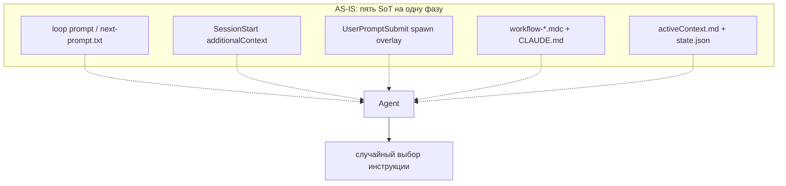
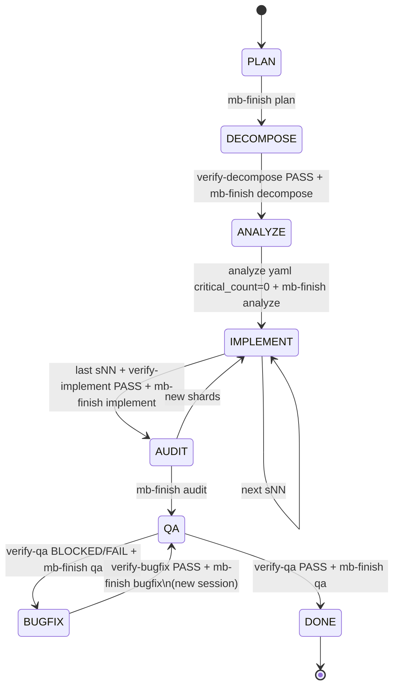
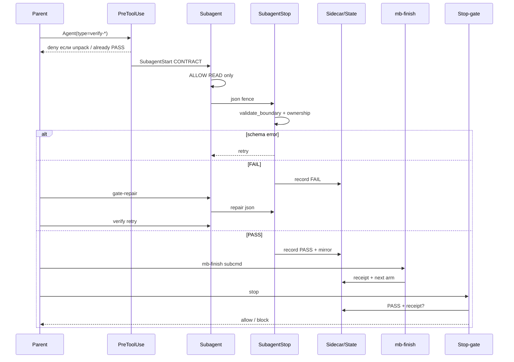

# Архитектура loop-сессии: составные части, канон, drift, рефакторинг

**Дата:** 2026-09-05  
**Вход:** runtime-аудит [`claude-sessions-20260905-last15.md`](./claude-sessions-20260905-last15.md) + code-аудит [`workflow-loop-20260905/index.md`](./workflow-loop-20260905/index.md) + исходники `loop/`, `harness/hooks/`, `harness/agents/`, `loop/schemas/`.  
**Объект:** одна role-сессия (`BACK DECOMPOSE`, `BACK IMPLEMENT sNN`, `BACK QA`, …) как **конечный автомат с типизированными границами**, а не как «промпт + md».  
**Инвариант этого документа:** границы = **Pydantic + YAML/JSON**. Парсинг markdown regex’ами и извлечение фазы из заголовков `## Handoff` — **антипаттерн**, его нужно вынести из hot path.

> Это **архитектурный разбор**. Не план эпика и не changelog. Цель — разложить loop на части, показать кто кого спавнит, где ломается, и какими паттернами собрать один SoT.

---

## 0. Одна картинка: что такое сессия

Сессия — не «чат». Это **транзакция**:

```text
identity (role, phase, epic_id, step_id, session_id)
  → ContextBundle (typed, complete/incomplete)
  → Work (parent ± managed subagents)
  → GateRecord (PASS|FAIL|BLOCKED)
  → optional RepairRecord
  → Transition (mb-finish) — atomic commit
  → next identity
```

Сейчас эти шаги размазаны по пяти независимым SoT. Поэтому агент «ломает workflow», даже когда послушен.



Целевое: **один PhasePolicy** (typed) → hooks/CLI/prompts **генерируются**. Агент читает одну карточку сессии, не пять текстов.

---

## 1. Функции старта, которые подкидывают контекст сразу

Это слой **Context Injection**. Он срабатывает *до* первого tool call агента.

### 1.1 Точки входа runner

| Слой | Путь | Роль |
|---|---|---|
| CLI / skill | `.claude/skills/epic-run`, `loop-run` | запуск эпика |
| Runner | [`loop/context_loop.py`](../../loop/context_loop.py) | крутит сессии; next mode — из activeContext + index, не отдельный FSM-парсер runner |
| Arm / identity | [`harness/hooks/epic/core.py`](../../harness/hooks/epic/core.py) `arm_epic`, `rebuild_epic_projection`, `session_start_payload` | вооружает эпик, строит projection |
| Facade | [`harness/hooks/epic_lib.py`](../../harness/hooks/epic_lib.py) | re-export, не SoT |
| Paths | [`harness/hooks/epic_paths.py`](../../harness/hooks/epic_paths.py) → [`loop/paths/epic_layout.py`](../../loop/paths/epic_layout.py) | `state.json`, `activeContext.md`, runtime dir |
| Resume | [`harness/hooks/session_resilience.py`](../../harness/hooks/session_resilience.py) | abort classify, dirty_files, backoff |

Порядок фактического старта Claude-сессии:

```text
context_loop
  → arm / checkpoint_resume
  → spawn Claude (fresh -p)
      SessionStart hook
        harness/hooks/session-start.py
          product_cwd
          _check_preflight_drift  (Codex only, warning)
          epic.session_start_payload(cwd, source)
            load_epic_state
            projection + activeContext fallback
            prompt_builder.build_prompt_scope  ← runtime часто НЕ передаётся
            render_prompt_scope
            loop.mb_load.session.load_session
          additionalContext + sessionTitle
      UserPromptSubmit hook
        harness/hooks/user-prompt.py
          spawn-map + mode/gates из projection ИЛИ regex по prompt
      …агент работает…
```

### 1.2 Что именно инжектится

**A. `render_prompt_scope()`** — [`loop/prompt_builder.py`](../../loop/prompt_builder.py)

Минимальная карточка:

- `COMMAND: {ROLE} {PHASE}`
- runtime / entrypoint (`CLAUDE.md` | `AGENTS.md`)
- role, phase, **step**, epic
- HARD READ: «прочитай **только** указанный entrypoint», затем `mainrule.mdc`, затем chain

Намерение правильное: builder **не читает** workflow files (экономия). Агент сам идёт по chain.

Факт: `step` берётся из `projection.step | next_step`, иначе литерал **`unknown`**. На QA/BUGFIX/AUDIT в пятнашке step = `unknown`. Это не «агент не прочитал rules» — **projection не положил armed step**.

**B. `load_session()`** — [`loop/mb_load/session.py`](../../loop/mb_load/session.py)

Typed result: `MbLoadResult` / `mb-load-result/v1`.

Делает:

1. `read_active_context` → shape validate
2. `parse_handoff_meta` → `LoopHandoffFrontmatter` (`loop-handoff/v1`)
3. `extract_load_now` → `resolve_bundle_paths` (pack + forbidden policy)
4. Читает файлы с cap `max_file_bytes` (256 KiB), считает sha256
5. Опционально `load_plan_section` (режет plan по `##` — **это md-парсинг, не канон**)

Баг (P1, подтверждён кодом): при `missing_file:*` / `read_error:*` цикл `continue`, затем **`ok_status = True`**. Partial bundle выглядит как успешный inject. SessionStart при exception пишет `Warning: load_session exception` и продолжает.

В сессиях DECOMPOSE: SessionStart **инлайнит весь `plan.md`**, потому что `load_now` на ANALYZE/DECOMPOSE указывает на plan, а loader не умеет «path-only, не тело». Это ломает lean load и создаёт ложный «файл уже в контексте».

**C. Duplicate hooks** — [`.claude/settings.json`](../../.claude/settings.json)

На одно событие висят **два** command:

- `$CLAUDE_PROJECT_DIR/.claude/hooks/session-start.py`
- `$CLAUDE_PROJECT_DIR/harness/hooks/session-start.py`

То же для UserPromptSubmit / PreToolUse / SubagentStart / SubagentStop / Stop. Alongside-install = тот же код, **два процесса**. В jsonl: двойной inject, дубль spawn-gate, гонка fingerprint (T-HUB-065, уже в production).

**D. UserPromptSubmit overlay** — [`harness/hooks/user-prompt.py`](../../harness/hooks/user-prompt.py)

Это **второй** командный канал. Он:

1. Берёт `projection.phase` из `state.json` → `gates_from_phase` (хорошо).
2. Если projection нет — **regex по тексту user prompt** (`QA_RE`, `IMPL_RE`, `BUGFIX_RE`, `FINISH_RE`) — плохо, и это ровно то, что пользователь запрещает.
3. Hardcoded строки, **не из phase_registry**:
   - `QA FINISH → REFLECT` (фаза удалена T-HUB-060)
   - `armed_step=DECOMPOSE → verify/reviewer OFF` + `promote DECOMPOSE→IMPLEMENT`
4. Пишет spawn-gate state: `need_verify`, `need_reviewer`, `mode`.

Итог пятнашки: loop COMMAND = `BACK BUGFIX`, SessionStart COMMAND = `BACK QA`, overlay = `PROJECTION phase=QA` + `REFLECT`. Три команды в одном ходе.

### 1.3 Канон старта (должно быть)

Один adapter, один payload, fail-closed:

```text
SessionStartAdapter (thin hook)
  → SessionContextService.load(expected_identity)
       1. identity из state.json (Pydantic EpicState) — единственный COMMAND
       2. handoff frontmatter (loop-handoff/v1) обязан совпасть с identity
          mismatch → CONTEXT_IDENTITY_DRIFT, сессия не стартует работу
       3. ContextBundle = список typed LoadNowItem
            kind: path_ref | yaml_artifact | json_record
            inline_body: только yaml/json ≤ cap И только если flag inline=true
            markdown plan: PATH ONLY, тело не инлайнить
       4. completeness: любой required missing → ok=false, diagnostic_codes
       5. PromptScope из identity, runtime из EPIC_RUNTIME
  → additionalContext = render(PromptScope) + bundle.manifest (пути+sha, не тела md)
```

**Запрещено на старте:**

- инлайнить `plan.md` целиком;
- второй SessionStart (realpath-дедуп в generator settings);
- regex по user prompt для выбора фазы;
- `ok=true` при missing required;
- COMMAND из overlay, расходящийся с `state.armed_step`.

Паттерн: **Facade + Adapter**. Hook не содержит политики. Политика — `SessionContextService`.

---

## 2. Workflow, которое мы читаем

Это слой **Instruction Graph**. Он *не* должен инжектиться телами файлов. Агент читает его *после* карточки сессии.

### 2.1 Каноническая цепочка (software pack)

Pack: [`loop/workflow_pack_registry.yaml`](../../loop/workflow_pack_registry.yaml) → `dev-hub-software`.

```text
entrypoint (CLAUDE.md | AGENTS.md)
  → .cursor/rules/mainrule.mdc
  → role index + role core  (back_developer / front_developer / integration)
  → workflow-{mode}.mdc
  → Gates _lean/{mode}.mdc
  → @-ссылки до листьев
  → skills.impl шага = literal SKILL.md paths
```

Резолв pack: [`loop/workflow/registry.py`](../../loop/workflow/registry.py) `resolve_workflow_pack` (project.yaml > env > default), затем [`loop/workflow/resolve.py`](../../loop/workflow/resolve.py) `full_resolve` проверяет только `phase_registry` file + `memory_bank` dir. **Не** проверяет, что `workflow-{mode}.mdc` и skill paths существуют.

`prompt_builder` сознательно **не** резолвит workflow_file. Это правильно как lean load. Неправильно, что нет machine-check «route существует» *до* сессии.

### 2.2 Что агент обязан прочитать vs что loop говорит

| Источник | Инструкция |
|---|---|
| CLAUDE.md HARD RULE | нельзя начинать, пока не прочитана **вся** цепочка рекурсивно |
| `render_prompt_scope` | прочитай **только** entrypoint, потом mainrule, потом chain выбранной команды |
| token-economy | lean load, `load_now` only |
| SessionStart | инлайнит тела load_now (часто весь plan) |

Агент выбирает случайно. В пятнашке DECOMPOSE: ack есть, Skill `back-decompose` «успешен», файла `.claude/skills/back-decompose/SKILL.md` на диске в момент аудита не было / topology skills nested.

### 2.3 Skills topology (P0, ломает Step 0 прямо сейчас)

Workflow пишет:

```text
.agents/skills/<name>/SKILL.md
```

Факт:

```text
.agents/skills → harness/skills
реальные файлы: harness/skills/skills/<name>/SKILL.md
```

`skills.impl` в yaml шагов указывает несуществующий path. Агент либо ловит File does not exist, либо импровизирует. T-HUB-062 как раз про это, но ANALYZE уже armed без analyze artifact.

Канон путей skills (один, без silent fallback):

```text
harness/skills/<skill>/SKILL.md          # SoT
.agents/skills/<skill>/SKILL.md          # symlink 1:1, без вложенного skills/
.claude/skills/<role>-<mode>/SKILL.md    # role-command thin wrappers, обязаны существовать
```

Missing literal `@` path = **pack doctor FAIL**, сессия не стартует code-режим.

### 2.4 Phase registry — единственный machine SoT фаз

Файл: [`loop/schemas/phase_registry.yaml`](../../loop/schemas/phase_registry.yaml) (`phase-registry/v1`).

Читается через [`loop/epic_transition.py`](../../loop/epic_transition.py): `load_phase_registry` / `get_phase_config` / `get_verify_agent` / `gates_from_phase`.

Поля фазы (канон):

| Поле | Смысл |
|---|---|
| `verify_agent` | какой gate спавнить перед FINISH (`null` = нет gate) |
| `finish_gates_dict.need_verify` / `need_reviewer` | stop-gate |
| `dsh_preset` | preset субагента |
| `promotable_after_finish` | можно ли сразу promote |
| `arm_template` | как вооружать activeContext |
| `board_column` | UI |

**AS-IS дыра:** `user-prompt.py` и spawn-map **дублируют** эти флаги прозой. DECOMPOSE в overlay: verify OFF. Registry / spawn-hard / workflow-decompose: `@verify-decompose` обязателен.

### 2.5 Канон чтения workflow (должно быть)

Паттерн: **Interpreter + Flyweight**.

1. Runner резолвит `PhasePolicy` (Pydantic) из registry + pack + identity.
2. В prompt кладётся **манифест цепочки**: список путей в порядке чтения, каждый path exists (проверено pack doctor).
3. Агент читает файлы сам (Read). Тела workflow **не** инлайнятся.
4. Skill paths из `skills.impl` yaml шага — единственный список; каждый path exists else `SKILL_PATH_MISSING` halt.
5. Никакого второго текста «verify OFF» в overlay.

---

## 3. Sunset-inventory: изоляция устаревшего кода

Это слой **Anti-Corruption / Sunset Boundary**. Задача — *не смешать* as-built legacy с новым SoT в одном контексте parent.

### 3.1 Контракт агента

Файл: [`harness/agents/sunset-inventory.md`](../../harness/agents/sunset-inventory.md)

| | |
|-|-|
| type | managed search, read-only |
| alias | `sunset` |
| tools | Read, Bash, Grep, Glob |
| disallowed | Write, Edit, Agent, Skill, … |
| overlay.verdict | `none` (не gate PASS/FAIL) |
| выход | fenced JSON `loop-sunset-inventory/v1` |

Модель: [`loop/schemas/sunset_inventory.py`](../../loop/schemas/sunset_inventory.py) `SunsetReport` / `SunsetItem`.

Смысл полей:

- `boundary_id`, `new_sot` — граница замены
- `forbidden_for_parent` — пути/символы, которые parent **не должен читать как образец**
- `items[]` — kind A/B/C/I, path+lines, excerpt ≤40 строк, `mark=REPLACE`
- no-design: только WHAT to remove, не HOW

Когда спавнится (канон spawn-hard): shard `sunset_scope.required: true` → **до первого prod Write** нового SoT.

### 3.2 Как результат должен попасть в контекст

Цепочка, которой **нет** end-to-end:

```text
parent packs ALLOW READ + sunset_scope
  → SubagentStart inject CONTRACT sunset-inventory
  → agent emits JSON fence
  → validate_boundary("loop-sunset-inventory/v1")
  → sidecar persist (owned by epic/step/session)
  → parent ContextBundle.forbidden_skipped ∪ report.forbidden_for_parent
  → load_session / resolver больше не инлайнит эти пути
  → IMPLEMENT читает new SoT + inventory refs, не dual-path
```

### 3.3 Что сломано сейчас (P0)

| Проверка | Факт |
|---|---|
| Модель Pydantic | есть, `extra=forbid` |
| `BOUNDARY_REGISTRY` | **нет** `SCHEMA_LOOP_SUNSET_INVENTORY` → `validate_boundary` = `schema_unknown_schema_id` |
| SubagentStop ветка | **нет** sunset |
| SubagentStart `_ALWAYS_INJECT` / `PRESET_BY_AGENT` | sunset **нет** (контракт в `CONTRACTS` есть, но inject только если workflow_state_active) |
| Manifest | агент есть в software set |
| Tesты | `model_validate`, не hook e2e |

Prompt говорит «перед emit: validate-boundary `--schema-id loop-sunset-inventory/v1`». CLI честно ответит unknown schema. Агент либо врёт ok, либо стопорится.

Без sidecar parent **не получает** `forbidden_for_parent` машинно. Устаревший код остаётся в graphify/rg и смешивается с новым SoT — ровно то, от чего sunset должен защищать.

### 3.4 Канон (должно быть)

Паттерн: **Anti-Corruption Layer + Specification**.

1. Зарегистрировать `SunsetReport` в `BOUNDARY_REGISTRY`.
2. SubagentStop: schema → persist sidecar → не gate-verdict (status inventory, не PASS).
3. `resolve_bundle_paths` / forbidden policy читает последний sunset sidecar текущего epic/step.
4. Parent после inventory **не Read** paths из `forbidden_for_parent` кроме цитат в самом JSON.
5. IMPLEMENT shard с `sunset_scope.required` без valid sidecar → stop-gate block Write SoT.

Не парсить md «устарело вот это». Только JSON record.

---

## 4. Verify subagents и валидация pydantic JSON verdict

Слой **Gate**. Read-only. Не пишет код. Не FINISH.

### 4.1 Карта агентов

SoT промптов: [`harness/agents/*.md`](../../harness/agents/). Claude: `.claude/agents` symlink.

| Agent | Фаза | Alias | Verdict | maxTurns (prompt) |
|---|---|---|---|---|
| `verify-implement` | IMPLEMENT / REFACTOR / TASK, `code_changed` | `@verify` | PASS/FAIL | 12 |
| `verify-bugfix` | BUGFIX, `code_changed` | `@verify` | PASS/FAIL | 12 |
| `verify-qa` | QA после parent suite | `@reviewer` | PASS/FAIL/**BLOCKED** | 18 |
| `verify-decompose` | DECOMPOSE pre-FINISH | — | PASS/FAIL | 10–12 |
| `analyze-verify` | после фикса ANALYZE findings | — | PASS/FAIL | gate optional |
| `verify-script/edit/publish` | video pack | — | **не в manifest** | — |

Packed prompt (parent обязан):

- implement/bugfix: `AC+` · `AC−` · `§0.11` · `VERIFY` · `ALLOW READ` (≤10 файлов, без glob `**`)
- qa: `Suite results` · AC+/AC− · §0.11 · ALLOW; **pytest только parent**
- decompose: `COVERAGE` · `PLAN EXCERPT` · ALLOW; **без pytest**

FRONT tests: parent-only HARD RULE в каждом spawn (`HARD_RULE` в [`harness/hooks/_lib.py`](../../harness/hooks/_lib.py)).

### 4.2 Machine JSON

Схема: `loop-gate-verdict/v1` — [`loop/schemas/gate_verdict.py`](../../loop/schemas/gate_verdict.py) `GateVerdictRecord`.

```json
{
  "schema": "loop-gate-verdict/v1",
  "agent_id": "verify-implement",
  "verdict": "PASS",
  "reason": "…",
  "evidence_sha256": "…",
  "step_id": "s05",
  "session_id": "…",
  "epic_id": "T-HUB-…",
  "recorded_at": "<iso8601>"
}
```

`extra=forbid`. Поле схемы — `schema` (alias `schema_version`). Текстовая строка `VERDICT:` — human-only, **не** machine input.

Перед emit агент обязан прогнать:

```text
python harness/hooks/epic_resolve.py validate-boundary
  --schema-id loop-gate-verdict/v1 --json '…'
```

`validate_boundary` — [`loop/validate_boundary.py`](../../loop/validate_boundary.py) → `BOUNDARY_REGISTRY`.

### 4.3 Runtime pipeline verify

```text
PreToolUse Agent (agent-pretool.py)
  → packed sections / ALLOW / strip worktree+model
  → DENY verify если уже PASS
  → DENY gate-repair без prior FAIL

SubagentStart
  → CONTRACTS[agent] + HARD_RULE
  → preset.verify | preset.reviewer

verify agent (read-only)
  → fenced json

SubagentStop (subagent-stop.py)
  → extract_json_fence
  → validate_boundary
  → schema error → retry (лимит)
  → semantic/ownership
  → coerce_verify_verdict (PASS может демотироваться в FAIL, если step incomplete)
  → record_verdict + sidecar
  → mirror_verify_verdict / mirror_gate_verdict в epic state
  → FAIL → hint parent: @gate-repair
  → PASS → mb_finish_hint_after_verdict

Stop (stop-gate.py)
  → FINISH без PASS / без mb-finish receipt → block
  → stale load_now completed steps → block
  → NEED_HUMAN: verify_no_verdict после исчерпания retry
```

Хинты после PASS: [`loop/mb_finish/verify_hint.py`](../../loop/mb_finish/verify_hint.py)

| Agent | mb-finish subcmd |
|---|---|
| verify-implement / verify | `implement --step {armed}` |
| verify-bugfix | `bugfix` |
| verify-qa PASS | `qa` |
| verify-qa BLOCKED | `bugfix` |
| verify-decompose | `decompose` |
| analyze-verify | `analyze` |

### 4.4 Дыры валидации (не «агент забыл JSON»)

1. **Payload bypass:** если hook получил `data.verdict` без JSON fence, часть путей пропускает validation. Противоречит контракту «нет fence = protocol FAIL».
2. **`schema` фактически optional** в unified validator для части gate/repair.
3. **Ownership слабый:** `epic_id`/`step_id`/`session_id` optional в модели. Чужой/старый PASS может закрыть другой шаг.
4. **Mirror в try/except continue** — FAIL mirror не блокирует transition.
5. **DECOMPOSE overlay выключает need_verify**, хотя агент `verify-decompose` managed и spawn-hard его требует. Stop-gate смотрит `need_verify` из spawn state → ложный green docs-only FINISH.
6. README схем врёт: `loop/schemas/verdict.py` / `LoopGateVerdict` / `SKIP` — **не существуют**. Реально `gate_verdict.py`, `PASS/FAIL/BLOCKED`.

### 4.5 Канон verify (должно быть)

Паттерн: **Chain of Responsibility** на одном `GatePipeline`.

```text
ParseFence → SchemaValidate → SemanticOwnership → PersistSidecar → PolicyDecision
```

- Нет fence → schema retry, не `data.verdict`.
- Ownership mismatch → **не** retry, сразу BLOCKED/NEED_HUMAN.
- `ExpectedGateContext(agent, epic, step, session, phase)` обязателен.
- PhasePolicy.verify_agent == null → агент не спавнится и stop не требует.
- PhasePolicy.verify_agent == `verify-decompose` → overlay не имеет права выключить.

---

## 5. Repair agent

Слой **Repair**. Write-only в ALLOW. Не spawn verify. Не FINISH.

### 5.1 Контракт

[`harness/agents/gate-repair.md`](../../harness/agents/gate-repair.md)

Parent после `VERDICT: FAIL` пакует:

| Секция | Обязательна |
|---|---|
| `BLOCKERS` | да, из verify-отчёта |
| `ALLOW WRITE` | да, ≤10 конкретных файлов |
| `VERIFY` | да, точная pytest/CLI команда |
| `ALLOW READ` | нет, ≤10 |

Выход: `loop-repair-result/v1` — [`loop/schemas/repair_result.py`](../../loop/schemas/repair_result.py)

```json
{
  "schema": "loop-repair-result/v1",
  "agent_id": "gate-repair",
  "status": "done|partial|fail",
  "fixed_blockers": [],
  "remaining_blockers": [],
  "recorded_at": "<iso8601>"
}
```

`agent-pretool` DENY `@gate-repair` без prior verify FAIL.

После `done`/`partial` parent **обязан** retry `@verify-*`. Repair сам verify не вызывает.

### 5.2 Дыры

- Repair result **не связан** с parent FAIL id / evidence_sha256 / blocker ids.
- Нет поля `changed_files`.
- `status=fail` семантически не требует remaining_blockers на уровне модели (только prose).
- Schema retry = 1; не спутать с semantic fail.
- SubagentStop stores repair status, но stop-gate смотрит в основном verify sidecar.

### 5.3 Канон repair

Паттерн: **Command + Compensating Transaction**.

```text
RepairCommand(
  parent_gate_id,
  blockers: list[BlockerId],
  allow_write: list[Path],
  verify_cmd: Argv,
)
→ RepairResultRecord
→ if done|partial: enqueue VerifyCommand(same identity)
→ if fail: NEED_HUMAN or parent widen ALLOW
```

Модель дополнить: `parent_evidence_sha256`, `parent_blockers`, `changed_files`. Fixed ⊆ parent blockers. Иначе `semantic_ownership_mismatch`.

---

## 6. mb-finish

Слой **Transition**. Единственный легальный writer `activeContext.md` на FINISH.

### 6.1 API

CLI: `python harness/hooks/epic_resolve.py mb-finish <subcmd>`  
MCP: [`loop/mb_finish/mcp_server.py`](../../loop/mb_finish/mcp_server.py)

| Tool / subcmd | Handler | Файл |
|---|---|---|
| `finish_handoff` | low-level escape hatch | [`impl.py`](../../loop/mb_finish/impl.py) |
| `finish_implement` | step + `finalize_step` | [`finish_implement.py`](../../loop/mb_finish/finish_implement.py) |
| `finish_qa` | QA artifact + next BUGFIX/DONE | impl.py |
| `finish_bugfix` | bugfix artifact → arm QA new session | impl.py |
| `finish_decompose` | → ANALYZE | impl |
| `finish_plan` | → DECOMPOSE / queue | impl |
| `finish_analyze` | critical_count=0 → IMPLEMENT | impl |
| `finish_audit` | → QA or new IMPLEMENT shards | impl |
| `finish_creative` | creative artifact | impl |
| `finish_reflect` | **остаток T-HUB-060**, ImportError-риск | не в TOOLS mcp_server, ещё в старых ветках |

`finalize_step` (index yaml `completed`) — **не** руками и не из verify. Только mb-finish implement после PASS.

Lock: `_lib.assert_active_context_writable` — runner owns AC, агент не Write handoff.

### 6.2 Что finish должен гарантировать (транзакция)

```text
pre:
  identity matches
  gate sidecar PASS (если PhasePolicy требует)
  artifacts exist (qa yaml / bugfix / analyze / decompose tree)
commit:
  render activeContext (typed frontmatter + load_now paths)
  atomic_write AC
  index status (implement)
  append event log
  reconcile
  sync_cursor_from_index
  write last_finish_tool receipt (name, phase_run_id, handoff_sha256)
  arm next phase
rollback:
  restore AC backup
  не оставлять Handoff без index/state
```

Факт: `atomic_write_text` атомарна **на один файл**. Между AC write и index/state — окно. `finish_handoff()` позволяет записать Handoff **без** finalize pipeline.

QA finish: `qa_after_bugfix` требует **новую сессию** (`qa_new_session_required`). Это правильный session boundary. В пятнашке его обошли: bugfix-док «1942 passed», qa yaml остался `fail`, queue ушёл на 062.

DECOMPOSE finish канон: next = **ANALYZE only**. Overlay говорит IMPLEMENT. AC на диске уже ANALYZE **без** `analyze-*.yaml`.

### 6.3 Канон mb-finish

Паттерн: **Unit of Work + State Machine (явный)**.

Один `TransitionService.commit(TransitionCommand)`:

- phase-specific policy из registry (не N копий `finish_*` с copy-paste backup/write);
- `finish_handoff` убрать из public MCP или пометить `unsafe_escape` + fail в loop env;
- receipt обязателен для stop-gate;
- multi-file commit: AC + state + index в одном lock, иначе rollback всех трёх.

---

## 7. Правильные схемы и пути

### 7.1 Boundary registry (machine, CLI `validate-boundary`)

Сейчас в [`loop/schemas/boundary_registry.py`](../../loop/schemas/boundary_registry.py):

| schema_id | model | роль |
|---|---|---|
| `mb-load-result/v1` | `MbLoadResult` | старт bundle |
| `loop-gate-verdict/v1` | `GateVerdictRecord` | verify |
| `loop-repair-result/v1` | `RepairResultRecord` | repair |
| `loop-validate-result/v1` | `ValidateResult` | мета-валидатор |

**Должны быть в том же реестре (сейчас снаружи):**

| schema_id | model | файл |
|---|---|---|
| `loop-sunset-inventory/v1` | `SunsetReport` | `sunset_inventory.py` |
| `loop-handoff/v1` | `LoopHandoffFrontmatter` | `handoff.py` |
| `loop-state/v2` | `EpicState` | `state.py` |
| `loop-checkpoint/v1` | checkpoint record | epic/core.py константа |
| `mb-finish-result/v1` | `MbFinishResult` | mb_finish/schemas |
| `phase-registry/v1` | PhaseRegistry | yaml → Pydantic pack |
| `reconcile-report/v1` | | epic/reconcile.py |

Один принцип: **если агент или CLI эмитит JSON — id есть в BOUNDARY_REGISTRY**. Иначе контракт вранье.

### 7.2 Доменные артефакты (YAML, не md)

| Артефакт | Канон path |
|---|---|
| Handoff cursor | `memory-bank/activeContext.md` — **только** yaml frontmatter + load_now links + короткий Handoff; тела планов нет |
| State | `.claude/runtime/epic/state.json` (`loop-state/v2`) |
| Spawn-gate | `.claude/runtime/spawn-gate/<session>.json` |
| Gate sidecar | рядом со state / evidence sha |
| Plan | `memory-bank/<role>/plan/<epic_id>/md/plan.md` |
| Decompose index | `memory-bank/<role>/plan/<epic_id>/yaml/decompose-index.yaml` |
| Steps | `.../yaml/steps/sNN-*.yaml` |
| Implement shard | `memory-bank/<role>/implement/<epic_id>/...` |
| QA | `memory-bank/<role>/qa/<epic_id>/qa-*.yaml` |
| Bugfix | `memory-bank/<role>/bugfix/<epic_id>/...` |
| Analyze | `memory-bank/<role>/analyze/<epic_id>/analyze-*.yaml` |
| Audit | `memory-bank/<role>/audit/<epic_id>/...` |
| Queue | `memory-bank/back/roadmap/queue.yaml` |

`epic_id` = полный `T-HUB-NNN-slug`, не short queue id, не reserved `back|front|integration`.

Layout resolver: [`loop/paths/epic_layout.py`](../../loop/paths/epic_layout.py) / pack `artifact_layout: software-epic-v1`. Legacy `decompose-` prefix = diagnostic `layout_v1_deprecated`, не silent.

### 7.3 Что нельзя парсить regex’ом из md

Вынести из hot path (сейчас живёт в `loop/schemas/active_context.py`, `user-prompt.py`, `stop-gate.py`, `plan_section.py`, `epic/reconcile.py`):

| Сейчас | Должно |
|---|---|
| `## Handoff BACK QA` heading → phase | `frontmatter.mode` |
| `Режим/шаг: \`BACK AUDIT\`` | `frontmatter.mode` |
| `QA_RE.search(prompt)` | `state.armed_step` / PhasePolicy |
| `extract_load_now` из markdown списка | yaml блока `load_now:` в frontmatter или отдельный `load_now.yaml` |
| `load_plan_section` split по `##` | plan sections как якоря в yaml (offset/id), либо не инлайнить |
| `_PLAN_LAYOUT_ROW` / backtick paths в reconcile | delta/as_built **уже yaml** в step file |
| `re.search(sNN-)` в load_now для stale | `LoadNowItem.step_id` поле модели |

Markdown остаётся **человеческим комментарием** к typed record, не источником фазы.

Frontmatter parse через yaml.safe_load + Pydantic — это не «regex md», это допустимая граница. Regex заголовков Handoff — нет.

### 7.4 README схем

[`loop/schemas/README.md`](../../loop/schemas/README.md) — **generated** из registry. Сейчас врёт (`verdict.py`, SKIP, loop-state/v1). Паттерн: **documentation as code**.

---

## 8. Кто когда спавнится: целевая схема по режимам

Единый закон:

```text
PhasePolicy = registry[phase]
parent work
optional: explorer (code modes, managed)
optional: sunset-inventory (sunset_scope.required)
parent FINISH intent
  if verify_agent: spawn exactly that agent
  FAIL → gate-repair → retry verify
  PASS → mb-finish <subcmd>
stop-gate checks sidecar + finish receipt
```

Никакого generic `@verify`, если policy назвала `verify-bugfix`.



**REFLECT отсутствует.** POST_IMPLEMENT = `IMPLEMENT → AUDIT → QA → DONE` (+BUGFIX петля).

### 8.1 Матрица сессии по фазам

#### PLAN

| | |
|-|-|
| Start inject | COMMAND + paths plan dir; **не** тело чужих эпиков |
| Workflow | `workflow-*-plan.mdc`, plan-artifact unlimited |
| Skills | writing-plans / grill-me — **canonical path exists** |
| explorer | нет (docs) |
| sunset | нет |
| verify | **нет** (`verify_agent: null`) |
| repair | нет |
| FINISH | `mb-finish plan` → arm DECOMPOSE |
| Запрет | Skill tool success при missing file; mega-plan вместо split |

#### DECOMPOSE (пример из пятнашки)

| | |
|-|-|
| Start inject | COMMAND `BACK DECOMPOSE`, step=`DECOMPOSE` (не unknown), load_now = **paths** index+plan, без inline plan body |
| Workflow | `workflow-decompose.mdc` 7a/7b: coverage 4 секции, `validate-decompose-tree` |
| explorer | нет |
| sunset | если replace-эпик и shard later; на самой нарезке обычно нет |
| verify | **`verify-decompose` ON** (coverage semantic) |
| repair | да, если FAIL blockers в index/shards (ALLOW WRITE = yaml/md decompose) |
| FINISH | PASS → `mb-finish decompose` → **ANALYZE only** |
| Запрет | verify OFF overlay; promote в IMPLEMENT; ANALYZE без finish |

AS-IS пятнашка: 8× abort 401, dirty_files=`plan.md` (не yaml tree), verify OFF, AC уже ANALYZE без artifact.

#### ANALYZE

| | |
|-|-|
| Вход | decompose tree существует; analyze yaml ещё нет |
| Work | read-only findings A1…An |
| verify | `analyze-verify` **после** фикса plan/decompose, не как pre-FINISH всей фазы |
| FINISH | `mb-finish analyze` только при `critical_count=0` |
| Запрет | IMPLEMENT без analyze yaml |

#### CREATIVE

| | |
|-|-|
| verify | нет / docs |
| FINISH | `mb-finish creative` |
| spawn | не explorer/verify unless policy |

#### IMPLEMENT / REFACTOR / TASK (code)

Порядок внутри шага sNN:

```text
1. SessionStart: identity step=sNN, load_now = implement yaml + index (не полный plan)
2. explorer  — если managed search ON; иначе parent graphify+узкий rg
3. sunset-inventory — если sunset_scope.required до Write SoT
4. parent TDD: seed → checkpoints flush → suite
5. @verify-implement packed
6. FAIL → @gate-repair → retry verify
7. PASS → mb-finish implement --step sNN → finalize-step
8. next sNN или AUDIT
```

`explorer managed: off` в s05 пятнашки — осознанный bypass spawn-hard; допустим только если policy explicit `scope_disabled`, не «забыли».

#### AUDIT

| | |
|-|-|
| verify | нет (docs gap) |
| FINISH | audit yaml + gap matrix; next IMPLEMENT или QA |
| overlay regex | не определяет фазу |

#### QA

```text
parent full suite (bin/pytest -q --tb=line)   # FRONT: только parent
  → qa-*.yaml
  → @verify-qa  (alias reviewer)
       PASS  → mb-finish qa → DONE (или pack next)
       BLOCKED/FAIL → mb-finish qa → BUGFIX
```

Не REFLECT. Не закрывать эпик, пока qa yaml stale fail.

#### BUGFIX

```text
вход = QA fail artifact (не «COMMAND QA» в SessionStart)
  → root cause → red/green
  → @verify-bugfix
  → PASS → mb-finish bugfix
  → arm QA + qa_after_bugfix.phase_run_id
  → STOP session (обязательная новая QA-сессия)
```

Identity lock: `armed_step=BUGFIX` → `finish_handoff` с mode≠BUGFIX отвергается (`bugfix_finish_required`). Это уже в коде — сохранить.

### 8.2 Subagent lifecycle (все фазы)



Sunset в той же шине, но **не** GateVerdict: отдельный `InventoryRecord`, потребляется ContextBundle, не stop-gate PASS.

---

## 9. Расхождения «есть → должно»

Сводка из пятнашки + кода. Это не вина агента.

| # | Есть | Должно | Слой |
|---|---|---|---|
| 1 | 5 текстов SoT на фазу | 1 `PhasePolicy` | architecture |
| 2 | SessionStart ×2 | 1 command / event (realpath) | settings generator |
| 3 | Inline весь plan.md | path + sha, body по Read | mb_load |
| 4 | `ok=true` при missing file | `ok=false` + `CONTEXT_INCOMPLETE` | mb_load |
| 5 | COMMAND BUGFIX vs inject QA | identity lock, mismatch = halt | session_start_payload |
| 6 | `step: unknown` | armed_step из state | prompt_builder |
| 7 | `build_prompt_scope` без runtime | `EPIC_RUNTIME` → entrypoint | session_start |
| 8 | overlay `verify OFF` на DECOMPOSE | `verify-decompose` ON | user-prompt ← registry |
| 9 | overlay `QA → REFLECT` | QA → DONE/BUGFIX | T-HUB-060 complete |
| 10 | overlay promote DECOMPOSE→IMPLEMENT | DECOMPOSE→ANALYZE | finish_decompose |
| 11 | ANALYZE armed, analyze yaml нет | finish_decompose не arm без gate | transition |
| 12 | Skill `back-*` missing / nested skills | literal path exists | topology |
| 13 | `validate_boundary` не знает sunset | registry + SubagentStop branch | schemas |
| 14 | fence bypass через `data.verdict` | fence required | subagent-stop |
| 15 | repair не связан с parent FAIL | parent_gate_id | repair model |
| 16 | `finish_handoff` public escape | loop env forbid | mcp |
| 17 | AC write ≠ index/state transaction | Unit of Work | mb-finish |
| 18 | dirty_files только plan.md | yaml tree + steps | session_resilience |
| 19 | 401 ban = TRANSIENT ×8 | HALT / NEED_HUMAN reconnect | abort classifier |
| 20 | phase из regex md/prompt | frontmatter + state | anti-regex |
| 21 | README схем врёт | generate from registry | docs |
| 22 | video pack route 404 | pack doctor fail-closed | workflow |
| 23 | Codex TOML без tools/maxTurns | Contract Registry → all runtimes | materializer |
| 24 | QA yaml fail + queue ушёл | нельзя mark epic done | finish_qa |
| 25 | CLAUDE.md hash drift vs harness/instructions | generated entrypoint | runtime-sync |

Корневые причины (не симптомы):

1. **Несколько SoT** на фазу (prompt, projection, overlay, mdc, AC).
2. **Skill FS layout** ломает read-contract.
3. **Duplicate hooks** в production settings.
4. **Незавершённый T-HUB-060** (код без REFLECT, overlay/docs/finish_reflect ещё с ним).
5. **Abort classifier** врёт класс 401.
6. **Markdown как IPC** (фаза/load_now/verdict prose).

---

## 10. Предложения и варианты рефакторинга (паттерны)

Не «переписать loop». Сжать число SoT. Regex/md-парсинг убрать с границы.

### Вариант A (рекомендуемый): Policy Registry + thin adapters

Паттерны: **Registry, Adapter, Strategy, Unit of Work, Anti-Corruption**.

```text
ContractRegistry (typed)
  agents, schemas, phase policies, skill paths, hook contracts
       │ generates
       ├─ harness/agents/*.md checksum check (не руками дублировать CONTRACTS)
       ├─ _lib.CONTRACTS
       ├─ Codex TOML metadata
       ├─ spawn-hard table
       └─ schemas/README.md

PhaseStrategy[phase]
  start_bundle_policy
  verify_agent
  repair_allowed
  finish_command
  next_phase

SessionContextService   # start
GatePipeline            # verify/repair/sunset
TransitionService       # mb-finish
```

Hooks = adapters 20–40 строк. Политика не копируется в `user-prompt.py`.

Плюс: минимальный поведенческий diff, чинит P0 без big-bang.  
Минус: нужна дисциплина «не писать прозу в overlay».

### Вариант B: Event-sourced lifecycle

Паттерны: **Event Sourcing + Projector**.

Уже есть event log (`_append_event`, `reconcile_epic_events`). Сделать его SoT:

- команды: `Arm`, `GateRecorded`, `Repaired`, `Finished`, `Aborted`
- `activeContext` и `projection` — **read models**, не writers
- mismatch AC vs events → repair projector, не regex handoff

Плюс: пятнашка BUGFIX vs QA невозможна (COMMAND = last event).  
Минус: больше миграции state; делать после A.

### Вариант C: Orchestrator / Mediator для субагентов

Паттерны: **Mediator, Command Bus**.

Parent не «помнит» spawn-hard таблицу. `Orchestrator.next()` возвращает Command:

```text
SpawnExplorer | SpawnSunset | SpawnVerify | SpawnRepair | InvokeFinish | Stop
```

Агент-parent либо исполняет команду, либо отказывается (NEED_HUMAN). Импровизация «verify OFF потому что overlay» невозможна.

Плюс: закрывает DECOMPOSE/QA противоречия.  
Минус: parent становится тоньше; осторожно с IDE-сессиями без loop.

### Вариант D: не делать

Оставить facade `epic_lib` + ещё regex в `user-prompt`. Это текущий путь. Пятнашка показывает цену.

### Порядок внедрения (маленькие шаги, YAGNI)

1. **P0.1** Добить REFLECT: вычистить overlay строку, `finish_reflect`, tests. Один SoT next(QA).
2. **P0.2** Duplicate hooks: generator settings по realpath, один command.
3. **P0.3** Identity lock: SessionStart COMMAND == `armed_step`; mismatch halt. Step никогда `unknown` если armed.
4. **P0.4** `load_session`: missing required → `ok=false`; md plan не инлайнить (path-only).
5. **P0.5** DECOMPOSE gates из registry: удалить блок `verify OFF` / promote IMPLEMENT в `user-prompt.py`.
6. **P0.6** Sunset в `BOUNDARY_REGISTRY` + SubagentStop + forbidden_for_parent в bundle.
7. **P0.7** Skill topology: один FS layout + pack doctor `@` paths.
8. **P1** Fence-required; ownership fields required; repair.parent_gate_id.
9. **P1** `finish_handoff` закрыть в loop env; Unit of Work AC+state+index.
10. **P1** Abort: 401 banned → NEED_HUMAN, не TRANSIENT storm.
11. **P2** ContractRegistry codegen; README generate; выпилить regex phase detection.
12. **P2** Event projector (вариант B) когда identity lock стабилен.

Критерий готовности слоя: **нельзя** получить зелёный FINISH, если любой из пяти старых SoT молчит или врёт — потому что четырёх из них больше нет.

### Что удалить (deletion > addition)

- regex фазы в `user-prompt.py` (`QA_RE` как источник mode, когда есть projection);
- строку REFLECT;
- hardcoded DECOMPOSE verify OFF;
- public `finish_handoff` в loop;
- nested `harness/skills/skills/`;
- legacy gate parser / `data.verdict` без fence;
- `loop/schemas/README.md` ручную таблицу;
- generic `@verify` в machine commands (оставить alias map в registry);
- md heading parsers в `active_context.py` hot path, когда frontmatter валиден.

Не добавлять «умный fallback путь skills». Missing path = halt.

---

## 11. Правило «никаких regex и парсинга md» — как провести границу

Разрешено:

- YAML/JSON parse;
- Pydantic `model_validate`;
- frontmatter split по стандартному `---` + `yaml.safe_load` (это документ-конверт, не семантика Handoff);
- чтение полей `mode` / `load_now` из модели.

Запрещено как IPC:

- угадать фазу из `## Handoff …`;
- угадать COMMAND из текста user prompt, если `state.json` armed;
- вырезать AC+/coverage из markdown как machine evidence (evidence = yaml shard + json verdict);
- `load_plan_section` по `##` как SoT (если нужно — якоря в plan yaml);
- spawn-gate mode от `FINISH_RE.search(prompt)`.

Reality check: часть regex останется в **миграционном** слое для старых AC без frontmatter. Он должен:

- писать `drift_counters` (уже есть `gate_verdict_regex_fallback`);
- не быть на пути, если `loop-handoff/v1` валиден;
- выключиться флагом `PROJECT_LOOP_HANDOFF_STRICT=1` (уже объявлен в README схем).

---

## 12. Привязка к пятнашке (зачем эта схема)

Разбор [`claude-sessions-20260905-last15.md`](./claude-sessions-20260905-last15.md) по слоям этой архитектуры:

| Сессия | Слой, который соврал |
|---|---|
| `94cea2d3` BUGFIX vs QA inject | §1 identity lock, §8 BUGFIX |
| `78283c81` DECOMPOSE verify OFF + plan dump | §1 inline, §8 DECOMPOSE, overlay |
| `b47bb588` dual SessionStart | §1 duplicate hooks |
| 8× 78K abort 401 | §9 abort classifier, dirty_files |
| `5f623711` PLAN skill missing | §2 skill topology |
| T-HUB-062 AC ANALYZE без yaml | §6 finish_decompose / §8 ANALYZE |
| T-HUB-060 qa fail + queue gone | §6 QA transaction, §8 QA |
| Нет sunset e2e | §3 registry |

Агент в этих сессиях не «не прочитал workflow». Ему **подсунули противоречивый ContextBundle**.

---

## 13. Связанные файлы (навигация)

**Start:** [`loop/context_loop.py`](../../loop/context_loop.py) · [`harness/hooks/session-start.py`](../../harness/hooks/session-start.py) · [`loop/prompt_builder.py`](../../loop/prompt_builder.py) · [`loop/mb_load/session.py`](../../loop/mb_load/session.py) · [`loop/mb_load/resolver.py`](../../loop/mb_load/resolver.py)

**Workflow:** [`loop/workflow_pack_registry.yaml`](../../loop/workflow_pack_registry.yaml) · [`loop/schemas/phase_registry.yaml`](../../loop/schemas/phase_registry.yaml) · [`loop/epic_transition.py`](../../loop/epic_transition.py) · [`loop/workflow/resolve.py`](../../loop/workflow/resolve.py)

**Gates:** [`harness/hooks/user-prompt.py`](../../harness/hooks/user-prompt.py) · [`harness/hooks/subagent-start.py`](../../harness/hooks/subagent-start.py) · [`harness/hooks/subagent-stop.py`](../../harness/hooks/subagent-stop.py) · [`harness/hooks/stop-gate.py`](../../harness/hooks/stop-gate.py) · [`.claude/instructions/spawn-hard.md`](../../.claude/instructions/spawn-hard.md)

**Agents:** [`harness/agents/`](../../harness/agents/) · [`loop/mb_finish/verify_hint.py`](../../loop/mb_finish/verify_hint.py)

**Finish:** [`loop/mb_finish/impl.py`](../../loop/mb_finish/impl.py) · [`loop/mb_finish/finish_implement.py`](../../loop/mb_finish/finish_implement.py) · [`loop/mb_finish/mcp_server.py`](../../loop/mb_finish/mcp_server.py)

**Schemas:** [`loop/schemas/boundary_registry.py`](../../loop/schemas/boundary_registry.py) · [`gate_verdict.py`](../../loop/schemas/gate_verdict.py) · [`repair_result.py`](../../loop/schemas/repair_result.py) · [`sunset_inventory.py`](../../loop/schemas/sunset_inventory.py) · [`handoff.py`](../../loop/schemas/handoff.py) · [`state.py`](../../loop/schemas/state.py) · [`loop/validate_boundary.py`](../../loop/validate_boundary.py)

**Code-audit детали:** [`workflow-loop-20260905/index.md`](./workflow-loop-20260905/index.md) · [03-start-finish](./workflow-loop-20260905/03-start-finish-inject.md) · [04-schemas](./workflow-loop-20260905/04-schemas-validation.md) · [05-repair](./workflow-loop-20260905/05-repair-and-verdict.md) · [07-roadmap](./workflow-loop-20260905/07-priority-roadmap.md)
