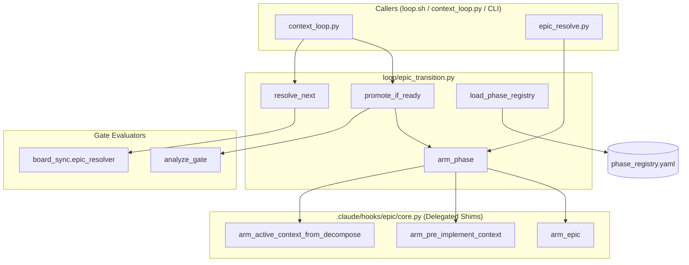

# Epic Transition Engine Architecture

Architecture shard for `T-HUB-029-epic-phase-transition-engine`.

## Overview

The Epic Transition Engine (`loop/epic_transition.py`) provides a single, unified API for phase transitions, resolving next actions, loading phase registries, and managing state arming across the dev-hub automation system.

## Component Interaction & Data-Flow

## Phase Registry Structure

| Phase | Category | Promotable | Gate Required | Default Verify Agent | DSH Preset |
|-------|----------|------------|---------------|----------------------|------------|
| PLAN | Pre-Implement | No | No | verify | plan |
| CLARIFY | Pre-Implement | No | No | verify | clarify |
| DECOMPOSE | Pre-Implement | Yes | No | verify | decompose |
| CREATIVE | Pre-Implement | No | No | verify | creative |
| ANALYZE | Pre-Implement | Yes | Yes (analyze_gate) | verify | analyze |
| IMPLEMENT | Implement | No | No | verify | implement |
| TASK | Implement | No | No | verify | task |
| REFACTOR | Implement | No | No | verify | refactor |
| BUGFIX | Implement | No | No | verify | bugfix |
| QA | Post-Implement | No | No | reviewer | qa |
| REFLECT | Terminal | No | No | verify | reflect |
| AUDIT | Post-Implement | No | No | verify | audit |

## Entrypoint Migration Map

| Legacy Function | New API Replacement | Status |
|-----------------|---------------------|--------|
| `promote_decompose_phase_if_ready` | `epic_transition.promote_if_ready` | Deprecated Shim (Delegates) |
| `arm_active_context_from_decompose` | `epic_transition.arm_phase` | Deprecated Shim (Delegates) |
| `arm_pre_implement_context` | `epic_transition.arm_phase` | Deprecated Shim (Delegates) |
