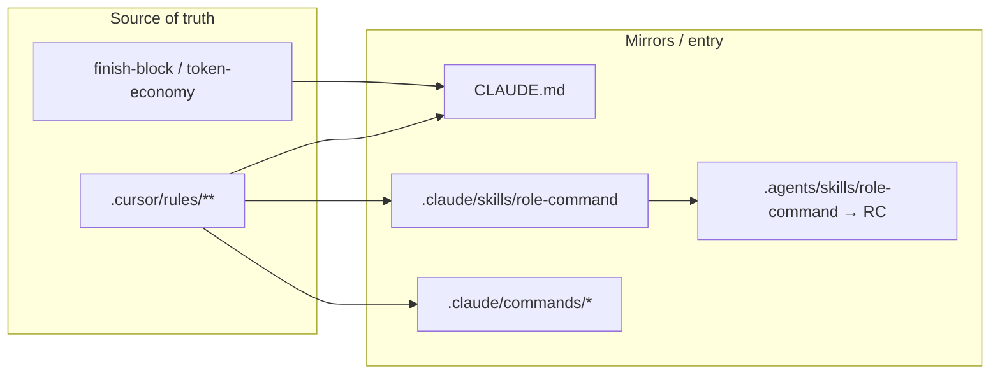

# [T-HUB-002 | canon-sync] PLAN

**Дата:** 2026-08-16  
**Режим:** BACK PLAN  
**Уровень:** L3  
**Статус:** active  
**Roadmap:** [roadmap-workflow-loop-hardening-epics.md](roadmap-workflow-loop-hardening-epics.md) · queue sibling  
**Research:** [audit contradictions §P0](../../audit/workflow-loop-20260816/contradictions.md) · [audit roadmap P0 1–5](../../audit/workflow-loop-20260816/roadmap.md)

**Skills:** writing-plans · brainstorming (locked decisions below) · python-testing-patterns (n/a code; doc grep AC)

→ [T-HUB-002-canon-sync/md/decompose-index.md](T-HUB-002-canon-sync/md/decompose-index.md) — **после DECOMPOSE**

---

## Контекст

- **req:** устранить противоречия и битые пути в каноне workflow (CLAUDE ↔ `.cursor/rules` ↔ `.claude` ↔ `.agents`), из‑за которых агенты выбирают неверную копию правила.
- **deps:** нет (первый в queue). Soft: последующий T-HUB-004 выровняет код NEED_HUMAN под тексты этого эпика.
- **refs:** `CLAUDE.md`, `.cursor/rules/mainrule.mdc`, `.cursor/rules/graphify.mdc`, `.cursor/rules/token-economy-core.mdc`, `.cursor/rules/shared/finish-block.mdc`, `.cursor/rules/shared/workflow-idea-pipeline.mdc`, `.cursor/rules/integration_developer/workflow-plan.mdc`, `.claude/skills/role-command/SKILL.md`, `.agents/skills/role-command/SKILL.md`, `.claude/rules/front-tests-parent-only.md`, `.claude/commands/{pm,tl,content,marketing,seo}-*.md`, `memory-bank/architecture/index.md`.

### Зафиксированные решения (brainstorming batch — без CREATIVE)

| Тема | Решение | Почему |
|------|---------|--------|
| Архив ролей PM/TL/… | **FAIL-fast**, не vendor полный `_archive/` в этом эпике | YAGNI для hub; архив живёт в product-репо; hub должен явно падать, а не ссылаться на ghost paths |
| SoT `role-command` | **`.claude/skills/role-command/SKILL.md` = канон**; `.agents/...` → symlink или байт-в-байт копия + CI/doc «не править .agents вручную» | CLAUDE.md уже указывает `.claude`; Cursor catalog тянет `.agents` |
| `front-tests-parent-only` | Создать **`.cursor/rules/front-tests-parent-only.mdc`** с тем же смыслом, что `.claude/rules/front-tests-parent-only.md` | Закрыть 404 по ссылкам из alwaysApply |
| Graphify PLAN | В `mainrule.mdc` + `graphify.mdc`: **skip PLAN кроме** inventory-режимов (`INTEG PLAN`, brownfield VAN inventory); **hub/tooling N/A protocol** если нет `.venv/bin/graphify` | Снять конфликт skip vs workflow-plan 1b |
| Cursor epic gates | **Не** в scope 002 (см. T-HUB-003/004 / architecture note later) | Отдельный риск |

**CREATIVE need:** нет (решения зафиксированы).

---

## Цель

Агенты Cursor и Claude Code читают **один** согласованный канон: implement = yaml, Handoff только в `activeContext`, spawn = pointer на `spawn-hard`, archive roles = explicit FAIL, front-tests path существует, dual `role-command` исчез.

---

## Требования

### FR

| ID | Требование |
|----|------------|
| FR-1 | `CLAUDE.md` Session/FINISH: implement shards = `*.yaml`; Handoff только `activeContext`; убрать «ONE plan shard» из IMPLEMENT session start |
| FR-2 | `CLAUDE.md` spawn: pointer на `.claude/instructions/spawn-hard.md` exceptions (`delta_paths_exist`, MODEL_LOOP), не отдельная политика «L1–L2 без spawn» как абсолют |
| FR-3 | `CLAUDE.md` re-read / TodoWrite: как `context-economy-cc.md` (FINISH 1× activeContext ok; TodoWrite ≤2 на IMPLEMENT/TASK/BUGFIX; PLAN N/A) |
| FR-4 | Существует `.cursor/rules/front-tests-parent-only.mdc`; все ссылки на missing mdc резолвятся |
| FR-5 | `.agents/skills/role-command/SKILL.md` ≡ `.claude/skills/role-command/SKILL.md` (symlink предпочтительно) |
| FR-6 | `mainrule.mdc`: PM/TL/CONTENT/MARKETING/SEO → не live `.cursor/rules/<role>/`; явная строка archived + require `_archive/cursor-rules/` present или FAIL |
| FR-7 | Slash `pm-*`/`tl-*`/…: при отсутствии `_archive` — текст FAIL «восстановить архив из product / vendor», не Load битого path как будто он есть |
| FR-8 | `workflow-idea-pipeline.mdc`: gate «PM phases require `_archive/.../project_manager` present» |
| FR-9 | `graphify.mdc` + `mainrule` Step 0: exception inventory PLAN (INTEG PLAN) + hub N/A protocol (document attempt, fallback inventory, no halt-as-if-CLI-exists) |
| FR-10 | `integration_developer/workflow-plan.mdc` 1b согласован с FR-9 (не «нарушает skip») |
| FR-11 | Архив-секция CLAUDE.md согласована с FR-6 (нет обещания `_archive/` если его нет; инструкция restore) |

### NFR

| ID | Требование |
|----|------------|
| NFR-1 | Не менять поведение runtime hooks/loop (только docs/rules/skills paths) |
| NFR-2 | Не ослаблять §0.0 / plan-artifact / finish-block yaml HARD |
| NFR-3 | Язык артефактов: rules EN compact; chat RU; memory-bank RU где трогаем |
| NFR-4 | После sync: `diff` role-command = empty (или symlink) |

### AC+

1. `test -f .cursor/rules/front-tests-parent-only.mdc`  
2. `diff -q .claude/skills/role-command/SKILL.md .agents/skills/role-command/SKILL.md` → identical **или** `.agents` is symlink to `.claude`  
3. `rg -n 'sNN\|eNN-\*\.md|ONE plan shard|implement-\*\.md' CLAUDE.md` → нет leftover, противоречащих yaml/Handoff-only (допускаются явные «FORBIDDEN .md»)  
4. `rg -n 'project_manager/mainrule-pm' .cursor/rules/mainrule.mdc` → нет live path без archived gate  
5. `rg -n 'front-tests-parent-only\.mdc' CLAUDE.md .cursor/rules` → пути существуют  
6. `graphify.mdc` содержит секцию hub/tooling N/A + exception INTEG PLAN / inventory  
7. IDEA pipeline doc содержит archive-present gate для PM  
8. Manual: открыть `/pm-plan` command text — описывает FAIL без archive, не silent Load missing  

### AC−

1. Не vendor полный `_archive/cursor-rules/` без отдельного решения (out of scope)  
2. Не менять `finish-block.mdc` yaml/order (только CLAUDE pointers)  
3. Не править `loop.sh` / hooks Python  
4. Не удалять agents verify/reviewer/explorer  

---

## Компоненты / файлы

| Файл | Действие |
|------|----------|
| `CLAUDE.md` | Править Session/FINISH/spawn/re-read/TodoWrite/архив |
| `.claude/rules/context-economy-cc.md` | Сверить; при расхождении — выровнять CLAUDE под него (канон CC) |
| `.cursor/rules/front-tests-parent-only.mdc` | **Create** (содержание = смысл `.claude/rules/front-tests-parent-only.md`) |
| `.agents/skills/role-command/SKILL.md` | Replace → symlink/copy from `.claude` |
| `.claude/skills/role-command/SKILL.md` | Канон; при необходимости дописать SECURITY graphify как в mainrule |
| `.cursor/rules/mainrule.mdc` | Таблица prefix → archived FAIL; Step 0 graphify exception |
| `.cursor/rules/graphify.mdc` | N/A protocol + PLAN inventory exception |
| `.cursor/rules/integration_developer/workflow-plan.mdc` | Согласовать 1b wording |
| `.cursor/rules/shared/workflow-idea-pipeline.mdc` | Archive gate |
| `.claude/commands/pm-*.md` (и tl/content/marketing/seo) | Преамбула FAIL if archive missing |
| `memory-bank/architecture/overview.md` или index | Одна строка: SoT rules = `.cursor`; role-command SoT = `.claude` mirror to `.agents` |
| `.claude/README.md` | Упомянуть SoT sync role-command |

---

## Архитектура (docs SoT)

**Правило дрейфа:** править сначала `.cursor/rules` + finish-block; затем CLAUDE/role-command; `.agents` никогда не primary edit.

---

## Replacement / sunset (brownfield)

| Устаревает (path / symbol) | Замена | Policy |
| :--- | :--- | :--- |
| CLAUDE формулировки `implement-*/sNN-*.md` как канон | `*.yaml` + finish-block | delete wording in-epic |
| CLAUDE «ONE plan shard» в IMPLEMENT session | `load_now` = work shard + `index.yaml` only | delete wording |
| CLAUDE Handoff в implement artifact | Handoff only `activeContext` | delete wording |
| Live paths `.cursor/rules/project_manager/…` в mainrule | archived + FAIL | replace in-epic |
| Расходящийся `.agents/.../role-command` | symlink/copy от `.claude` | overwrite in-epic |
| Missing `front-tests-parent-only.mdc` | create file | create |
| Абсолютный «L1–L2 без spawn» без spawn-hard | pointer + exceptions | replace |

---

## Стратегия тестирования

- **Автотесты кода:** не требуются (docs-only), кроме опционального script `diff` в CI later (out of scope).  
- **Верификация:** shell checklist AC+ выше; `rg` по leftover patterns.  
- **Регрессия смысла:** прочитать finish-block — yaml HARD не ослаблен.

---

## Риски

| Риск | Митигация |
|------|-----------|
| Symlink `.agents` → `.claude` ломает Cursor skill loader | Fallback: байт-копия + комментарий «generated from .claude»; проверить открытие skill в Cursor |
| FAIL-fast archive ломает ожидание «PM PLAN всегда работает» | Документировать restore; это честнее битого Load |
| Правка 40 commands — шум | Общий include-блок / одинаковая преамбула 5–10 строк |
| Graphify exception прочитают как «всегда graphify на PLAN» | Явный allowlist: INTEG PLAN + brownfield VAN only |

---

## До DECOMPOSE (черновик фаз)

1. **s01 — CLAUDE canon pass:** Session/FINISH/spawn/re-read/TodoWrite/архив  
2. **s02 — front-tests.mdc + link sweep:** create mdc; rg fix broken refs  
3. **s03 — role-command SoT:** sync `.agents` ← `.claude`; align SECURITY graphify  
4. **s04 — mainrule + archive FAIL:** prefix table + commands preambles  
5. **s05 — graphify + INTEG PLAN wording + IDEA gate**  
6. **s06 — architecture/README note + verification rg suite**

Черновик count advisory (~6 sNN). DECOMPOSE может дробить.

---

## Gaps / open (non-blocking)

- Полный vendor `_archive/` — отдельное решение пользователя / follow-up epic.  
- Cursor `hooks.json` epic parity — не этот эпик.  

---

## Следующий режим

→ **BACK DECOMPOSE T-HUB-002**
