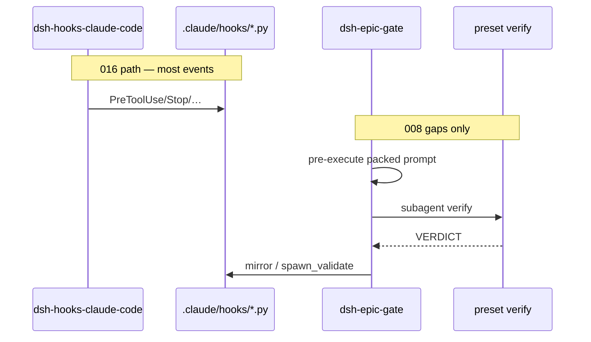

# [T-HUB-008 | dsh-epic-gate-plugin] PLAN

**Дата:** 2026-08-22 · **Revision:** 2026-08-27 (pivot: gap-fill after CC hooks bridge)  
**Режим:** BACK PLAN  
**Уровень:** L3–L4  
**Статус:** active  
**Roadmap:** [roadmap-dsh-loop-backend-epics.md](roadmap-dsh-loop-backend-epics.md)  
**Deps:** hard T-HUB-006, T-HUB-007, **T-HUB-016**. Soft: pin DSH API for Cordis intercept.

**Skills:** writing-plans · architecture-patterns · python-testing-patterns · typescript (Cordis plugin surface)

→ [T-HUB-008-dsh-epic-gate-plugin/md/decompose-index.md](T-HUB-008-dsh-epic-gate-plugin/md/decompose-index.md) — **после DECOMPOSE**

---

## Контекст

- **req (revision):** **не** полный порт Claude hooks в TS. После [T-HUB-016](plan-T-HUB-016-dsh-cc-hooks-bridge.md) (`dsh-hooks-claude-code` гоняет `.claude/settings.json` → ваши `.py`) закрыть **только дыры bridge**, без которых workflow ломается: spawn `updatedInput` / packed prompt rewrite, typed subagent identity, verdict/transcript, при необходимости thin native поверх уже работающего Stop.
- **deps:** 006 runtime · 007 presets · **016 bridge + self-limit**.
- **refs:** `.claude/hooks/agent-pretool.py` (`updatedInput`), `subagent-start.py` / `subagent-stop.py` (`agent_type`, transcript), `stop-gate.py`, `spawn-hard.md`, `@deepseek-ai/dsh-hooks-claude-code` Known Limitations, gap matrix из 016.

### Зафиксированные решения (revision 2026-08-27)

| Тема | Решение |
|------|---------|
| Strategy | **Bridge-first** (016) + **native gap plugin** `@dev-hub/dsh-epic-gate` только для unsupported CC semantics |
| Do NOT reimplement | Full Stop / UserPrompt / Bash pretool logic already in Python via bridge |
| Gap A — updatedInput | Native `tools/pre-execute` on subagent tool: apply HARD RULE / normalize type / packed sections **или** deny + force model retry; prefer calling shared Python validator that prints JSON decision (extract from agent-pretool) |
| Gap B — agent_type | Bridge reports constant `general-purpose`. Plugin maps DSH preset id / subagent tool name → `verify`\|`reviewer`\|`explorer` and injects contract (or sets env for child hooks) |
| Gap C — SubagentStop verdict | On subagent end: read result text / transcript locator; mirror VERDICT via `epic_resolve` / existing mirror helpers |
| Gap D — Stop | Prefer bridge+016 self-limit; native turn-stopping **only if** bridge Stop insufficient for FINISH evidence — then shell-out `gate-check-turn.py` (extract from stop-gate) |
| Python ownership | Epic state / FINISH integrity остаётся в `.claude/hooks/*.py` + `epic_resolve.py` |
| Mount | epic-* profiles after 016 hooks row; order: hooks-claude-code → epic-gate → presets |
| Claude path | Unchanged |

**CREATIVE need:** только если Cordis не даёт rewrite tool input — spike в DECOMPOSE s01; иначе нет.

---

## Цель

DSH + bridge: spawn-hard и VERDICT/FINISH parity для verify/reviewer/explorer **без** дублирования всего hooks стека в TypeScript.

---

## Продуктовая спека (WHAT)

### User Stories

| # | Story | Priority | Independent Test |
| :--- | :--- | :--- | :--- |
| US-001 | Как parent agent, я хочу чтобы spawn verify без AC+ блокировался даже если bridge не сделал updatedInput. | P0 | pre-execute deny `prompt_incomplete:AC+` |
| US-002 | Как verify child, я хочу свой contract inject несмотря на bridge `agent_type=general-purpose`. | P0 | child sees verify contract / HARD RULE |
| US-003 | Как parent, я хочу VERDICT PASS с mirrored evidence после subagent. | P0 | mirror_verify / state flag set |
| US-004 | Как loop, я не хочу второй полный stop-gate на TS. | P0 | Stop path = bridge (± thin gate-check-turn only) |

### Functional Requirements (FR-###)

- **FR-001:** Package `dsh/plugins/epic-gate/` `@dev-hub/dsh-epic-gate`.
- **FR-002:** Shared Python module extract from `agent-pretool` for packed-prompt validation (callable CLI or stdin JSON) — used by native pre-execute.
- **FR-003:** Native pre-execute: deny incomplete spawn; optionally rewrite via supported Cordis API **or** deny with instruction listing missing sections (if rewrite unsupported).
- **FR-004:** Map preset/tool → agent_type for SubagentStart inject / SubagentStop verdict path.
- **FR-005:** Post-subagent / subagent/end: parse VERDICT → mirror (reuse epic_lib / epic_resolve).
- **FR-006:** Optional `gate-check-turn.py` + turn-stopping **only if** 016 bridge Stop fails FINISH scenarios in integration test.
- **FR-007:** Parity matrix README: row per gap A–D with bridge vs native owner.
- **FR-008:** Integration test: bridge mounted + epic-gate → incomplete spawn denied; VERDICT mirrored.
- **FR-009:** `EPIC_PROJECT_ROOT` / `DEV_HUB` exports (from 006/016) consumed.

### Success Criteria

| ID | Результат | Проверка |
| :--- | :--- | :--- |
| SC-001 | Spawn without AC+ denied under DSH profile | integration/unit |
| SC-002 | verify preset gets contract despite bridge agent_type | unit/plugin test |
| SC-003 | VERDICT PASS mirrored | unit |
| SC-004 | No full TS reimplementation of stop-gate body | review AC− |

### Assumptions

- T-HUB-016 complete: hooks bridge mounted, stop self-limit present.
- T-HUB-007 presets verify/reviewer/explorer exist.

### [НУЖНО УТОЧНИТЬ]

- n/a CRITICAL. Soft: rewrite vs deny-only for updatedInput — решить в DECOMPOSE s01 spike.

---

## AC

### AC+

1. Incomplete verify spawn → deny with stable reason code  
2. agent_type/preset mapping covers verify, reviewer, explorer  
3. VERDICT PASS → mirror evidence visible to stop-gate / state  
4. Parity README lists gaps A–D closed or deferred with owner  
5. Claude path zero regression  

### AC−

1. Не удалять / не заменять Python stop-gate / agent-pretool для Claude  
2. Не портировать bash-pretool / user-prompt / session-start в TS  
3. Не дублировать 016 bridge  
4. Не default EPIC_RUNTIME=dsh  
5. Не раздувать plugin до «всех hooks»  

---

## Техника / архитектура (HOW)

### Компоненты

| Path | Action |
|------|--------|
| `dsh/plugins/epic-gate/**` | Create — thin Cordis |
| `.claude/hooks/spawn_validate.py` (or lib extract) | Create — shared validation from agent-pretool |
| `.claude/hooks/gate-check-turn.py` | Create **only if** FR-006 needed |
| `dsh/profiles/*/cordis.patch.yml` | Add epic-gate row **after** cc-hooks |
| `dsh/plugins/epic-gate/README.md` | Gap parity matrix |
| `loop/tests/test_dsh_epic_gate_gaps.py` | New |

### Архитектура

### Event ownership (после 016+008)

| Event | Owner |
|-------|--------|
| SessionStart, UserPrompt, Bash Pre/Post, Stop (base) | Bridge → Python (016) |
| PreToolUse Agent spawn semantics | Bridge deny + **008** validate/rewrite |
| SubagentStart/Stop typed | **008** (+ presets 007) |
| FINISH evidence | Python stop-gate via bridge; 008 thin only if needed |

---

## Replacement / sunset

| Устаревает | Замена | Policy |
| :--- | :--- | :--- |
| PLAN 2026-08-22 «full TS port of agent-pretool + stop-gate» | Bridge-first + gap plugin | delete in-epic (this revision) |
| Duplicate Stop in TS by default | Bridge Stop + 016 self-limit | keep |

---

## До DECOMPOSE (черновик)

1. **s01 — spike:** Cordis tool-input rewrite available? → rewrite vs deny-only ADR in shard  
2. **s02 — extract spawn_validate.py + tests**  
3. **s03 — epic-gate pre-execute wiring**  
4. **s04 — agent_type / preset mapping + SubagentStart inject**  
5. **s05 — VERDICT mirror on subagent end**  
6. **s06 — conditional gate-check-turn + turn-stopping** (skip if bridge OK)  
7. **s07 — mount order + README parity + integration**  

---

## Следующий режим

→ **BACK DECOMPOSE T-HUB-008** после QA **T-HUB-016** (и 007).
