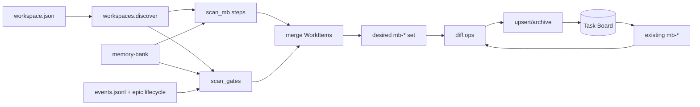

# [T-HUB-014 | dsh-mb-board-sync] PLAN

**Дата:** 2026-08-27  
**Режим:** BACK PLAN  
**Уровень:** L3  
**Статус:** active  
**Roadmap:** [roadmap-dsh-mb-board-epics.md](roadmap-dsh-mb-board-epics.md)  
**Queue:** [roadmap-dsh-mb-board-epics.queue.yaml](roadmap-dsh-mb-board-epics.queue.yaml)  
**Deps:** нет hard. Soft: установленный `dsh web` + `@linxin666/dsh-client-ui-task-board` (иначе sync CLI dry-run / ledger-file mode для тестов).

**Skills:** writing-plans · architecture-patterns · python-testing-patterns · brainstorming (batch decisions below)

→ [T-HUB-014-dsh-mb-board-sync/md/decompose-index.md](T-HUB-014-dsh-mb-board-sync/md/decompose-index.md) — **после DECOMPOSE**

---

## Контекст

- **req:** проекты, добавленные в DSH (workspaces), должны **синхронизировать** свой `memory-bank` на DSH Task Board: создавать/обновлять/архивировать карточки lean-очереди (pending / in_progress), не превращая board в SoT.
- **deps:** нет hard на T-HUB-006…009. Board plugin уже в `$DSH_HOME` profile `web`.
- **refs:** `$DSH_HOME/storages/workspace.json`; `@linxin666/dsh-client-ui-task-board` (`protocol.ts` actions `create|update|import|archive|move`, ledger `$DSH_HOME/task-board/ledger-v2.json`); `loop/roadmap_queue.py`; `memory-bank/**/plan/roadmap-epics.queue.yaml`; `decompose-*/index.yaml`; `bin/hub-link`; roadmap §канон [roadmap-dsh-mb-board-epics.md](roadmap-dsh-mb-board-epics.md).

### Зафиксированные решения (brainstorming batch)

| Тема | Решение |
|------|---------|
| Источник проектов | **`$DSH_HOME/storages/workspace.json`** → `tables.workspaces[*].path` + `workspaceId`. Не invent отдельный registry; hub-link не обязателен для sync, но продукт без `memory-bank/` **пропускается** с warning |
| Фильтр проекта | Path exists + `memory-bank/` directory exists → eligible. Иначе skip (не ошибка batch) |
| Гранулярность карточек | **Два типа `mb-*` (revision 2026-08-27):** (A) **step** — `role` + `epic_id` + `step_id` (sNN\|eNN) со status ∈ `{pending, in_progress}` в `decompose-*/index.yaml`; (B) **gate** — одна карточка на эпик/проект для workflow-фазы без sNN: `CLARIFY` · `ANALYZE` · `AUDIT` · `QA` · `BUGFIX` · `REFLECT` · `PLAN` · `DECOMPOSE` · `ROADMAP`. Gate **не** дублирует step: если есть pending/in_progress sNN → только step-карточки для этого эпика; post-implement gate только когда implement queue исчерпана |
| Связь карточек | Общий `epic_id` + `project_root` + `decompose_rel` в metadata; stock UI без parent-child — группировка через search `T-HUB-007` или будущий companion filter. **Не** второй taskboard |
| Не класть на доску | completed / done / cancelled **step** rows как активные карточки; полный backlog FR; `plan-*.md` целиком; `tasks.md` rows; archive trees; EPIC_DONE (phase DONE) |
| Направление sync | **One-way:** memory-bank → board. Правки title/prompt/description на `mb-*` карточках **перезаписываются** следующим sync. User-created non-`mb-*` cards **не трогаем** |
| Stable task id | **step:** `mb-{workspaceId}-{role}-{epic_id}-{step_id}` (нормализация `/`→`-`, lower). **gate:** `mb-{workspaceId}-{role}-{epic_id}-gate-{gate_phase}` (`gate_phase` = `CLARIFY|ANALYZE|…|ROADMAP`). **project gate:** `mb-{workspaceId}-gate-roadmap` (без epic_id). Длина > 120 → `mb-{workspaceId}-{sha256(kind+role+epic+step|gate)[:16]}` + полный metadata в description |
| Board write path | **Primary:** HTTP Host actions (`POST /api/task-board/action`) при живом `dsh web` (same-origin / loopback + proxy token per plugin docs). **Test/CI:** in-memory fake client + optional `--ledger-file` для unit (без concurrent Host). **FORBIDDEN:** silent write в ledger при живом Host lock без API |
| Metadata в карточке | `description` — machine block `mb-board-card/v1`: `card_kind` (`step`|`gate`), `project_root`, `workspace_id`, `role`, `epic_id` (optional для ROADMAP-only), `step_id` (only step), `gate_phase` (only gate), `decompose_rel`, `phase` (loop command phase = `BACK IMPLEMENT`/`BACK QA`…), `sync_generation`, `reason_code` (optional, gate), `hub_dev` (optional). `prompt` = точная role-команда для loop (015); stub до 015 |
| Status mapping | **step:** `pending`→`todo`; `in_progress`→`running`; completed/done → archive. **gate:** active → `todo`; после успешной сессии/терминальной фазы → archive. Enum stock board: `backlog`|`todo`|`running`|`done`|`failed` (@linxin666/dsh-client-ui-task-board `tasks.ts`) |
| Multi-role | Scan `memory-bank/back|front|integration/plan/decompose-*/index.yaml` + role-specific `roadmap-epics.queue.yaml` если есть; default role priority для ROADMAP card: back → front → integration |
| Dev-hub itself | Если workspace path = `dev-hub` и есть `memory-bank/` — sync **разрешён** (T-HUB-* видны на доске) |
| Fail-closed | Corrupt workspace.json → non-zero exit + diagnostic. Corrupt index.yaml одного проекта → skip project + error list (batch continues). Missing DSH_HOME → fail |
| CREATIVE | нет |

**CREATIVE need:** нет.

---

## Цель

CLI/модуль hub синхронизирует eligible DSH workspaces → Task Board: на доске видны **step-карточки** (pending/in_progress sNN) и **gate-карточки** (CLARIFY/ANALYZE/post-implement AUDIT→QA→BUGFIX→REFLECT + roadmap/plan/decompose tips), с pinned `workspaceId` и metadata `mb-board-card/v1` для arm/loop (T-HUB-015). Один эпик = несколько связанных карточек по `epic_id`, не один PLAN на доску.

---

## Продуктовая спека (WHAT)

### User Stories

| # | Story | Priority | Independent Test |
| :--- | :--- | :--- | :--- |
| US-001 | Как разработчик, я хочу после добавления продукта в DSH увидеть его pending-шаги на Task Board, чтобы не открывать вручную каждый `index.yaml`. | P0 | Добавить fixture workspace + fake MB → `hub-board sync` → в snapshot есть `mb-*` cards |
| US-002 | Как разработчик, я хочу чтобы completed шаги уходили с активной доски (archive), чтобы канбан не засорялся. | P0 | Sync дважды: step completed → card archived |
| US-003 | Как разработчик, я хочу dry-run sync без записи, чтобы проверить mapping до применения. | P1 | `--dry-run` печатает plan upsert/archive, ledger unchanged |
| US-004 | Как разработчик, я не хочу чтобы ручные карточки на board исчезли после sync. | P0 | Non-`mb-*` card остаётся после sync |
| US-005 | Как разработчик, после завершения всех sNN я хочу видеть gate «BACK QA» для эпика, чтобы не терять post-implement фазу на пустой доске. | P0 | Fixture: all sNN completed, events без qa_pass → gate `gate-QA` на board |
| US-006 | Как разработчик, я хочу фильтровать доску по `epic_id` (search) и видеть step + gate одного эпика. | P1 | Title/metadata содержат `T-HUB-007`; step s02 + gate QA coexist с одним epic_id |

#### Acceptance Scenarios — US-005

- **Given:** decompose index: все sNN `completed`; `reduce_epic_lifecycle` → phase `QA`
- **When:** `hub-board sync`
- **Then:** активна gate-карточка `mb-…-gate-qa` с `card_kind: gate`, `gate_phase: QA`, prompt `BACK QA {epic_id}`; step-карточки archived

#### Acceptance Scenarios — US-006

- **Given:** epic T-HUB-007: s02 `in_progress`, s03 `pending`; lifecycle не применим (implement queue active)
- **When:** sync
- **Then:** карточки s02/s03 на board; **нет** gate-QA для того же epic_id

#### Acceptance Scenarios — US-001

- **Given:** DSH workspace указывает на `$PROJECT_ROOT` с `decompose-*/index.yaml` где `s01` status=`pending`
- **When:** `hub-board sync` (или `python -m loop.board_sync …`)
- **Then:** существует task id `mb-{ws}-back-{epic}-s01` с `workspaceId` = workspace id и metadata `project_root`

#### Acceptance Scenarios — US-002

- **Given:** card для `s01` уже на board; в index `s01` стал `completed`
- **When:** повторный sync
- **Then:** card archived (или moved to archive column); не остаётся в active columns

#### Acceptance Scenarios — US-004

- **Given:** на board есть user task id `manual-1`
- **When:** sync
- **Then:** `manual-1` не deleted / не modified

### Functional Requirements (FR-###)

- **FR-001:** Discover workspaces из `$DSH_HOME/storages/workspace.json` (path override `--dsh-home`).
- **FR-002:** Eligible = path exists ∧ `memory-bank/` is dir.
- **FR-003:** Scan decompose indexes (yaml canon) → emit WorkItem list `{role, epic_id, step_id, status, decompose_rel, title}`.
- **FR-004:** Optional ROADMAP tip card если нет pending steps, но queue имеет next armable epic (reuse `select_next_epic` / thin wrapper — без side-effect arm).
- **FR-005:** Upsert board cards by stable id; update title/description/prompt/workspaceId/status mapping.
- **FR-006:** Archive mb-cards чьи WorkItems исчезли из desired set.
- **FR-007:** CLI: `sync` · `sync --dry-run` · `sync --workspace-id <id>` · `status` (print last generation / counts).
- **FR-008:** Machine metadata block `mb-board-card/v1` в description; parser round-trip в tests.
- **FR-009:** Board client abstraction: `TaskBoardClient` with `list_tasks`, `upsert`, `archive`; implementations: `HttpHostClient`, `FakeClient`, optional `LedgerFileClient` (tests only / offline).
- **FR-010:** Sync generation counter / timestamp в metadata; идемпотентность: повторный sync без изменений → no-op revisions (или equal content skip).
- **FR-011:** Документация `dsh/README.md` секция «Memory-bank board sync» + пример cron/manual.
- **FR-012:** `card_kind` в metadata: `step` | `gate`; парсер round-trip.
- **FR-013:** **Gate emission** — `loop/board_sync/scan_gates.py` (или `scan_mb.gates`): правила ниже §Gate cards; reuse `epic.reduce_epic_lifecycle` для post-implement; **не** invent lifecycle отдельно от loop.
- **FR-014:** Pre-implement gate **ANALYZE:** decompose exists ∧ **ноль** sNN в `{completed,done}` ∧ (нет `analyze/*.yaml` для epic **или** latest analyze `metrics.critical_count > 0`).
- **FR-015:** Pre-implement gate **CLARIFY:** `plan-<epic>.md` содержит `[НУЖНО УТОЧНИТЬ: CRITICAL` ∧ нет clarify-артефакта с resolved CRITICAL для slug/epic (heuristic: Completion Report без defer CRITICAL).
- **FR-016:** Pre-implement tips: **PLAN** (epic в `roadmap-*.queue.yaml`, plan file missing); **DECOMPOSE** (plan exists, `decompose-*/` missing); **ROADMAP** (≤1 на project, next queue entry, нет armed pending work).
- **FR-017:** Post-implement gate: implement queue empty (no pending/in_progress/active/blocked sNN) ∧ lifecycle phase ∈ `{AUDIT, QA, BUGFIX, REFLECT}` → одна gate; `qa_failed` → `gate_phase: BUGFIX`; phase `DONE` → archive all mb-cards эпика.
- **FR-018:** Prompt builder: gate → `{ROLE} {gate_phase} {epic_id_or_slug}` (e.g. `BACK QA T-HUB-007-dsh-profiles-presets`); step → `{ROLE} IMPLEMENT` (loop arms step via metadata).

### Success Criteria (SC-###)

| ID | Измеримый результат | Проверка / источник | Type |
| :--- | :--- | :--- | :--- |
| SC-001 | ≥1 fixture project → N pending cards == N pending steps | unit/integration test | outcome |
| SC-002 | Non-mb cards count unchanged after sync | unit | outcome |
| SC-003 | Dry-run exit 0 + zero ledger writes | unit with FakeClient assert | outcome |
| SC-004 | Corrupt workspace.json → exit ≠ 0 + diagnostic_code | unit | outcome |
| SC-005 | All sNN completed + lifecycle QA → exactly one gate-QA card | unit fixture + fake lifecycle | outcome |
| SC-006 | Pending sNN present → no post-implement gate for same epic | unit | outcome |

### Assumptions

- Пользователь добавляет проекты через DSH UI (workspace add); hub не дублирует UI add-project.
- Task Board plugin установлен в profile `web`; если Host недоступен — CLI явно fail или `--offline-ledger` только для dev/test (documented).
- `index.yaml` — canon статусов шагов (не md checkbox).

### Clarifications

- Session: 2026-08-27 chat (user: sync added projects + arm/loop from board).
- Session: 2026-08-27 chat (user: gate cards QA/BUGFIX/CLARIFY/ANALYZE + epic linkage на одной доске).
- Решённые: SoT = memory-bank; board = mirror; step + gate cards; source = workspace.json + epic lifecycle.

### [НУЖНО УТОЧНИТЬ]

- n/a (CRITICAL нет). Status enum зафиксирован: `todo` / `running` / archive (§Mapping board status).

---

## AC

### AC+

1. Unit: parse `workspace.json` fixture → list WorkspaceRef  
2. Unit: scan fixture `memory-bank` → WorkItems only pending/in_progress  
3. Unit: desired set diff → create/update/archive ops  
4. Unit: FakeClient sync → snapshot contains expected `mb-*` ids  
5. Unit: non-mb task preserved  
6. Unit: dry-run emits ops, FakeClient.write_count==0  
7. Unit: metadata parse/serialize round-trip (`card_kind` step + gate)  
8. Unit: gate ANALYZE emitted when decompose exists, zero completed sNN, no analyze artifact  
9. Unit: post-implement gate uses `reduce_epic_lifecycle` (mock) — AUDIT before QA  
10. Docs: README explains step vs gate + search by `epic_id`  
11. CLI `--help` lists sync/status  

### AC−

1. Не делать board SoT статусов шагов  
2. Не сканировать весь диск / не auto-add workspaces  
3. Не удалять non-`mb-*` cards  
4. Не вызывать `arm` / `loop` / `roadmap-advance` (→ 015)  
5. Не интегрировать Jira  
6. Не патчить upstream `@linxin666/dsh-client-ui-task-board` source in-place (только consume API / optional thin Cordis companion later in 015)  
7. Не silent fallback на Claude/agent run  

---

## Техника / архитектура (HOW)

### Стек

- Python 3.12 (hub `loop/` package) — core sync + tests (`timeout 300s .venv/bin/pytest`)
- Optional thin TS Cordis companion **не** в 014 (отложено в 015 для UI buttons)
- DSH Task Board HTTP protocol v2

### Модули (target layout)

| Файл | Роль |
|------|------|
| `loop/board_sync/__init__.py` | Package export |
| `loop/board_sync/workspaces.py` | Load/parse `$DSH_HOME/storages/workspace.json` → `WorkspaceRef` |
| `loop/board_sync/scan_mb.py` | Scan decompose indexes → step `WorkItem[]` |
| `loop/board_sync/scan_gates.py` | Gate `WorkItem[]`: CLARIFY/ANALYZE/tips + `reduce_epic_lifecycle` post-implement |
| `loop/board_sync/card_model.py` | Stable id, metadata v1, title/prompt builders (step + gate) |
| `loop/board_sync/diff.py` | desired vs existing mb-cards → ops |
| `loop/board_sync/client.py` | `TaskBoardClient` protocol + Fake + Http + LedgerFile |
| `loop/board_sync/sync.py` | Orchestrator `run_sync(...)` |
| `loop/board_sync/cli.py` | argparse entry |
| `bin/hub-board` | Thin wrapper → `python -m loop.board_sync` / cli |
| `loop/tests/test_board_sync_*.py` | Suite |
| `loop/tests/fixtures/board_sync/**` | workspace.json + mini memory-banks |
| `dsh/README.md` | Docs section |

### Архитектура



### Типы карточек (`card_kind`)

| `card_kind` | Когда на доске | `step_id` | `gate_phase` | Пример title |
|-------------|----------------|-----------|--------------|--------------|
| `step` | sNN pending/in_progress | s02 | — | `[BACK] T-HUB-007 … s02 — epic-implement-profile` |
| `gate` | workflow фаза без sNN | — | `ANALYZE` | `[GATE][BACK] T-HUB-007 — ANALYZE` |
| `gate` | post-implement | — | `QA` / `BUGFIX` / `AUDIT` / `REFLECT` | `[GATE][BACK] T-HUB-007 — QA` |
| `gate` | pre-plan | — | `CLARIFY` / `PLAN` / `DECOMPOSE` / `ROADMAP` | `[GATE][ROADMAP] dev-hub — next T-HUB-014` |

**Связь:** все карточки одного эпика делят `epic_id` + `decompose_rel` (если есть). На stock UI — плоский kanban; пользователь группирует search `T-HUB-007`. Companion UI (post-015) может фильтр по metadata — out of scope 014.

### Gate emission (канон)

**Implement queue active** = ∃ step в `index.yaml` с status ∈ `{pending, in_progress, active, blocked}`.

| Условие | Gate (`gate_phase`) | Max per epic/project |
|---------|---------------------|----------------------|
| Epic в roadmap queue, plan file missing | `PLAN` | 1 |
| Plan exists, `decompose-*/` missing | `DECOMPOSE` | 1 |
| Decompose exists, **0** completed sNN, analyze missing or `critical_count>0` | `ANALYZE` | 1 |
| Plan has unresolved `[НУЖНО УТОЧНИТЬ: CRITICAL` | `CLARIFY` | 1 |
| Implement queue **не** active, all sNN completed/done, lifecycle | `AUDIT`→`QA`→`BUGFIX`→`REFLECT` | **1** (текущая фаза) |
| `reason_code=qa_failed` | `BUGFIX` (не `QA`) | 1 |
| Lifecycle `DONE` | archive all mb-* эпика | — |
| Нет armed work, queue has next | `ROADMAP` | 1 per project |

**FORBIDDEN:** post-implement gate + step cards **одного** epic_id в одном sync (mutually exclusive per FR-017).

**Источник lifecycle:** `epic.reduce_epic_lifecycle(cwd, role_dir, epic_id)` — тот же reducer что loop (`POST_IMPLEMENT_CHAIN = IMPLEMENT → AUDIT → QA → REFLECT → EPIC_DONE`). При `qa_failed` → UI phase `BUGFIX` (как `rebuild_epic_projection`).

### Card identity & metadata contract

**Step card:**

```yaml
schema: mb-board-card/v1
card_kind: step
project_root: /abs/path
workspace_id: "1eeefba3-..."
role: back
epic_id: T-HUB-007-dsh-profiles-presets
step_id: s02
decompose_rel: memory-bank/back/plan/decompose-T-HUB-007-dsh-profiles-presets/index.yaml
phase: IMPLEMENT
sync_generation: 42
```

**Gate card (post-implement QA):**

```yaml
schema: mb-board-card/v1
card_kind: gate
project_root: /abs/path
workspace_id: "1eeefba3-..."
role: back
epic_id: T-HUB-007-dsh-profiles-presets
gate_phase: QA
decompose_rel: memory-bank/back/plan/decompose-T-HUB-007-dsh-profiles-presets/index.yaml
phase: QA
reason_code: qa_required
sync_generation: 42
```

### Title / prompt (014)

- **step title:** `[{ROLE}] {epic_id} {step_id} — {step_title}`
- **gate title:** `[GATE][{ROLE}] {epic_id} — {gate_phase}` (ROADMAP: `[GATE][ROADMAP] {project_label} — next {epic_id}`)
- **prompt (step):** `BACK IMPLEMENT` (loop arm по `step_id` из metadata — T-HUB-015)
- **prompt (gate):** `{ROLE} {gate_phase} {epic_id}` e.g. `BACK QA T-HUB-007-dsh-profiles-presets`
- До 015: footer `MB_BOARD_CARD v1 — use hub-board arm/loop (T-HUB-015)`

### HTTP client notes

- Endpoints: `GET /api/task-board/state`, `POST /api/task-board/action`
- Envelope: `{ requestId, action: { kind: create|update|archive|move|import, … } }`
- Auth: loopback origin rules; for CLI from same host use documented proxy token env `DSH_TASK_BOARD_PROXY_TOKEN` if required
- Fail-closed on non-2xx / lock conflict — no partial silent success without report

### Mapping board status (locked для DECOMPOSE)

| WorkItem | Board `TaskStatus` |
|----------|-------------------|
| step `pending` | `todo` |
| step `in_progress` | `running` |
| step completed/done | archive mb-card |
| gate active | `todo` |
| gate terminal (lifecycle DONE / artifact satisfied) | archive |

Enum stock: `backlog` | `todo` | `running` | `done` | `failed` (`@linxin666/dsh-client-ui-task-board` `tasks.ts`). **Не** использовать `doing` — только `running`.

---

## Replacement / sunset (brownfield)

Greenfield feature — **n/a** A/B/C.

| | |
|--|--|
| A. Code / modules | n/a |
| B. Entrypoints | n/a |
| C. Fallbacks | n/a — misconfig fail-closed, no stub success |

---

## Компоненты / файлы (детально)

| Path | Action | Notes |
|------|--------|-------|
| `loop/board_sync/**` | Create | Core |
| `bin/hub-board` | Create | Executable wrapper |
| `loop/tests/test_board_sync_workspaces.py` | Create | |
| `loop/tests/test_board_sync_scan_gates.py` | Create | Gate emission + lifecycle mock |
| `loop/tests/test_board_sync_diff.py` | Create | |
| `loop/tests/test_board_sync_sync.py` | Create | |
| `loop/tests/test_board_sync_cli.py` | Create | |
| `loop/tests/fixtures/board_sync/` | Create | |
| `dsh/README.md` | Modify | Sync section |
| `loop/README.md` | Modify | Link to hub-board |
| `make/product.mk` | Optional | `board-sync` target |

**Do Not Touch:** `loop/loop.sh` prepare/record path; `epic_resolve` finalize; roadmap-advance behavior; T-HUB-006 armed shards.

---

## Тест-стратегия

1. **TDD pure:** workspaces parse, scan, diff, metadata — red→green first  
2. **FakeClient integration:** full `run_sync` without network  
3. **Optional smoke:** manual against live `dsh web` (not CI-required) documented in README  
4. Runner: `timeout 300s .venv/bin/pytest loop/tests/test_board_sync_*.py -q`

### Пример fixtures (минимум)

```
loop/tests/fixtures/board_sync/
  dsh_home/storages/workspace.json
  projects/alpha/memory-bank/activeContext.md
  projects/alpha/memory-bank/back/plan/roadmap-epics.queue.yaml
  projects/alpha/memory-bank/back/plan/decompose-T-ALPHA-001/index.yaml
  projects/beta_no_mb/README.md
```

---

## Риски

| Риск | Митигация |
|------|-----------|
| Concurrent Host ledger write | Prefer Host API; document «stop dsh web» only for offline ledger mode |
| Status enum drift Task Board | Mapping table + adapter; tests lock strings |
| Huge epics → many cards | Only pending/in_progress steps + **one** gate per epic phase; archive aggressively |
| Product without hub-link | Still sync if memory-bank exists; warn if `.cursor/rules` missing |
| Path = hub while product loop expected | Allowed; cards distinguish `project_root` |

---

## До DECOMPOSE (черновик нарезки)

1. **s01 — card model + metadata + stable id** (step + gate; tests)  
2. **s02 — workspaces discover + eligible filter**  
3. **s03 — scan_mb step WorkItems from index.yaml**  
4. **s04 — scan_gates: CLARIFY/ANALYZE/tips + reduce_epic_lifecycle post-implement**  
5. **s05 — diff + FakeClient sync orchestrator (merged desired set)**  
6. **s06 — HttpHostClient + fail-closed errors**  
7. **s07 — CLI `bin/hub-board` + dry-run/status**  
8. **s08 — docs README + gate/step UX note + optional make target + regression polish**

После DECOMPOSE — checkbox только в `decompose/index.*`.

---

## Следующий режим

→ **BACK DECOMPOSE** `T-HUB-014` (после `BACK ROADMAP MERGE` slug queue в canon)  
→ затем IMPLEMENT; T-HUB-015 не стартовать до QA/REFLECT 014 (hard dep).
