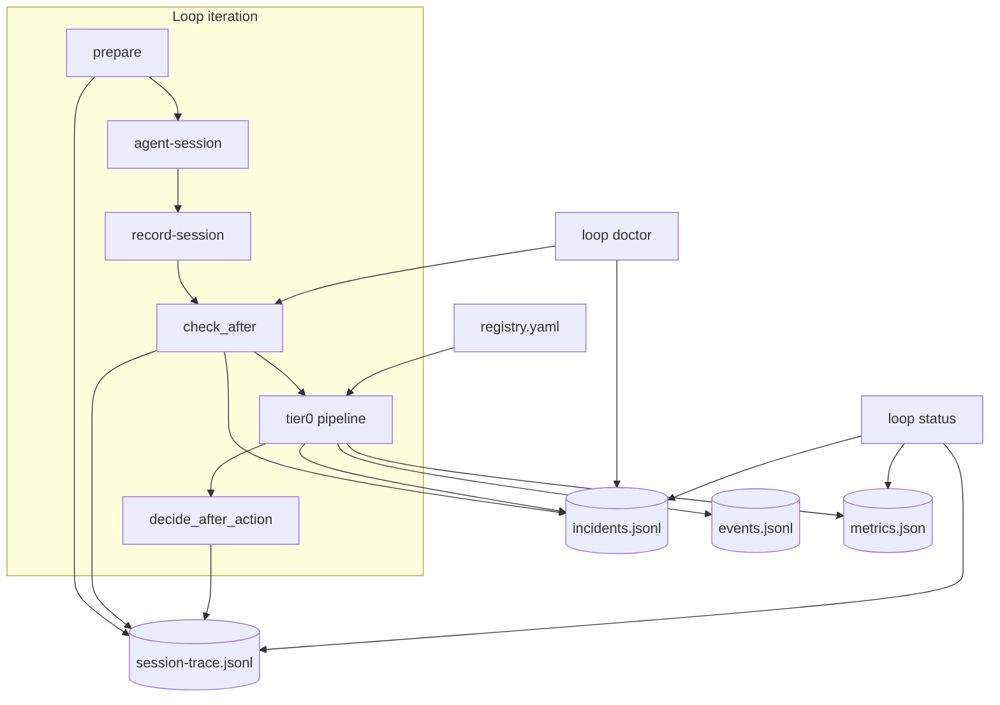

# [T-HUB-017 | loop-observability-foundation] PLAN

**Дата:** 2026-08-28  
**Режим:** BACK PLAN  
**Уровень:** L3  
**Статус:** active  
**Roadmap:** [roadmap-loop-observability-epics.md](roadmap-loop-observability-epics.md)  
**Queue:** [roadmap-loop-observability-epics.queue.yaml](roadmap-loop-observability-epics.queue.yaml)  
**Deps:** нет hard. Soft: T-HUB-014 (board sync drift diagnostic в `loop doctor`).

**Skills:** writing-plans · architecture-patterns · python-testing-patterns · brainstorming (batch decisions below)

→ [T-HUB-017-loop-observability-foundation/md/decompose-index.md](T-HUB-017-loop-observability-foundation/md/decompose-index.md) — **после DECOMPOSE**

---

## Контекст

- **req:** loop должен **наблюдать** orchestration-состояние (не только product code): фиксировать инциденты, писать trace сессий, агрегировать метрики, давать `doctor` preflight и расширить Tier-0 repair registry — чтобы большинство сбоев workflow разрешались **без человека** ещё до Tier-1 autopilot (018).
- **deps:** нет hard. Существующий код: `check_after`, `halt_logic.decide_after_action`, `loop status` (`loop-status/v1`), repairs в `epic/core.py`, `events.jsonl`, reflection notes T-HUB-011/012/013.
- **refs:** `loop/context_loop.py` (`check_after`, `status`); `loop/halt_logic.py`; `.claude/hooks/epic/core.py` (repair_*); `.claude/hooks/epic_events.py`; `loop/loop.sh`; `memory-bank/architecture/workers.md`; reflection T-HUB-011/012/013.

### Зафиксированные решения (brainstorming batch)

| Тема | Решение |
|------|---------|
| Incident storage | **`runtime/<slug>/epic/incidents.jsonl`** append-only (hub slot `HUB_ROOT/runtime/$PROJ_SLUG/epic/` или legacy `PROJECT_ROOT/.claude/runtime/epic/` — тот же `epic_dir()` что loop) |
| Incident schema | **`loop-incident/v1`** — machine JSON per line; stable `incident_id` = sha256 canonical fields |
| Open vs resolved | `status: open|resolved|escalated`; один `diagnostic_code` может иметь несколько incidents; `resolved` требует `resolution_tier` + `resolution_action` |
| Tier-0 registry | **`loop/incidents/registry.yaml`** — `diagnostic_code` → ordered list `{repair_fn, verify_fn, max_attempts}`; repair_fn = import path к существующим `epic.core` symbols only |
| Tier-0 orchestration | Новый модуль **`loop/incidents/tier0.py`** — читает registry, вызывает repairs, пишет incident + event `repair_applied` |
| Session trace | **`runtime/<slug>/epic/session-trace.jsonl`** — одна строка на lifecycle phase: `prepare|agent_start|check_after|tier0|decide` |
| Metrics | **`runtime/<slug>/epic/metrics.json`** — rolling window (default 7d): counters + rates; atomic write |
| Status extensions | `context_loop status` → добавить `incidents` (open count + last 5), `metrics` summary, `trace_tail` (last 10) — **без** prompt/secrets (как сейчас) |
| Doctor CLI | **`bin/loop doctor`** или `context_loop.py doctor` — preflight checklist; exit 0 = ready, exit 1 = blockers, exit 2 = misconfig |
| Event completeness | Emit `repair_applied`, `incident_opened`, `incident_resolved` в `memory-bank/**/events/<epic>/events.jsonl` via existing `build_event` |
| Board drift (soft) | Если `hub-board` exists (014): doctor optional check `board_sync_stale` — last sync gen vs index; **skip** if CLI missing |
| Fail-closed | Corrupt incidents.jsonl → doctor error + status flag; unknown diagnostic in registry → no auto-repair, log only |
| CREATIVE | нет |

**CREATIVE need:** нет.

---

## Цель

Единый observability слой для loop: **incident log + Tier-0 registry + session trace + metrics + doctor + status extensions + repair events** — чтобы orchestration drift был видим, измерим и автоматически чинился детерминированно до эскалации человеку (Tier-1 → T-HUB-018).

---

## Продуктовая спека (WHAT)

### User Stories

| # | Story | Priority | Independent Test |
| :--- | :--- | :--- | :--- |
| US-001 | Как разработчик, я хочу видеть открытые orchestration-инциденты после сбоя loop, чтобы понимать что сломалось без чтения сырого stdout. | P0 | Fixture halt → `loop status` → `incidents.open_count >= 1` + diagnostic_codes |
| US-002 | Как разработчик, я хочу чтобы известные desync (index/implement, fingerprint stall) чинились автоматически Tier-0, чтобы loop продолжался без моего участия. | P0 | Fixture `mark_index_missing` → tier0 → repair → `decide=continue` |
| US-003 | Как разработчик, я хочу session-trace цепочку prepare→check_after, чтобы видеть почему loop крутился N раз на одном шаге. | P0 | 2 sessions → trace.jsonl ≥ 4 entries с одинаковым `step_id` |
| US-004 | Как разработчик, я хочу `loop doctor` перед ночным автозапуском, чтобы не стартовать на stale lock / corrupt index. | P1 | Fixture stale owner → doctor exit 1 + `stale_owner` |
| US-005 | Как разработчик, я хочу метрики repair success rate, чтобы оценивать качество autopilot. | P1 | After 3 tier0 repairs → metrics.tier0_success_rate computable |
| US-006 | Как разработчик, я хочу repair/incident events в epic events.jsonl для lifecycle projection. | P1 | tier0 repair → event kind `repair_applied` in events.jsonl |

#### Acceptance Scenarios — US-001

- **Given:** `check_after` вернул `halt: true`, `diagnostic_codes: [finish_integrity_desync]`
- **When:** incident pipeline runs
- **Then:** `incidents.jsonl` содержит open incident с `source: check_after`, `diagnostic_codes`, `session_id`

#### Acceptance Scenarios — US-002

- **Given:** registry entry `mark_index_missing` → `repair_finish_desync`; fixture implement completed, index open
- **When:** `run_tier0_repairs(cwd, diagnostic_codes)`
- **Then:** implement rolled back; incident `resolution_tier: tier0`, `status: resolved`; `decide_after_action` → `continue`

#### Acceptance Scenarios — US-003

- **Given:** loop shell completes one iteration
- **When:** trace writer enabled (default on)
- **Then:** `session-trace.jsonl` last line has `phase: decide`, `action: continue|halt|complete`

#### Acceptance Scenarios — US-004

- **Given:** `runner.json` owner pid dead, lock file present
- **When:** `loop doctor`
- **Then:** exit 1, checklist item `stale_owner: fail`, remediation hint `clear stale lock`

#### Acceptance Scenarios — US-005

- **Given:** metrics.json initialized; 2 successful tier0, 1 failed tier0
- **When:** `status --metrics` or status payload
- **Then:** `tier0_attempts: 3`, `tier0_success: 2`, `tier0_success_rate: 0.67`

#### Acceptance Scenarios — US-006

- **Given:** armed epic T-HUB-fixture; tier0 resolves incident
- **When:** repair completes
- **Then:** `events.jsonl` new event `kind: repair_applied` with metadata `{repair_fn, diagnostic_code, incident_id}`

### Functional Requirements (FR-###)

- **FR-001:** Schema `loop-incident/v1` + validate/serialize round-trip tests.
- **FR-002:** `append_incident`, `resolve_incident`, `list_open_incidents` in `loop/incidents/store.py`.
- **FR-003:** `loop/incidents/registry.yaml` — initial entries: `mark_index_missing`, `fingerprint_stall`, `index_mirror_drift`, `premature_epic_done`, `stale_owner`, `checkpoint_drift`, `active_context_shape_invalid` (last = tier0 noop + escalate after max).
- **FR-004:** `loop/incidents/tier0.py` — `run_tier0_for_incident(cwd, incident) -> Tier0Result`; respects `max_attempts` per registry entry; sets `repair_exhausted` when exceeded.
- **FR-005:** Wire tier0 into `check_after` **after** existing inline repairs, **before** return halt — if tier0 resolves → return `ok: true, continue` with `incident_resolved` payload.
- **FR-006:** `loop/incidents/trace.py` — `append_trace(epic_dir, entry)`; called from `loop.sh` at prepare/check_after/decide boundaries.
- **FR-007:** `loop/incidents/metrics.py` — increment counters on: session_start, check_after_halt, check_after_continue, tier0_attempt, tier0_success, tier0_fail, incident_opened, incident_escalated.
- **FR-008:** Extend `status()` payload: `incidents`, `metrics`, `trace_tail` (bounded, no secrets).
- **FR-009:** CLI `doctor` subcommand: checks — `activeContext` shape, armed decompose exists, finish_integrity, stale_owner, corrupt incidents, optional board_sync_stale (if hub-board on PATH).
- **FR-010:** Event emission: `incident_opened`, `incident_resolved`, `repair_applied` via `build_event` + append to epic event log when `epic_id` known.
- **FR-011:** `loop/incidents/runbooks/` — one markdown per `diagnostic_code` (human + Tier-1 agent context); registry links `runbook_rel`.
- **FR-012:** Config: `EPIC_INCIDENT_TRACE=0` disables trace; `EPIC_INCIDENT_METRICS=0` disables metrics (default both on).
- **FR-013:** Idempotency: reopening same `diagnostic_code`+`fingerprint` within same session → update existing open incident, not duplicate flood.
- **FR-014:** Docs: `loop/README.md` § Observability + `loop/incidents/README.md` registry format.

### Success Criteria (SC-###)

| ID | Измеримый результат | Проверка / источник | Type |
| :--- | :--- | :--- | :--- |
| SC-001 | Tier-0 registry covers ≥6 diagnostic_codes from reflection/check_after | registry.yaml count | outcome |
| SC-002 | Fixture desync → auto-continue without NEED_HUMAN | integration test | outcome |
| SC-003 | `loop status` exposes open incidents + metrics without prompt leak | test_status_* | outcome |
| SC-004 | `loop doctor` detects stale_owner fixture | test_doctor_* | outcome |
| SC-005 | session-trace.jsonl written per loop iteration | loop.sh integration smoke | outcome |
| SC-006 | repair_applied event in events.jsonl after tier0 | unit test | outcome |

### Assumptions

- Runtime slot path resolution reuse `epic_dir()` / `STATE_DIR` from loop.sh — не invent второй каталог.
- Tier-0 repairs остаются thin wrappers над существующими `epic.core` functions — не дублировать repair logic.
- Product pytest failures **не** tier0 — они остаются agent/human scope.

### Clarifications

- Session: 2026-08-28 chat (observability + autopilot vision).
- Решённые: local-first metrics (no Prometheus required in 017); incident log in runtime slot; Tier-1 deferred to 018.

### [НУЖНО УТОЧНИТЬ]

- n/a (CRITICAL нет).

---

## AC

### AC+

1. Unit: `loop-incident/v1` parse/serialize round-trip  
2. Unit: tier0 `mark_index_missing` fixture → repair → resolved incident  
3. Unit: registry unknown code → no repair, incident stays open  
4. Unit: metrics increment + rolling window prune  
5. Unit: trace append + tail in status  
6. Unit: `doctor` stale_owner + valid project exit codes  
7. Integration: check_after wires tier0 before halt on repairable code  
8. Unit: event `repair_applied` emitted to events.jsonl  
9. Docs: loop README observability section  
10. Regression: existing `test_decide_after_action`, `test_status_*` green  

### AC−

1. Не spawn agent sessions (→ 018)  
2. Не отправлять webhooks/Telegram (→ 018)  
3. Не чинить product application code / failing pytest in product  
4. Не редактировать `loop/*.py` / hooks из tier0 registry dynamically  
5. Не требовать DSH / board for core 017 ship  
6. Не silent swallow corrupt incidents.jsonl — fail-closed in doctor  
7. Не дублировать repair logic — только call existing epic.core symbols  

---

## Техника / архитектура (HOW)

### Стек

- Python 3.12 (hub `loop/` + `.claude/hooks/`)
- YAML registry (`registry.yaml`)
- JSONL append-only logs
- Tests: `timeout 300s .venv/bin/pytest`

### Модули (target layout)

| Файл | Роль |
|------|------|
| `loop/incidents/__init__.py` | Package export |
| `loop/incidents/schema.py` | `loop-incident/v1` dataclasses + validate |
| `loop/incidents/store.py` | incidents.jsonl read/append/resolve/list |
| `loop/incidents/registry.yaml` | diagnostic_code → tier0 repair chain |
| `loop/incidents/registry.py` | Load/validate registry; resolve repair_fn import |
| `loop/incidents/tier0.py` | Execute tier0 chain; repair_exhausted |
| `loop/incidents/trace.py` | session-trace.jsonl writer |
| `loop/incidents/metrics.py` | metrics.json rolling counters |
| `loop/incidents/doctor.py` | Preflight checks |
| `loop/incidents/runbooks/*.md` | Per-code runbook stubs |
| `loop/incidents/README.md` | Registry + extension guide |
| `loop/context_loop.py` | Wire tier0 in check_after; extend status; doctor cmd |
| `loop/loop.sh` | trace hooks at prepare/check_after/decide |
| `loop/tests/test_incidents_*.py` | Suite |
| `loop/tests/fixtures/incidents/**` | corrupt index, stale owner, desync |
| `loop/README.md` | Observability docs |

### Архитектура



### Incident schema (`loop-incident/v1`)

```yaml
schema: loop-incident/v1
incident_id: a1b2c3...
status: open  # open | resolved | escalated
opened_at: "2026-08-28T12:00:00Z"
resolved_at: null
project_root: /abs/product
epic_id: T-HUB-014-dsh-mb-board-sync
step_id: s04
phase: BACK IMPLEMENT
session_id: sess-uuid
source: check_after  # check_after | hook | doctor | manual
diagnostic_codes: [mark_index_missing]
fingerprint: sha256:activeContext...
tier0_attempts: 1
tier0_repair_log:
  - repair_fn: repair_finish_desync
    ok: true
    ts: "..."
resolution_tier: null  # tier0 | tier1 | human
resolution_action: null
runbook_rel: loop/incidents/runbooks/mark_index_missing.md
metadata: {}
```

### Registry entry shape

```yaml
version: loop-incident-registry/v1
repairs:
  mark_index_missing:
    runbook: runbooks/mark_index_missing.md
    chain:
      - repair_fn: epic.core.repair_finish_desync
        verify_fn: epic.core.validate_finish_integrity
        max_attempts: 2
  stale_owner:
    runbook: runbooks/stale_owner.md
    chain:
      - repair_fn: loop.incidents.repairs.clear_stale_runner_lock
        verify_fn: loop.incidents.repairs.verify_runner_owner
        max_attempts: 1
```

### Tier-0 integration in `check_after`

Порядок (после существующих inline repairs):

1. Собрать `diagnostic_codes` из finish_integrity / shape / stall payloads  
2. Если halt imminent (`ok: false`) → `open_incident(...)`  
3. `run_tier0_for_incident` для каждого open incident с matching registry  
4. Если все resolved → return `{ok: true, continue: true, incidents_resolved: [...]}`  
5. Если `repair_exhausted` → return halt с `repair_exhausted: true` (existing halt_logic)  
6. Emit events + update metrics  

### Session trace entry shape

```yaml
schema: loop-session-trace/v1
ts: "..."
session_id: ...
step_id: s04
epic_id: T-HUB-014-...
phase: check_after
action: tier0_repair
detail:
  repair_fn: repair_finish_desync
  ok: true
decide: null
```

### Doctor checks

| Check ID | Condition | Severity |
|----------|-----------|----------|
| `active_context_shape` | `validate_active_context_shape` empty | blocker |
| `armed_decompose_exists` | armed path is file | blocker |
| `finish_integrity` | validate_finish_integrity ok | blocker |
| `stale_owner` | owner pid dead | blocker |
| `open_incidents` | open_count > 0 | warn |
| `incidents_corrupt` | incidents.jsonl parse fail | blocker |
| `board_sync_stale` | optional hub-board status age > threshold | warn |

Exit codes: `0` = no blockers; `1` = blockers present; `2` = misconfig (missing PROJECT_ROOT, etc.).

### Metrics schema (summary)

```json
{
  "schema": "loop-metrics/v1",
  "window_days": 7,
  "counters": {
    "sessions_total": 42,
    "tier0_attempts": 10,
    "tier0_success": 8,
    "incidents_opened": 5,
    "incidents_escalated": 1,
    "check_after_halt": 3,
    "check_after_continue": 39
  },
  "rates": {
    "tier0_success_rate": 0.8,
    "auto_continue_rate": 0.93
  },
  "updated_at": "..."
}
```

### Replacement / sunset (brownfield)

Greenfield extension — существующие `check_after` repairs **остаются**; tier0 registry **оборачивает** их, не заменяет inline вызовы в первой итерации (dual-path допустим с follow-up cleanup в DECOMPOSE sNN `legacy-inline-repair-dedup` optional).

#### A. Code / modules

| Устаревает | Замена | Policy |
| :--- | :--- | :--- |
| n/a | — | greenfield |

#### B. Entrypoints / deploy

| Устаревает | Замена | Policy |
| :--- | :--- | :--- |
| n/a | — | greenfield |

#### C. Fallbacks / soft-fail

| Устаревает | Замена | Policy |
| :--- | :--- | :--- |
| n/a | — | greenfield |

---

## DECOMPOSE (канон)

**Трекер:** [T-HUB-017-loop-observability-foundation/md/decompose-index.md](T-HUB-017-loop-observability-foundation/md/decompose-index.md) · [index.yaml](T-HUB-017-loop-observability-foundation/yaml/decompose-index.yaml)

| sNN | Slug | Суть |
|-----|------|------|
| s01 | incident-schema-store | `loop-incident/v1` + incidents.jsonl store + idempotency |
| s02 | registry-yaml-tier0 | registry.yaml + tier0 runner + 7 diagnostic codes |
| s03 | check-after-wire-tier0 | integrate tier0 in check_after + repair_exhausted |
| s04 | session-trace-jsonl | trace.py + loop.sh hooks + EPIC_INCIDENT_TRACE |
| s05 | metrics-rolling | metrics.py rolling counters + EPIC_INCIDENT_METRICS |
| s06 | status-incidents-metrics | status payload incidents/metrics/trace_tail |
| s07 | doctor-cli-preflight | doctor checks + CLI exit codes |
| s08 | event-emission-repair | incident/repair events → events.jsonl |
| s09 | runbooks-docs-readme | runbooks/*.md + loop README |

---

## Следующий режим

→ **BACK IMPLEMENT** T-HUB-017 s01 (новый чат; опционально BACK ANALYZE перед стартом)
