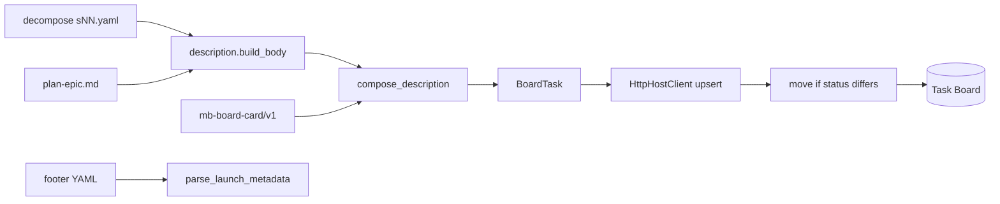

# [T-HUB-019 | dsh-board-sync-enrichments] PLAN

**Дата:** 2026-08-29  
**Режим:** BACK PLAN  
**Уровень:** L3  
**Статус:** active  
**Roadmap:** [roadmap-dsh-mb-board-epics.md](roadmap-dsh-mb-board-epics.md)  
**Queue:** [roadmap-dsh-mb-board-epics.queue.yaml](roadmap-dsh-mb-board-epics.queue.yaml)  
**Deps:** **hard** T-HUB-014, T-HUB-015 (stable `mb-*` ids, arm/loop, HttpHostClient). Soft: живой `dsh web` + `@linxin666/dsh-client-ui-task-board`.

**Skills:** writing-plans · architecture-patterns · python-testing-patterns · brainstorming (batch decisions below)

→ [T-HUB-019-dsh-board-sync-enrichments/md/decompose-index.md](T-HUB-019-dsh-board-sync-enrichments/md/decompose-index.md) — **после DECOMPOSE**

---

## Контекст

- **req:** после live sync (T-HUB-014/015) на Task Board карточки `mb-*` должны быть **читаемыми** (описание задачи из memory-bank, не только YAML metadata), **колонки** должны отражать канон (`in_progress` → `running`; pre-implement plan/decompose → **backlog**), кнопка **Run** на plan-карточках запускает **`BACK DECOMPOSE`** (через существующий arm+loop pipeline 015).
- **gap (as-built 2026-08-29):**
  - `BoardTask.description` = только `serialize_metadata()` — в UI пусто/нечитаемо.
  - `HttpHostClient.upsert` не шлёт `status` на create/update и не вызывает `move` → все новые карточки остаются в default column (`todo`), `in_progress` не попадает в `running`.
  - Gate `PLAN` / `DECOMPOSE` эмитятся в `todo`; продуктово pre-implement work queue = **backlog**.
  - `dsh/plugins/mb-bridge` `board-filter.ts` парсит `description` как JSON — ломается на YAML metadata.
- **refs:** [plan-T-HUB-014](plan-T-HUB-014-dsh-mb-board-sync.md) §Status mapping · §Metadata; [plan-T-HUB-015](plan-T-HUB-015-dsh-board-arm-loop.md) arm/loop на gate prompt; `loop/board_sync/**`; decompose shard schema `epic-decompose/v1`; `@linxin666/dsh-client-ui-task-board` `protocol.ts` (`move`, `TaskStatus`).

### Зафиксированные решения (brainstorming batch)

| Тема | Решение |
|------|---------|
| Human description | **Two-part `description`:** сверху markdown-тело для UI; снизу delimiter `---\nmb-board-card/v1\n` + YAML metadata (канон parser). Delimiter **стабилен**, не менять без bump schema |
| Источник текста **step** | Файл shard из `index.yaml` `steps[].file` → поля `goal`, `delta[]`, `files[]` (fallback: `title`, `context.consumes` первые 3 строки). Max **4000** символов body; обрезка с `…` |
| Источник текста **gate** | `plan-<epic_id>.md`: секции **Цель** + первый абзац **Контекст** + таблица **User Stories** (только `#` story title, max 5 строк). Если plan missing — однострочный reason из `reason_code` |
| Источник текста **plan backlog** | Тот же extractor что gate DECOMPOSE; title plan H1 `[T-HUB-NNN \| slug]` |
| Plan «шарды» на доске | **Не** нарезать `plan-*.md` на FR-строки. Одна **gate-карточка на epic** с `gate_phase` ∈ `{PLAN, DECOMPOSE}` → колонка **`backlog`**. «Plan shard» = карточка эпика с готовым plan-файлом, ждущего decompose |
| Prompt plan backlog | `BACK DECOMPOSE {epic_id}` если plan exists; `BACK PLAN {epic_id}` если plan missing (roadmap queue entry без plan file) |
| Status mapping (step) | `pending`→`todo`; `in_progress`|`active`|`blocked`→`running`; completed → archive (без изменений) |
| Status mapping (gate) | Post-implement (`AUDIT`,`QA`,`BUGFIX`,`REFLECT`) → `todo`; pre-implement (`PLAN`,`DECOMPOSE`,`CLARIFY`,`ANALYZE`) → **`backlog`**; `ROADMAP` → `backlog` |
| HTTP apply | После create/update: если `card.status` ≠ фактический status на board → `action: { kind: move, taskId, status }`. Create **без** status в input (stock default) → move сразу после create |
| Metadata parser | `parse_metadata(description)` → ищет delimiter/footer YAML; `parse_launch_metadata` / CLI arm — **только footer**. Body игнорируется launch path |
| mb-bridge filter | Shared helper: extract metadata dict из footer YAML (не JSON.parse whole description) |
| card_kind | **Без** нового kind — остаётся `step` \| `gate`; backlog = колонка, не тип |
| One-way sync | Body перезаписывается каждым sync (как title/prompt в 014) |
| CREATIVE | нет |

**CREATIVE need:** нет.

---

## Цель

Task Board mirror memory-bank: у каждой `mb-*` карточки есть **человекочитаемое описание** из plan/decompose shard; **plan/decompose gate-карточки** стоят в **backlog** с prompt `BACK DECOMPOSE …` и работают через Run/Arm+Run (015); **in_progress** шаги в колонке **running**.

---

## Продуктовая спека (WHAT)

### User Stories

| # | Story | Priority | Independent Test |
| :--- | :--- | :--- | :--- |
| US-001 | Как разработчик, я хочу открыть карточку шага на доске и увидеть goal/delta из decompose shard, чтобы не открывать yaml в редакторе. | P0 | Sync fixture s11 → description body содержит substring из shard `goal` |
| US-002 | Как разработчик, я хочу in_progress шаг в колонке running, чтобы визуально отличать активный шаг. | P0 | FakeClient/Http mock: step in_progress → move `running` вызван |
| US-003 | Как разработчик, я хочу эпики с plan без decompose в backlog с кнопкой Run на DECOMPOSE. | P0 | Fixture: plan-T-HUB-006 exists, no decompose → card backlog, prompt `BACK DECOMPOSE T-HUB-006-…` |
| US-004 | Как разработчик, я хочу gate QA в todo (не backlog), чтобы post-implement фазы не смешивались с планированием. | P1 | Lifecycle QA gate → status `todo` |
| US-005 | Как разработчик, я хочу workspace filter в mb-bridge работать после смены формата description. | P0 | filterCards находит card по `workspace_id` в footer metadata |
| US-006 | Как разработчик, я хочу arm+loop на DECOMPOSE gate card без поломки parser. | P0 | CLI `_launch_card` на two-part description → arm ok |

#### Acceptance Scenarios — US-001

- **Given:** decompose index s11 `pending`, shard file с `goal: |` multiline
- **When:** `hub-board sync`
- **Then:** card description начинается с markdown body (goal text); footer содержит `schema: mb-board-card/v1`

#### Acceptance Scenarios — US-002

- **Given:** s02 `in_progress` на board ранее был `todo`
- **When:** sync
- **Then:** HttpHostClient: update + move `{ status: running }`; ledger status `running`

#### Acceptance Scenarios — US-003

- **Given:** roadmap queue entry T-HUB-008, `plan-T-HUB-008-*.md` exists, `decompose-T-HUB-008-*` missing, нет active sNN
- **When:** sync
- **Then:** одна gate card `gate-DECOMPOSE`, column `backlog`, title `[GATE][BACK] T-HUB-008-… — DECOMPOSE`, body из plan Goal

#### Acceptance Scenarios — US-006

- **Given:** two-part description на mb-card
- **When:** `hub-board arm-loop --task-id …`
- **Then:** `parse_launch_metadata` успешен; loop argv строится как для gate DECOMPOSE (015)

### Functional Requirements (FR-###)

- **FR-001:** Модуль `loop/board_sync/description.py`: `build_body(card, work_item|gate_item) -> str`, `compose_description(body, metadata_card) -> str`, `split_description(raw) -> (body, metadata_yaml)`.
- **FR-002:** `parse_metadata` / `serialize_metadata` работают через `split_description` (backward compat: description = только YAML → body empty).
- **FR-003:** Step body loader: resolve shard path `{decompose_dir}/{steps[].file}`; fail-soft missing file → index `title` only + diagnostic в sync report (не abort batch).
- **FR-004:** Gate/plan body loader: `plan-<epic>.md` markdown extractor (headings `## Цель`, `## Контекст`, `### User Stories`); encoding utf-8; missing plan → template по `reason_code`.
- **FR-005:** `diff.work_item_card` / `gate_card` → `description=compose_description(...)`.
- **FR-006:** Status map table (§Mapping) в `diff.py` или `status_map.py`; единая функция `board_status(card_kind, work_status|gate_phase)`.
- **FR-007:** `HttpHostClient.upsert`: после create/update вызвать `_ensure_status(task_id, desired_status)` через `move` если нужно; idempotent если уже в колонке.
- **FR-008:** `FakeClient` / tests: записывает `status` на `BoardTask`; move ops observable.
- **FR-009:** `scan_gates`: pre-implement gates (`PLAN`,`DECOMPOSE`,`CLARIFY`,`ANALYZE`,`ROADMAP`) не меняют логику emission — только downstream status `backlog` (не дублировать карточки).
- **FR-010:** Sync report / dry-run: печатать `status=` per op когда differs.
- **FR-011:** `dsh/plugins/mb-bridge`: `parseCardMetadata(description)` — footer YAML; заменить JSON.parse path в `board-filter.ts` (+ re-export для client bundle).
- **FR-012:** Docs `dsh/README.md` + `loop/README.md`: формат two-part description, backlog semantics, Run на DECOMPOSE.
- **FR-013:** Max body length config constant `_MAX_DESCRIPTION_BODY = 4000`; truncate documented.
- **FR-014:** `_same_content` diff: сравнивать body + metadata без sync_generation (strip generation in footer only).

### Success Criteria (SC-###)

| ID | Измеримый результат | Проверка | Type |
| :--- | :--- | :--- | :--- |
| SC-001 | Step card body ⊇ first line of shard goal | unit fixture | outcome |
| SC-002 | in_progress → move running invoked | HttpClient mock test | outcome |
| SC-003 | DECOMPOSE gate → backlog + prompt contains DECOMPOSE + epic_id | unit scan+diff | outcome |
| SC-004 | parse_metadata round-trip on two-part description | unit | outcome |
| SC-005 | mb-bridge filter by workspace_id on two-part cards | TS unit or manual script | outcome |
| SC-006 | Non-mb cards untouched | regression test 014 | outcome |

### Assumptions

- Stock Task Board UI показывает поле `description` как markdown/plain (as today).
- `move` API стабилен в `@linxin666/dsh-client-ui-task-board` v2.
- Plan files follow hub heading conventions (`## Цель`, Russian).

### Clarifications

- Session: 2026-08-29 chat — user: подтягивать описания задач; plan shards в backlog с Run на decompose; follow-up к live sync gaps.

### [НУЖНО УТОЧНИТЬ]

- n/a (CRITICAL нет). Truncate 4000 chars — зафиксировано в batch.

---

## AC

### AC+

1. Unit: `split_description` / `compose_description` round-trip  
2. Unit: step body from shard yaml fixture (goal + delta)  
3. Unit: gate body from plan markdown fixture  
4. Unit: `board_status` mapping table (step pending/todo, in_progress/running, gate DECOMPOSE/backlog, gate QA/todo)  
5. Unit: `parse_metadata` on two-part description identical to pure YAML  
6. Unit: HttpHostClient mock — create then move to `running`  
7. Unit: DECOMPOSE gate card status `backlog` + prompt `BACK DECOMPOSE {epic}`  
8. Unit: diff `_same_content` ignores sync_generation only  
9. Integration: `run_sync` FakeClient — in_progress step has status running  
10. TS/build: mb-bridge metadata parser extracts `workspace_id` from footer  
11. Docs: README section updated  

### AC−

1. Не делать board SoT статусов decompose index  
2. Не нарезать plan-*.md на отдельные FR-карточки  
3. Не менять arm/loop семантику 015 кроме parser compat  
4. Не fork upstream task-board  
5. Не хранить body отдельно от description (single field contract)  
6. Не silent skip move on HTTP error — fail-closed with diagnostic  

---

## Техника / архитектура (HOW)

### Стек

- Python 3.12 — `loop/board_sync/**`, pytest 300s  
- TypeScript — `dsh/plugins/mb-bridge` metadata helper  
- DSH Task Board HTTP v2 (`create`, `update`, `move`, `archive`)

### Модули (target layout)

| Файл | Роль |
|------|------|
| `loop/board_sync/description.py` | Body builders, compose/split, plan markdown extract |
| `loop/board_sync/status_map.py` | `board_status(...)` canonical mapping |
| `loop/board_sync/card_model.py` | `parse_metadata` delegates to split footer |
| `loop/board_sync/diff.py` | Wire compose_description + status |
| `loop/board_sync/client.py` | HttpHostClient `_ensure_status` / move |
| `loop/board_sync/scan_mb.py` | Optional: attach `shard_rel` to WorkItem for loader |
| `dsh/plugins/mb-bridge/src/card-metadata.ts` | Footer YAML parse for UI filter |
| `loop/tests/test_board_sync_description.py` | New suite |
| `loop/tests/test_board_sync_status_move.py` | Move + status |
| `loop/tests/fixtures/board_sync/**` | plan.md + shard yaml samples |

### Архитектура



### Description contract (two-part)

```
## Goal
Закрыть …

## Delta
- Expose …
- Add tests …

## Files
- `.claude/hooks/stop-gate.py`

---
mb-board-card/v1
schema: mb-board-card/v1
card_kind: step
project_root: /abs/dev-hub
…
```

**Parser rules:**

- Delimiter line exact: `---` then newline then `mb-board-card/v1` then newline then YAML.
- If delimiter absent → treat entire string as YAML metadata (legacy cards).
- Launch/arm: only footer YAML passed to `parse_metadata`.

### Mapping board status (locked)

| Source | Board `TaskStatus` |
|--------|-------------------|
| step `pending` | `todo` |
| step `in_progress` \| `active` \| `blocked` | `running` |
| step completed/done | archive |
| gate `PLAN`, `DECOMPOSE`, `CLARIFY`, `ANALYZE`, `ROADMAP` | **`backlog`** |
| gate `AUDIT`, `QA`, `BUGFIX`, `REFLECT` | `todo` |
| lifecycle DONE | archive all mb-* epic |

Enum: `backlog` \| `todo` \| `running` \| `done` \| `failed`. **Не** использовать `doing`.

### Title / prompt (unchanged from 014/015)

- step prompt: `{ROLE} IMPLEMENT`
- gate DECOMPOSE prompt: `{ROLE} DECOMPOSE {epic_id}` — **Run на backlog card запускает decompose через loop** (015 gate arm path)

### HTTP client notes

- Sequence: `create` → read state optional → `move` if needed; `update` → `move` if patch cannot include status (stock update patch may omit status — prefer explicit move).
- Fail-closed: move 4xx → `BoardClientError`, sync batch reports failed ids.

---

## Replacement / sunset (brownfield)

Extension of T-HUB-014 — **partial B** (behavior change, not delete).

| | |
|--|--|
| A. Code / modules | Replace pure-YAML-only description assumption in tests/docs |
| B. Entrypoints | Same `hub-board sync`; behavior change documented |
| C. Fallbacks | Legacy cards (YAML-only description) remain parseable; first sync rewrites to two-part |

**Migration:** one sync pass rewrites all mb-* descriptions; no manual ledger edit.

---

## Компоненты / файлы (детально)

| Path | Action | Notes |
|------|--------|-------|
| `loop/board_sync/description.py` | Create | Body + compose/split |
| `loop/board_sync/status_map.py` | Create | Central status mapping |
| `loop/board_sync/card_model.py` | Modify | Footer-aware parse |
| `loop/board_sync/diff.py` | Modify | compose_description, status |
| `loop/board_sync/client.py` | Modify | move after upsert |
| `loop/board_sync/scan_mb.py` | Modify | shard_rel on WorkItem (optional field) |
| `loop/tests/test_board_sync_description.py` | Create | |
| `loop/tests/test_board_sync_status_move.py` | Create | |
| `loop/tests/test_board_sync_http_client.py` | Modify | move expectations |
| `dsh/plugins/mb-bridge/src/card-metadata.ts` | Create | |
| `dsh/plugins/mb-bridge/src/board-filter.ts` | Modify | use card-metadata |
| `dsh/README.md` | Modify | two-part + backlog |
| `loop/README.md` | Modify | link |

**Do Not Touch:** `loop/loop.sh` prepare path; `context_loop arm` semantics; T-HUB-016 armed shards; epic lifecycle reducer.

---

## Тест-стратегия

1. **TDD:** description split/compose + status_map red→green first  
2. **FakeClient:** full sync with body + status  
3. **HttpHostClient mock transport:** assert move payload  
4. Runner: `timeout 300s .venv/bin/pytest loop/tests/test_board_sync_*.py -q`

### Fixtures (добавить)

```
loop/tests/fixtures/board_sync/
  projects/alpha/memory-bank/back/plan/plan-T-ALPHA-001.md
  projects/alpha/memory-bank/back/plan/decompose-T-ALPHA-001/s01-sample.yaml
  projects/plan_only/memory-bank/back/plan/plan-T-BETA-002.md
  projects/plan_only/memory-bank/back/plan/roadmap-epics.queue.yaml  # entry without decompose
```

---

## Риски

| Риск | Митигация |
|------|-----------|
| Description size / ledger bloat | 4000 char cap; only active cards |
| Plan markdown headings drift | Extractor tolerant: fallback first `#` H1 + `## Цель` regex |
| move race on concurrent UI | Same as 014 Host lock — fail-closed |
| mb-bridge bundle desync | install-mb-bridge.sh in docs after TS change |

---

## До DECOMPOSE (черновик нарезки)

1. **s01 — description compose/split + card_model footer parse** (tests round-trip)  
2. **s02 — step shard body loader + WorkItem shard_rel**  
3. **s03 — plan markdown body extractor (gate/plan backlog)**  
4. **s04 — status_map + diff wiring (backlog for DECOMPOSE/PLAN gates)**  
5. **s05 — HttpHostClient move after upsert + FakeClient status**  
6. **s06 — mb-bridge card-metadata.ts + board-filter fix**  
7. **s07 — integration sync regression + docs README**

После DECOMPOSE — checkbox только в `decompose/index.*`.

---

## Следующий режим

→ **BACK DECOMPOSE** `T-HUB-019` (после merge slug queue или напрямую по roadmap-dsh-mb-board)  
→ затем **BACK IMPLEMENT**; не блокирует T-HUB-016 IMPLEMENT (parallel epic).
