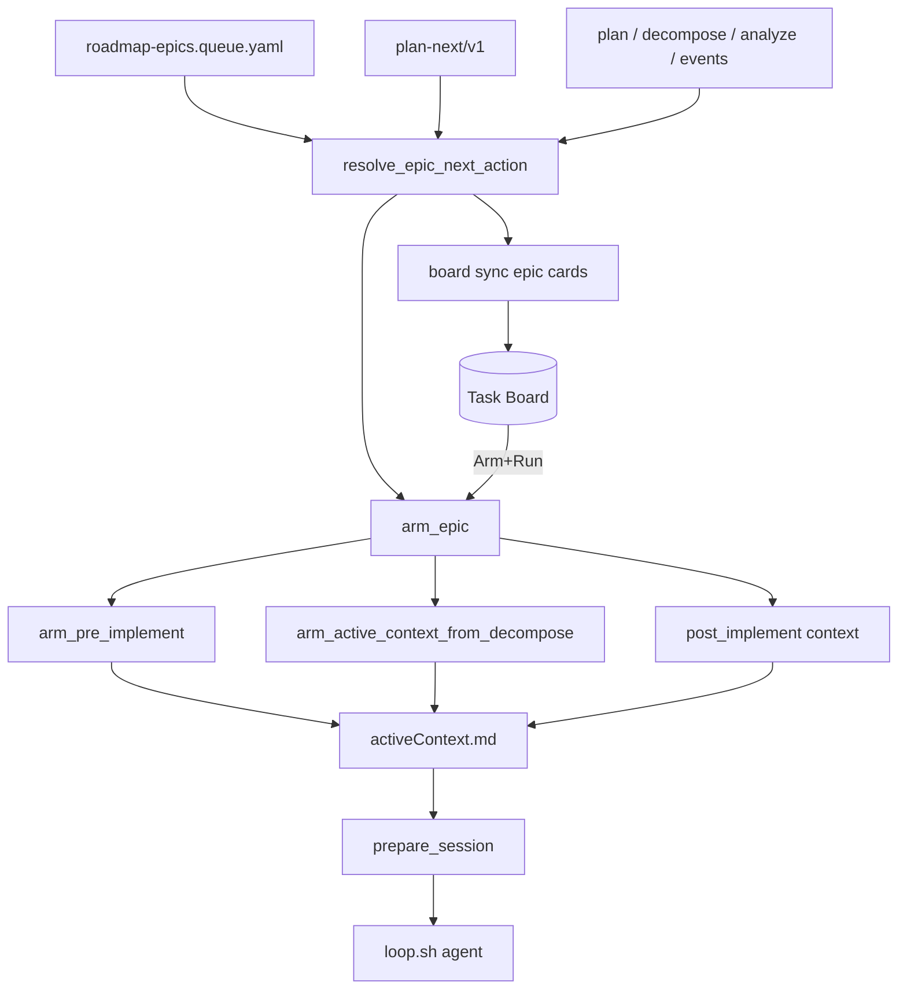

# [T-HUB-020 | dsh-board-epic-loop] PLAN

**Дата:** 2026-08-30  
**Режим:** BACK PLAN  
**Уровень:** L4  
**Статус:** active  
**Roadmap:** [roadmap-dsh-mb-board-epics.md](roadmap-dsh-mb-board-epics.md)  
**Queue:** [roadmap-dsh-mb-board-epics.queue.yaml](roadmap-dsh-mb-board-epics.queue.yaml)  
**Deps:** **hard** T-HUB-014, T-HUB-015. **Soft:** T-HUB-019 (two-part description + HTTP `move` — желательно до epic-карточек, не блокирует resolver/arm).

**Skills:** writing-plans · architecture-patterns · python-testing-patterns · domain-driven-design · brainstorming (batch decisions below)

→ [T-HUB-020-dsh-board-epic-loop/md/decompose-index.md](T-HUB-020-dsh-board-epic-loop/md/decompose-index.md) — **после DECOMPOSE**

---

## Контекст

- **req:** Task Board и loop должны работать **на уровне эпика + roadmap**, а не списка pending sNN. Run на карточке → `arm_epic(project, epic_id)` → loop выполняет **следующую каноническую команду** (`BACK PLAN` / `DECOMPOSE` / `CLARIFY` / `ANALYZE` / `IMPLEMENT` / post-implement). BACK PLAN при FINISH фиксирует machine-блок `plan-next/v1` («что дальше»).
- **pain (chat 2026-08-30):** на доске все pending sNN выглядят одинаково; непонятно с какой карточки Run; DECOMPOSE gate без `decompose_rel` не arm'ится; loop умеет только `arm_session(decompose-path)` → IMPLEMENT queue.
- **refs:** [plan-T-HUB-014](plan-T-HUB-014-dsh-mb-board-sync.md) · [plan-T-HUB-015](plan-T-HUB-015-dsh-board-arm-loop.md) · [plan-T-HUB-019](plan-T-HUB-019-dsh-board-sync-enrichments.md); `loop/board_sync/scan_gates.py`; `loop/roadmap_queue.py`; `.claude/hooks/epic/core.py` (`arm_active_context_from_decompose`, `sync_cursor_from_index` skips PLAN/DECOMPOSE); `loop/loop.sh` EPIC arg.

### Зафиксированные решения (brainstorming batch)

| Тема | Решение |
|------|---------|
| Единый резолвер | **`resolve_epic_next_action(cwd, role, epic_id) -> EpicNextAction`** — единственный источник для board sync, `arm_epic`, CLI, docs. Логика pre-implement = extract/refactor из `scan_gates._pre_gates`; post-implement = `reduce_epic_lifecycle` |
| Override из plan | Footer **`plan-next/v1`** в `plan-*.md` (YAML после `---`). Поля: `epic_id`, `role`, `next_command` (e.g. `BACK DECOMPOSE`). Если override **конфликтует** с артефактами (plan missing при DECOMPOSE) → **fail-closed** resolver diagnostic, не silent fallback |
| Prose «Следующий режим» | Остаётся для человека; BACK PLAN FINISH **обязан** писать `plan-next/v1` синхронно с prose |
| Arm entrypoint | **`arm_epic(cwd, epic_id, role=back)`** → resolver → `arm_pre_implement` \| `arm_active_context_from_decompose` \| `build_post_implement_active_context` |
| Pre-implement arm | **`arm_pre_implement_context`:** `load_now` = plan file (+ clarify/analyze artifact если есть); Handoff = `{next_command} {epic_id}`; `epic_state.armed_step` = phase slug (`DECOMPOSE`, `PLAN`, …); `armed_decompose` = null до появления index |
| Board granularity | **`card_kind: epic`** (новый тип metadata v1). **FORBIDDEN:** эмитить pending/in_progress **step** cards в sync (sunset 014 step projection). Optional: completed steps в **`done`** read-only **или** прогресс только в epic body |
| Одна карточка на epic | Stable id: `mb-{ws}-{role}-{epic_id}-epic` (hash fallback как 014). Title: `[BACK] T-HUB-016 — next: BACK IMPLEMENT s12 (1 pending)` |
| Roadmap → колонка | **`running`:** epic #1 из `roadmap-epics.queue.yaml` с unresolved next action; остальные active epics → **`backlog`**. Post-implement same epic → **`todo`**. Resolver + queue, не ручной UI |
| Run pipeline | Board **Arm+Run** → `arm_epic` → `loop` (015 pipeline). **Убрать** `step_mismatch` для epic cards. Gate cards step-era → archive при sync |
| Loop CLI | `context_loop.py arm --epic-id T-HUB-016`; `loop.sh --epic T-HUB-016`; `hub-board arm-loop --epic-id …` (parity). Legacy `arm --epic decompose-…` сохранить |
| prepare_session | Уже skip index sync для `armed_step ∈ {PLAN,DECOMPOSE,…}` — **не ломать**; добавить smoke pre-implement arm → prepare ok |
| T-HUB-019 interaction | 020 **заменяет** step descriptions на epic body (plan goal + progress lines). 019 step body loader — **не** требуется если 020 done first; если 019 раньше — epic body переиспользует plan extractor |
| CREATIVE | нет |

**CREATIVE need:** нет.

---

## Цель

Разработчик на DSH Task Board видит **одну карточку на эпик** с явной **следующей командой** из roadmap/resolver; Run запускает loop в `PROJECT_ROOT` эпика с правильной фазой (PLAN…IMPLEMENT…QA). BACK PLAN записывает `plan-next/v1` для machine-следующего шага.

---

## Продуктовая спека (WHAT)

### User Stories

| # | Story | Priority | Independent Test |
| :--- | :--- | :--- | :--- |
| US-001 | Как разработчик, после BACK PLAN я хочу machine-блок next command в plan file. | P0 | plan fixture содержит `plan-next/v1` после PLAN FINISH hook |
| US-002 | Как разработчик, я хочу resolver вернуть BACK DECOMPOSE для epic с plan без decompose. | P0 | Unit: plan exists, no decompose → command + phase DECOMPOSE |
| US-003 | Как разработчик, Run на epic-карточке arm'ит activeContext и loop стартует без step_id на card. | P0 | arm_epic + FakeLoopRunner; no step_mismatch |
| US-004 | Как разработчик, я не хочу видеть 15 pending sNN на доске. | P0 | Sync fixture 12 pending → 1 epic card, 0 step cards |
| US-005 | Как разработчик, roadmap #1 epic в колонке running, остальные backlog. | P1 | Queue order + resolver → board status map |
| US-006 | Как разработчик, CLARIFY/ANALYZE Run работает до decompose. | P0 | arm_pre_implement → Handoff BACK CLARIFY; prepare ok |
| US-007 | Как разработчик, override plan-next/v1 respected когда valid. | P1 | Footer DECOMPOSE + plan file → resolver matches |
| US-008 | Как разработчик, IMPLEMENT phase arm picks next sNN from index. | P0 | decompose s12 pending → next_command BACK IMPLEMENT, step s12 in state |

#### Acceptance Scenarios — US-003

- **Given:** epic card metadata `card_kind: epic`, `epic_id=T-HUB-016`, resolver says IMPLEMENT s12
- **When:** `hub-board arm-loop --epic-id T-HUB-016-dsh-cc-hooks-bridge`
- **Then:** activeContext Handoff s12; loop subprocess exit 0 on stub

#### Acceptance Scenarios — US-004

- **Given:** decompose index 12 steps pending
- **When:** `hub-board sync`
- **Then:** ledger has `mb-…-T-HUB-016-…-epic`; no `mb-…-s01` ids

#### Acceptance Scenarios — US-006

- **Given:** plan with CRITICAL marker unresolved
- **When:** resolve + arm_epic
- **Then:** activeContext load_now includes plan; Handoff `BACK CLARIFY T-HUB-…`; `armed_step=CLARIFY`

### Functional Requirements (FR-###)

- **FR-001:** Schema `plan-next/v1` + parser `parse_plan_next(plan_path) -> PlanNext | None`.
- **FR-002:** BACK PLAN workflow FINISH (`.cursor/rules/back_developer/workflow-plan.mdc` hook doc): append/write footer в `plan-*.md` via `epic_resolve` helper or shared writer.
- **FR-003:** Module `loop/epic_next_action.py`: `EpicNextAction` dataclass (`phase`, `next_command`, `role`, `epic_id`, `step_id?`, `plan_rel?`, `decompose_rel?`, `reason_code`, `board_status`).
- **FR-004:** `resolve_epic_next_action(cwd, role, epic_id)` — refactor shared logic from `scan_gates` (no duplicate rules).
- **FR-005:** `arm_epic(cwd, epic_id, role=back)` in `loop/context_loop.py` + export in `epic/core.py` wrapper.
- **FR-006:** `arm_pre_implement_context(cwd, action: EpicNextAction)` — activeContext template + epic_state fields.
- **FR-007:** `card_kind` enum extend **`epic`** in `mb-board-card/v1`; `stable_id` for epic cards; `parse_launch_metadata` accepts epic (no step_id).
- **FR-008:** `scan_mb.py` — **default off** step emission (`project_steps=False` or remove from default sync path); `scan_epics.py` new scanner from roadmap queue + known epics.
- **FR-009:** `diff.epic_card(action, sync_generation)` — title/prompt/description from resolver snapshot.
- **FR-010:** Roadmap position helper `roadmap_epic_rank(cwd, epic_id) -> int | None` for running vs backlog.
- **FR-011:** `board_launch/arm.py` — `arm_from_card` epic path via `arm_epic`; drop step_mismatch for epic kind.
- **FR-012:** CLI: `context_loop arm --epic-id ID`; `hub-board arm|arm-loop --epic-id ID`; `loop.sh --epic ID` (mutually exclusive with decompose path arg documented).
- **FR-013:** Sync migration: first sync archives all legacy `mb-*` step cards (kind step) still on board.
- **FR-014:** Optional `done` column: emit read-only step history for **current running epic only** (`card_kind: step`, `prompt` empty, no Run in mb-bridge) — **default off**, flag `sync_step_history=true`.
- **FR-015:** Docs: `dsh/README.md` epic-centric board; `loop/WORKFLOW.md` resolver + plan-next; BACK PLAN template update.
- **FR-016:** Tests: resolver matrix (PLAN/DECOMPOSE/CLARIFY/ANALYZE/IMPLEMENT/AUDIT/QA); arm_epic integration; sync no step cards.

### Success Criteria (SC-###)

| ID | Измеримый результат | Проверка | Type |
| :--- | :--- | :--- | :--- |
| SC-001 | plan-next/v1 round-trip parse | unit | outcome |
| SC-002 | Resolver 6-phase fixture matrix green | unit | outcome |
| SC-003 | arm_epic DECOMPOSE without decompose index | unit | outcome |
| SC-004 | Sync: 0 step cards, ≥1 epic card | integration FakeClient | outcome |
| SC-005 | arm-loop --epic-id end-to-end stub | integration | outcome |
| SC-006 | prepare_session ok after pre-implement arm | unit | outcome |
| SC-007 | Legacy step cards archived on sync | unit | outcome |

### Assumptions

- `roadmap-epics.queue.yaml` — canon порядок epics для running selection.
- Agent role commands (`BACK DECOMPOSE …`) уже понимаются Cursor/Claude rules chain.
- Один running epic per workspace (не parallel implement на одном product).

### Clarifications

- Session 2026-08-30: epic-level Run; roadmap binding; CLARIFY/ANALYZE/DECOMPOSE from plan; hide pending sNN confusion.

### [НУЖНО УТОЧНИТЬ]

- n/a. Step history in `done` — default **off** (FR-014 flag).

---

## AC

### AC+

1. Unit: `parse_plan_next` valid/invalid/missing footer  
2. Unit: resolver — plan missing → PLAN  
3. Unit: resolver — plan yes, decompose no → DECOMPOSE  
4. Unit: resolver — CRITICAL in plan → CLARIFY  
5. Unit: resolver — analyze gap → ANALYZE  
6. Unit: resolver — pending sNN → IMPLEMENT + step_id  
7. Unit: resolver — all steps done → AUDIT/QA via lifecycle mock  
8. Unit: `arm_pre_implement_context` writes Handoff + load_now  
9. Unit: epic `stable_id` + metadata round-trip  
10. Integration: sync produces epic card only (default)  
11. Integration: `hub-board arm-loop --epic-id` with FakeLoopRunner  
12. CLI `--help` documents `--epic-id`  
13. Docs README epic loop section  
14. BACK PLAN finish writes plan-next/v1 (doc + one fixture plan)  

### AC−

1. Не делать board SoT статусов index.yaml  
2. Не удалять `arm_active_context_from_decompose` — reuse для IMPLEMENT  
3. Не fork upstream task-board  
4. Не silent fallback если plan-next conflicts with artifacts  
5. Не показывать pending step cards по умолчанию (014 behavior sunset)  
6. Не auto roadmap-advance с доски (015 default сохранить)  
7. Не ломать T-HUB-016 armed IMPLEMENT mid-flight — migration = sync archive stale step cards only  

---

## Техника / архитектура (HOW)

### Стек

- Python 3.12 — `loop/`, `.claude/hooks/epic/`, pytest 300s  
- TypeScript — `dsh/plugins/mb-bridge` (epic card Run, hide Run on step history if enabled)  
- Markdown + YAML artifacts in `memory-bank/`

### Модули (target layout)

| Файл | Роль |
|------|------|
| `loop/epic_next_action.py` | Resolver + EpicNextAction |
| `loop/plan_next.py` | plan-next/v1 parse/write |
| `.claude/hooks/epic/arm_pre.py` | arm_pre_implement_context (or epic/core section) |
| `loop/context_loop.py` | `arm_epic`, CLI `--epic-id` |
| `loop/board_sync/scan_epics.py` | Epic cards from queue + filesystem |
| `loop/board_sync/card_model.py` | `CardKind.EPIC`, builders |
| `loop/board_sync/scan_gates.py` | Delegate pre-gate rules to resolver (thin) |
| `loop/board_sync/diff.py` | epic_card, sunset step_card default |
| `loop/board_launch/arm.py` | epic arm path |
| `loop/board_sync/cli.py` | `--epic-id` for arm/loop |
| `loop/loop.sh` | `--epic ID` parsing |
| `loop/tests/test_epic_next_action.py` | Resolver suite |
| `loop/tests/test_arm_epic.py` | Arm suite |
| `loop/tests/test_board_sync_epic_cards.py` | Sync suite |

### Архитектура



### plan-next/v1 contract

```yaml
---
plan-next/v1:
  epic_id: T-HUB-020-dsh-board-epic-loop
  role: back
  next_command: BACK DECOMPOSE
```

- Parser: last YAML footer in plan file wins.  
- Writer: BACK PLAN FINISH replaces/updates block; prose «Следующий режим» unchanged manually by agent.

### EpicNextAction (resolver output)

| Field | Example |
|-------|---------|
| `phase` | `DECOMPOSE` |
| `next_command` | `BACK DECOMPOSE T-HUB-008-dsh-epic-gate-plugin` |
| `step_id` | `s12` (only IMPLEMENT) |
| `board_status` | `running` \| `backlog` \| `todo` |
| `reason_code` | `decompose_missing` |

### Resolver priority (locked)

1. Valid `plan-next/v1` override (artifact check)  
2. Post-implement lifecycle if implement queue empty  
3. Pre-implement: PLAN → DECOMPOSE → ANALYZE → CLARIFY (same order as 014 scan_gates)  
4. IMPLEMENT: first pending/in_progress sNN from index  
5. Fail-closed diagnostic if epic_id unknown / corrupt index  

### mb-board-card/v1 epic card

```yaml
schema: mb-board-card/v1
card_kind: epic
project_root: /abs/dev-hub
workspace_id: "…"
role: back
epic_id: T-HUB-016-dsh-cc-hooks-bridge
decompose_rel: memory-bank/back/plan/decompose-T-HUB-016-…/index.yaml  # optional until exists
phase: IMPLEMENT
next_command: BACK IMPLEMENT
next_step_id: s12
sync_generation: 1
```

- `prompt` on board = full `next_command` (+ `@s12` in prompt optional for IMPLEMENT — **title** carries step hint).  
- Launch: `arm_epic(project_root, epic_id)` — **ignore** `next_step_id` on card (resolver re-run at arm time for freshness).

### Board columns (with 020)

| Resolver phase bucket | Column |
|-----------------------|--------|
| PLAN, DECOMPOSE, CLARIFY, ANALYZE; epic not #1 in roadmap | `backlog` |
| IMPLEMENT / in_progress epic #1 | `running` |
| AUDIT, QA, BUGFIX, REFLECT | `todo` |
| EPIC_DONE | archive epic card |

### Sunset 014 step projection

| | |
|--|--|
| A. Code | `scan_mb` step emission removed from default `run_sync` |
| B. Entrypoints | `hub-board sync` behavior change documented |
| C. Migration | Sync archives `card_kind: step` mb-* cards |

---

## Replacement / sunset (brownfield)

**Replace** T-HUB-014 step-on-board UX (not sync infrastructure).

| | |
|--|--|
| A. | Step cards default off; step stable ids no longer created |
| B. | Same CLI; `--granularity step` debug flag only for tests |
| C. | One sync pass archives legacy step cards |

---

## Компоненты / файлы (детально)

| Path | Action | Notes |
|------|--------|-------|
| `loop/epic_next_action.py` | Create | Core resolver |
| `loop/plan_next.py` | Create | plan-next/v1 |
| `loop/board_sync/scan_epics.py` | Create | Epic scanner |
| `loop/board_sync/card_model.py` | Modify | EPIC kind |
| `loop/board_sync/sync.py` | Modify | epic path + step archive |
| `loop/context_loop.py` | Modify | arm_epic CLI |
| `loop/board_launch/arm.py` | Modify | epic launch |
| `.claude/hooks/epic/core.py` | Modify | arm_pre_implement |
| `.cursor/rules/back_developer/workflow-plan.mdc` | Modify | plan-next FINISH note |
| `dsh/plugins/mb-bridge/src/intercept-run.ts` | Modify | epic cards |
| `dsh/README.md` | Modify | |
| `loop/tests/**` | Create/Modify | |

**Do Not Touch:** `reduce_epic_lifecycle` semantics; T-HUB-016 in-flight implement shards; `roadmap-advance` default deny on board.

---

## Тест-стратегия

1. TDD resolver matrix red→green  
2. arm_epic fixtures per phase  
3. FakeClient full sync migration  
4. `timeout 300s .venv/bin/pytest loop/tests/test_epic_next_action.py loop/tests/test_arm_epic.py loop/tests/test_board_sync_epic*.py -q`

### Fixtures

```
loop/tests/fixtures/board_sync/epic_loop/
  project/memory-bank/back/plan/plan-T-EPIC-PLAN.md      # plan-next DECOMPOSE
  project/memory-bank/back/plan/plan-T-EPIC-CLARIFY.md  # CRITICAL marker
  project/memory-bank/back/plan/decompose-T-EPIC-IMPL/index.yaml  # pending s01
  project/memory-bank/back/plan/roadmap-epics.queue.yaml
```

---

## Риски

| Риск | Митигация |
|------|-----------|
| Resolver drift vs scan_gates | Single module; scan_gates calls resolver |
| Mid-flight 016 step cards | Archive on sync, epic card coexists |
| plan-next stale | Re-resolve at arm time; override validated |
| Parallel epics confusion | Document: one running epic per workspace |

---

## До DECOMPOSE (черновик нарезки)

1. **s01 — plan-next/v1 parse/write + BACK PLAN doc hook**  
2. **s02 — EpicNextAction resolver (pre-implement matrix)**  
3. **s03 — resolver post-implement + plan-next override validation**  
4. **s04 — arm_pre_implement_context + arm_epic orchestrator**  
5. **s05 — card_kind epic + stable_id + launch metadata**  
6. **s06 — scan_epics + sync sunset step cards + archive migration**  
7. **s07 — board_launch + hub-board/loop.sh --epic-id CLI**  
8. **s08 — mb-bridge epic Run + roadmap column rank**  
9. **s09 — integration tests + README/WORKFLOW docs**

После DECOMPOSE — checkbox только в `decompose/index.*`.

---

## Следующий режим

→ **BACK DECOMPOSE** `T-HUB-020` (после `BACK ROADMAP MERGE` slug queue)  
→ рекомендуемый порядок implement: **T-HUB-019** (UX polish) **или** **T-HUB-020** (модель) — параллельно не блокируют T-HUB-016; 020 меняет board semantics сильнее.

```yaml
---
plan-next/v1:
  epic_id: T-HUB-020-dsh-board-epic-loop
  role: back
  next_command: BACK DECOMPOSE
```
