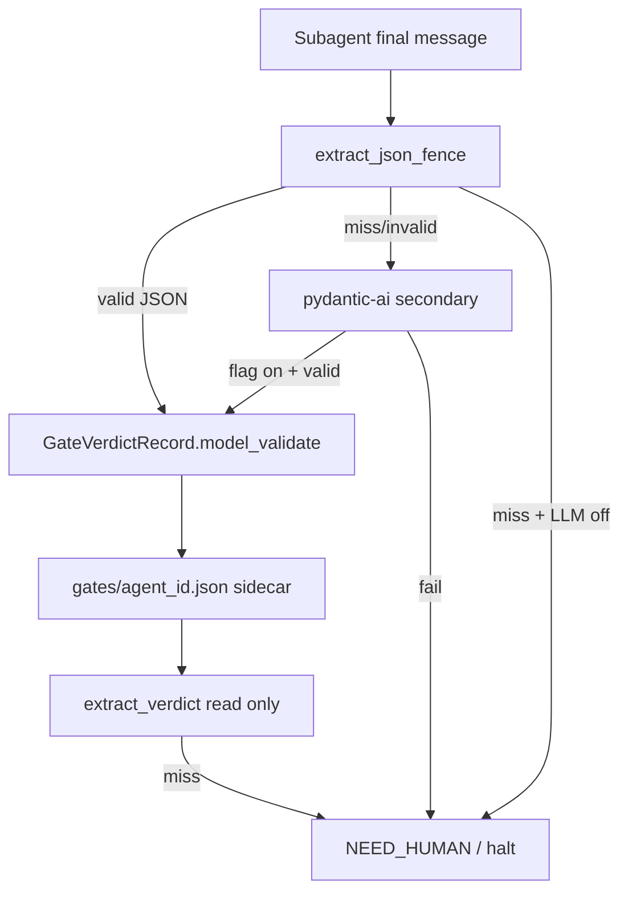

# [T-HUB-023 | hooks-structured-validation] PLAN

**Дата:** 2026-08-30 · **rev v4:** 2026-08-31  
**Режим:** BACK PLAN  
**Уровень:** L3–L4  
**Статус:** active — **REDO v4** (JSON-in-prompt contract + pydantic validate; без regex)  
**Roadmap:** [roadmap-pydantic-reliability-epics.md](roadmap-pydantic-reliability-epics.md) · **canon queue:** [roadmap-epics.queue.yaml](roadmap-epics.queue.yaml) (#5 после T-HUB-031)  
**Queue:** [roadmap-pydantic-reliability-epics.queue.yaml](roadmap-pydantic-reliability-epics.queue.yaml)  
**Deps:** **hard** T-HUB-021 (`llm_structured` / pydantic-ai client), T-HUB-022 (`GateVerdictRecord`, `LoopHandoffFrontmatter`, validate-on-write). **Hard (canon):** T-HUB-031. **Soft:** T-HUB-017.

**Skills:** writing-plans · architecture-patterns · python-testing-patterns · diagnosing-bugs

→ **BACK DECOMPOSE** (re-run после plan v4) · prior decompose invalid · coverage: [T-HUB-023-hooks-llm-fallbacks/yaml/steps/](T-HUB-023-hooks-llm-fallbacks/yaml/steps/) — **создать заново из §Decompose input map**

---

## Axiom (не обсуждается)

**Pydantic валидирует структурированные данные. Структурированные данные на границе LLM → machine = JSON (или YAML frontmatter в файле).**

Если subagent шлёт prose (`VERDICT: PASS`) — pydantic **не при чём**, это regex/string parsing, т.е. старый мусор.

| Граница | Формат | Validate |
|---------|--------|----------|
| verify / reviewer / analyze-verify | fenced ```json `loop-gate-verdict/v1` | `GateVerdictRecord.model_validate` |
| activeContext handoff meta | YAML frontmatter `loop-handoff/v1` | `LoopHandoffFrontmatter.model_validate` |
| sidecar на диске | JSON файл | validate-on-write (022) |
| pydantic-ai secondary | LLM → **typed OutputModel** (не prose) | Agent structured output |

**Не просить «очевидное» отдельно:** JSON на gate-границах — следствие выбора pydantic, не опция v4.

---

## REDO v4 2026-08-31 — JSON-in-prompt contract

**Дополнение к v3:** managed subagents (`@verify`, `@reviewer`, `@analyze-verify`) **обязаны** завершать сессию **fenced JSON** по схеме `loop-gate-verdict/v1`. Hook парсит JSON → `GateVerdictRecord.model_validate` → `write_gate_verdict`. Prose (`VERDICT:` строки) **не machine input**.

**Primary machine path (verify/reviewer):**

```text
subagent final message
  → extract single ```json … ``` block (deterministic fence parser, NOT regex VERDICT)
  → GateVerdictRecord.model_validate
  → write_gate_verdict → gates/<agent_id>.json
  → extract_verdict reads sidecar only
```

**Secondary (только если JSON block отсутствует или ValidationError):**

```text
  → если PROJECT_HOOKS_LLM_VERDICT=1: pydantic-ai Agent[VerdictExtract] по transcript
  → иначе: NEED_HUMAN / verify_no_verdict (fail-closed)
```

**Запрещено навсегда:** regex `VERDICT:`, last-wins prose, fallback на legacy extractors.

---

## REDO v3 2026-08-31 — канон валидации

**Проблема v1/v2:** regex `VERDICT: PASS`, sidecar→regex→LLM chains, «fallback на старый код» — ненадёжно; IMPLEMENT s01–s10 не попал в код.

**Новый канон (HARD):**

1. **Нет парсинга строк вердиктов** — запрещены `re.search(VERDICT:)`, last-wins regex, spawn-hard «первая строка = VERDICT» как machine path.
2. **Нет fallback на legacy extractors** — если structured path не дал валидный результат → `NEED_HUMAN` / halt, не regex.
3. **pydantic-ai + Pydantic v2 enums** — все machine-readable ответы gate/handoff/abort через `Agent[OutputModel]` или `model_validate` JSON sidecar.
4. **Единый модуль** `.claude/hooks/llm_structured.py` — factories для output-cap (021) и gate extractors (023).

**Trigger order (единственный):**

```text
1) subagent fenced JSON (loop-gate-verdict/v1) → model_validate → sidecar
2) activeContext loop-handoff/v1 frontmatter → model_validate (handoff meta)
3) при miss JSON + domain LLM on → pydantic-ai Agent[OutputModel] → sidecar
4) при miss/fail → NEED_HUMAN / halt (без regex)
```

---

## Контекст

- **req:** machine path для verify/reviewer/handoff/abort — **только** typed pydantic + pydantic-ai; убрать regex/heuristic decision paths из hooks.
- **gap (as-built):** `extract_verdict` — sidecar then **regex**; spawn prompts требуют `VERDICT:` text; `classify_abort` — regex patterns; `write_gate_verdict` не wired; T-HUB-021 `LogSummary` без gate models в том же модуле.
- **refs:** `loop/schemas/gate_verdict.py`, `loop/schemas/handoff.py`, `llm_structured.py`, `stop-gate.py`, `session_resilience.py`, T-HUB-022 sunset policy.

### Зафиксированные решения

| Тема | Решение |
|------|---------|
| **Subagent output (primary)** | Fenced ```json block — **единственный** machine verdict от subagent; prose выше/ниже fence — human-only |
| Verdict SoT | `GateVerdictRecord` sidecar (`loop-gate-verdict/v1`) после JSON validate или pydantic-ai secondary |
| Verdict enum | `GateVerdictValue = Literal["PASS", "FAIL", "BLOCKED"]` |
| JSON parse | `extract_json_fence(text) -> dict` — один fenced block; `json.loads` + `GateVerdictRecord.model_validate` |
| Verdict secondary | `Agent[VerdictExtract]` — **только** если JSON fence miss/invalid и `PROJECT_HOOKS_LLM_VERDICT=1` |
| Handoff SoT | `LoopHandoffFrontmatter` YAML frontmatter (022); FINISH parent пишет frontmatter, не regex `## Handoff` |
| Handoff secondary | Optional fenced JSON `loop-handoff/v1` в parent FINISH или pydantic-ai `HandoffExtract` — DECOMPOSE решает shard |
| Abort enum | `AbortKind = Literal["transient", "fatal"]` via pydantic-ai `AbortClassify` on session log (не subagent JSON) |
| Spawn prompts | **FR-010…FR-013:** agent `.md`, spawn-hard, `_lib` CONTRACT, `context_loop.py`, pretool/stop-gate — JSON contract, sunset `VERDICT:` |
| Master switch | `PROJECT_HOOKS_LLM_VERDICT=0` in CI → tests seed sidecar or inject valid JSON in fixture; no regex substitute |
| Metrics | `structured_extract_used` (+ JSON path vs pydantic-ai path tag in metadata) |
| Legacy purge | Delete regex VERDICT/handoff/abort decision paths + spawn `VERDICT:` machine dependency |

**CREATIVE need:** нет.

---

## Цель

Gate transitions принимают **только** pydantic-validated artifacts. Subagents шлют **JSON по схеме**; hooks валидируют и пишут sidecar. Regex и prose-вердикты **удалены** из machine path.

---

## Spawn / loop prompt contract (JSON) — канон для DECOMPOSE

Managed gate subagents **обязаны** завершать финальное сообщение одним fenced JSON-блоком. Prose-отчёт — **до или после** блока, на русском; machine читает **только JSON**.

### Gate verdict JSON (`loop-gate-verdict/v1`)

Минимальный payload (поля сверх схемы — `extra=forbid` → FAIL validate):

```json
{
  "schema": "loop-gate-verdict/v1",
  "agent_id": "verify",
  "verdict": "PASS",
  "step_id": "s04",
  "epic_id": "T-HUB-023-hooks-llm-fallbacks",
  "session_id": "<optional>",
  "recorded_at": "2026-08-31T13:00:00Z",
  "evidence_sha256": null
}
```

`verdict` — **enum string** `PASS` | `FAIL` | `BLOCKED` (uppercase). Blockers / AC notes — **в prose вне JSON**, не в machine path (или отдельный epic slice для расширения схемы).

### Prompt template (verify / reviewer / analyze-verify)

Каждый agent `.md` и packed spawn MUST включать:

1. **HARD:** финальное сообщение содержит ровно один блок ` ```json ` … ` ``` ` с объектом `loop-gate-verdict/v1`.
2. **FORBIDDEN:** строка `VERDICT: PASS|FAIL|BLOCKED` как machine output (можно упомянуть «для parent human summary», но не как substitute JSON).
3. **FAIL protocol:** при incomplete prompt → `"verdict": "FAIL"` в JSON + prose blocker list.
4. Пример JSON в agent instruction (copy-paste shape).

### Handoff (parent FINISH, не subagent)

| Artifact | Format | Machine read |
|----------|--------|--------------|
| Meta | YAML frontmatter `loop-handoff/v1` в `activeContext.md` | `parse_handoff_meta` |
| Body | Markdown `## Handoff` | human/agent only |
| Recovery | Optional JSON fence `loop-handoff/v1` или pydantic-ai | secondary only |

### Файлы для правки промптов (inventory для DECOMPOSE)

| Группа | Пути | Что менять |
|--------|------|------------|
| **G1 agents** | `.claude/agents/verify.md`, `reviewer.md`, `analyze-verify.md` | JSON fence HARD; sunset `VERDICT:` first line |
| **G2 spawn overlay** | `.claude/instructions/spawn-hard.md` | verify/reviewer/analyze-verify sections → JSON contract |
| **G3 hook CONTRACT** | `.claude/hooks/_lib.py` — `verify_contract()`, `reviewer_contract()` | JSON requirement text вместо VERDICT first line |
| **G4 loop prompts** | `loop/context_loop.py` — IMPLEMENT/QA/ANALYZE packed prompts | шаги «`VERDICT: PASS` → finalize» → «valid gate JSON sidecar → finalize» |
| **G5 agent-pretool** | `.claude/hooks/agent-pretool.py` | SubagentStop: missing JSON fence → block (+ incomplete counter) |
| **G6 stop-gate** | `.claude/hooks/stop-gate.py` | read sidecar not regex transcript |
| **G7 docs** | `loop/README.md`, `.claude/project.env` comments | structured gate contract for operators |

---

## Продуктовая спека (WHAT)

### User Stories

| # | Story | Priority | Independent Test |
| :--- | :--- | :--- | :--- |
| US-001 | Как verify gate, verdict только из `GateVerdictRecord` sidecar | P0 | valid JSON → sidecar → extract_verdict |
| US-002 | Как verify subagent, я обязан прислать JSON `loop-gate-verdict/v1`, не prose VERDICT | P0 | agent.md + spawn-hard contain JSON HARD |
| US-003 | Как hook, я парсю fenced JSON → model_validate, не regex | P0 | invalid JSON → fail-closed; no VERDICT regex |
| US-004 | CI без LLM: только pre-seeded sidecar или injected JSON fixture | P0 | LLM off + no JSON → NEED_HUMAN |
| US-005 | Purge regex VERDICT/handoff/abort machine paths | P0 | rg + pytest purge |
| US-006 | Loop IMPLEMENT prompt говорит «gate JSON → finalize», не «VERDICT: PASS» | P1 | context_loop prompt audit |
| US-007 | Secondary pydantic-ai только при miss/invalid JSON fence | P1 | mock: valid JSON skips Agent.run |

### Functional Requirements (FR-###)

- **FR-001:** Enum models in `llm_structured.py`: `VerdictExtract`, `HandoffExtract`, `AbortClassify` — Literals for verdict/kind.
- **FR-002:** `make_hooks_extract_agent(output_type)` — pydantic-ai factory (021 provider config).
- **FR-003:** `extract_json_fence(text) -> dict | None` — deterministic single ```json fence parser (not VERDICT regex).
- **FR-004:** `parse_gate_verdict_message(text, *, agent_id, ...) -> GateVerdictRecord | None` — `json.loads` + `GateVerdictRecord.model_validate`; on success → `write_gate_verdict`.
- **FR-005:** `extract_verdict(cwd, agent_id)` — **read sidecar only**; no transcript regex.
- **FR-006:** Secondary: `run_verdict_extract(text)` pydantic-ai **only** if FR-004 returned None and `PROJECT_HOOKS_LLM_VERDICT=1`.
- **FR-007:** Handoff: `parse_handoff_meta` frontmatter first; secondary pydantic-ai / optional JSON fence — no regex `## Handoff` in machine path.
- **FR-008:** Abort: `classify_abort` → pydantic-ai `AbortClassify` enum only; purge regex decision tree.
- **FR-009:** `load_hooks_llm_env()` + per-domain flags; hooks fail-soft (never crash session).
- **FR-010:** **G1 agents** — verify/reviewer/analyze-verify `.md`: JSON fence HARD + example payload + sunset `VERDICT:` machine line.
- **FR-011:** **G2–G3** — `spawn-hard.md` + `_lib.py` CONTRACT strings aligned with FR-010.
- **FR-012:** **G4** — `context_loop.py` packed prompts: replace `VERDICT: PASS` steps with «valid gate JSON sidecar exists → finalize-step».
- **FR-013:** **G5–G6** — `agent-pretool.py` + `stop-gate.py`: SubagentStop parses JSON → sidecar; missing fence → block/incomplete (not VERDICT regex).
- **FR-014:** Tests: JSON fence valid/invalid/missing; mock pydantic-ai secondary; assert zero VERDICT regex.
- **FR-015:** **G7** docs — README + project.env structured gate contract.
- **FR-016:** **Sunset:** remove regex VERDICT, `gate_verdict_regex_fallback`, spawn VERDICT machine dependency.
- **FR-017:** Unified `llm_structured.py`: LogSummary (021) + gate models/runners; output-cap regression green.

### Success Criteria (SC-###)

| ID | Измеримый результат | Проверка | Type |
| :--- | :--- | :--- | :--- |
| SC-001 | No `VERDICT:` regex in machine path | rg + pytest | outcome |
| SC-002 | Valid JSON fence → sidecar → extract_verdict enum | pytest roundtrip | outcome |
| SC-003 | Invalid/missing JSON → fail-closed (no regex PASS) | pytest | outcome |
| SC-004 | Valid JSON skips pydantic-ai Agent.run | mock call count 0 | outcome |
| SC-005 | agent.md + spawn-hard contain JSON HARD contract | rg audit | outcome |
| SC-006 | context_loop IMPLEMENT prompt references gate JSON not VERDICT line | rg audit | outcome |
| SC-007 | classify_abort pydantic-ai enum only | pytest | outcome |
| SC-008 | T-HUB-021 LogSummary path green | pytest bash_output_cap | outcome |

### Assumptions

- T-HUB-021 `llm_structured` + pydantic-ai pinned in `requirements-hub.txt`.
- Verify/reviewer sessions have network or pre-seeded sidecar in tests.
- Human prose summary in subagent message — OK **outside** JSON fence.
- pydantic-ai secondary requires explicit env flag per domain.

### [НУЖНО УТОЧНИТЬ]

- n/a CRITICAL. Soft: optional `blockers[]` field in `loop-gate-verdict/v2` — v1 ship без blockers в JSON; blockers в prose.

---

## AC

### AC+

1. Subagents emit fenced JSON `loop-gate-verdict/v1`; hooks `extract_json_fence` → `GateVerdictRecord.model_validate` → sidecar
2. `extract_verdict` reads sidecar only — no transcript regex
3. pydantic-ai secondary only on JSON miss/invalid when domain flag on
4. G1–G4 prompt inventory (agents, spawn-hard, `_lib`, `context_loop`) aligned with JSON contract
5. G5–G6 pretool/stop-gate wire JSON → sidecar on SubagentStop
6. Legacy regex VERDICT/handoff/abort machine paths deleted (purge step)
7. Mocked tests + CI fail-closed without LLM; README operator contract

### AC−

1. **Запрещён** regex `VERDICT:` / prose verdict as machine input
2. **Запрещён** pydantic-ai secondary when valid JSON already parsed
3. **Запрещён** silent PASS on ValidationError
4. **Запрещён** fallback to legacy free-text LLM for gates
5. Hook never crashes on bad JSON — fail-closed + diagnostic

---

## Техника / архитектура (HOW)

### Стек

- **pydantic-ai** — `Agent[OutputModel]`, structured output validation
- **Pydantic v2** — sidecar/frontmatter + extract models
- **loop/schemas/** — `GateVerdictRecord`, `LoopHandoffFrontmatter`

### Layout

| Path | Action |
|------|--------|
| `.claude/hooks/llm_structured.py` | Extend — enums, agents, runners (unified with 021) |
| `.claude/hooks/_lib.py` | Rewrite `extract_verdict` — no regex; env helpers |
| `.claude/hooks/epic/core.py` | Handoff structured path only |
| `.claude/hooks/stop-gate.py` | Wire structured extract on verify/reviewer stop |
| `.claude/hooks/session_resilience.py` | pydantic-ai abort classify |
| `loop/gate_verdict_store.py` | validate-on-write (existing) |
| `.claude/agents/verify.md` | JSON fence HARD; sunset VERDICT machine line |
| `.claude/agents/reviewer.md` | same |
| `.claude/agents/analyze-verify.md` | same |
| `.claude/instructions/spawn-hard.md` | G2 JSON contract sections |
| `.claude/hooks/_lib.py` | G3 CONTRACT strings + extract_json_fence + parse_gate_verdict_message |
| `.claude/hooks/agent-pretool.py` | G5 SubagentStop JSON → sidecar |
| `.claude/hooks/stop-gate.py` | G6 read sidecar not regex |
| `loop/context_loop.py` | G4 packed prompts gate JSON finalize |
| `loop/tests/test_hooks_llm_*.py` | JSON fence + secondary mock tests |
| `loop/tests/test_gate_structured_purge.py` | purge proofs (s13) |

### Архитектура



### Prompt constraints (канон)

- **verify/reviewer/analyze-verify:** финальное сообщение — один ` ```json ` block `loop-gate-verdict/v1`; prose вне fence; **FORBIDDEN** `VERDICT:` as machine output
- **Handoff (parent FINISH):** YAML frontmatter `loop-handoff/v1`; optional JSON fence secondary
- **Abort:** pydantic-ai `AbortClassify` enum on session log (не subagent JSON)

### TDD plan

1. `test_extract_json_fence_valid_invalid_missing`
2. `test_parse_gate_verdict_message_writes_sidecar`
3. `test_extract_verdict_no_regex_path` — rg + behavior
4. `test_verdict_valid_json_skips_pydantic_ai` — mock Agent call count 0
5. `test_verdict_llm_off_no_json_fails_closed`
6. `test_handoff_frontmatter_or_pydantic_ai_only`
7. `test_abort_enum_from_pydantic_ai`
8. `test_spawn_prompts_contain_json_contract` — rg G1–G4
9. `test_legacy_verdict_regex_purged` — s13 purge

---

## Replacement / sunset (brownfield)

### A. Code (s12 purge)

| Устаревает | Замена | Policy |
| :--- | :--- | :--- |
| `extract_verdict` regex `VERDICT:` | JSON fence → sidecar + pydantic-ai secondary | **delete** |
| spawn-hard «первая строка VERDICT» as machine gate | JSON fence HARD in agent/spawn | **delete** machine dependency |
| `context_loop` «VERDICT: PASS → finalize» | «valid gate JSON sidecar → finalize» | **replace** |
| `gate_verdict_regex_fallback` counter | `structured_extract_used` (+ path tag json\|pydantic-ai) | **delete** old counter |
| `classify_abort` regex pattern decision | `Agent[AbortClassify]` | **delete** pattern tree for decision |
| regex `extract_handoff_block` machine path | frontmatter + `HandoffExtract` | **delete** from gate/finish path |

### B. Fallbacks

| Устаревает | Замена | Policy |
| :--- | :--- | :--- |
| regex → LLM chain | JSON primary → pydantic-ai secondary only | **no legacy fallback** |

---

## Decompose input map (канон для BACK DECOMPOSE)

> **HARD:** prior `decompose-T-HUB-023-*` invalid — создать заново из этой секции.  
> Число шагов **advisory**; добавляй sNN пока coverage без дыр (FR, G1–G7, sunset A).  
> Трекер после DECOMPOSE: [T-HUB-023-hooks-llm-fallbacks/yaml/decompose-index.yaml](T-HUB-023-hooks-llm-fallbacks/yaml/decompose-index.yaml)

### Requirements coverage (plan → steps)

| Req ID | Кратко | sNN | Notes |
| :--- | :--- | :--- | :--- |
| FR-001 | Enum models VerdictExtract/HandoffExtract/AbortClassify | s02 | unified с LogSummary |
| FR-002 | make_hooks_extract_agent factory | s02 | shared 021 provider |
| FR-003 | extract_json_fence | s03 | deterministic fence parser |
| FR-004 | parse_gate_verdict_message → write_gate_verdict | s03 | primary machine path |
| FR-005 | extract_verdict sidecar-only | s04 | no regex |
| FR-006 | pydantic-ai secondary verdict | s05 | only JSON miss + flag |
| FR-007 | handoff frontmatter + secondary | s05 | no regex ## Handoff machine |
| FR-008 | abort pydantic-ai enum | s05 | purge regex tree |
| FR-009 | load_hooks_llm_env + flags | s01 | fail-soft hooks |
| FR-010 | G1 agents JSON contract | s06 | verify/reviewer/analyze-verify.md |
| FR-011 | G2–G3 spawn-hard + _lib CONTRACT | s07 | aligned with s06 |
| FR-012 | G4 context_loop prompts | s08 | sunset VERDICT finalize steps |
| FR-013 | G5–G6 pretool + stop-gate wire | s09 | SubagentStop → sidecar |
| FR-014 | test suite JSON + mock + purge | s11 | fixtures in loop/tests/fixtures/llm_fallback/ |
| FR-015 | G7 docs README + project.env | s12 | operator contract |
| FR-016 | legacy purge deletes | s13 | legacy-purge-step.yaml template |
| FR-017 | 021 LogSummary regression | s02 | pytest bash_output_cap green |
| AC+ #1–#7 | см. AC секцию | s03–s13 | каждый AC+ ≥1 step |
| SC-001…SC-008 | measurable outcomes | s11, s13 | rg audit in purge step |
| US-001…US-007 | user stories | s03–s13 | via FR mapping |

### Stages coverage (G-groups → steps)

| Группа / этап | Источник | sNN |
| :--- | :--- | :--- |
| G1 agents | plan §Spawn inventory | s06 |
| G2 spawn overlay | spawn-hard.md | s07 |
| G3 hook CONTRACT | _lib.py verify_contract/reviewer_contract | s07 |
| G4 loop prompts | context_loop.py IMPLEMENT/QA/ANALYZE | s08 |
| G5 agent-pretool | SubagentStop JSON block | s09 |
| G6 stop-gate | sidecar read path | s09 |
| G7 docs | README + project.env | s12 |
| JSON primary path | plan v4 REDO | s03, s04 |
| pydantic-ai secondary | plan v4 trigger #3 | s05 |
| Drift metrics | structured_extract_used | s10 |

### Outcome map (plan → steps)

| Plan outcome / NFR / AC | Закрывают шаги |
| :--- | :--- |
| Subagent JSON → validated sidecar (no regex) | s03, s04, s09 |
| Spawn/loop prompts teach JSON not VERDICT | s06, s07, s08 |
| pydantic-ai secondary fail-closed | s01, s05, s11 |
| Handoff/abort structured only | s05 |
| Legacy regex purge + rg proofs | s13 |
| Operator docs | s12 |
| Out of scope: `loop-gate-verdict/v2` blockers[] in JSON | — / follow-up epic |

### Replacement cleanup (sunset → steps)

| Устаревает (path / symbol) | Kind | Замена | sNN (deletes) | Fallback? |
| :--- | :---: | :--- | :--- | :---: |
| `_lib.extract_verdict` regex `VERDICT:` | A | JSON fence + sidecar | s13 | no |
| `gate_verdict_regex_fallback` counter | A | structured_extract_used | s13 | no |
| spawn-hard VERDICT first line machine gate | B | JSON fence HARD | s07, s13 | no |
| agent `.md` VERDICT first line requirement | B | JSON fence example | s06, s13 | no |
| `context_loop` VERDICT finalize strings | B | gate JSON sidecar check | s08, s13 | no |
| `classify_abort` regex pattern tree | A | Agent[AbortClassify] | s05, s13 | no |
| regex `extract_handoff_block` machine path | A | frontmatter + HandoffExtract | s05, s13 | no |
| regex → LLM chain | C | JSON → pydantic-ai secondary | s13 | no |

### До DECOMPOSE (черновик s01–s13)

| step | outcome-first title | Consumes | Files (primary) |
|------|---------------------|----------|-----------------|
| s01 | Env contract — structured gate flags + load_hooks_llm_env | FR-009 | `.claude/hooks/_lib.py`, `.claude/project.env` |
| s02 | Unified llm_structured — LogSummary (021) + enum extract models + factory | FR-001, FR-002, FR-017 | `.claude/hooks/llm_structured.py` |
| s03 | JSON fence parser + parse_gate_verdict_message + write_gate_verdict | FR-003, FR-004, AC+ #1 | `.claude/hooks/_lib.py`, `loop/gate_verdict_store.py` |
| s04 | extract_verdict sidecar-only read (no regex) | FR-005, AC+ #2 | `.claude/hooks/_lib.py` |
| s05 | pydantic-ai secondary — verdict/handoff/abort runners fail-soft | FR-006, FR-007, FR-008 | `.claude/hooks/llm_structured.py`, `session_resilience.py`, `epic/core.py` |
| s06 | G1 agents — verify/reviewer/analyze-verify JSON fence HARD | FR-010, US-002, SC-005 | `.claude/agents/*.md` |
| s07 | G2–G3 spawn-hard + _lib CONTRACT strings | FR-011, SC-005 | `spawn-hard.md`, `_lib.py` CONTRACT fns |
| s08 | G4 context_loop — gate JSON finalize not VERDICT line | FR-012, US-006, SC-006 | `loop/context_loop.py` |
| s09 | G5–G6 pretool + stop-gate — SubagentStop JSON → sidecar | FR-013, AC+ #5 | `agent-pretool.py`, `stop-gate.py` |
| s10 | structured_extract_used drift counter (+ json\|pydantic-ai tag) | FR metrics | `_lib.py` or drift module |
| s11 | Tests — JSON valid/invalid/missing; secondary mock; spawn rg audit | FR-014, SC-001…SC-004 | `loop/tests/test_hooks_llm_*.py`, fixtures |
| s12 | G7 docs — structured gate contract for operators | FR-015 | `loop/README.md`, `.claude/project.env` |
| s13 | Legacy purge — delete regex VERDICT/handoff/abort + grep_control | FR-016, SC-001, sunset A | `_lib.py`, spawn-hard, agents, context_loop; `deletes:` per template |

**TDD focus:** `loop/tests/test_hooks_llm_models.py` import gate models green; `test_gate_structured_purge.py` rg proofs; golden JSON fixtures in `loop/tests/fixtures/llm_fallback/`.

**Dependency order:** s01 → s02 → s03 → s04 → s05 (parallel s06–s08 after s03) → s09 → s10 → s11 → s12 → s13 (purge last).

---

## Decompose (advisory preview)

Трекер после BACK DECOMPOSE: [T-HUB-023-hooks-llm-fallbacks/yaml/decompose-index.yaml](T-HUB-023-hooks-llm-fallbacks/yaml/decompose-index.yaml)

| step | outcome-first title |
|------|---------------------|
| s01 | Env contract — structured gate flags + load_hooks_llm_env |
| s02 | Unified llm_structured — LogSummary + enum models + factory |
| s03 | JSON fence parser + parse_gate_verdict_message + sidecar write |
| s04 | extract_verdict sidecar-only (no regex) |
| s05 | pydantic-ai secondary — verdict/handoff/abort fail-soft |
| s06 | G1 agents — JSON fence HARD (verify/reviewer/analyze-verify) |
| s07 | G2–G3 spawn-hard + _lib CONTRACT aligned |
| s08 | G4 context_loop — gate JSON finalize steps |
| s09 | G5–G6 pretool + stop-gate JSON → sidecar wire |
| s10 | structured_extract_used drift counter |
| s11 | Tests — JSON fence + secondary mock + spawn rg audit |
| s12 | G7 docs — operator structured gate contract |
| s13 | Legacy purge — regex VERDICT/handoff/abort deletes |

---

## Следующий режим

→ **BACK DECOMPOSE T-HUB-023-hooks-llm-fallbacks** (re-run из §Decompose input map; `plan_id` = stem plan со slug) · затем `BACK IMPLEMENT s01` **после T-HUB-031** (canon queue #5) · `BACK ANALYZE T-HUB-023-hooks-llm-fallbacks` рекомендуется перед IMPLEMENT
