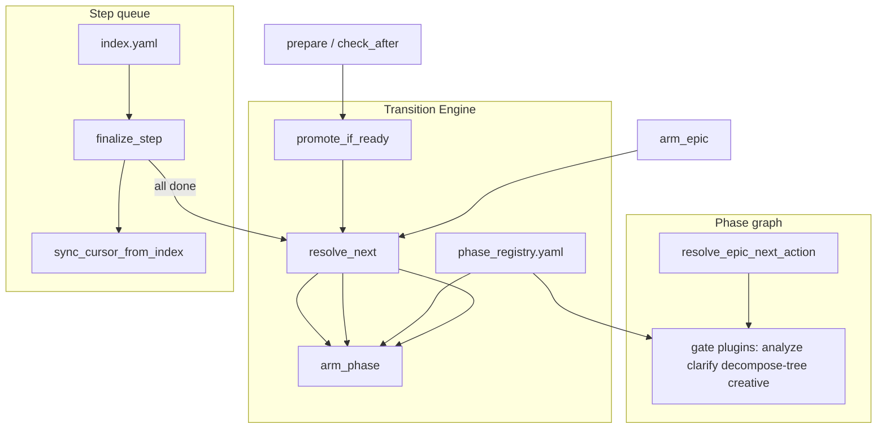

# [T-HUB-029 | epic-phase-transition-engine] PLAN

**Дата:** 2026-08-31  
**Режим:** BACK PLAN  
**Уровень:** L4  
**Статус:** active  
**Deps:** **hard** T-HUB-008 (DSH epic-gate preset mapping), T-HUB-020 (resolver/arm_epic — partial as-built). **Soft:** T-HUB-007 (profiles), T-HUB-011 (ANALYZE workflow), T-HUB-016 (hooks bridge), T-HUB-022 (typed handoff), T-HUB-023 (verdict extract).

**Supersedes:** [T-HUB-028 phase-verify-agents](plan-T-HUB-028-phase-verify-agents.md) — verify-per-phase вливается в phase registry этого эпика (CLARIFY Q3=A).

**Skills:** writing-plans · architecture-patterns · python-testing-patterns · diagnosing-bugs

→ [T-HUB-029-epic-phase-transition-engine/md/decompose-index.md](T-HUB-029-epic-phase-transition-engine/md/decompose-index.md) — **после DECOMPOSE**

---

## Контекст

- **req:** Единая система переходов фаз эпика (Transition Engine): любой entry point loop/hooks/board проходит `resolve_next` → `arm_phase` → `promote_if_ready`; устранение дрейфа (ANALYZE после DECOMPOSE, dual arm paths, `promote_decompose` bypass); merge phase-verify-agents (ex T-HUB-028) в phase registry.
- **gap (as-built):**
  - `resolve_epic_next_action` — SoT на бумаге (T-HUB-020), но `promote_decompose_phase_if_ready` сразу армирует IMPLEMENT (`loop/context_loop.py`).
  - `_arm_analyze_context` (roadmap) vs `arm_pre_implement_context` (arm_epic) — разные Handoff/state.
  - `sync_cursor_from_index` не skip ANALYZE/CLARIFY → rearm в IMPLEMENT.
  - `arm_session` / legacy `arm --decompose` bypass resolver.
  - verify agents (T-HUB-028 plan) не wired; `gates_from_phase` не читает registry.
- **refs:** [clarify-20260831-epic-phase-transition-engine.md](../clarify/clarify-20260831-epic-phase-transition-engine.md); [plan-T-HUB-020](plan-T-HUB-020-dsh-board-epic-loop.md); `loop/analyze_gate.py`; `loop/board_sync/epic_resolver.py`; `loop/WORKFLOW.md`; `.claude/hooks/stop-gate.py`.

### Зафиксированные решения (CLARIFY 2026-08-31)

| Тема | Решение |
|------|---------|
| Scope | **Full unification:** фазовый граф + step sync + DAG adapter (Q1=D) |
| Delivery | Один эпик, **vertical slices** + alias-delegate до sunset (Q2=B) |
| T-HUB-028 | **Merge** в T-HUB-029; 028 superseded (Q3=A) |
| DAG | Epic graph + **adapter** (`_arm_dag_next` → shared API); scheduler не rewrite (Q4=B) |
| Roles | **BACK + FRONT + INTEG** parity v1 (Q5=B) |
| In-flight | T-HUB-024 и др. — alias-period; HALT forbidden на полумиграции |
| Anti-scope | Rewrite `reduce_epic_lifecycle`; portal scheduler internals; product rollout вне dev-hub |

**CREATIVE need:** нет (registry + существующие workflow gates).

---

## Цель

Один контракт смены фазы/очереди: **любой переход = Transition Engine API**. Phase registry связывает фазу с arm template, finish gate, verify agent и sync policy. Дрейф реализаций становится архитектурно невозможен: прямой вызов legacy promote/arm — deprecated delegate с warning.

---

## Продуктовая спека (WHAT)

### User Stories

| # | Story | Priority | Independent Test |
| :--- | :--- | :--- | :--- |
| US-001 | Как loop operator, я хочу после DECOMPOSE FINISH автоматически попадать в ANALYZE (если gate required), чтобы IMPLEMENT не стартовал без `analyze-*.yaml`. | P0 | promote после decompose index → Handoff ANALYZE; zero completed sNN |
| US-002 | Как operator, я хочу board Run и roadmap arm вести себя как loop prepare, чтобы не было двух истин. | P0 | `arm_epic` и `promote_if_ready` → одинаковый `armed_step` + Handoff |
| US-003 | Как platform, я хочу phase registry (yaml), чтобы FINISH gate и verify agent определялись из одной таблицы. | P0 | registry row DECOMPOSE → validate-decompose-tree + verify-decompose |
| US-004 | Как parent IMPLEMENT, я хочу `@verify-implement` (ex `@verify`) без смены FINISH порядка. | P0 | alias verify→verify-implement; stop-gate PASS |
| US-005 | Как parent BACK QA, я хочу `@verify-qa` (ex reviewer) с BLOCKED для Handoff BUGFIX. | P0 | verify-qa BLOCKED → FINISH allowed |
| US-006 | Как INTEG/FRONT operator, я хочу тот же transition contract, что BACK. | P1 | arm_epic(integration, epic) → registry role path |
| US-007 | Как portal operator, я хочу DAG arm использовать тот же `arm_phase` где применимо. | P1 | `_arm_dag_next` delegate smoke |
| US-008 | Как auditor, я хочу матрицу phase×entrypoint×gate в docs, чтобы не было «agent есть, enforce нет». | P1 | `loop/README.md` + architecture/services.md |

#### Acceptance Scenarios — US-001

- **Given:** decompose index exists, zero completed sNN, no analyze artifact
- **When:** `check_after` / `prepare_session` after DECOMPOSE FINISH
- **Then:** `armed_step=ANALYZE`, Handoff `PENDING ANALYZE`; **not** IMPLEMENT s01

#### Acceptance Scenarios — US-002

- **Given:** same epic state
- **When:** `arm_epic` vs `promote_if_ready`
- **Then:** identical phase + `reason_code` from resolver

#### Acceptance Scenarios — US-003

- **Given:** phase registry lists DECOMPOSE finish_gates
- **When:** stop-gate FINISH with `armed_step=DECOMPOSE`
- **Then:** CLI schema gate + optional verify-decompose per registry flags

### Functional Requirements (FR-###)

#### Transition Engine (core)

- **FR-001:** Модуль `loop/epic_transition.py`: `resolve_next(cwd, role, epic_id) -> EpicNextAction` (delegate `resolve_epic_next_action` + unified gate plugins).
- **FR-002:** `arm_phase(cwd, action) -> dict` — единственный writer Handoff+state для фаз; merge `_arm_analyze_context`, `_arm_decompose_context`, `arm_pre_implement_context`, `arm_active_context_from_decompose` логики по `action.phase`.
- **FR-003:** `promote_if_ready(cwd) -> dict | None` — заменяет `promote_decompose_phase_if_ready`; при `armed_step` in registry `promotable_phases` → `resolve_next` → `arm_phase`.
- **FR-004:** `promote_if_ready` вызывается из `prepare_session` и `check_after` (единая точка).
- **FR-005:** `epic_resolver` pre-implement ANALYZE использует полный `analyze_required_before_implement` (incl. **stale**), не inline subset.
- **FR-006:** `sync_cursor_from_index` skip-list строится из registry `skip_index_sync: true` (DECOMPOSE, ANALYZE, CLARIFY, PLAN, …).
- **FR-007:** `arm_session`, `roadmap_queue.arm_roadmap_entry`, `arm_epic` — только через `arm_phase` / `resolve_next` (alias delegate + deprecation log).
- **FR-008:** `finalize_step` all_completed → `arm_phase(resolve_next(...))` для post-implement, не прямой `arm_active_context_from_decompose` без resolver (кроме internal delegate в `arm_phase` IMPLEMENT branch).
- **FR-009:** Tri-role: registry paths `memory-bank/{back,front,integration}/`; tests per role for arm ANALYZE + promote DECOMPOSE→ANALYZE.

#### Phase registry

- **FR-010:** `loop/phase_registry.yaml` schema `phase-registry/v1`: phases with `arm_template`, `promotable_after_finish`, `skip_index_sync`, `finish_gates[]`, `verify_agent`, `board_column`.
- **FR-011:** Loader `load_phase_registry()` + validation test; unknown phase → fail-closed diagnostic.
- **FR-012:** `gates_from_phase()` читает registry → spawn-gate flags (`need_verify_*`, `need_analyze_verify`).

#### Step queue (unified API surface)

- **FR-013:** IMPLEMENT step advance (`sync_cursor`, `finalize_step` next sNN) остаётся index SoT, но **entry** в IMPLEMENT только через `arm_phase` IMPLEMENT branch (gate pass).
- **FR-014:** `sync_cursor_from_index` при gate-required ANALYZE pending → no-op rearm IMPLEMENT (fail-closed reason in response).

#### DAG adapter

- **FR-015:** `_arm_dag_next` где node maps to epic arm → `resolve_next` + `arm_phase`; scheduler dependency logic unchanged.

#### Verify agents (merged from T-HUB-028)

- **FR-020:** Agents: `verify-implement`, `verify-bugfix`, `verify-decompose`, `verify-qa`; wire `analyze-verify`.
- **FR-021:** Aliases: `verify`→`verify-implement`, `reviewer`→`verify-qa` ≥1 release.
- **FR-022:** `stop-gate.py` FINISH blocks driven by registry `finish_gates` + verify_agent per phase.
- **FR-023:** DSH presets + epic-gate mapping for all verify-* agents (deps T-HUB-008).
- **FR-024:** `agent-pretool`, `subagent-stop`, `spawn_validate` per-agent state fields + backward compat.
- **FR-025:** Tests: `test_epic_transition.py`, `test_phase_verify_gates.py`, extend `test_agent_hooks.py`.

### Success Criteria (SC-###)

| ID | Результат | Проверка |
| :--- | :--- | :--- |
| SC-001 | DECOMPOSE→ANALYZE promote без bypass | integration test promote matrix |
| SC-002 | Zero direct `promote_decompose_phase_if_ready` callers (delegate only) | rg sunset |
| SC-003 | arm_epic ANALYZE Handoff == roadmap `_arm_analyze_context` shape | snapshot test |
| SC-004 | Legacy `@verify` spawn works | alias test |
| SC-005 | FRONT/INTEG arm_epic ANALYZE path green | parametrized role tests |
| SC-006 | DAG adapter smoke | `test_dag_*` delegate |
| SC-007 | Suite green | pytest loop transition + hooks matrix |

### Assumptions

- T-HUB-020 resolver as-built достаточен как ядро `resolve_next`; refactor не переписывает lifecycle reducer.
- In-flight epics с `armed_step=IMPLEMENT` не затрагиваются promote до завершения шага (gate only on phase boundaries).
- `hub-link` symlink agents для products сохраняется.

### Clarifications

- Session: [clarify-20260831-epic-phase-transition-engine.md](../clarify/clarify-20260831-epic-phase-transition-engine.md) — 5/5 Q resolved.
- Discussion 2026-08-31: три семейства переходов; ANALYZE drift root cause = promote bypass.

### [НУЖНО УТОЧНИТЬ]

- n/a CRITICAL. **Defer:** `verify-audit` optional agent — post-AUDIT slice если scope allows. **Defer:** CREATIVE per-step registry row — NICE.

---

## AC

### AC+

1. `loop/epic_transition.py` exported API: `resolve_next`, `arm_phase`, `promote_if_ready`
2. DECOMPOSE FINISH → ANALYZE when `analyze_required_before_implement.required`
3. ANALYZE FINISH → IMPLEMENT s01 when gate pass (promote + analyze artifact)
4. `phase_registry.yaml` loaded; `gates_from_phase` registry-driven
5. verify-* agents + aliases per FR-020–024
6. BACK/FRONT/INTEG arm_epic parity tests pass
7. `_arm_dag_next` delegates to transition engine where applicable
8. `loop/README.md` + `WORKFLOW.md` document single transition contract
9. T-HUB-028 plan marked superseded; no duplicate DECOMPOSE for 028

### AC−

1. Не удалять `validate-decompose-tree` CLI fail-closed
2. Не rewrite portal DAG scheduler internals
3. Не replace `reduce_epic_lifecycle` wholesale
4. Не big-bang delete legacy arm без alias-period (min 1 release delegate + warning)
5. Не default hard `analyze-verify` without env flag
6. Не merge verify-implement и verify-qa prompt files
7. Не ломать T-HUB-018 tier1 pytest orchestration
8. Не port hooks to TypeScript
9. Не rename `explorer` into verify family
10. Не HALT in-flight T-HUB-024 IMPLEMENT on deploy of transition slices

---

## Техника / архитектура (HOW)

### Три слоя (канон)



### Transition contract (HARD)

> **Любой переход фазы эпика = `resolve_next` + `arm_phase`.**  
> **Любой auto-advance после FINISH = `promote_if_ready`.**  
> **Прямой вызов legacy = bug** (delegate + deprecation only during alias-period).

### phase_registry.yaml (draft schema)

```yaml
schema: phase-registry/v1
roles: [back, front, integration]
phases:
  DECOMPOSE:
    arm_template: decompose
    promotable_after_finish: true
    skip_index_sync: true
    finish_gates:
      - cli: validate-decompose-tree
    verify_agent: verify-decompose
    board_column: backlog
  ANALYZE:
    arm_template: analyze
    promotable_after_finish: true
    skip_index_sync: true
    finish_gates:
      - artifact: analyze-*.yaml
      - gate: analyze_required_before_implement
    verify_agent: analyze-verify
    verify_optional_env: PROJECT_LOOP_ANALYZE_VERIFY
    board_column: backlog
  IMPLEMENT:
    arm_template: implement_step
    skip_index_sync: false
    finish_gates:
      - cli: validate-step
    verify_agent: verify-implement
    board_column: running
  # QA, BUGFIX, REFLECT, PLAN, CLARIFY — rows in full file at IMPLEMENT
```

### Entrypoint migration map

| Legacy | Target |
|--------|--------|
| `promote_decompose_phase_if_ready` | `promote_if_ready` |
| `roadmap_queue._arm_analyze_context` | `arm_phase(phase=ANALYZE)` |
| `arm_pre_implement_context` | `arm_phase` |
| `arm_session` | `arm_phase(IMPLEMENT)` via resolve |
| `arm_active_context_from_decompose` (external) | internal to `arm_phase` only |

### Resolver priority (unchanged, T-HUB-020)

1. `plan-next/v1` override (validated)  
2. Post-implement lifecycle if queue empty  
3. Pre-implement: PLAN → DECOMPOSE → ANALYZE → CLARIFY  
4. IMPLEMENT: first pending sNN  
5. Fail-closed diagnostic  

### Agent matrix (registry verify_agent)

| Phase | verify_agent | CLI co-gate |
|-------|--------------|-------------|
| DECOMPOSE | verify-decompose | validate-decompose-tree |
| ANALYZE | analyze-verify (optional) | analyze artifact |
| IMPLEMENT / TASK / REFACTOR | verify-implement | validate-step |
| BUGFIX | verify-bugfix | bugfix artifact |
| QA | verify-qa | parent suite |

---

## Replacement / sunset (brownfield)

### A. Code / modules

| Устаревает | Замена | Policy |
| :--- | :--- | :--- |
| `promote_decompose_phase_if_ready` | `promote_if_ready` | shim+delegate 1 release → delete in-epic final slice |
| `roadmap_queue._arm_analyze_context` (public) | `epic_transition.arm_phase` | delete in-epic |
| Direct `arm_active_context_from_decompose` from context_loop promote | `arm_phase` | delete in-epic |
| T-HUB-028 separate implement tree | merged into T-HUB-029 decompose | supersede plan |

### B. Entrypoints

| Устаревает | Замена | Policy |
| :--- | :--- | :--- |
| `context_loop arm` bypass | `arm_epic` / `arm_phase` | delegate + warning |
| `epic_resolve arm --decompose` direct | `arm_epic` | document deprecation |

### C. Fallbacks

| Устаревает | Замена | Policy |
| :--- | :--- | :--- |
| Silent skip ANALYZE on promote | gate fail-closed → ANALYZE arm | delete in-epic |
| Dual analyze arm handoffs | unified `arm_template: analyze` | delete in-epic |

---

## До DECOMPOSE (черновик нарезки)

Vertical slices — каждый slice оставляет suite green + alias delegate.

| Phase | Outline |
|-------|---------|
| s01 | `epic_transition.py` skeleton + `resolve_next` delegate + tests |
| s02 | `arm_phase` unify analyze/decompose/pre-implement handoffs |
| s03 | `promote_if_ready` replace decompose promote; ANALYZE promote |
| s04 | resolver stale analyze; `sync_cursor` registry skip |
| s05 | wire `arm_epic`, `roadmap_queue`, `finalize_step` post-queue |
| s06 | `phase_registry.yaml` + loader + `gates_from_phase` registry-driven |
| s07 | verify agents registry (verify-implement/bugfix/decompose/qa) + aliases |
| s08 | stop-gate + agent-pretool/subagent-stop registry-driven |
| s09 | DSH presets + epic-gate mapping (T-HUB-008 integration) |
| s10 | DAG adapter `_arm_dag_next` → transition engine |
| s11 | FRONT/INTEG parity tests + arm paths |
| s12 | legacy sunset purge + docs (`WORKFLOW.md`, README, architecture) |

---

## Следующий режим

→ `BACK DECOMPOSE T-HUB-029-epic-phase-transition-engine` (новый чат)

---
plan-next/v1:
  epic_id: T-HUB-029-epic-phase-transition-engine
  role: back
  next_command: BACK DECOMPOSE T-HUB-029-epic-phase-transition-engine
