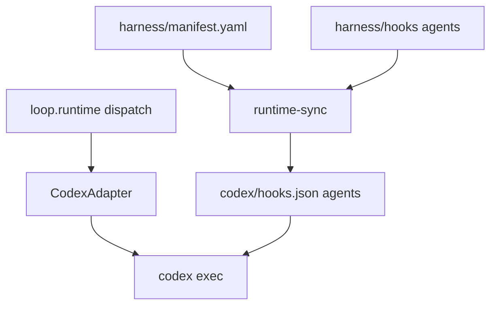

# [T-HUB-043 | runtime-bridge-codex] PLAN

**Дата:** 2026-09-01  
**Режим:** BACK PLAN  
**Уровень:** L3–L4  
**Статус:** active  
**Roadmap:** [roadmap-harness-universal-runtime-epics.md](roadmap-harness-universal-runtime-epics.md)  
**Queue:** [roadmap-harness-universal-runtime-epics.queue.yaml](roadmap-harness-universal-runtime-epics.queue.yaml)  
**Deps:** **hard** T-HUB-042. **Soft:** T-HUB-039 (verify-* agent files), T-HUB-016 (cc-hooks-bridge pattern), T-HUB-007 (DSH presets sync pattern).

**Skills:** writing-plans · architecture-patterns · python-testing-patterns · diagnosing-bugs

→ [T-HUB-043-runtime-bridge-codex/md/decompose-index.md](T-HUB-043-runtime-bridge-codex/md/decompose-index.md) — **после DECOMPOSE**

---

## Контекст

- **req:** Codex CLI не участвует в loop; hooks/agents для Codex/DSH дублируются. Нужны: (1) `harness/manifest.yaml` + `runtime-sync` generator; (2) `CodexAdapter` headless; (3) hooks bridge so stop-gate/spawn-gate semantics unchanged.
- **deps:** **hard** T-HUB-042 (registry + dispatch). **Soft:** T-HUB-039 agent files for materializer input.
- **refs:** `.agents/skills/impeccable/scripts/live-copy-edit-agent.mjs` (codex exec argv), `dsh/scripts/install-cc-hooks.sh`, `dsh/patches/cc-hooks-bridge.yml`, plan-T-HUB-016, README §Supported agents.

### Зафиксированные решения

| Тема | Решение |
|------|---------|
| manifest SoT | `harness/manifest.yaml` — agents, hooks, instructions → runtime bindings |
| Sync CLI | `bin/runtime-sync [--runtime codex\|dsh\|all] [--check\|--apply]` |
| Codex headless | `codex exec --cd $PROJECT_ROOT --ephemeral --dangerously-bypass-approvals-and-sandbox -` |
| Hooks bridge | `.codex/hooks.json` **generated** from manifest (not hand-edited) |
| Agent materialize | `harness/agents/*.md` → `.codex/agents/` (copy or symlink policy: copy for portability) |
| DSH presets | manifest row `type: preset` → regenerate `dsh/presets/` from harness agents (optional sync pass) |
| Workflow semantics | **unchanged** — same stop-gate, spawn-hard, phase_registry verify_agent |
| Interactive codex loop | out of scope (headless only v1) |
| Cursor chat Codex | out of scope (IDE layer) |

**CREATIVE need:** нет.

---

## Technology axiom (replace-not-wrap)

| Выбор | Machine input | FORBIDDEN после эпика |
|-------|---------------|------------------------|
| Runtime hook registration | generated `.codex/hooks.json` from manifest | hand-maintained duplicate hook entries |
| Agent defs | `harness/agents/` SoT | parallel `.codex/agents` authored separately |
| Codex invoke | CodexAdapter.build_command | new `run_codex_session` if/else in loop.sh |
| Gate verdict | JSON fence loop-gate-verdict/v1 (T-HUB-023 path) | prose VERDICT regex |

---

## Продуктовая spека (WHAT)

### Product probe

| # | Question | Answer | Impact |
|---|----------|--------|--------|
| 1 | Reframe | Loop can't use Codex CLI; subagents don't fire in codex headless | Bridge + adapter |
| 2 | Wedge | manifest + runtime-sync + CodexAdapter + minimal hooks.json | defer full DSH preset regen |
| 3 | Pre-mortem | Generated hooks drift from harness; operator forgets sync | `--check` in doctor/loop preflight |
| 4 | Adoption | `EPIC_RUNTIME=codex make loop` after sync | runbook T-HUB-044 |
| 5 | Leverage | Reuse hub Python hooks via wrapper scripts; impeccable codex exec pattern | |
| 6 | Appetite | L3–L4, 7–10 days | cut: DSH preset regen automation |

### User Stories

| # | Story | Priority | Independent Test |
| :--- | :--- | :--- | :--- |
| US-001 | Как operator, я хочу `EPIC_RUNTIME=codex` в loop headless. | P0 | mock codex binary invoked with prompt stdin |
| US-002 | Как maintainer, я хочу manifest-driven sync, чтобы один hook fix → all runtimes. | P0 | change manifest → runtime-sync → hooks.json updated |
| US-003 | Как parent IMPLEMENT, я хочу stop-gate block FINISH без verify PASS на codex runtime. | P0 | integration test with harness stop-gate wired |
| US-004 | Как CI, я хочу `runtime-sync --check` fail on drift. | P1 | touch harness hook without sync → exit 1 |

#### Acceptance Scenarios — US-003

- **Given:** codex runtime session with code_changed IMPLEMENT
- **When:** parent attempts FINISH without verify-implement PASS
- **Then:** stop-gate denies (same as claude)

### Functional Requirements

- **FR-001:** `harness/manifest.yaml` schema `harness-manifest/v1` with agents, hooks, instructions sections.
- **FR-002:** `loop/runtime_materializers/sync.py` — read manifest, emit targets per runtime.
- **FR-003:** `bin/runtime-sync` CLI wrapper (--runtime, --check, --apply).
- **FR-004:** Generate `.codex/hooks.json` mapping events → hub Python hook entrypoints (wrapper shell or direct python3 path).
- **FR-005:** Materialize `.codex/agents/` from `harness/agents/` (verify-*, explorer, analyze-verify).
- **FR-006:** `loop/runtime_adapters/codex.py` — CodexAdapter implements RuntimeAdapter.
- **FR-007:** Register codex in `loop/runtime_registry.yaml` with capabilities (headless, bridge subagents).
- **FR-008:** `analyze_log` for codex: detect incomplete FINISH, exit codes, model hints from codex output fixtures.
- **FR-009:** `codex/bin/which-codex.sh` — resolve `codex` from PATH or env `CODEX_BIN`.
- **FR-010:** Extend `session_resilience` / adapter tests with codex log fixtures.
- **FR-011:** Optional: manifest hook rows for dsh bridge refresh (document manual step if not automated).
- **FR-012:** Preflight hook: loop start warns if `EPIC_RUNTIME=codex` and `--check` drift (soft warn v1; hard fail v2 defer).

### Success Criteria

| SC-001 | mock codex + loop invokes | test_codex_runtime_adapter |
| SC-002 | runtime-sync --check detects drift | test_runtime_sync |
| SC-003 | codex in registry; foo still fail-closed | test_runtime_registry |
| SC-004 | stop-gate integration smoke | test_codex_hooks_bridge |

---

## AC+

1. `EPIC_RUNTIME=codex` + mock `codex` script → loop invokes with prompt on stdin; log written.
2. `harness/manifest.yaml` exists; `runtime-sync --apply --runtime codex` generates `.codex/hooks.json`.
3. `runtime-sync --check` returns non-zero when generated files stale.
4. CodexAdapter registered; missing codex binary → exit 127, no claude fallback.
5. Unit: codex log fixture → SessionAnalysis completed vs aborted.
6. `.codex/agents/verify-implement.md` materialized from harness (when T-HUB-039 agent exists).

### AC−

1. Hand-edited `.codex/hooks.json` as SoT (must be generated header comment + manifest hash).
2. Separate spawn policy for codex (semantics must match spawn-hard).
3. Silent fallback codex → claude.
4. Dual dispatch `run_codex_session` in loop.sh alongside adapter.

---

## Техника / архитектура (HOW)

### manifest.yaml (sketch)

```yaml
schema: harness-manifest/v1
agents:
  verify-implement:
    source: harness/agents/verify-implement.md
    aliases: [verify]
    runtimes:
      claude: { type: native }
      codex:  { type: materialize, target: .codex/agents/verify-implement.md }
      dsh:    { type: preset, target: dsh/presets/verify-implement.prompt.md }
hooks:
  stop-gate:
    source: harness/hooks/stop-gate.py
    runtimes:
      claude: { event: Stop, settings: .claude/settings.json }
      codex:  { event: Stop, manifest: .codex/hooks.json }
      dsh:    { bridge: dsh/patches/cc-hooks-bridge.yml }
```

### Codex invoke (v1)

```bash
cd "$HUB_ROOT" && codex exec \
  --cd "$PROJECT_ROOT" \
  --dangerously-bypass-approvals-and-sandbox \
  --ephemeral \
  ${MODEL:+--model "$MODEL"} \
  -
# prompt on stdin
```

Note: cwd hub vs product — validate against Codex CLI docs during IMPLEMENT; adapter encapsulates final argv.

### Architecture diagram



### Files

| Файл | Действие |
|------|----------|
| `harness/manifest.yaml` | new |
| `loop/runtime_materializers/sync.py` | new |
| `loop/runtime_materializers/__init__.py` | new |
| `bin/runtime-sync` | new |
| `.codex/hooks.json` | generated (template in repo with GENERATED header) |
| `.codex/agents/.gitkeep` | generated agents |
| `loop/runtime_adapters/codex.py` | new |
| `loop/runtime_registry.yaml` | add codex entry |
| `codex/README.md` | install/auth contract |
| `codex/bin/which-codex.sh` | new |
| `loop/tests/fixtures/codex_session_*.log` | new |
| `loop/tests/test_codex_runtime_adapter.py` | new |
| `loop/tests/test_runtime_sync.py` | new |
| `loop/tests/test_codex_hooks_bridge.py` | new |

---

## Eng review spine

### Failure matrix

| Component | Failure | Detection | Response | Test ID |
|-----------|---------|-----------|----------|---------|
| manifest | invalid yaml | sync load | exit 2 | TM-001 |
| codex auth | not logged in | codex exec stderr | permanent_failure | TM-002 |
| hooks drift | manifest hash mismatch | --check | exit 1 | TM-003 |
| stop-gate | hook not registered | FINISH without verify | deny | TM-004 |
| materialize | missing agent source | sync | fail-closed | TM-005 |
| binary | codex not found | resolve_binary | exit 127 | TM-006 |

---

## Replacement / sunset

### A. Code

| Устаревает | Замена | Policy |
| :--- | :--- | :--- |
| README "loop не запускает Codex" | codex runtime section | update in T-HUB-044 |
| hand-maintained dsh preset drift (optional) | manifest preset rows | shim doc if not automated |

### C. Fallbacks

| Pattern | Replacement | Policy |
|---------|-------------|--------|
| codex fail → claude | exit 127 | fail-closed |

---

<a id="qa-consumes"></a>
## QA consumes

| ID | Priority | Scenario | Command | Expected | Maps |
|----|----------|----------|---------|----------|------|
| TM-001 | P0 | codex command builder | pytest loop/tests/test_codex_runtime_adapter.py | PASS | FR-006 |
| TM-002 | P0 | codex log analysis | pytest loop/tests/test_codex_runtime_adapter.py -k analyze | PASS | FR-008 |
| TM-003 | P0 | runtime-sync check drift | pytest loop/tests/test_runtime_sync.py | PASS | FR-003 |
| TM-004 | P0 | registry has codex | pytest loop/tests/test_runtime_registry.py -k codex | PASS | FR-007 |
| TM-005 | P1 | mock loop invoke codex | pytest loop/tests/test_loop_codex_dispatch.py | PASS | US-001 |
| TM-006 | P1 | hooks bridge smoke | pytest loop/tests/test_codex_hooks_bridge.py | PASS | US-003 |

---

## Review readiness

| Gate | Required | Status | Evidence |
|------|----------|--------|----------|
| Product probe | L3 | done | §Product probe |
| Eng spine | L2+ | done | failure matrix |
| qa_consumes | L2+ | done | 6 TM |
| §0.11 | external codex CLI | done | codex exec argv documented; verify CLI flags in IMPLEMENT |

---

## Plan review batch log

| Phase | Auto-resolved | Deferred |
|-------|---------------|----------|
| Product | headless only v1 | interactive codex |
| Eng | reuse T-HUB-016 bridge pattern | full DSH preset regen |

---

## До DECOMPOSE

| sNN | Slice |
|-----|-------|
| s01 | manifest.yaml schema + validator |
| s02 | runtime_materializers/sync.py core |
| s03 | bin/runtime-sync CLI |
| s04 | generate .codex/hooks.json |
| s05 | materialize .codex/agents |
| s06 | CodexAdapter + which-codex.sh |
| s07 | registry entry + dispatch wiring |
| s08 | analyze_log fixtures + tests |
| s09 | stop-gate bridge integration test |
| s10 | optional dsh manifest rows + doc stub |
| s11 | legacy purge (no run_codex in loop.sh) |

---

## Appetite

| Поле | Значение |
| :--- | :--- |
| `timebox_days` | 10 |
| `cut_list` | `['DSH preset auto-regen', 'loop preflight hard fail on drift']` |

---

## Следующий режим

→ BACK DECOMPOSE (after T-HUB-042)
