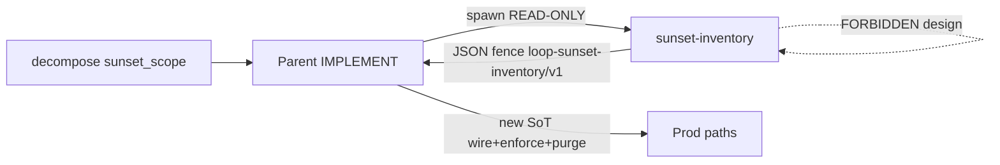

# [T-HUB-058 | sunset-inventory-agent] PLAN

**Дата:** 2026-09-03  
**Режим:** BACK PLAN  
**Уровень:** L3  
**Статус:** active  
**Clarify:** Phase 0 skipped — taxonomy clear (чат 2026-09-03: subagent inventory as-built → JSON REPLACE; scope в decompose; parent строит новый SoT)  
**Roadmap:** [roadmap-sunset-inventory-agent-epics.md](roadmap-sunset-inventory-agent-epics.md) · queue sibling  
**Deps:** **hard** T-HUB-057. **Unlocks hard** T-HUB-053 (materialize нового agent в Codex parity).  
**Skills:** writing-plans · architecture-patterns · python-testing-patterns · grill-me (Phase 0 skip → mini grill §Product probe)

→ [T-HUB-058-sunset-inventory-agent/md/decompose-index.md](T-HUB-058-sunset-inventory-agent/md/decompose-index.md) — **после DECOMPOSE**

---

## Контекст

- **req:** При brownfield replace главный агент не должен глубоко читать старую реализацию как шаблон дизайна. Нужен отдельный READ-ONLY subagent, который по **scope из decompose** изучает as-built, помечает поверхности как **REPLACE**, и возвращает **typed JSON** (с путями, символами, excerpts кода и меткой). Parent проектирует/пишет **новый SoT** поверх inventory, не «расширяя» старый путь.
- **gap (as-built):**
  - Есть `explorer` — search gate (где/кто), **не** sunset inventory с Kind A/B/C/I и mark REPLACE.
  - Spec-first / behavior-first / Kind I уже требуют sunset, но **исполнитель inventory = parent** → contamination.
  - В `epic-decompose/v1` нет поля scope для spawn sunset-агента.
  - Нет machine schema отчёта inventory для parent/hooks.
- **refs:** чат 2026-09-03; `harness/agents/explorer.md`; `dsh/presets/explorer.prompt.md`; `harness/manifest.yaml`; `harness/hooks/_lib.py` / `agent_registry.py`; `shared/workflow-behavior-first.mdc` §3–§4; `shared/workflow-legacy-fallback-cleanup.mdc` Kind A/B/C/I; `shared/workflow-spec-first-replace.mdc`; templates `decompose/epic-step.yaml`.

**CREATIVE need:** нет.

---

## Technology axiom (replace-not-wrap)

| Выбор | Machine input | FORBIDDEN после эпика |
|-------|---------------|------------------------|
| Sunset report | fenced JSON + pydantic `loop-sunset-inventory/v1` | free-text «нашёл вот это» как SoT для parent |
| Mark | enum `REPLACE` (обязателен на каждом item) | нейтральный «info» / «consider» без mark |
| Agent role | READ-ONLY inventory; **zero design** нового пути | HOW / dual-path / wrap suggestions в ответе |
| Scope SoT | поле `sunset_scope` в decompose shard | parent угадывает paths «на глаз» без scope |
| vs explorer | отдельный agent id `sunset-inventory` | расширение explorer prose-отчётом «и ещё устарело» |

As-built grep parent’ом для **design** — sunset inventory (что **не** читать как шаблон). Deep-read obsolete после report — только для deletes/callers, не для копирования логики.

---

## Продуктовая спека (WHAT)

Оператор и workflow получают:

1. Именованный subagent, которого parent **обязан** вызвать на brownfield-replace шагах с заполненным `sunset_scope`.
2. Отчёт строгого формата: каждый найденный символ/файл помечен **REPLACE**, с excerpt и Kind.
3. Parent видит inventory как «мусор на вытеснение», а не как код для эволюции.
4. Decompose задаёт **что читать** (allow paths / globs / boundary / new_sot hint из plan axiom).
5. Misuse (design advice, edit, выход за scope) → fail-closed diagnostic в report или spawn deny.

### Product probe (office-hours lite)

| # | Question | Answer / Probe | Decision / Impact on PLAN |
|---|----------|----------------|---------------------------|
| 1 | **Reframe:** | Parent травится as-built → dual path / minimal wire | Отдельный inventory agent + JSON REPLACE |
| 2 | **Narrowest wedge:** | Agent + schema + decompose field + parent spawn rule + 1 fixture test | P0 = Claude/harness path; Cursor Task enum sync in-epic |
| 3 | **Pre-mortem:** | Agent начнёт предлагать HOW / wrap | HARD zero-design + AC− + schema forbid design fields |
| 4 | **Adoption:** | DECOMPOSE пишет `sunset_scope`; IMPLEMENT spawn до кода на replace steps | Workflow + template + lean implement gate |
| 5 | **Leverage:** | Паттерн explorer (manifest, overlay search, CONTRACT) | Новый agent, не fork explorer поведения |
| 6 | **Appetite:** | 3–5 дней | cut: MCP tool; auto-write sunset tables в plan |

### User Stories

| # | Story | Priority | Independent Test |
| :--- | :--- | :--- | :--- |
| US-001 | Как parent на brownfield-replace шаге, я хочу вызвать `@sunset-inventory` со scope из shard, чтобы получить JSON inventory с mark REPLACE без design advice. | P0 | Fixture scope → agent/report path → pydantic ok; items[].mark=REPLACE; нет design keys |
| US-002 | Как DECOMPOSE author, я хочу поле `sunset_scope` в shard, чтобы явно указать что читать и какой new_sot. | P0 | Template + validate-decompose принимает поле; step без scope при required=false ок |
| US-003 | Как parent, я хочу запрет deep-design-read obsolete без report, чтобы не копировать старый путь. | P0 | Workflow/lean: spawn sunset до prod edit на replace; AC− documented |
| US-004 | Как operator, я хочу отличать explorer (поиск) от sunset-inventory (вытеснение). | P1 | Два agent id в registry/manifest; contracts разные |

#### Acceptance Scenarios — US-001

- **Given:** decompose step с `sunset_scope.allow_read` и `new_sot`
- **When:** parent packs spawn `sunset-inventory` с ALLOW = scope
- **Then:** ответ содержит fenced JSON `schema: loop-sunset-inventory/v1`, каждый item `mark: REPLACE`, excerpts в scope; нет предложений HOW/dual-path

#### Acceptance Scenarios — US-002

- **Given:** новый epic-step template
- **When:** DECOMPOSE пишет `sunset_scope` на replace step
- **Then:** validate-decompose-tree / schema accept; implement lean требует spawn если `required: true`

### Functional Requirements (FR-###)

- **FR-001:** Agent `sunset-inventory` (alias `sunset`) в harness: source md + dsh preset + manifest materialize Claude (+ Codex target как у explorer).
- **FR-002:** Overlay: `mode: search`, `verdict: none`, READ-ONLY tools (как explorer: Read/Bash/Grep/Glob; disallowed Write/Edit/Agent/…).
- **FR-003:** Pydantic model + schema id `loop-sunset-inventory/v1` в `loop/schemas/` (или `loop/mb_*` peer — выбрать один package path в DECOMPOSE; default `loop/schemas/sunset_inventory.py`).
- **FR-004:** Report items: `kind` ∈ {A,B,C,I}, `symbol`, `path`, `start_line`, `end_line`, `excerpt` (bounded), `mark=REPLACE`, `role`, optional `notes`. Top-level: `boundary_id`, `new_sot`, `forbidden_for_parent[]`, `diagnostic_codes[]`, `ok`.
- **FR-005:** Excerpt budget HARD (напр. ≤40 строк / item, ≤N items или truncate с diagnostic) — не заливать parent полным файлом.
- **FR-006:** Agent **FORBIDDEN:** предлагать новый HOW, dual-path, optional wire, «оставить для совместимости», edit/write, читать вне `allow_read` без явного diagnostic.
- **FR-007:** Decompose template + schema: поле `sunset_scope:` (`required`, `boundary_id`, `new_sot`, `allow_read[]`, optional `kind_hint[]`).
- **FR-008:** Workflow: brownfield replace / Technology axiom steps с `sunset_scope.required: true` → parent **обязан** spawn `@sunset-inventory` **до** prod Write нового SoT; report ∈ evidence / implement yaml.
- **FR-009:** Lean IMPLEMENT + behavior-first / spec-first pointer: inventory от subagent; parent не deep-reads obsolete как design template.
- **FR-010:** Registry/hooks: CONTRACT string в `_lib.py`; spawn_validate не требует verdict fence; normalize alias `sunset` → `sunset-inventory`.
- **FR-011:** Cursor path: зарегистрировать тип в том же harness materialize / документировать spawn через Task/Agent с `subagent_type=sunset-inventory` (если Cursor enum синхронизируется из harness — обновить источник; иначе rule + agent md для Cursor mirror).
- **FR-012:** Tests: schema validate; fixture report ok/fail; registry discover agent; optional spawn_validate smoke; obsolete-design fields rejected by model.
- **FR-013:** Purge: не оставлять «sunset = explorer prose»; no dual agent id; docs/cheatsheet one-liner.

### Success Criteria (SC-###)

| ID | Измеримый результат | Проверка / источник | Type |
| :--- | :--- | :--- | :--- |
| SC-001 | `discover_registry` содержит `sunset-inventory` mode=search verdict=none | unit / CLI | outcome |
| SC-002 | Valid report `mark=REPLACE` all items; invalid without mark → ValidationError | pytest | outcome |
| SC-003 | Decompose template содержит `sunset_scope` comment+example | rg template | outcome |
| SC-004 | Lean implement / behavior-first упоминают spawn sunset на required scope | rg rules | outcome |
| SC-005 | Targeted pytest green для schema+registry | `bin/pytest …` | outcome |

### Assumptions

- Parent остаётся единственным writer нового SoT; sunset-agent никогда не пишет код.
- Kind A/B/C/I совпадают с legacy-fallback-cleanup (не новая taxonomy).
- Explorer остаётся search gate; sunset не заменяет «где используется X» без mark REPLACE.
- Codex materialize в том же эпике (manifest), полная Codex↔Claude parity behavior — soft follow в 053.

### Clarifications

- Session: 2026-09-03 chat; Phase 0 skipped.
- Решено: новый agent (не режим explorer); JSON+pydantic; scope в decompose; mark REPLACE.

### [НУЖНО УТОЧНИТЬ]

- нет CRITICAL open.

---

## AC

1. Agent + preset + manifest entry существуют и materialize’ятся.
2. Schema `loop-sunset-inventory/v1` validate-on-read для parent/tests.
3. Decompose `sunset_scope` в template + document в workflow DECOMPOSE/IMPLEMENT.
4. Parent spawn rule на `required: true` enforce в lean implement (no FINISH без report evidence).
5. Tests green targeted; registry lists agent.
6. AC− ниже PASS.

### AC− (brownfield / anti-contamination)

1. Нет «sunset-inventory предлагает HOW / dual-path» в agent prompt или schema fields.
2. Нет слияния explorer и sunset в один agent id.
3. Нет optional mark / silent info items без REPLACE на obsolete surfaces в happy path.
4. Нет parent-done replace step без spawn при `sunset_scope.required: true`.
5. Excerpt не является license копировать логику — prompt + `forbidden_for_parent` явно запрещают design-from-excerpt.

---

## Components / Architecture

| Component | Responsibility |
|-----------|----------------|
| `harness/agents/sunset-inventory.md` | Agent card + overlay + prompt HARD |
| `dsh/presets/sunset-inventory.prompt.md` | DSH preset mirror |
| `harness/manifest.yaml` | Materialize Claude/Codex |
| `loop/schemas/sunset_inventory.py` | Pydantic models |
| `harness/hooks/_lib.py` + aliases | CONTRACT + normalize |
| `templates/decompose/epic-step.yaml` | `sunset_scope` field |
| workflow rules | When to spawn; parent contamination ban |
| tests | Schema + registry + template presence |

---

## Eng review spine

| Dimension | Notes |
|-----------|-------|
| Architecture | Separate search-mode agent; report is machine boundary; parent is sole implementer |
| Patterns | Mirror explorer overlay; replace-not-wrap on agent purpose; Kind taxonomy reuse |
| Code surface | harness agents + loop/schemas + hooks registry + templates + lean rules |
| Failure | Out-of-scope read → diagnostic; empty inventory when expected → ok:false + code; oversized excerpt → truncate + diagnostic |

---

## Replacement / sunset (brownfield)

> Частичный replace процесса (parent-as-inventory → subagent). A+B+C+I ниже.

### A. Code / modules

| Устаревает (path / symbol) | Замена | Policy |
| :--- | :--- | :--- |
| Неформальный parent deep-read as-built как design на replace steps | `@sunset-inventory` + report | delete in-epic (process) |
| n/a code module | — | greenfield agent |

### B. Entrypoints / deploy

| Устаревает | Замена | Policy |
| :--- | :--- | :--- |
| n/a | manifest + registry discover | greenfield |

### C. Fallbacks / soft-fail

| Устаревает | Замена | Policy |
| :--- | :--- | :--- |
| «можно вызвать explorer вместо sunset» на replace | required spawn sunset-inventory | delete in-epic |
| prose inventory без schema | JSON+pydantic fail-closed | delete in-epic |

### I. Instruction surfaces

| Устаревает | Замена | Policy |
| :--- | :--- | :--- |
| Lean/implement/cheatsheet «сам прочитай as-built и пойми» на replace | spawn sunset-inventory; design from report marks only | delete in-epic |
| behavior-first без inventory executor | pointer на sunset-inventory spawn | rewrite in-epic |

---

## Failure matrix

| Failure | Detect | Mitigate | Test |
|---------|--------|----------|------|
| Agent invents HOW | schema forbid + prompt HARD | reject / ok:false | TM-003 |
| Scope empty / missing | spawn_validate or parent gate | DENY spawn / FAIL step | TM-004 |
| Parent skips spawn | lean abort | no FINISH | TM-005 |
| Huge excerpts | budget truncate | diagnostic | TM-006 |
| Confused with explorer | two ids + contracts | docs + tests | TM-007 |

---

## QA consumes (test plan)

### Scope under test

- Epic / surfaces: sunset-inventory agent, schema, decompose field, workflow gates, registry
- Out of scope: product app code; full Codex parity (053)

### Test matrix

| ID | Priority | Scenario | Command / fixture | Expected | Maps FR/AC |
|----|----------|----------|-------------------|----------|------------|
| TM-001 | P0 | Schema accepts valid REPLACE report | `bin/pytest loop/tests/test_sunset_inventory_schema.py -q` | PASS | FR-003/004 |
| TM-002 | P0 | Schema rejects missing mark / design fields | same | ValidationError | AC−1 |
| TM-003 | P0 | Registry discovers sunset-inventory search/none | `bin/pytest loop/tests/test_agent_registry.py -k sunset -q` | PASS | FR-001/010 |
| TM-004 | P0 | Template has sunset_scope | `rg sunset_scope .cursor/templates/decompose/epic-step.yaml` | ≥1 | FR-007 |
| TM-005 | P0 | Lean/rules require spawn when required | `rg sunset-inventory .cursor/rules/.../implement.mdc` | ≥1 | FR-008 |
| TM-006 | P1 | Alias sunset → sunset-inventory | unit normalize | PASS | FR-010 |
| TM-007 | P1 | Manifest lists agent | `rg sunset-inventory harness/manifest.yaml` | ≥1 | FR-001 |

Min: ≥3 P0 — ok.

---

## Review readiness

| Check | Status | Notes |
|-------|--------|-------|
| Product probe ≥4 | Required — done | table filled |
| Eng review spine | Required — done | section filled |
| Technology axiom | Required — done | |
| Sunset A+B+C+I | Required — done | |
| QA consumes ≥3 TM | Required — done | |
| CRITICAL open | Required — none | |

---

## Plan review batch log

| Topic | Resolution |
|-------|------------|
| New agent vs explorer mode | **New agent** `sunset-inventory` |
| Response format | **JSON + pydantic**, mark REPLACE, bounded excerpts |
| Scope source | **decompose `sunset_scope`** |
| Cursor | Materialize/sync in-epic; rule spawn `subagent_type=sunset-inventory` |
| Auto-fill plan sunset tables | **Out of scope** (parent/DECOMPOSE maps report → deletes) |

---

## Draft step cut (advisory — DECOMPOSE authoritative)

1. **s01** — pydantic `loop-sunset-inventory/v1` + tests  
2. **s02** — agent md + dsh preset + manifest + registry/CONTRACT/alias  
3. **s03** — decompose template `sunset_scope` + validate if needed  
4. **s04** — workflow lean IMPLEMENT/DECOMPOSE/behavior-first/spec-first pointers + cheatsheet  
5. **s05** — Cursor/Task spawn docs or enum source sync  
6. **s06** — legacy-fallback-purge (instruction dual «use explorer for sunset»; prose inventory)

---

## Handoff

- **Done:** BACK PLAN T-HUB-058  
- **Files:** this plan · roadmap-sunset-inventory-agent-epics.md + .queue.yaml  
- **Next:** `BACK DECOMPOSE T-HUB-058-sunset-inventory-agent` после ROADMAP MERGE (same session CLI)
