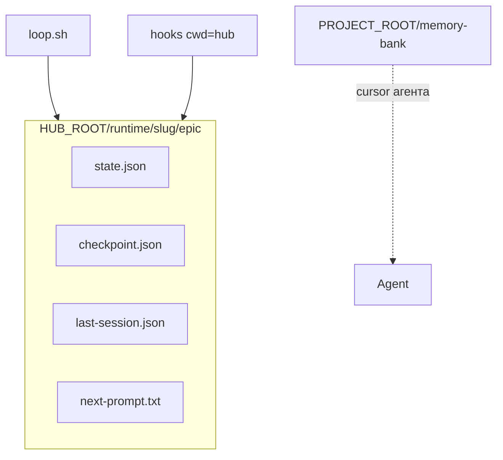

# [T-HUB-003 | loop-halt] PLAN

**Дата:** 2026-08-16  
**Режим:** BACK PLAN  
**Уровень:** L3  
**Статус:** active  
**Roadmap:** [roadmap-workflow-loop-hardening-epics.md](roadmap-workflow-loop-hardening-epics.md)  
**Research:** [loop-reliability](../../audit/workflow-loop-20260816/loop-reliability.md) · audit roadmap P0 6–7 · P1 17–19

**Skills:** writing-plans · brainstorming · python-testing-patterns · architecture-patterns (узко: single runtime root)

→ [decompose-T-HUB-003-loop-halt/index.md](decompose-T-HUB-003-loop-halt/index.md) — **после DECOMPOSE**

---

## Контекст

- **req:** loop runner должен останавливаться на fail-closed / NEED_HUMAN после сессии; recovery-файлы лежат рядом с каноническим state; architecture docs не врут.
- **deps:** нет hard. Рекомендуется после T-HUB-002 только для согласованных формулировок docs (не блокирует).
- **refs:** `loop/loop.sh` (~641–647), `loop/context_loop.py` `check_after`, `.claude/hooks/session_resilience.py` `last_session_path`, `.claude/hooks/epic_paths.py` `epic_dir`, `loop/WORKFLOW.md`, `.claude/instructions/epic-loop.md`, `memory-bank/architecture/{index,services,data-flow,overview}.md`, `projectbrief.md`.

### Зафиксированные решения

| Тема | Решение |
|------|---------|
| Поведение `check-after` halt | **HALT (exit ≠0)** когда: JSON `halt=true`; `stop` начинается с `NEED_HUMAN`; integrity fail-closed после repair exhaustion. **CONTINUE** только при `ok` + continue / fingerprint advanced. **COMPLETE** при `EPIC_DONE` (и opt-in chain). Не outer-retry «вслепую» на NEED_HUMAN |
| `BLOCKED:` auto-clear на prepare | **Сохранить** (уже as-built); документировать асимметрию: BLOCKED auto-clear vs NEED_HUMAN halt |
| `last_session_path` | Писать в **тот же** `epic_dir()` (hub `runtime/<slug>/epic/` при HUB_*), не в `PROJECT_ROOT/.claude/runtime/...` |
| Stale product `.claude/runtime` | Docs: migrate/ignore; **не** массово delete evidence вслепую; опциональный note в hub-unlink/README |
| `architecture/workers.md` | **Создать** shard (loop sessions as workers) — index уже ссылается |
| Pytest в hub | Минимум: зафиксировать в `techContext`/`architecture` «гонять `loop/tests` из окружения с pytest» + optional stub `pyproject.toml` **или** явная ссылка на product venv — выбрать **документ + optional minimal pyproject** если нет конфликта |
| Cursor hooks | В architecture: S-HOOKS-CUR = **unwired / N/A for epic gates**; wiring `hooks.json` = out of scope этого эпика (отдельный follow-up) |

**CREATIVE need:** нет.

---

## Цель

Дорогие бесконечные outer-retry на NEED_HUMAN/integrity исчезают; `last-session.json` лежит рядом со `state.json` в hub runtime; docs recovery совпадают с кодом.

---

## Требования

### FR

| ID | Требование |
|----|------------|
| FR-1 | `loop.sh` после `check-after`: при `halt=1` → печать причины → **exit 1** (не sleep/continue) |
| FR-2 | `loop.sh`: при `complete` + `stop` matching `NEED_HUMAN*` → **exit 1** (human), не retry |
| FR-3 | `loop.sh`: при `complete` + `EPIC_DONE` → existing complete/chain path (без регрессии) |
| FR-4 | `loop.sh`: transient/`ok continue` path без регрессии |
| FR-5 | `last_session_path` использует тот же root, что `epic_dir()` (учитывает `HUB_ROOT`/`DEV_HUB` + slug) |
| FR-6 | Тесты: новые/обновлённые на halt-parity shell или python helper; last_session path unit |
| FR-7 | Docs: `epic-loop.md`, loop README/WORKFLOW, architecture data-flow — канон hub `runtime/<slug>/epic/` |
| FR-8 | Создать `memory-bank/architecture/workers.md` (loop sessions); убрать orphan claims `tests/unit/test_ports_browser` / корневой `tests/` из index/projectbrief или поправить правду |
| FR-9 | `projectbrief` / architecture gaps: согласовать с as-built |

### NFR

| ID | Требование |
|----|------------|
| NFR-1 | Не ломать `prepare` halt fail-closed |
| NFR-2 | Не отключать repair_* в `check_after` — только shell реакция на итог |
| NFR-3 | Не менять contract `activeContext` как cursor агента |
| NFR-4 | TDD: red→green на path helpers и shell semantics (через тест-двойники / extracted pure fn если нужно) |
| NFR-5 | Do Not Touch: flock, model_substitution HALT, phase models |

### AC+

1. Сценарий: mock `check-after` → `{halt: true}` → `loop.sh` exit ≠0 без «retrying outer loop»  
2. Сценарий: `stop=NEED_HUMAN: verify_no_verdict` + complete → exit ≠0  
3. Сценарий: `EPIC_DONE` → exit 0 / chain (как сейчас)  
4. Unit: `last_session_path` при `HUB_ROOT`/`DEV_HUB` + `PROJECT_ROOT` → `HUB/runtime/<slug>/epic/last-session.json` (имя файла как в коде)  
5. `rg -n '\\.claude/runtime/epic' .claude/instructions/epic-loop.md` — либо удалено как канон, либо помечено legacy-only  
6. `test -f memory-bank/architecture/workers.md`  
7. architecture index gaps про `test_ports_browser` / workers — закрыты или честно updated  

### AC−

1. Не HALT на обычном `continue` после успешного шага  
2. Не удалять product runtime dirs автоматически  
3. Не вводить Cursor epic stop-gate в этом эпике  
4. Не менять `extract_verdict` (T-HUB-004)  

---

## Компоненты / файлы

| Файл | Действие |
|------|----------|
| `loop/loop.sh` | Halt-parity ветки после `check-after` |
| `loop/context_loop.py` | При необходимости явные поля `halt_reason` / normalize stop (минимально) |
| `.claude/hooks/session_resilience.py` | `last_session_path` → epic_dir-aligned |
| `.claude/hooks/epic_paths.py` | Возможно helper `last_session_path` рядом с `epic_dir` (избежать дубля) |
| `loop/tests/test_*.py` | Новые кейсы halt + path |
| `.claude/instructions/epic-loop.md` | Runtime канон |
| `loop/README.md` / `loop/WORKFLOW.md` | Recovery path |
| `memory-bank/architecture/workers.md` | Create |
| `memory-bank/architecture/index.md` | Gaps update |
| `memory-bank/projectbrief.md` | Убрать ложный `tests/` claim |
| `memory-bank/techContext.md` | Pytest entry для hub (если файл есть) |

---

## Архитектура runtime (target)

**As-built bug:** `epic_dir` → hub runtime; `last_session_path` → product `.claude/runtime` — **закрыть**.

### Halt matrix (канон)

| Сигнал | prepare | check-after → shell |
|--------|---------|---------------------|
| `halt=1` | HALT | HALT |
| `NEED_HUMAN:*` | complete/stop | **HALT** (fix) |
| `BLOCKED:` (prepare) | auto-clear + continue | n/a |
| `EPIC_DONE` | — | COMPLETE |
| `ok` continue | — | outer continue |
| max iter | — | HALT (уже есть) |

---

## Replacement / sunset

| Устаревает | Замена | Policy |
| :--- | :--- | :--- |
| Outer retry на NEED_HUMAN после check-after | HALT exit | replace in-epic |
| `last_session_path` → product `.claude/runtime/...` | hub `epic_dir()/last-session` | replace |
| Docs канон `.claude/runtime/epic/` как primary | hub `runtime/<slug>/epic/` | replace docs; legacy mention ok |
| Missing `workers.md` | create | create |
| Orphaned `tests/unit/test_ports_browser` claims | remove/fix claims | delete claims |

---

## Стратегия тестирования

1. Unit `last_session_path` / epic_dir alignment (tmp_path + env).  
2. Shell semantics: предпочтительно вынести чистую функцию «decide_after_action(after_json) → continue|halt|complete» в python и тестировать; `loop.sh` вызывает её — **если** слишком рискованно править только bash, тестировать через батч fixtures.  
3. Регрессия: существующие `test_check_after_*`, `test_finish_integrity`.  
4. Команда: из окружения с pytest — `timeout 300s … pytest loop/tests/… -k 'check_after or last_session or loop_shell'`.

---

## Риски

| Риск | Митигация |
|------|-----------|
| Слишком агрессивный HALT на recoverable WARN | Матрица: только halt flag + NEED_HUMAN* + non-retryable integrity; обычный fingerprint continue остаётся |
| Тесты закрепляли legacy last-session path | Обновить тесты вместе с кодом (не оставлять dual truth) |
| Product всё ещё пишет в старый path вручную | Docs + один release note в architecture |

---

## До DECOMPOSE (черновик фаз)

1. **s01 — halt matrix + pure decide helper (TDD)**  
2. **s02 — wire `loop.sh`**  
3. **s03 — `last_session_path` → epic_dir (TDD)**  
4. **s04 — docs epic-loop / WORKFLOW / architecture data-flow**  
5. **s05 — workers.md + projectbrief/index gaps**  
6. **s06 — suite targeted + architecture note Cursor hooks unwired**

---

## Следующий режим

→ **BACK DECOMPOSE T-HUB-003** (после queue: обычно после завершения/продвижения с 002; queue позволяет 003 сразу после PLAN DECOMPOSE первого — human follows queue order: DECOMPOSE 002 first)
