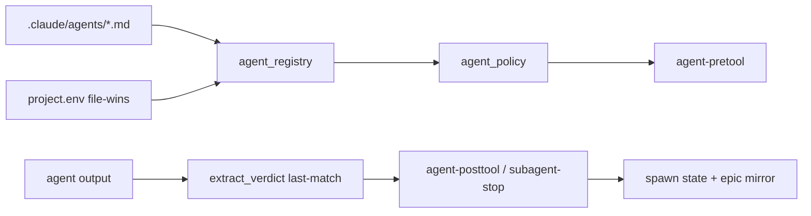

# [T-HUB-004 | hooks-hygiene] PLAN

**Дата:** 2026-08-16  
**Режим:** BACK PLAN  
**Уровень:** L3  
**Статус:** active  
**Roadmap:** [roadmap-workflow-loop-hardening-epics.md](roadmap-workflow-loop-hardening-epics.md)  
**Research:** [hooks-legacy](../../audit/workflow-loop-20260816/hooks-legacy.md) · contradictions BLOCKED/NEED_HUMAN · audit P0 8–9 · P1 13–15

**Skills:** writing-plans · brainstorming · python-testing-patterns

→ [decompose-T-HUB-004-hooks-hygiene/index.md](decompose-T-HUB-004-hooks-hygiene/index.md) — **после DECOMPOSE**

---

## Контекст

- **req:** убрать false PASS от `extract_verdict`, выровнять halt-messaging на `NEED_HUMAN:`, единый registry discovery, удалить мёртвые re-export, закрыть silent swallow / race на spawn state.
- **deps:** soft recommend после T-HUB-002 (тексты); hard deps нет. Queue ставит после T-HUB-003.
- **refs:** `.claude/hooks/_lib.py` `extract_verdict` (~1169), `agent-pretool.py`, `agent-posttool.py`, `subagent-stop.py`, `stop-gate.py`, `agent_registry.py`, `agent_policy.py`, `epic_lib.py`, `.claude/hooks/epic/{checkpoint,context,events,index,io,state}.py`, `.claude/instructions/spawn-hard.md`, `.claude/agents/explorer.md`, `loop/tests/*`.

### Зафиксированные решения

| Тема | Решение |
|------|---------|
| `extract_verdict` | Удалить short-circuit `if "VERDICT: PASS" in text`; **только** last regex match `VERDICT:\s*(PASS\|FAIL\|BLOCKED)\b` |
| Messaging no-verdict | Везде **`NEED_HUMAN: verify_no_verdict`**; pretool больше не учит `BLOCKED: verify_no_verdict`. Regex `has_blocked_verify_no_verdict` может временно принимать оба (compat), с комментарием deprecate BLOCKED |
| Registry | Все hooks через **один** path `_lib._discover_registry` (file-wins); убрать прямой `discover_registry` с process-env drift |
| Alias `explore` | `ALIAS["explore"]="explorer"` в `_lib` **или** убрать claim из `explorer.md` — выбрать **добавить ALIAS** (меньше сюрпризов) |
| Dead re-exports | **Delete** 6 файлов `epic/{checkpoint,context,events,index,io,state}.py` после rg=0 |
| `epic_lib` unused import | Удалить `import epic as _epic` |
| `agent-posttool` swallow | Mirror ошибки → stderr + не silent pass; при fail mirror — не считать epic verdict обновлённым |
| `save_state` race | Минимальный file lock (fcntl/portalocker-style или atomic replace already + lockfile) на spawn-state path |
| Split `_lib`/`core` | **Out of scope** (T-HUB-005 тоже не делает тяжёлый split) |
| Cursor hooks delete | Опционально: удалить unwired stubs **или** оставить + architecture N/A — **удалить stubs только если** нет плана wiring; иначе пометить. Решение: **оставить файлы**, architecture уже помечает unwired в 003; 004 не трогает `.cursor/hooks` |

**CREATIVE need:** нет.

---

## Цель

Gate-агенты дают честный last-VERDICT; stop/pretool говорят один язык (`NEED_HUMAN`); мёртвый код epic re-export удалён; registry policy не зависит от порядка env vs file.

---

## Требования

### FR

| ID | Требование |
|----|------------|
| FR-1 | `extract_verdict("… VERDICT: PASS … VERDICT: FAIL")` → `FAIL` |
| FR-2 | `extract_verdict` на тексте контракта, содержащем подстроку `VERDICT: PASS` в инструкции, но финальной строке `VERDICT: FAIL` → `FAIL` |
| FR-3 | Тесты на last-match wins; удалить/исправить тесты, закреплявшие PASS short-circuit |
| FR-4 | `agent-pretool` messages: `NEED_HUMAN: verify_no_verdict` only |
| FR-5 | `spawn-hard.md` + stop-gate messaging согласованы с FR-4 |
| FR-6 | Единый registry discovery helper для pretool/posttool/user-prompt/stop-gate |
| FR-7 | `ALIAS["explore"]="explorer"` работает в agent-pretool normalization |
| FR-8 | Delete 6 dead epic re-export modules; facade `epic/__init__.py` + `epic_lib` остаются |
| FR-9 | `agent-posttool`: no bare `except: pass` на mirror; ошибка видна |
| FR-10 | `save_state` / load_state: защита от lost-update (lock или atomic+retry) |

### NFR

| ID | Требование |
|----|------------|
| NFR-1 | Не менять набор registered hooks в `settings.json` без нужды |
| NFR-2 | Не ослаблять stop-gate FINISH integrity |
| NFR-3 | TDD обязателен для extract_verdict + alias + registry file-wins |
| NFR-4 | Do Not Touch: agents md overlay schema (кроме alias claim), session_resilience (кроме если shared lock util) |

### AC+

1. Pytest: parametrized extract_verdict last-wins (PASS→FAIL, FAIL→PASS, BLOCKED)  
2. Pytest: contract-like blob with instructional `VERDICT: PASS` substring + final FAIL → FAIL  
3. `rg -n 'BLOCKED: verify_no_verdict' .claude/hooks/agent-pretool.py` → 0  
4. `rg -n 'from epic\\.(checkpoint|context|events|index|io|state)'` → 0; файлы отсутствуют  
5. Registry: при process env `PROJECT_AGENT_VERIFY_MODEL_LOOP=0` и file `=1` → file wins во **всех** entry hooks (один тест на helper)  
6. Alias: spawn type `explore` нормализуется к `explorer`  
7. Targeted: `timeout 300s … pytest` на hooks/loop tests затронутых  

### AC−

1. Не удалять `epic/core.py` / `epic_lib` facade  
2. Не менять `loop.sh` halt (003)  
3. Не vendor archive / CLAUDE (002)  
4. Не делать большой split monolith  

---

## Компоненты / файлы

| Файл | Действие |
|------|----------|
| `.claude/hooks/_lib.py` | extract_verdict; ALIAS; unified discover; save_state lock |
| `.claude/hooks/agent-pretool.py` | NEED_HUMAN messages; use unified discover |
| `.claude/hooks/agent-posttool.py` | mirror errors; unified discover |
| `.claude/hooks/user-prompt.py` | unified discover if needed |
| `.claude/hooks/stop-gate.py` | messaging sync |
| `.claude/hooks/subagent-stop.py` | verify extract uses fixed helper |
| `.claude/hooks/epic_lib.py` | drop unused import |
| `.claude/hooks/epic/checkpoint.py` … `state.py` | **delete** |
| `.claude/instructions/spawn-hard.md` | sync NEED_HUMAN |
| `.claude/agents/explorer.md` | alias claim ↔ code |
| `loop/tests/` или `.claude/hooks` tests | expand |

---

## Архитектура (policy path)

---

## Replacement / sunset

| Устаревает | Замена | Policy |
| :--- | :--- | :--- |
| PASS short-circuit в `extract_verdict` | last regex match | delete logic |
| `BLOCKED: verify_no_verdict` в pretool | `NEED_HUMAN: verify_no_verdict` | replace |
| 6× `epic/*.py` re-export | imports via `epic.core` / package | delete files |
| unused `_epic` import | — | delete |
| silent `except: pass` mirror | log + fail-visible | replace |
| dual discover_registry call styles | `_discover_registry` only | replace |

---

## Стратегия тестирования

1. Red: тест last-wins (сейчас ожидаемо падает на short-circuit).  
2. Green: fix extract_verdict.  
3. Red/green: alias explore.  
4. Red/green: file-wins registry helper.  
5. Smoke: импорт package `epic` после delete re-exports; `from epic import …` тесты finish_integrity.  
6. Regression: stop-gate / verify_no_verdict exhausted paths.

---

## Риски

| Риск | Митигация |
|------|-----------|
| Агенты всё ещё пишут BLOCKED: | compat regex + docs; loop auto-strip BLOCKED остаётся |
| Lock deadlock | короткий timeout; lock только spawn-state file |
| Удаление re-export ломает внешний import | rg + tests до delete |

---

## До DECOMPOSE (черновик фаз)

1. **s01 — extract_verdict TDD fix**  
2. **s02 — NEED_HUMAN messaging sweep (pretool/spawn-hard/stop)**  
3. **s03 — unified registry discovery**  
4. **s04 — ALIAS explore**  
5. **s05 — delete dead epic re-exports + epic_lib cleanup**  
6. **s06 — posttool mirror + save_state lock**  
7. **s07 — targeted suite + import smoke**

---

## Следующий режим

→ **BACK DECOMPOSE T-HUB-004**
