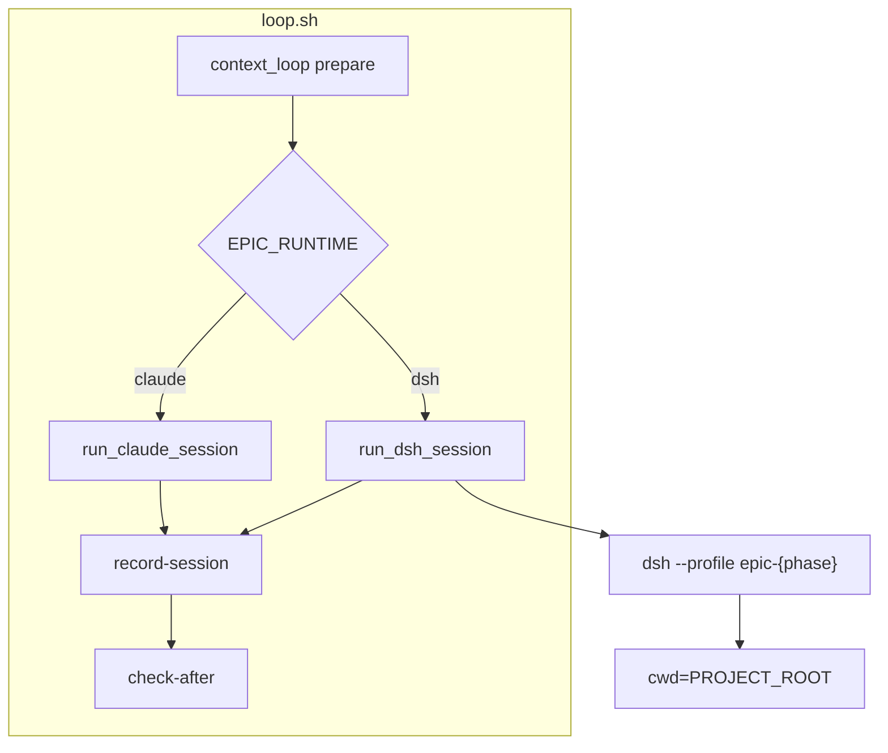

# [T-HUB-006 | dsh-loop-runtime-adapter] PLAN

**Дата:** 2026-08-22  
**Режим:** BACK PLAN  
**Уровень:** L3  
**Статус:** active  
**Roadmap:** [roadmap-dsh-loop-backend-epics.md](roadmap-dsh-loop-backend-epics.md)  
**Queue:** [roadmap-dsh-loop-backend-epics.queue.yaml](roadmap-dsh-loop-backend-epics.queue.yaml)

**Skills:** writing-plans · python-testing-patterns · architecture-patterns · async-python-patterns (узко: subprocess/session wrapper)

→ [decompose-T-HUB-006-dsh-loop-runtime-adapter/index.md](decompose-T-HUB-006-dsh-loop-runtime-adapter/index.md) — **DECOMPOSE DONE** (2026-08-22)

---

## Контекст

- **req:** loop должен уметь запускать сессию через **DeepSeek Harness headless** (`dsh --profile …`) как альтернативу Claude CLI, не ломая context-first orchestration (`prepare` / `check-after` / `record-session`).
- **deps:** нет hard. Soft: T-HUB-003 halt parity — желателен до production pilot (не блокирует adapter).
- **refs:** `loop/loop.sh` `run_claude_session`, `loop/context_loop.py`, `.claude/hooks/session_resilience.py`, `.claude/hooks/epic_stream_filter.py`, DSH CLI (`dsh --profile headless`), [roadmap §архитектурный принцип](roadmap-dsh-loop-backend-epics.md).

### Зафиксированные решения

| Тема | Решение |
|------|---------|
| Default runtime | **`EPIC_RUNTIME=claude`** (unset = claude). DSH только при явном `EPIC_RUNTIME=dsh` или `make loop ARGS="--runtime dsh gpt"` |
| Orchestrator | **`context_loop.py` не знает** про Cordis — только `runtime: claude\|dsh` в prepare JSON и единый contract log path |
| Workspace DSH | **`cwd=$PROJECT_ROOT`** при вызове `dsh`; hub rules через `--add-dir` **не** применимы — system prompt inject через profile (T-HUB-007) |
| Session log | DSH пишет JSONL session log в `$DSH_HOME/storages/` или stdout — adapter **нормалizes** в формат, понятный `analyze_session_log` |
| Stream filter | При DSH: отдельный filter или no-op passthrough; не ломать Claude path |
| Node dependency | `dsh` через `npx @deepseek-ai/dsh` или pinned global; **fail-closed** если Node/dsh missing при `EPIC_RUNTIME=dsh` |
| Interactive mode | Phase 1: **headless only** для DSH; interactive loop остаётся Claude-only до follow-up |

**CREATIVE need:** нет.

---

## Цель

Один env-flag переключает executor с Claude на DSH headless; `record-session` классифицирует abort/completed для DSH logs; regression suite для Claude path зелёный.

---

## Требования

### FR

| ID | Требование |
|----|------------|
| FR-1 | Env `EPIC_RUNTIME` ∈ `{claude, dsh}`; invalid → `invalid_runtime_config` fail-closed при старте loop |
| FR-2 | CLI loop: `--runtime claude\|dsh` override env (как `--model`) |
| FR-3 | `loop.sh`: `run_agent_session()` dispatch → `run_claude_session` \| `run_dsh_session` |
| FR-4 | `run_dsh_session`: invoke `dsh --profile epic-${LOOP_PHASE}` или fallback `epic-implement`; prompt из `prompt_file`; log в `$STATE_DIR/session-${iter}.log` |
| FR-5 | `prepare` JSON: поля `runtime`, `dsh_profile`, `dsh_workspace` (= PROJECT_ROOT) |
| FR-6 | Module `loop/runtime_adapters/dsh.py`: `build_command()`, `normalize_log_for_analysis(raw_log) → text` |
| FR-7 | `analyze_session_log` (session_resilience): ветка `runtime=dsh` — detect completed / transient / permanent без Claude stream-json |
| FR-8 | `record-session` корректно классifies DSH exit 0 + incomplete FINISH как abort (как Claude) |
| FR-9 | Scaffold `dsh/README.md` + `dsh/profiles/.gitkeep` + минимальный `dsh/bin/which-dsh.sh` |
| FR-10 | Unit tests: command builder, log normalizer, runtime config validation |

### NFR

| ID | Требование |
|----|------------|
| NFR-1 | Zero regression: `EPIC_RUNTIME` unset → byte-identical Claude code path |
| NFR-2 | Timeout/retry: тот же `session_resilience.py` wrapper вокруг DSH subprocess |
| NFR-3 | Model substitution HALT: для DSH phase — отдельная detection (adapter mismatch), не Claude org message |
| NFR-4 | TDD: red→green на pure functions до shell wiring |
| NFR-5 | Do Not Touch: flock, roadmap-advance, DAG, prepare halt matrix |

### AC+

1. `EPIC_RUNTIME=dsh` + mock `dsh` script → loop invokes mock with `--profile epic-implement` and prompt body  
2. `EPIC_RUNTIME=claude` (default) → existing tests green (`loop/tests/test_context_loop.py`, finish integrity subset)  
3. Unit: invalid `EPIC_RUNTIME=foo` → loop exit 2 + diagnostic  
4. Unit: DSH log fixture → `analyze_session_log` → `outcome=completed` vs `aborted` vs `retryable`  
5. `dsh/README.md` documents Node version, `DEEPSEEK_API_KEY`, `EPIC_RUNTIME=dsh`  
6. Missing `dsh` binary when runtime=dsh → fail-closed message (not silent fallback to Claude)  

### AC−

1. Не менять default на dsh  
2. Не удалять Claude path  
3. Не монтировать Cordis plugins в этом эпике (→ T-HUB-008)  
4. Не дублировать epic state logic в DSH adapter  
5. Не требовать DSH для обычного `make loop ARGS=gpt`  

---

## Компоненты / файлы

| Файл | Действие |
|------|----------|
| `loop/loop.sh` | Rename/wrap `run_claude_session` → `run_agent_session`; add `run_dsh_session`; `--runtime` flag |
| `loop/context_loop.py` | `prepare`: emit runtime fields; `resolve_runtime_config`: EPIC_RUNTIME |
| `loop/runtime_adapters/__init__.py` | Package |
| `loop/runtime_adapters/dsh.py` | Command build + log normalize |
| `loop/runtime_adapters/claude.py` | Extract existing claude argv (optional refactor) |
| `.claude/hooks/session_resilience.py` | `analyze_session_log`: runtime branch |
| `.claude/hooks/_lib.py` | `resolve_runtime_config`: EPIC_RUNTIME validation |
| `dsh/README.md` | Install + env contract |
| `dsh/bin/which-dsh.sh` | Resolve npx/global dsh |
| `loop/tests/test_dsh_runtime_adapter.py` | New |
| `loop/tests/fixtures/dsh_session_*.jsonl` | Fixtures |
| `loop/tests/test_runtime_config.py` | Extend EPIC_RUNTIME cases |

---

## Архитектура (target)



### DSH invoke contract (v1)

```bash
cd "$PROJECT_ROOT" && \
  "$DSH_BIN" --profile "epic-${LOOP_PHASE:-implement}" \
  --no-open \
  "$(cat "$prompt_file")"
```

- `DSH_BIN`: `dsh/bin/which-dsh.sh` → `npx -y @deepseek-ai/dsh` or env `DSH_BIN`
- Profile names reserved for T-HUB-007; до его merge — stub profile `epic-implement` minimal в `dsh/profiles/stub/`

### Log analysis contract

| Signal | Claude (as-built) | DSH (target) |
|--------|-------------------|--------------|
| Success | exit 0 + stream-json `type=result` | exit 0 + session end event / empty error tail |
| Transient API | `terminal_reason=api_error` | HTTP 429/5xx patterns in stderr/log |
| Incomplete FINISH | stop without finalize evidence | same via `check-after` fingerprint |

---

## Replacement / sunset

| Устаревает | Замена | Policy |
| :--- | :--- | :--- |
| n/a | additive `EPIC_RUNTIME` | greenfield extension |
| Monolithic `run_claude_session` name | `run_agent_session` dispatch | refactor in-epic; keep `run_claude_session` as internal |

### A. Code / modules — greenfield extension  
### B. Entrypoints — `make loop` unchanged default  
### C. Fallbacks — **FORBIDDEN** silent fallback dsh→claude on error  

---

## Стратегия тестирования

1. Pure fn tests: `build_dsh_command`, `normalize_dsh_log`, runtime enum validation  
2. Integration: fake `dsh` shell script in fixtures recording argv  
3. Regression: full `loop/tests/test_context_loop.py` with default runtime  
4. Command: `timeout 300s pytest loop/tests/test_dsh_runtime_adapter.py loop/tests/test_runtime_config.py -q`

---

## Риски

| Риск | Митигация |
|------|-----------|
| DSH CLI flags change (developer preview) | Pin version in `dsh/README.md`; adapter isolated in one module |
| DSH log format unstable | Fixture-based normalizer; version tag in normalizer |
| Dual maintenance analyze_session_log | Runtime discriminator; shared outcome enum |
| Profile missing before T-HUB-007 | Stub profile + clear error if profile not bootable |

---

## Нарезка (фактическая: s01–s07)

Трекер: [decompose-T-HUB-006-dsh-loop-runtime-adapter/index.yaml](decompose-T-HUB-006-dsh-loop-runtime-adapter/index.yaml)

| ID | Title | Status |
|----|-------|--------|
| s01 | EPIC_RUNTIME validation + fail-closed unit tests | pending |
| s02 | DSH adapter module: build_command + normalize_log | pending |
| s03 | prepare runtime fields + --runtime CLI override | pending |
| s04 | run_dsh_session + run_agent_session dispatch in loop.sh | pending |
| s05 | analyze_session_log DSH branch + record-session classify | pending |
| s06 | dsh/ scaffold: README + which-dsh.sh + profiles/.gitkeep | pending |
| s07 | Regression suite: Claude path + end-to-end fake-dsh smoke | pending |

---

## Следующий режим

→ **BACK IMPLEMENT s01** (новый чат)
