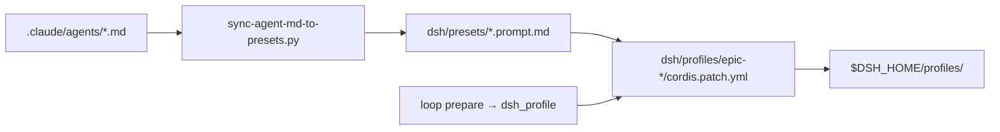

# [T-HUB-007 | dsh-profiles-presets] PLAN

**Дата:** 2026-08-22  
**Режим:** BACK PLAN  
**Уровень:** L3  
**Статус:** active  
**Roadmap:** [roadmap-dsh-loop-backend-epics.md](roadmap-dsh-loop-backend-epics.md)  
**Deps:** T-HUB-006  
**Follow-up:** [T-HUB-016](plan-T-HUB-016-dsh-cc-hooks-bridge.md) монтирует `@deepseek-ai/dsh-hooks-claude-code` в эти profiles; [T-HUB-008](plan-T-HUB-008-dsh-epic-gate-plugin.md) — только gaps bridge.

**Skills:** writing-plans · architecture-patterns · python-testing-patterns

→ [decompose-T-HUB-007-dsh-profiles-presets/index.md](decompose-T-HUB-007-dsh-profiles-presets/index.md) — **DECOMPOSE completed** (s01–s06). PLAN revision 2026-08-27: hooks bridge **не** в этом эпике.

---

## Контекст

- **req:** для каждой loop phase — bootable DSH profile с правильным LLM, tools и **presets** для subagents verify / reviewer / explorer; контент из существующих `.claude/agents/*.md`.
- **deps:** T-HUB-006 (`run_dsh_session` вызывает `--profile epic-{phase}`).
- **refs:** `.claude/agents/{verify,reviewer,explorer}.md`, `.claude/project.env` `PROJECT_LOOP_*_MODEL`, `.claude/hooks/agent_registry.py`, DSH profiles/bundles docs, `loop/WORKFLOW.md` phase model table; **hooks reuse → T-HUB-016**.

### Зафиксированные решения

| Тема | Решение |
|------|---------|
| Profile naming | `epic-{phase}` lowercase: `implement`, `qa`, `decompose`, `plan`, `creative`, `audit`, `bugfix`, `reflect` — mirror `PROJECT_LOOP_*` phases |
| Profile location | **`dev-hub/dsh/profiles/<name>/`** — versioned in hub repo; install via `DSH_HOME` symlink or `dsh plugin` copy script |
| Preset source | Body from `.claude/agents/<id>.md` (strip frontmatter) → DSH preset `systemPrompt` file reference |
| Model routing | Map `PROJECT_LOOP_<PHASE>_MODEL` + `PROJECT_AGENT_<NAME>_MODEL` → `cordis.patch.yml` LLM row per profile/preset |
| Tools per preset | verify/reviewer/explorer: Read, Grep, Bash only (mirror disallowedTools) |
| Parent profile tools | implement: bash, fs, subagent, todo — минимальный spine; refine in DECOMPOSE |
| Default profile | Missing phase-specific profile → **fail-closed** (not silent fallback to epic-implement) after T-HUB-007 |
| Sync | Script `dsh/scripts/sync-agent-md-to-presets.py` — regen preset bodies on agent md change |
| Claude hooks / settings.json | **Out of scope 007** — mount via T-HUB-016 patch fragment; profiles MUST leave a documented include slot / comment `<!-- cc-hooks-bridge -->` in `cordis.patch.yml` for 016 |
| agents.md vs presets | Presets = **real** subagents; `dsh-claude-compat` skill-shim **не** замена (016 optional) |

**CREATIVE need:** нет (mapping tables exhaustive below).

---

## Цель

`dsh --profile epic-implement` (и др.) boot без ручной настройки `$DSH_HOME`; parent agent может вызвать subagent preset verify/reviewer/explorer; phase model env overrides reflected in patch.

---

## Требования

### FR

| ID | Требование |
|----|------------|
| FR-1 | Directory `dsh/profiles/epic-implement/` with `package.json` (`dsh.profile.bundles`) + `cordis.patch.yml` |
| FR-2 | Profiles minimum set: `epic-implement`, `epic-qa`, `epic-decompose` (остальные phases — stub or full per table) |
| FR-3 | Presets: `verify`, `reviewer`, `explorer` registered on subagent provider in each profile that needs gates |
| FR-4 | `dsh/scripts/install-profiles.sh`: copy/link profiles into `$DSH_HOME/profiles/` |
| FR-5 | `loop/context_loop.py` `prepare`: `dsh_profile=f"epic-{loop_phase_lower}"` |
| FR-6 | `dsh/scripts/sync-agent-md-to-presets.py`: frontmatter strip + write `dsh/presets/<id>.prompt.md` |
| FR-7 | Env bridge doc: table PROJECT_LOOP_* → patch id in profile |
| FR-8 | Smoke: `dsh --profile epic-implement --dump-config` exits 0 in CI skip without API key |
| FR-9 | `dsh/patches/phase-models.yml` — shared LLM patch fragments included by profiles |

### NFR

| ID | Требование |
|----|------------|
| NFR-1 | Preset prompt bytes track `.claude/agents/*.md` (sync script test) |
| NFR-2 | No secrets in repo patches — credentials via `$DSH_HOME/.credentials.yaml` |
| NFR-3 | Profiles boot without hub product code — workspace still PROJECT_ROOT at invoke time |
| NFR-4 | DSH developer preview: pin `@deepseek-ai/dsh` version in README |

### AC+

1. `install-profiles.sh` → `$DSH_HOME/profiles/epic-implement` exists  
2. `sync-agent-md-to-presets.py` → `dsh/presets/verify.prompt.md` contains AC+ section from verify.md  
3. `--dump-config` for epic-implement lists subagent preset verify  
4. Unit: phase `IMPLEMENT` → prepare returns `dsh_profile=epic-implement`  
5. Table in `dsh/README.md`: all 8 phases → profile name  
6. Model env `PROJECT_LOOP_IMPLEMENT_MODEL=X` documented → patch field to change  

### AC−

1. Не дублировать spawn-hard policy enforcement (→ T-HUB-016 bridge + T-HUB-008 gaps)  
2. Не менять `.claude/agents/*.md` content (only consume)  
3. Не require DSH for Claude default loop  
4. Не commit API keys  
5. Не монтировать `dsh-hooks-claude-code` в этом эпике (→ T-HUB-016) — только include slot в patch templates  

---

## Profile matrix

| Loop phase | Profile | Presets mounted | Primary model env |
|------------|---------|-----------------|-------------------|
| DECOMPOSE | epic-decompose | explorer (optional) | PROJECT_LOOP_DECOMPOSE_MODEL |
| PLAN | epic-plan | explorer (optional) | PROJECT_LOOP_PLAN_MODEL |
| CREATIVE | epic-creative | — | PROJECT_LOOP_CREATIVE_MODEL |
| IMPLEMENT | epic-implement | verify, explorer | PROJECT_LOOP_IMPLEMENT_MODEL |
| AUDIT | epic-audit | explorer | PROJECT_LOOP_AUDIT_MODEL |
| QA | epic-qa | reviewer | PROJECT_LOOP_QA_MODEL |
| BUGFIX | epic-bugfix | verify, explorer | PROJECT_LOOP_BUGFIX_MODEL |
| REFLECT | epic-reflect | — | PROJECT_LOOP_REFLECT_MODEL |

---

## Компоненты / файлы

| Файл | Действие |
|------|----------|
| `dsh/profiles/epic-implement/package.json` | Create |
| `dsh/profiles/epic-implement/cordis.patch.yml` | Create |
| `dsh/profiles/epic-qa/` | Create |
| `dsh/profiles/epic-decompose/` | Create |
| `dsh/profiles/epic-{plan,creative,audit,bugfix,reflect}/` | Create stub or full |
| `dsh/presets/verify.prompt.md` | Generated |
| `dsh/presets/reviewer.prompt.md` | Generated |
| `dsh/presets/explorer.prompt.md` | Generated |
| `dsh/patches/phase-models.yml` | Shared LLM fragments |
| `dsh/scripts/sync-agent-md-to-presets.py` | Create |
| `dsh/scripts/install-profiles.sh` | Create |
| `loop/context_loop.py` | dsh_profile in prepare |
| `dsh/README.md` | Extend from 006 |
| `loop/tests/test_dsh_profile_mapping.py` | New |

---

## Архитектура presets



### cordis.patch.yml sketch (implement)

```yaml
- id: preset-verify
  name: '@deepseek-ai/dsh-preset'
  config:
    id: verify
    systemPrompt:
      file: ../../../../presets/verify.prompt.md
- id: subagent-local
  config:
    presets:
      verify: preset-verify
      explorer: preset-explorer
```

(Exact row ids validated against `dsh --dump-config` during IMPLEMENT.)

---

## Replacement / sunset

| Устаревает | Замена | Policy |
| :--- | :--- | :--- |
| Stub profile from T-HUB-006 | Real epic-* profiles | replace stub |
| n/a | — | greenfield |

---

## Стратегия тестирования

1. Unit: sync script output hash vs agent md  
2. Unit: phase → profile name mapping  
3. Smoke: install-profiles + dump-config (skip if no node)  
4. Manual: headless one-shot with epic-implement (requires API key — not CI gate)

---

## Риски

| Риск | Митигация |
|------|-----------|
| DSH preset API changes | Pin version; dump-config gate in CI |
| 8 profiles maintenance | Shared base patch + per-phase delta |
| Model env drift vs Claude loop | Same env names documented in WORKFLOW.md |

---

## До DECOMPOSE (черновик фаз)

1. **s01 — sync-agent-md script + preset files (TDD)**  
2. **s02 — epic-implement profile + dump-config smoke**  
3. **s03 — epic-qa + epic-decompose profiles**  
4. **s04 — remaining phase profiles (stub minimum)**  
5. **s05 — install-profiles.sh + README**  
6. **s06 — prepare dsh_profile mapping + tests**

---

## Разбивка после DECOMPOSE

**DECOMPOSE:** [decompose-T-HUB-007-dsh-profiles-presets/index.md](decompose-T-HUB-007-dsh-profiles-presets/index.md)  
**Index (machine):** [decompose-T-HUB-007-dsh-profiles-presets/index.yaml](decompose-T-HUB-007-dsh-profiles-presets/index.yaml)

### Очередь шагов (канон: index.yaml)

| step_id | title | next_phase | status |
| :--- | :--- | :--- | :--- |
| **s01** | sync-agent-md-to-presets.py + preset files (TDD) — frontmatter strip | BACK IMPLEMENT | pending |
| **s02** | epic-implement profile + dump-config smoke — package.json + cordis.patch.yml | BACK IMPLEMENT | pending |
| **s03** | epic-qa + epic-decompose profiles — reviewer + explorer presets | BACK IMPLEMENT | pending |
| **s04** | remaining phase profiles (stub minimum) — plan/creative/audit/bugfix/reflect | BACK IMPLEMENT | pending |
| **s05** | install-profiles.sh + README — copy/link + 8-phase table | BACK IMPLEMENT | pending |
| **s06** | prepare dsh_profile mapping + tests — context_loop.py + test_dsh_profile_mapping.py | BACK IMPLEMENT | pending |

**Coverage gates (index.md):**
- Requirements coverage — все AC+/AC−/FR/NFR → sNN или out_of_scope
- Stages coverage — все этапы плана → sNN
- Outcome map — каждый outcome → sNN
- Replacement cleanup — stub → real (s02), README extend (s05); greenfield остальное

---

## Следующий режим

→ **BACK IMPLEMENT T-HUB-007** (после DECOMPOSE QA)
