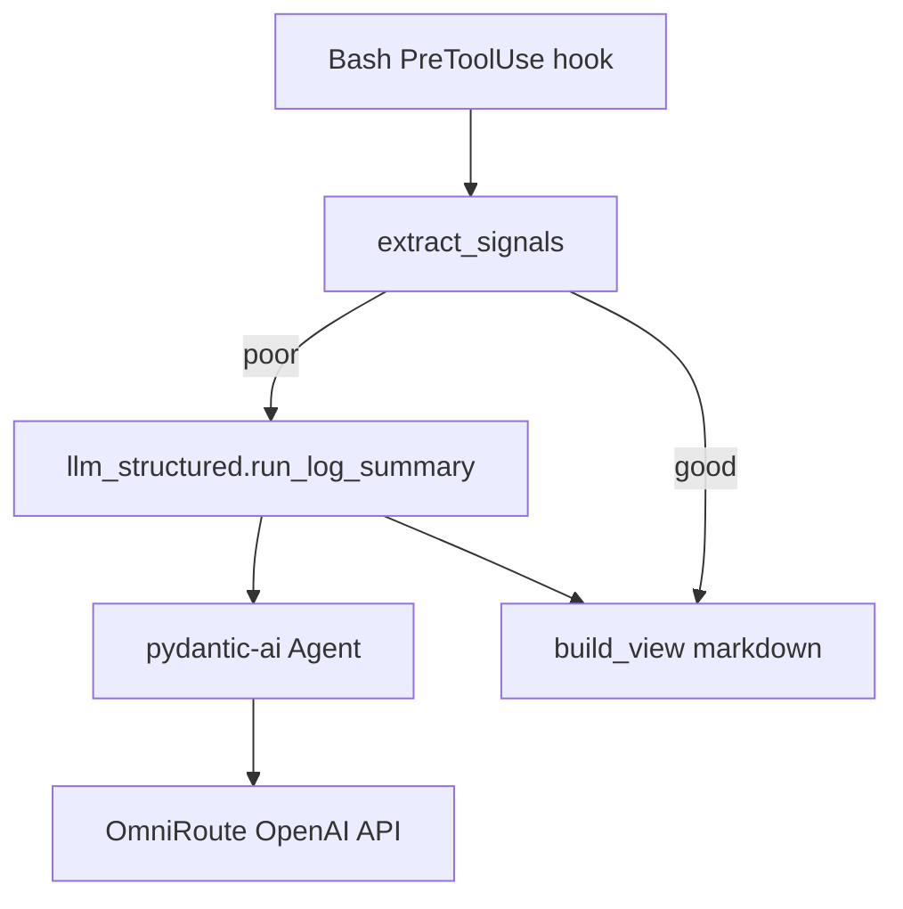

# [T-HUB-021 | pydantic-ai-output-cap] PLAN

**Дата:** 2026-08-30  
**Режим:** BACK PLAN  
**Уровень:** L3  
**Статус:** active  
**Roadmap:** [roadmap-pydantic-reliability-epics.md](roadmap-pydantic-reliability-epics.md)  
**Queue:** [roadmap-pydantic-reliability-epics.queue.yaml](roadmap-pydantic-reliability-epics.queue.yaml)  
**Deps:** нет hard. Soft: существующий `PROJECT_OUTPUT_SUMMARY_*` в `.claude/project.env`.

**Skills:** writing-plans · architecture-patterns · python-testing-patterns · async-python-patterns

→ [decompose-T-HUB-021-pydantic-ai-output-cap/index.md](decompose-T-HUB-021-pydantic-ai-output-cap/index.md) — **после DECOMPOSE**

---

## Контекст

- **req:** заменить сырой HTTP `/chat/completions` в `bash-output-cap.py` на **pydantic-ai** с типизированным выходом `LogSummary`, сохранив текущий extract-first pipeline и fail-soft при отключённом LLM.
- **gap (as-built):** единственный Python LLM-call — `llm_summarize()` через `urllib.request` + free-text; нет structured validation, retry только на transport/empty content.
- **refs:** `.claude/hooks/bash-output-cap.py`; `.claude/hooks/_lib.py` (`load_output_summary_env`); `.claude/project.env` § Bash output summary; `epic_yaml.py` (уже Pydantic v2 в hub).

### Зафиксированные решения (brainstorming batch)

| Тема | Решение |
|------|---------|
| Provider | **OpenAI-compatible** через pydantic-ai `OpenAIProvider` / model settings → существующий `PROJECT_OUTPUT_SUMMARY_URL` (OmniRoute) |
| Shared module | **`.claude/hooks/llm_structured.py`** — Agent factory, models, sync wrapper для hooks (hooks не async) |
| Output model | **`LogSummary`** — `exit_code`, `failed_tests[]`, `errors[]` (file:line + msg), `root_cause`, `summary_bullets[]` (max 25) |
| Render | `build_view` по-прежнему отдаёт **markdown для агента**; structured поля сериализуются в буллеты + optional JSON footer для debug |
| Feature flag | `PROJECT_OUTPUT_SUMMARY_STRUCTURED=1` (default on когда `PROJECT_OUTPUT_SUMMARY=1`) |
| Fallback | Structured fail → retry (pydantic-ai) → fallback model → **legacy free-text path** (удалить только после green suite) |
| Deps pin | Новый **`requirements-hub.txt`** в корне dev-hub + install note в `memory-bank/techContext.md` |
| Sync API | `asyncio.run(agent.run())` в hook; timeout из `PROJECT_OUTPUT_SUMMARY_TIMEOUT` |
| CREATIVE | нет |

**CREATIVE need:** нет.

---

## Цель

Единственный Python LLM-call в hub возвращает **валидированный structured summary** логов bash-команд; при misconfig/отключении — прежнее поведение (extract → optional legacy LLM → truncate).

---

## Продуктовая спека (WHAT)

### User Stories

| # | Story | Priority | Independent Test |
| :--- | :--- | :--- | :--- |
| US-001 | Как coding-агент, я хочу видеть структурированный summary failed tests/errors после длинного pytest, чтобы быстрее локализовать сбой. | P0 | Fixture pytest log → `LogSummary.failed_tests` non-empty, rendered view contains file:line |
| US-002 | Как оператор loop, я хочу чтобы LLM summary не ломал hook при недоступном OmniRoute. | P0 | No key / HTTP 500 → `build_view` returns extract or truncate, hook exit 0 |
| US-003 | Как разработчик hub, я хочу единый LLM client для будущих fallbacks (023). | P1 | `llm_structured.run_structured()` importable from tests without bash-output-cap |

#### Acceptance Scenarios — US-001

- **Given:** `extract_signals` returns `good=False`, LLM enabled, valid key
- **When:** `build_view(cmd, pytest_log, dump_path)`
- **Then:** mode `structured` or `llm`; view contains `failed_tests` facts; max 25 bullets

#### Acceptance Scenarios — US-002

- **Given:** `PROJECT_OUTPUT_SUMMARY=0`
- **When:** long spammy docker log
- **Then:** no HTTP call; extract or truncate only

### Functional Requirements (FR-###)

- **FR-001:** Add `pydantic-ai` (+ pinned transitive) to `requirements-hub.txt`; document `.venv/bin/pip install -r requirements-hub.txt`.
- **FR-002:** `llm_structured.py`: `LogSummary` BaseModel; `make_output_cap_agent()` reading env from `_lib.load_output_summary_env`.
- **FR-003:** Provider: base_url + api_key from existing env; primary + fallback model list mirrors current `bash-output-cap` logic.
- **FR-004:** `run_log_summary(cmd, sample, dump_path) -> LogSummary | None` with timeout, retries, structured validation errors retried.
- **FR-005:** `bash-output-cap.py`: call structured path when `PROJECT_OUTPUT_SUMMARY_STRUCTURED=1`; render human view from model.
- **FR-006:** Preserve `extract_signals` first — LLM only when extract insufficient (unchanged order).
- **FR-007:** Unit tests: mock provider / stub agent; no live network in CI.
- **FR-008:** Integration test optional behind env `LLM_INTEGRATION_TEST=1` (skip default).
- **FR-009:** `project.env` comments for new flag; README snippet in `loop/README.md` or hooks doc.
- **FR-010:** Regression: existing `loop/tests` touching output-cap behavior green.

### Success Criteria (SC-###)

| ID | Измеримый результат | Проверка | Type |
| :--- | :--- | :--- | :--- |
| SC-001 | `LogSummary` validates fixture JSON 100% in unit tests | pytest | outcome |
| SC-002 | No network calls when summary disabled | pytest mock | outcome |
| SC-003 | Legacy urllib path removed or behind explicit `STRUCTURED=0` only until purge step | code review | outcome |
| SC-004 | Hub suite green | `pytest loop/tests/ -q` | outcome |

### Assumptions

- pydantic-ai supports OpenAI-compatible chat with `base_url` override (verify pin at IMPLEMENT via `pip show`).
- OmniRoute returns JSON tool/structured output compatible with pydantic-ai result type.
- Hub `.venv` Python ≥ 3.11 (spec-kit already 3.11+; verify hub venv).

### Clarifications

- Session: 2026-08-30 user request «полное внедрение pydantic-ai».
- Scope limited to output-cap in this epic; 022/023 separate plans.

### [НУЖНО УТОЧНИТЬ]

- n/a CRITICAL. Soft: exact `pydantic-ai` version pin at IMPLEMENT (`pip index` / lock).

---

## AC

### AC+

1. `requirements-hub.txt` contains `pydantic-ai` + compatible `pydantic>=2`
2. `llm_structured.py` exported API documented in module docstring
3. `bash-output-cap` uses structured path by default when summary enabled
4. `LogSummary` fields populated from pytest/docker/nginx-style fixture logs in tests
5. Fallback model chain preserved (primary → `PROJECT_OUTPUT_SUMMARY_FALLBACK_MODEL`)
6. Hook never raises to parent on LLM failure (exit 0, stderr debug optional)
7. `PROJECT_OUTPUT_SUMMARY_STRUCTURED=0` forces legacy free-text path until sunset step

### AC−

1. Не добавлять LLM в epic loop / stop-gate / verify path
2. Не требовать network для default pytest suite
3. Не менять `extract_signals` heuristics без regression tests
4. Не блокировать hook startup if pydantic-ai import fails — fail-closed disable structured + log once
5. Не дублировать env loading outside `_lib.load_output_summary_env`

---

## Техника / архитектура (HOW)

### Стек

- Python 3.11+ (hub `.venv`)
- `pydantic` 2.x (already installed)
- `pydantic-ai` (new)
- OpenAI-compatible HTTP (OmniRoute localhost:20128)
- Existing: `urllib` legacy path (sunset in last decompose step)

### Layout

| Path | Action |
|------|--------|
| `requirements-hub.txt` | Create — pin pydantic-ai, pydantic, httpx if needed |
| `.claude/hooks/llm_structured.py` | Create — models, agent factory, sync runner |
| `.claude/hooks/bash-output-cap.py` | Modify — integrate structured summarize |
| `.claude/project.env` | Modify — `PROJECT_OUTPUT_SUMMARY_STRUCTURED` comment |
| `loop/tests/test_llm_structured.py` | Create — unit tests |
| `loop/tests/test_bash_output_cap.py` | Create or extend — build_view modes |
| `memory-bank/techContext.md` | Modify — hub deps install line |

### Архитектура



### LogSummary schema (канон)

```python
class LogError(BaseModel):
    location: str = ""   # file:line or empty
    message: str

class LogSummary(BaseModel):
    exit_code: int | None = None
    failed_tests: list[str] = Field(default_factory=list, max_length=20)
    errors: list[LogError] = Field(default_factory=list, max_length=30)
    root_cause: str = ""
    summary_bullets: list[str] = Field(default_factory=list, max_length=25)
```

### Env contract (extends existing)

| Variable | Default | Meaning |
|----------|---------|---------|
| `PROJECT_OUTPUT_SUMMARY` | `1` | Master switch (unchanged) |
| `PROJECT_OUTPUT_SUMMARY_STRUCTURED` | `1` | Use pydantic-ai structured output |
| `PROJECT_OUTPUT_SUMMARY_URL` | `http://localhost:20128/v1` | OpenAI base (unchanged) |
| `PROJECT_OUTPUT_SUMMARY_MODEL` | from env | Primary model |
| `PROJECT_OUTPUT_SUMMARY_FALLBACK_MODEL` | haiku default | Fallback |
| `PROJECT_OUTPUT_SUMMARY_TIMEOUT` | `120` | Per-request timeout sec |
| `PROJECT_OUTPUT_SUMMARY_RETRIES` | `2` | Per model retries |

### TDD plan

1. Red: `test_log_summary_parses_pytest_failures` with mocked agent returning invalid then valid
2. Red: `test_build_view_structured_mode_label`
3. Red: `test_summary_disabled_no_agent_call`
4. Green: implement `llm_structured.py`
5. Green: wire `bash-output-cap.py`
6. Refactor: remove duplicate `_http_chat` when legacy sunset step passes

---

## Replacement / sunset (brownfield)

### A. Code / modules

| Устаревает | Замена | Policy |
| :--- | :--- | :--- |
| `bash-output-cap._http_chat` + free-text `llm_summarize` | `llm_structured.run_log_summary` | delete in-epic (final sNN after green tests) |
| n/a | — | — |

### B. Entrypoints / deploy

| Устаревает | Замена | Policy |
| :--- | :--- | :--- |
| n/a | — | greenfield |

### C. Fallbacks / soft-fail

| Устаревает | Замена | Policy |
| :--- | :--- | :--- |
| Silent empty LLM content → truncate only | Explicit mode label `structured\|llm\|extract\|truncate` in view header | delete in-epic |
| n/a | — | — |

---

## До DECOMPOSE (черновик нарезки)

| Phase | Шаги (outline) |
|-------|----------------|
| s01 | Pin research: pydantic-ai + OmniRoute compatibility matrix |
| s02 | `requirements-hub.txt` + techContext |
| s03 | `LogSummary` models + `llm_structured.py` factory |
| s04 | Sync runner + retry/fallback parity with current |
| s05 | `bash-output-cap` integration + render |
| s06 | Unit tests (mocked) |
| s07 | Legacy path sunset + `PROJECT_OUTPUT_SUMMARY_STRUCTURED=0` removal |
| s08 | Docs: project.env + loop/README snippet |
| s09 | AUDIT: §0.11 grep env keys ↔ code |
| s10 | legacy-fallback-purge checklist |

---

## Следующий режим

→ `BACK DECOMPOSE T-HUB-021` (после `BACK ROADMAP MERGE`)
