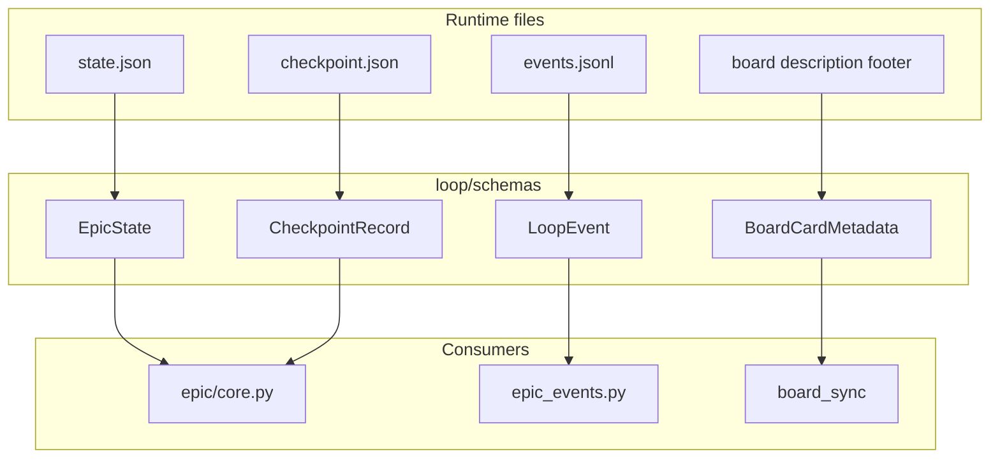

# [T-HUB-022 | runtime-pydantic-schemas] PLAN

**Дата:** 2026-08-30  
**Режим:** BACK PLAN  
**Уровень:** L3–L4  
**Статус:** active  
**Roadmap:** [roadmap-pydantic-reliability-epics.md](roadmap-pydantic-reliability-epics.md)  
**Queue:** [roadmap-pydantic-reliability-epics.queue.yaml](roadmap-pydantic-reliability-epics.queue.yaml)  
**Deps:** нет hard. Soft: T-HUB-017 incidents may consume `state_schema_invalid` diagnostic (if merged).

**Skills:** writing-plans · architecture-patterns · python-testing-patterns · python-design-patterns

→ [decompose-T-HUB-022-runtime-pydantic-schemas/index.md](decompose-T-HUB-022-runtime-pydantic-schemas/index.md) — **после DECOMPOSE**

---

## Контекст

- **req:** типизировать runtime persistence hub (не product DB): `state.json`, checkpoint JSON, `events.jsonl` lines, board card metadata — единый Pydantic слой validate-on-read / validate-before-write.
- **gap:** `load_epic_state` — `json.loads` + `setdefault`; events — manual field checks; `card_model` — dataclass + yaml without strict validation; corrupt files silently degrade.
- **refs:** `.claude/hooks/epic/core.py` (`default_state`, `load_epic_state`, `save_epic_state`, checkpoint_*); `.claude/hooks/epic_events.py`; `loop/board_sync/card_model.py`; `epic_yaml.py` (pattern reference).

### Зафиксированные решения

| Тема | Решение |
|------|---------|
| Package layout | **`loop/schemas/`** — runtime schemas; re-export thin wrappers from hooks |
| State schema | **`loop-state/v2`** → `EpicState` model mirrors `_runtime_snapshot` + projection fields |
| Checkpoint | **`loop-checkpoint/v1`** → `CheckpointRecord` aligned with `validate_checkpoint` |
| Events | **`loop-event/v1`** per line in `events.jsonl` (extend existing `build_event` contract) |
| Board | **`mb-board-card/v1`** → Pydantic models replace/extend `StepCard`/`GateCard` dataclasses |
| Migration | **Fail-soft read:** invalid → diagnostics `state_schema_invalid` + `default_state()` (preserve today); **strict write:** `save_*` validates before atomic write |
| Backward compat | `model_validator(mode='before')` coerces legacy keys; unknown keys stripped on write |
| Single source | Schemas imported by hooks AND loop tests — no duplicate definitions |
| CREATIVE | нет |

**CREATIVE need:** нет.

---

## Цель

Любая запись в hub runtime JSON/YAML проходит Pydantic validation; чтение возвращает typed models или явный diagnostic — без тихой порчи `state.json` / events / board metadata.

---

## Продуктовая спека (WHAT)

### User Stories

| # | Story | Priority | Independent Test |
| :--- | :--- | :--- | :--- |
| US-001 | Как loop runner, я хочу fail-closed diagnostic при corrupt `state.json`, чтобы `loop status` показывал `state_schema_invalid`. | P0 | Fixture corrupt JSON → load → diagnostic + safe defaults |
| US-002 | Как hook author, я хочу единую `CheckpointRecord` модель, чтобы checkpoint resume не расходился с validator. | P0 | Invalid cp field → `validate_checkpoint` raises/returns code |
| US-003 | Как board_sync, я хочу валидировать footer metadata YAML перед HTTP upsert. | P1 | Invalid `mb-board-card` → sync error with field path |
| US-004 | Как auditor, я хочу schema_version на каждом persisted artifact. | P1 | Saved state always has `state_schema_version: loop-state/v2` |

#### Acceptance Scenarios — US-001

- **Given:** `state.json` with wrong type for `active` (string)
- **When:** `load_epic_state(cwd)`
- **Then:** returns usable state; `_state_diagnostics` contains `state_schema_invalid`; no exception to caller

#### Acceptance Scenarios — US-002

- **Given:** checkpoint missing required `plan_id`
- **When:** `validate_checkpoint(path)`
- **Then:** non-zero / structured error code (existing contract preserved)

### Functional Requirements (FR-###)

- **FR-001:** `loop/schemas/state.py` — `EpicState`, `EpicRuntime`, `EpicProjection` nested models.
- **FR-002:** `loop/schemas/checkpoint.py` — `CheckpointRecord`, `CheckpointShardRef`.
- **FR-003:** `loop/schemas/events.py` — `LoopEvent` line model; align with `epic_events.build_event` fields.
- **FR-004:** `loop/schemas/board_card.py` — `BoardCardMetadata`, `StepCardMeta`, `GateCardMeta`.
- **FR-005:** `epic/core.py`: `load_epic_state` uses `EpicState.model_validate` with fallback; `save_epic_state` uses `model_dump`.
- **FR-006:** `epic_events.py`: validate on append; reject line missing `event_id`/`digest` per existing regex rules.
- **FR-007:** `board_sync/card_model.py`: migrate to Pydantic or delegate to `loop/schemas/board_card.py`.
- **FR-008:** Fixture corpus: valid/invalid golden files under `loop/tests/fixtures/schemas/`.
- **FR-009:** No behavior change on **valid** existing fixtures from `loop/tests/test_context_loop.py`.
- **FR-010:** Document schema versions in `loop/schemas/README.md` (short).

### Success Criteria (SC-###)

| ID | Измеримый результат | Проверка | Type |
| :--- | :--- | :--- | :--- |
| SC-001 | 100% existing state fixtures still load | pytest regression | outcome |
| SC-002 | Invalid fixture → diagnostic code | pytest | outcome |
| SC-003 | Round-trip save/load identity on golden state | pytest | outcome |
| SC-004 | board_sync tests green | pytest subset | outcome |

### Assumptions

- `state_schema_version: loop-state/v2` already written by `save_epic_state` — model enforces, does not rename.
- Extra unknown keys in old state files are dropped on next save (acceptable migration).
- `epic_yaml` schemas stay separate (different domain).

### Clarifications

- Session: 2026-08-30 — Tier 3 from pydantic reliability analysis.
- Independent from pydantic-ai (021).

### [НУЖНО УТОЧНИТЬ]

- n/a CRITICAL. Soft: full event schema vs partial (implement minimal required fields first).

---

## AC

### AC+

1. `loop/schemas/` package with 4 modules + `__init__.py` exports
2. `load_epic_state` / `save_epic_state` use Pydantic without breaking loop tests
3. Checkpoint validation uses shared model
4. Events append validates required fields
5. Board metadata parse raises clear error on invalid YAML footer
6. Golden fixtures + invalid fixtures in tests
7. `loop/schemas/README.md` lists schema ids

### AC−

1. Не менять `epic-implement/v1` shard models in `epic_yaml.py`
2. Не strict-fail read on production hot path without diagnostic (no new HALT solely from schema)
3. Не мигрировать product `memory-bank` YAML shards
4. Не добавлять pydantic-ai / LLM
5. Не breaking change `BoardTask` HTTP contract field names

---

## Техника / архитектура (HOW)

### Стек

- Pydantic v2 (existing hub `.venv`)
- Python 3.11+
- No new runtime dependencies beyond pydantic (already present)

### Layout

| Path | Action |
|------|--------|
| `loop/schemas/__init__.py` | Create |
| `loop/schemas/state.py` | Create |
| `loop/schemas/checkpoint.py` | Create |
| `loop/schemas/events.py` | Create |
| `loop/schemas/board_card.py` | Create |
| `loop/schemas/README.md` | Create |
| `.claude/hooks/epic/core.py` | Modify — load/save/checkpoint |
| `.claude/hooks/epic_events.py` | Modify — validate events |
| `loop/board_sync/card_model.py` | Modify — delegate validation |
| `loop/tests/fixtures/schemas/**` | Create |
| `loop/tests/test_runtime_schemas.py` | Create |
| `loop/tests/test_runtime_schemas_integration.py` | Create — hooks integration |

### Архитектура

### EpicState (outline — IMPLEMENT fills all fields)

- Top-level: `state_schema_version`, `active`, `status`, `halt_reason`, `model`, timestamps
- `runtime`: snapshot keys from `_runtime_snapshot`
- `projection`: epic cursor fields (read-only mirror)
- `dag`: pipeline_id, cursor
- Validators: coerce `active` bool; enum `status`; optional gates fields

### Migration strategy

1. **Read path:** `try: EpicState.model_validate(data)` except → log diagnostic + merge with `default_state()`
2. **Write path:** always `EpicState.model_validate(state).model_dump(mode='json')` before `atomic_write_text`
3. **Events:** validate new lines only; replay reader tolerant (skip invalid with counter)
4. **Board:** `parse_metadata` returns Pydantic model `.to_dataclass()` if TS bridge needs dataclass temporarily

### TDD plan

1. Golden `state.json` fixtures from real tests → round-trip
2. Invalid types → diagnostic codes unchanged
3. Checkpoint missing field → same error as today
4. Event line missing `event_id` → reject append
5. Full `loop/tests` regression

---

## Replacement / sunset (brownfield)

### A. Code / modules

| Устаревает | Замена | Policy |
| :--- | :--- | :--- |
| Ad-hoc `json.loads` validation blocks in `epic_events` | `LoopEvent` model | delete in-epic |
| Inline dict shape checks in checkpoint | `CheckpointRecord` | delete in-epic |
| `card_model` manual yaml dict assembly | `BoardCardMetadata` | shim+follow-up only if TS types block — prefer in-epic |

### B. Entrypoints

| Устаревает | Замена | Policy |
| :--- | :--- | :--- |
| n/a | — | greenfield |

### C. Fallbacks

| Устаревает | Замена | Policy |
| :--- | :--- | :--- |
| Silent `return st` on any parse error without diagnostic | Always surface `state_schema_invalid` when validation fails | delete in-epic |

---

## До DECOMPOSE (черновик нарезки)

| Phase | Outline |
|-------|---------|
| s01 | Inventory all state/checkpoint/event fields from code + tests |
| s02 | `EpicState` model + golden fixtures |
| s03 | Wire `load_epic_state` / `save_epic_state` |
| s04 | `CheckpointRecord` + `validate_checkpoint` |
| s05 | `LoopEvent` + `epic_events` append |
| s06 | `BoardCardMetadata` + `card_model` |
| s07 | Integration tests + full loop suite |
| s08 | README + §0.11 integration grep |
| s09 | AUDIT schema coverage vs as-built |
| s10 | legacy dict-validation purge |

---

## Следующий режим

→ `BACK DECOMPOSE T-HUB-022` (parallel OK with 021 after s02)
