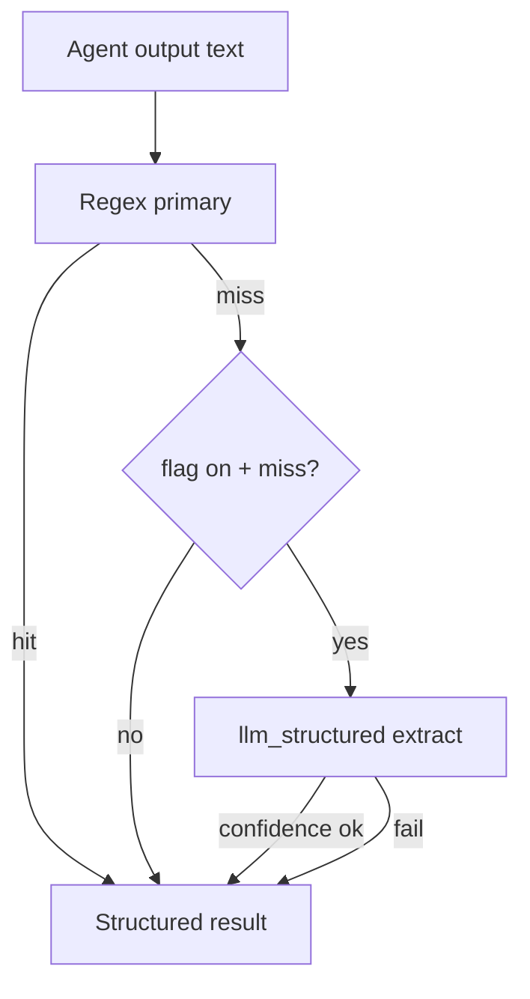

# [T-HUB-023 | hooks-llm-fallbacks] PLAN

**Дата:** 2026-08-30  
**Режим:** BACK PLAN  
**Уровень:** L3  
**Статус:** active  
**Roadmap:** [roadmap-pydantic-reliability-epics.md](roadmap-pydantic-reliability-epics.md)  
**Queue:** [roadmap-pydantic-reliability-epics.queue.yaml](roadmap-pydantic-reliability-epics.queue.yaml)  
**Deps:** **hard** T-HUB-021 (`llm_structured` client). Soft: T-HUB-022 (typed state for `llm_fallback_used` counter); T-HUB-017 (incident events).

**Skills:** writing-plans · architecture-patterns · python-testing-patterns · diagnosing-bugs

→ [decompose-T-HUB-023-hooks-llm-fallbacks/index.md](decompose-T-HUB-023-hooks-llm-fallbacks/index.md) — **после DECOMPOSE**

---

## Контекст

- **req:** opt-in LLM fallbacks в hooks когда **детерминированный** парсинг не дал результата — без изменения happy path и без обязательной сети.
- **gap:** `extract_handoff_block`, `extract_verdict`, `classify_abort` — pure regex/heuristics; при malformed agent output loop уходит в stall/retry/NEED_HUMAN.
- **refs:** `.claude/hooks/epic/core.py`; `.claude/hooks/_lib.py` (`extract_verdict`); `.claude/hooks/session_resilience.py` (`classify_abort`); T-HUB-021 `llm_structured.py`.

### Зафиксированные решения

| Тема | Решение |
|------|---------|
| Master switch | **`PROJECT_HOOKS_LLM_FALLBACK=0`** default off |
| Per-domain flags | `PROJECT_HOOKS_LLM_HANDOFF=0`, `PROJECT_HOOKS_LLM_VERDICT=0`, `PROJECT_HOOKS_LLM_ABORT=0` |
| Trigger | Only when primary extractor returns `None` / empty AND input length ≥ threshold |
| Models | Reuse output-cap env URL/key; separate model env `PROJECT_HOOKS_LLM_MODEL` default `haiku` class |
| Handoff model | `HandoffExtract` — `handoff_md`, `load_now_paths[]`, `phase`, `confidence` |
| Verdict model | `VerdictExtract` — `verdict: PASS\|FAIL\|BLOCKED`, `confidence` |
| Abort model | `AbortClassify` — `kind: transient\|fatal`, `reason_short` |
| Happy path | **Zero LLM calls** when regex succeeds — unit tests must assert call count 0 |
| Timeout | Shorter than output-cap: default **30s**, `PROJECT_HOOKS_LLM_TIMEOUT` |
| Metrics | Increment `state['llm_fallback_count']` on use (requires 022 or inline int with validation) |
| CREATIVE | нет |

**CREATIVE need:** нет.

---

## Цель

Снизить частоту `fingerprint_stall`, `verify_no_verdict`, ложных transient/fatal abort — через **редкий** structured LLM fallback, не заменяя regex и не включая по умолчанию.

---

## Продуктовая спека (WHAT)

### User Stories

| # | Story | Priority | Independent Test |
| :--- | :--- | :--- | :--- |
| US-001 | Как loop operator, я хочу opt-in восстановление Handoff из кривого markdown, чтобы реже видеть fingerprint stall. | P1 | Malformed fixture + flag on → `extract_handoff_block` non-empty |
| US-002 | Как verify gate, я хочу fallback извлечь VERDICT из transcript tail когда regex failed. | P1 | Transcript with buried VERDICT + flag on → `extract_verdict` returns PASS |
| US-003 | Как loop, я хочу default-off чтобы CI и air-gapped не ходили в сеть. | P0 | Flags off → 0 LLM invocations in full hook test suite |
| US-004 | Как auditor, я хочу счётчик fallback в state/status для observability. | P2 | After fallback → `llm_fallback_count` incremented |

#### Acceptance Scenarios — US-003

- **Given:** all `PROJECT_HOOKS_LLM_*=0` (default)
- **When:** run `loop/tests/test_agent_hooks.py` subset
- **Then:** mock agent `run` call count == 0

#### Acceptance Scenarios — US-001

- **Given:** `PROJECT_HOOKS_LLM_FALLBACK=1`, `PROJECT_HOOKS_LLM_HANDOFF=1`, activeContext without `## Handoff` but prose contains phase info
- **When:** `repair_fingerprint_stall` or `validate_active_context_shape`
- **Then:** optional recovery path may run; if LLM disabled mid-flight → same as today

### Functional Requirements (FR-###)

- **FR-001:** `llm_structured.py` extend with `run_handoff_extract`, `run_verdict_extract`, `run_abort_classify` (thin prompts).
- **FR-002:** `epic/core.py`: `extract_handoff_block_llm_fallback(text) -> str | None` called only from existing extract after regex miss.
- **FR-003:** `_lib.py`: `extract_verdict` tries regex first; optional LLM tail only if flag + regex None + agent_type verify/reviewer.
- **FR-004:** `session_resilience.py`: `classify_abort` optional LLM when regex inconclusive and flag on.
- **FR-005:** Env loading via `_lib` helper `load_hooks_llm_env()` — single place.
- **FR-006:** All fallbacks try/except — never crash hook; stderr debug with `PROJECT_HOOKS_LLM_DEBUG=1`.
- **FR-007:** Confidence threshold: apply LLM result only if `confidence >= 0.7` (configurable).
- **FR-008:** Tests: mock pydantic-ai Agent; fixtures from real stall transcripts (anonymized).
- **FR-009:** Document flags in `.claude/project.env` + `loop/README.md` § reliability.
- **FR-010:** AUDIT: no fallback on path where regex already succeeded (grep + test).

### Success Criteria (SC-###)

| ID | Измеримый результат | Проверка | Type |
| :--- | :--- | :--- | :--- |
| SC-001 | Default off → 0 LLM calls in tests | pytest mock | outcome |
| SC-002 | Handoff fallback recovers ≥1 golden malformed fixture | pytest | outcome |
| SC-003 | Verdict fallback recovers buried VERDICT fixture | pytest | outcome |
| SC-004 | No regression when flags off vs baseline suite | pytest diff | outcome |

### Assumptions

- T-HUB-021 merged — `llm_structured` stable API.
- Fallback volume low enough that cost acceptable when enabled.
- Operators enable explicitly on noisy models only.

### Clarifications

- Session: 2026-08-30 Tier 2 from analysis.
- Not a replacement for better agent prompts / spawn-hard.

### [НУЖНО УТОЧНИТЬ]

- n/a CRITICAL. Soft: whether `repair_fingerprint_stall` should call Handoff LLM inline or only `validate_active_context_shape`.

---

## AC

### AC+

1. All flags default `0` in `project.env` template
2. Regex happy path unchanged (byte-stable outputs on golden inputs)
3. Three structured models + runners in `llm_structured.py`
4. Confidence gate enforced
5. `llm_fallback_count` incremented on successful fallback apply
6. Mocked unit tests for each domain
7. README documents when to enable (flash models, long transcripts)

### AC−

1. Не default-on любой fallback
2. Не LLM на каждый `check_after` / `stop-gate`
3. Не заменять `spawn-hard` VERDICT protocol text
4. Не блокировать session if LLM unavailable
5. Не вызывать fallback when input shorter than `PROJECT_HOOKS_LLM_MIN_CHARS` (default 200)
6. Не дублировать OmniRoute config outside 021 client

---

## Техника / архитектура (HOW)

### Стек

- pydantic-ai via T-HUB-021 `llm_structured`
- Pydantic result models
- Existing regex extractors (primary)

### Layout

| Path | Action |
|------|--------|
| `.claude/hooks/llm_structured.py` | Modify — add 3 extract runners + models |
| `.claude/hooks/epic/core.py` | Modify — handoff fallback hook-in |
| `.claude/hooks/_lib.py` | Modify — verdict fallback + env loader |
| `.claude/hooks/session_resilience.py` | Modify — abort classify fallback |
| `.claude/project.env` | Modify — flag block |
| `loop/tests/test_hooks_llm_fallback.py` | Create |
| `loop/tests/fixtures/llm_fallback/**` | Create — transcripts |

### Архитектура

### Prompt constraints (канон)

- Handoff: «Верни только JSON по схеме; извлеки ## Handoff и load_now paths; не выдумывай файлы»
- Verdict: «Найди финальный VERDICT PASS/FAIL/BLOCKED; если нет — verdict=null»
- Abort: «Классифицируй transient vs fatal для loop retry; cite log line»

### TDD plan

1. `test_extract_verdict_regex_only_no_llm` — mock call count 0
2. `test_handoff_fallback_recovers_malformed` — flag on
3. `test_verdict_fallback_buried_pass` — flag on
4. `test_abort_fallback_unknown_reason` — flag on
5. Full agent_hooks regression flags off

---

## Replacement / sunset (brownfield)

### A. Code

| Устаревает | Замена | Policy |
| :--- | :--- | :--- |
| n/a | — | greenfield additive |

### B. Entrypoints

| Устаревает | Замена | Policy |
| :--- | :--- | :--- |
| n/a | — | greenfield |

### C. Fallbacks

| Устаревает | Замена | Policy |
| :--- | :--- | :--- |
| Immediate NEED_HUMAN on single regex miss (operational pain) | Optional LLM recovery before NEED_HUMAN | keep both paths; LLM opt-in |

---

## До DECOMPOSE (черновик нарезки)

| Phase | Outline |
|-------|---------|
| s01 | Env contract + `load_hooks_llm_env` |
| s02 | Pydantic models Handoff/Verdict/Abort |
| s03 | Runners in `llm_structured` |
| s04 | Handoff wire-in `epic/core` |
| s05 | Verdict wire-in `_lib` |
| s06 | Abort wire-in `session_resilience` |
| s07 | `llm_fallback_count` + status exposure |
| s08 | Fixtures + mocked tests |
| s09 | Docs + project.env |
| s10 | AUDIT happy-path zero-call proof |

---

## Следующий режим

→ `BACK DECOMPOSE T-HUB-023` (after T-HUB-021 EPIC_DONE or queue position)
