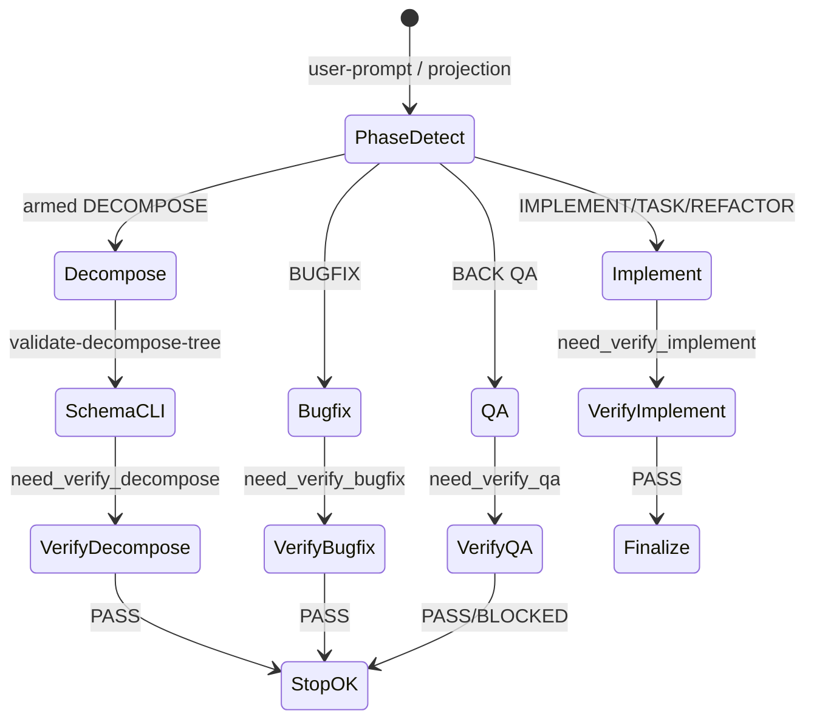

# [T-HUB-028 | phase-verify-agents] PLAN

**Дата:** 2026-08-30  
**Режим:** BACK PLAN  
**Уровень:** L3–L4  
**Статус:** superseded → [T-HUB-029](plan-T-HUB-029-epic-phase-transition-engine.md) (merge verify registry + transition engine; CLARIFY 2026-08-31)  
**Deps:** **hard** T-HUB-008 (DSH epic-gate preset mapping), T-HUB-007 (profiles/presets). **Soft:** T-HUB-016 (hooks bridge), T-HUB-023 (verdict extract / LLM fallback per agent_type), T-HUB-022 (gate sidecar / typed verdict mirror).

**Skills:** writing-plans · architecture-patterns · python-testing-patterns · diagnosing-bugs

→ [decompose-T-HUB-028-phase-verify-agents/index.md](decompose-T-HUB-028-phase-verify-agents/index.md) — **после DECOMPOSE**

---

## Контекст

- **req:** Разделить monolithic gate subagents на **phase-specific verify agents** — у каждой критичной фазы workflow свой `subagent_type`, свой prompt-контракт и своя pin-модель (`PROJECT_AGENT_<NAME>_MODEL`), при общих DRY-фрагментах для AC+/AC−/§0.11.
- **gap:** Сейчас один `verify` обслуживает IMPLEMENT/BUGFIX/TASK/REFACTOR; DECOMPOSE — только CLI (`validate-decompose-tree`, advisory `verify-decompose-creative`); QA — отдельный `reviewer` без единой семантики «verify»; `analyze-verify` описан в spawn-hard и `.claude/agents/analyze-verify.md`, но **не wired** в hooks/stop-gate.
- **refs:** `.claude/agents/{verify,reviewer,explorer,analyze-verify}.md`; `.claude/instructions/spawn-hard.md`; `.claude/hooks/{_lib,stop-gate,agent-pretool,subagent-start,subagent-stop,spawn_validate,user-prompt}.py`; `loop/context_loop.py` finish blocks; `dsh/plugins/epic-gate/`; `memory-bank/architecture/services.md` (S-AGENTS).

### Зафиксированные решения

| Тема | Решение |
|------|---------|
| Naming | **`verify-<phase>`** kebab-case в registry `name:`; legacy alias на переходный период |
| IMPLEMENT family | `verify-implement` — IMPLEMENT · REFACTOR · TASK (code FINISH) |
| BUGFIX | **`verify-bugfix`** — отдельный agent (regression + bugfix artifact + implement step; тот же pytest gate, другой scope/evidence) |
| DECOMPOSE | **`verify-decompose`** subagent для **semantic** coverage; **CLI schema gate остаётся** fail-closed (`validate-decompose-tree`) |
| QA | **`verify-qa`** — evolution of `reviewer` (Suite results · AC+ · BLOCKED verdict); alias `reviewer` → `verify-qa` минимум 1 release |
| ANALYZE fix | **`analyze-verify`** — wire в hooks (optional loop gate после fix plan/decompose) |
| Search | **`explorer`** — **не** verify-семья; без rename |
| Shared DRY | `.claude/agents/_fragments/gate-ac-matrix.md` (include в agent md или ген preset sync из 007) |
| State model | Per-gate flags в spawn-gate state: `need_verify_implement`, `need_verify_bugfix`, `need_verify_decompose`, `need_verify_qa`, `need_analyze_verify` + `*_done`/`*_verdict` |
| Tier1 incidents (T-HUB-018) | `run_tier1_verify` = **pytest orchestration**, не subagent; out of scope rename |
| CREATIVE / PLAN / VAN | Subagent verify **не** mandatory; optional `verify-plan` — **defer** (см. Optional) |
| CREATIVE need | нет (контракты детерминированы из существующих workflow gates) |

**CREATIVE need:** нет.

---

## Цель

Единая архитектура phase verify gates: parent и loop всегда знают **какой** subagent вызывать на FINISH каждой фазы; hooks enforce packed prompt + VERDICT; DSH/Cursor parity; zero regression на Claude path; миграция без поломки in-flight epics через aliases.

---

## Продуктовая спека (WHAT)

### User Stories

| # | Story | Priority | Independent Test |
| :--- | :--- | :--- | :--- |
| US-001 | Как loop operator, я хочу DECOMPOSE FINISH с semantic verify subagent, чтобы coverage gaps ловились до IMPLEMENT. | P0 | `@verify-decompose` packed → PASS/FAIL; CLI schema отдельно green |
| US-002 | Как parent IMPLEMENT, я хочу `@verify-implement` с тем же контрактом что сегодня `@verify`, чтобы migrate без смены FINISH порядка. | P0 | alias `verify`→`verify-implement`; stop-gate PASS |
| US-003 | Как parent BUGFIX, я хочу `@verify-bugfix` с bugfix artifact в ALLOW, чтобы gate проверял regression story. | P0 | spawn без bugfix md → DENY или FAIL |
| US-004 | Как BACK QA, я хочу `@verify-qa` (ex reviewer) с BLOCKED, чтобы Handoff BUGFIX работал как сегодня. | P0 | alias `reviewer`→`verify-qa`; QA FINISH blocked без spawn |
| US-005 | Как operator после ANALYZE fix, я хочу optional `@analyze-verify`, чтобы CRITICAL findings закрыты до IMPLEMENT. | P1 | hooks set `need_analyze_verify`; PASS closes gate |
| US-006 | Как platform, я хочу per-agent model env, чтобы decompose gate мог быть дешевле implement gate. | P1 | `PROJECT_AGENT_VERIFY_DECOMPOSE_MODEL` ≠ implement |
| US-007 | Как auditor, я хочу parity matrix agent×phase×hook×DSH, чтобы не было «agent есть, enforce нет». | P1 | README + architecture/services.md |

#### Acceptance Scenarios — US-001

- **Given:** decompose tree schema-valid (`validate-decompose-tree` exit 0), но Outcome map с дырой
- **When:** parent FINISH DECOMPOSE с packed `@verify-decompose`
- **Then:** `VERDICT: FAIL` + blockers по COVERAGE; stop-gate блокирует FINISH до PASS

#### Acceptance Scenarios — US-002

- **Given:** implement step evidence ready, suite green
- **When:** parent spawn `subagent_type=verify` (legacy)
- **Then:** normalize → `verify-implement`; inject contract; PASS → `finalize-step` allowed

#### Acceptance Scenarios — US-004

- **Given:** QA suite green, packed verify-qa prompt
- **When:** `VERDICT: BLOCKED`
- **Then:** stop-gate allows FINISH with Handoff BACK BUGFIX; не treat as protocol FAIL

### Functional Requirements (FR-###)

- **FR-001:** Registry `.claude/agents/verify-implement.md` — перенос текущего `verify.md` + frontmatter `name: verify-implement`; `verify.md` → thin redirect/alias doc или symlink policy в hub-link.
- **FR-002:** Registry `verify-bugfix.md` — контракт: AC+ · AC− · §0.11 · VERIFY · BUGFIX ARTIFACT · ALLOW; pytest allowed; implement step optional if epic-scoped bugfix tied to sNN.
- **FR-003:** Registry `verify-decompose.md` — контракт: COVERAGE · PLAN EXCERPT · AC+ · AC− · ALLOW; **FORBIDDEN** pytest/product paths; verdict PASS/FAIL/GAPS (GAPS = FAIL для stop-gate).
- **FR-004:** Registry `verify-qa.md` — перенос `reviewer.md`; BLOCKED verdict; alias `reviewer`.
- **FR-005:** Wire `analyze-verify` в `_SECTION_PATTERNS`, `CONTRACTS`, `PRESET_BY_AGENT`, optional `need_analyze_verify` + stop-gate (non-fatal if agent disabled).
- **FR-006:** `gates_from_phase()` расширить: DECOMPOSE→`need_verify_decompose`; IMPLEMENT/REFACTOR/TASK→`need_verify_implement`; BUGFIX→`need_verify_bugfix`; QA→`need_verify_qa`; ANALYZE (post-fix handoff) → optional analyze gate.
- **FR-007:** `stop-gate.py` — per-gate FINISH blocks mirroring current verify/reviewer logic; DECOMPOSE: CLI schema **AND** verify-decompose when enabled.
- **FR-008:** `agent-pretool.py` — per-type deny (double PASS, step path for implement/bugfix, no-VERDICT retry keyed by agent id).
- **FR-009:** `subagent-stop.py` — mirror verdict per agent into state (`verify_implement_verdict`, …); backward compat fields `verify_verdict` / `reviewer_verdict` during migration.
- **FR-010:** `ALIAS` map: `verify`→`verify-implement`, `reviewer`→`verify-qa`, preserve `explore`→`explorer`.
- **FR-011:** DSH: presets `preset.verify-implement`, `preset.verify-bugfix`, `preset.verify-decompose`, `preset.verify-qa`, `preset.analyze-verify`; epic-gate mapping update; profiles epic-* patches.
- **FR-012:** `spawn-hard.md` + workflow isolation `_lean/{implement,decompose,qa,bugfix}.mdc` + `context_loop.py` finish blocks — таблица agent×phase.
- **FR-013:** Tests: `loop/tests/test_agent_hooks.py`, `test_dsh_epic_gate_gaps.py`, new `test_phase_verify_gates.py` matrix phase→required agent.
- **FR-014:** `extract_verdict` / T-HUB-023 path: recognize all verify-* types + legacy aliases.
- **FR-015:** Migration doc in `loop/README.md` or `dsh/README.md` §Phase verify agents.

### Success Criteria (SC-###)

| ID | Результат | Проверка |
| :--- | :--- | :--- |
| SC-001 | Legacy `@verify` spawn works via alias | unit normalize_type + integration hook |
| SC-002 | DECOMPOSE FINISH blocked without verify-decompose when gate on | stop-gate test |
| SC-003 | QA BLOCKED не ломает protocol | subagent-stop + stop-gate |
| SC-004 | DSH preset mapping 5 verify agents + explorer | epic-gate README row |
| SC-005 | Zero frontend test spawn from any verify agent | HARD RULE unchanged |
| SC-006 | Per-agent MODEL env documented | dsh/README + agent frontmatter |

### Assumptions

- T-HUB-008 closed или достаточно для preset injection pattern.
- Products symlink `.claude/agents` from hub via `hub-link`.
- Loop `armed_step=DECOMPOSE` больше не глобально выключает все verify — только implement/bugfix/qa gates; включает decompose gate.

### Clarifications

- Session: 2026-08-30 chat — решение split verify per phase; QA = verify-qa; BUGFIX отдельный agent.
- Product probe (mini): «каждый критичный шаг имеет verify agent» — DECOMPOSE semantic, IMPLEMENT code, QA suite review, BUGFIX regression.

### [НУЖНО УТОЧНИТЬ]

- n/a CRITICAL. **Soft defer:** `verify-audit` (post BACK AUDIT gap matrix) — optional s11 если DECOMPOSE s01–s10 green без scope creep.

---

## AC

### AC+

1. Agents exist: `verify-implement`, `verify-bugfix`, `verify-decompose`, `verify-qa`, wired `analyze-verify`
2. Legacy aliases `verify`, `reviewer` работают ≥1 release
3. `gates_from_phase` + stop-gate enforce correct gate per phase when agent enabled
4. DECOMPOSE: `validate-decompose-tree` остаётся fail-closed; verify-decompose additive
5. DSH epic-gate resolves all new preset ids
6. spawn-hard parent pack table agent×sections актуальна
7. Test matrix green: `.venv/bin/pytest loop/tests/test_agent_hooks.py loop/tests/test_phase_verify_gates.py loop/tests/test_dsh_epic_gate_gaps.py -q`
8. architecture/services.md S-AGENTS row updated

### AC−

1. Не удалять CLI `validate-decompose-tree` / `verify-decompose-creative`
2. Не merge verify-qa и verify-implement в один prompt file
3. Не ломать T-HUB-018 tier1 pytest verify (orchestration module)
4. Не требовать verify subagent для PLAN/VAN/CREATIVE/REFLECT
5. Не default-enable analyze-verify as hard gate без env/loop flag (optional first)
6. Не port hooks body to TypeScript (008 bridge-first сохраняется)
7. Не rename `explorer` into verify family

---

## Техника / архитектура (HOW)

### Agent matrix (target)

| Phase | subagent_type | Mandatory (loop) | Runs pytest | Verdicts | CLI co-gate |
|-------|---------------|------------------|-------------|----------|-------------|
| DECOMPOSE | `verify-decompose` | yes (when enabled) | no | PASS/FAIL | `validate-decompose-tree` fail-closed |
| IMPLEMENT | `verify-implement` | yes | yes (VERIFY sec) | PASS/FAIL | `validate-step` pre-spawn |
| REFACTOR | `verify-implement` | yes | yes | PASS/FAIL | same |
| TASK (code) | `verify-implement` | yes | yes | PASS/FAIL | same |
| BUGFIX | `verify-bugfix` | yes | yes | PASS/FAIL | bugfix md required |
| BACK QA | `verify-qa` | yes | no | PASS/BLOCKED/FAIL | parent suite |
| ANALYZE fix | `analyze-verify` | optional | no | PASS/FAIL | — |
| AUDIT | — (optional defer) | no | no | — | — |
| Search | `explorer` | conditional | no | none | graphify |

### Prompt sections (packed)

| Section | verify-implement | verify-bugfix | verify-decompose | verify-qa | analyze-verify |
|---------|------------------|---------------|------------------|-----------|----------------|
| AC+ | ✓ | ✓ | ✓ | ✓ | — |
| AC− | ✓ | ✓ | ✓ | ✓ | — |
| §0.11 | ✓ | ✓ | optional | ✓ | — |
| VERIFY | ✓ | ✓ | — | — | — |
| Suite results | — | — | — | ✓ | — |
| COVERAGE | — | — | ✓ | — | ✓ |
| PLAN EXCERPT | — | — | ✓ | — | — |
| FINDINGS | — | — | — | — | ✓ |
| BUGFIX ARTIFACT | — | ✓ | — | — | — |
| ALLOW READ | ≤10 | ≤10 | ≤10 | ≤10 | ≤10 |

### State machine (spawn-gate JSON)

### Компоненты (touch list)

| Path | Action |
|------|--------|
| `.claude/agents/verify-implement.md` | Create (from verify.md) |
| `.claude/agents/verify-bugfix.md` | Create |
| `.claude/agents/verify-decompose.md` | Create |
| `.claude/agents/verify-qa.md` | Create (from reviewer.md) |
| `.claude/agents/verify.md` | Deprecate → alias stub pointing to verify-implement |
| `.claude/agents/reviewer.md` | Deprecate → alias stub |
| `.claude/agents/_fragments/gate-ac-matrix.md` | Create shared |
| `.claude/agents/analyze-verify.md` | Minor align + hook wire |
| `.claude/hooks/_lib.py` | ALIAS, CONTRACTS, _SECTION_PATTERNS multi-agent |
| `.claude/hooks/epic/core.py` | `gates_from_phase` extend |
| `.claude/hooks/stop-gate.py` | per-gate FINISH |
| `.claude/hooks/user-prompt.py` | phase→need_* ; fix DECOMPOSE off all verify |
| `.claude/hooks/agent-pretool.py` | per-agent deny rules |
| `.claude/hooks/subagent-start.py` | PRESET_BY_AGENT |
| `.claude/hooks/subagent-stop.py` | multi verdict mirror |
| `.claude/hooks/spawn_validate.py` | gate detection for all verify-* |
| `.claude/instructions/spawn-hard.md` | matrix + examples |
| `loop/context_loop.py` | finish blocks per phase |
| `dsh/presets/verify-*.prompt.md` | Create/sync |
| `dsh/plugins/epic-gate/**` | Map new types |
| `dsh/profiles/epic-*/cordis.patch.yml` | Preset rows |
| `.cursor/rules/**/workflow-*.mdc` | spawn type names |
| `.cursor/rules/shared/finish-block.mdc` | verify-implement naming |
| `loop/tests/test_phase_verify_gates.py` | Create |
| `memory-bank/architecture/services.md` | S-AGENTS update |

### Migration (backward compat)

| Legacy spawn | Normalized | Sunset |
|--------------|------------|--------|
| `verify` | `verify-implement` | warn in spawn notes; remove alias after 2 epics QA |
| `reviewer` | `verify-qa` | same |
| state `verify_verdict` | mirror to `verify_implement_verdict` | read both in stop-gate until migration flag |

Feature flag: **`PROJECT_GATE_PHASE_VERIFY=1`** loop default on when agents present; `=0` restores legacy single-flag behavior for air-gapped debug.

### Optional agents (defer — не блокируют epic close)

| Agent | Phase | Rationale |
|-------|-------|-----------|
| `verify-audit` | BACK AUDIT FINISH | gap matrix completeness vs implement; low frequency |
| `verify-plan` | BACK PLAN | plan completeness vs grill-me; heavy token cost |
| `verify-refactor` | REFACTOR | thin wrapper over verify-implement unless refactor-specific AC diverges |

Рекомендация: **не** включать в MVP s01–s10; добавить отдельным epic если audit gate requested.

### Integration §0.11

- Each new agent md referenced from spawn-hard → subagent-start inject
- DSH preset paths exist on disk ↔ epic-gate tool name map
- `context_loop` finish inject strings match stop-gate flags
- T-HUB-023 `extract_verdict`: grep agent_type list includes all verify-*

---

## Replacement / sunset

| Устаревает | Замена | Policy |
| :--- | :--- | :--- |
| Monolithic `verify` name as canonical | `verify-implement` | alias period |
| Monolithic `reviewer` name | `verify-qa` | alias period |
| `armed_step=DECOMPOSE → verify OFF` blanket | only implement/qa off; decompose gate on | behavior change — document in loop/WORKFLOW.md |
| Single `need_verify` bool | per-phase flags | migration reads legacy bool as implement |

---

## Risks

| Risk | Mitigation |
|------|------------|
| State explosion in spawn-gate JSON | namespaced keys + migration helper |
| DSH mapping drift | parity test per preset id |
| Double gate DECOMPOSE (CLI+LLM) flaky | CLI fail-closed first; decompose verify advisory→mandatory only when stable |
| BUGFIX vs IMPLEMENT duplicate prompts | shared fragment + delta sections |

---

## До DECOMPOSE (черновик s01–s11)

1. **s01 — ADR + shared fragments:** agent naming, state keys, alias policy; `_fragments/gate-ac-matrix.md`; feature flag spec  
2. **s02 — verify-implement:** rename/migrate verify.md; ALIAS; CONTRACTS; tests alias  
3. **s03 — verify-bugfix:** agent md + sections + pretool bugfix artifact path  
4. **s04 — verify-decompose:** agent md + COVERAGE contract; **не** трогать validate-decompose-tree  
5. **s05 — verify-qa:** migrate reviewer; BLOCKED handling; alias  
6. **s06 — gates_from_phase + user-prompt + stop-gate:** per-phase need_* ; DECOMPOSE behavior fix  
7. **s07 — subagent-start/stop + agent-pretool + spawn_validate:** multi-agent  
8. **s08 — analyze-verify wire:** optional gate + tests  
9. **s09 — DSH presets + epic-gate mapping + profile patches**  
10. **s10 — docs:** spawn-hard, workflow mdc, context_loop, architecture/services, migration README  
11. **s11 — (optional) verify-audit spike:** agent stub + doc only if capacity  

**TDD focus:** `loop/tests/test_phase_verify_gates.py` — table-driven phase × spawn × expected deny/allow.

---

## Следующий режим

→ **BACK DECOMPOSE T-HUB-028** (после merge в queue или standalone из tasks.md).

**Order vs other epics:** после **T-HUB-008** QA green; soft parallel с T-HUB-023 (verdict extract расширить в s07).
