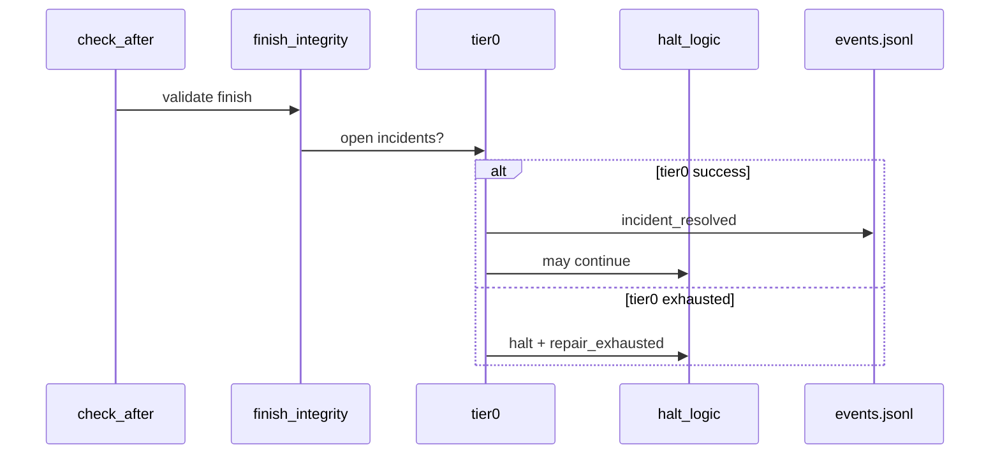

# [T-HUB-030 | harness-runtime-wire] PLAN

**Дата:** 2026-08-31  
**Режим:** BACK PLAN  
**Уровень:** L3  
**Статус:** active  
**Roadmap:** [roadmap-harness-maturity-borrowings-epics.md](roadmap-harness-maturity-borrowings-epics.md)  
**Queue:** [roadmap-harness-maturity-borrowings-epics.queue.yaml](roadmap-harness-maturity-borrowings-epics.queue.yaml)  
**Deps:** **soft** T-HUB-017, T-HUB-018 (код модулей exists; wire debt). **Soft:** T-HUB-024 (traceability CLI).

**Skills:** writing-plans · python-testing-patterns · diagnosing-bugs · architecture-patterns

→ [decompose-T-HUB-030-harness-runtime-wire/index.md](decompose-T-HUB-030-harness-runtime-wire/index.md) · [index.yaml](decompose-T-HUB-030-harness-runtime-wire/index.yaml) — **DECOMPOSE done**

---

## Контекст

- **req:** Закрыть **implementation debt** observability/incident epics: модули `tier0.py`, `doctor.py`, incident CLI описаны и протестированы, но **не подключены** к `context_loop.py` / `loop.sh`. Дополнительно: расширить lifecycle events и включить traceability по умолчанию на promote.
- **gap (as-built):**
  - `bin/loop doctor` → `context_loop.py doctor` — subcommand **отсутствует** (runtime error).
  - `run_tier0_for_incident` — **не вызывается** из `check_after` (тесты `test_check_after_tier0_wire.py` описывают контракт).
  - `incident-status`, `incident-retry` subcommands — отсутствуют (T-HUB-018 s07).
  - `EVENT_KINDS` не содержит `implement_done`, `decompose_step_done`, `phase_transition`.
  - `EPIC_TRACEABILITY_CHECK=0` default — drift не ловится без opt-in.
- **refs:** T-HUB-017/018 plans; `loop/incidents/`; `loop/tests/test_check_after_tier0_wire.py`; chat harness analysis 2026-08-31 P0.

**CREATIVE need:** нет.

---

## Цель

Loop runtime **fail-closed и self-healing на Tier-0**: `check_after` автоматически пытается tier0 repair; operator может `loop doctor` до сессии; incident CLI для ops; полный lifecycle timeline в events.jsonl; traceability ON на promote DECOMPOSE.

---

## Продуктовая спека (WHAT)

### User Stories

| # | Story | Priority | Independent Test |
| :--- | :--- | :--- | :--- |
| US-001 | Как loop operator, я хочу `bin/loop doctor` работал до автопилота, чтобы видеть blockers заранее. | P0 | doctor subcommand → DoctorReport JSON; exit 0/1/2 |
| US-002 | Как loop operator, я хочу tier0 auto-repair в check_after, чтобы drift index/activeContext чинился без tier1. | P0 | fixture incident → tier0 success → continue |
| US-003 | Как loop operator, я хочу tier0 exhausted → halt с флагом для tier1, чтобы autopilot (018) срабатывал предсказуемо. | P0 | tier0 fail → repair_exhausted; tier1 eligible |
| US-004 | Как operator, я хочу `incident-status` и `incident-retry`, чтобы управлять инцидентами вручную. | P0 | CLI lists open; retry spawns tier1 path |
| US-005 | Как auditor, я хочу implement/decompose events в timeline, чтобы events.jsonl отражал IMPLEMENT прогресс. | P0 | finalize_step → implement_done event |
| US-006 | Как platform, я хочу traceability check ON на promote, чтобы plan↔decompose drift ловился рано. | P0 | promote decompose → validate-traceability runs; exit 2 blocks |

#### Acceptance Scenarios — US-002

- **Given:** open incident `checkpoint_drift`, tier0 repair chain in registry
- **When:** `check_after` completes session
- **Then:** `run_tier0_for_incident` invoked; on success `incidents_resolved` in response; `decide=continue`

#### Acceptance Scenarios — US-001

- **Given:** corrupt activeContext shape
- **When:** `python loop/context_loop.py doctor --cwd $PROJECT_ROOT`
- **Then:** checklist fail; `--auto-repair` attempts tier0-eligible fixes

### Functional Requirements (FR-###)

#### Doctor CLI

- **FR-001:** Subparser `doctor` in `context_loop.py`: flags `--auto-repair`, `--format text|json`; delegate `loop.incidents.doctor.run_doctor`.
- **FR-002:** `bin/loop doctor` passthrough works (already wired in bin/loop).
- **FR-003:** Optional pre-loop hook: `loop.sh` calls doctor when `EPIC_LOOP_DOCTOR_PREFLIGHT=1` (default 0 for backward compat; document in README).

#### Tier0 wire in check_after

- **FR-004:** After finish integrity / halt prep in `check_after`: if open incidents → `run_tier0_for_incident` for each (or first blocking) per registry max_attempts.
- **FR-005:** Response fields: `tier0_attempted`, `tier0_resolved[]`, `repair_exhausted`, `incidents_open_count`.
- **FR-006:** Emit `repair_applied` / `incident_resolved` events via `loop.incidents.events`.
- **FR-007:** On tier0 success → may flip halt to continue per `halt_logic` integration (existing tests contract).

#### Incident ops CLI

- **FR-008:** Subparser `incident-status`: list open/resolved tail from `incidents.jsonl`; JSON output.
- **FR-009:** Subparser `incident-retry`: `--incident-id`; delegate tier1 eligibility check + optional spawn instruction JSON (actual spawn remains loop.sh for flock safety).

#### Event kinds extension

- **FR-010:** Add to `EVENT_KINDS`: `implement_done`, `decompose_step_done`, `phase_transition`, `traceability_warn`, `traceability_fail`.
- **FR-011:** Emit `implement_done` from `finalize_step` on step completion; `phase_transition` from transition paths (delegate stub OK until T-HUB-029; emit on promote_if_ready arm).
- **FR-012:** Update `reconcile_epic_events` backfill rules for new kinds.
- **FR-013:** Migration: v1 adapter accepts unknown kinds as opaque OR strict validation with explicit test for new kinds only.

#### Traceability default

- **FR-014:** Change default: `EPIC_TRACEABILITY_CHECK` unset → treat as `1` on DECOMPOSE promote path (fail-closed exit 2; warn-only for exit 1).
- **FR-015:** Update `.claude/project.env` comment: `# EPIC_TRACEABILITY_CHECK=0 to disable`.
- **FR-016:** Integration test: promote with drift fixture → blocked.

### Success Criteria (SC-###)

| ID | Измеримый результат | Проверка | Type |
| :--- | :--- | :--- | :--- |
| SC-001 | doctor subcommand exits 0 on healthy fixture | pytest + manual CLI | outcome |
| SC-002 | check_after tier0 wire tests green | `test_check_after_tier0_wire.py` | outcome |
| SC-003 | incident-status/retry CLI smoke | pytest CLI | outcome |
| SC-004 | implement_done in events after finalize | integration test | outcome |
| SC-005 | traceability default ON blocks drift promote | integration test | outcome |

### Assumptions

- T-HUB-017/018 module code in `loop/incidents/` is correct; this epic is **wire-only** + event/traceability hardening.
- Tier1 spawn remains in `loop.sh`; incident-retry returns actionable JSON for operator/loop.sh.

### Clarifications

- Session: chat 2026-08-31 harness P0 analysis; no separate CLARIFY (scope deterministic from as-built gap).

---

## AC

1. `context_loop.py doctor` subcommand exists and matches `run_doctor()` API.
2. `check_after` invokes tier0 per open incidents; existing tier0 wire tests pass.
3. `incident-status` and `incident-retry` subcommands exist with tests.
4. New EVENT_KINDS emitted on appropriate lifecycle hooks.
5. Traceability default ON on promote; opt-out via env=0.
6. `loop/README.md` observability section updated (doctor, tier0 flow, traceability default).
7. No regression: full `pytest loop/tests -q` green.

---

## Техника / архитектура (HOW)

### Touch map

| File | Change |
|------|--------|
| `loop/context_loop.py` | doctor, incident-status, incident-retry subparsers; tier0 block in check_after |
| `loop/loop.sh` | optional doctor preflight; document tier0→tier1 sequence |
| `.claude/hooks/epic_events.py` | EVENT_KINDS + validation |
| `.claude/hooks/epic/core.py` | emit implement_done in finalize_step; phase_transition stub |
| `.claude/project.env` | traceability default comment |
| `loop/README.md` | wire documentation |
| `loop/tests/test_check_after_tier0_wire.py` | should pass without skip |
| `loop/tests/test_doctor_cli.py` | new |
| `loop/tests/test_incident_cli.py` | new |
| `loop/tests/test_event_kinds_extended.py` | new |

### Flow (check_after tier0)

### Replacement / sunset

| n/a | greenfield — wire debt closure |

---

## До DECOMPOSE (черновик нарезки)

| sNN | Slice |
|-----|-------|
| s01 | doctor subcommand + tests |
| s02 | tier0 wire in check_after + tier0 wire tests green |
| s03 | incident-status + incident-retry CLI |
| s04 | EVENT_KINDS extend + finalize_step emit + reconcile backfill |
| s05 | traceability default ON + integration test |
| s06 | README + loop.sh preflight opt-in + docs |

---

## Следующий режим

→ BACK DECOMPOSE
