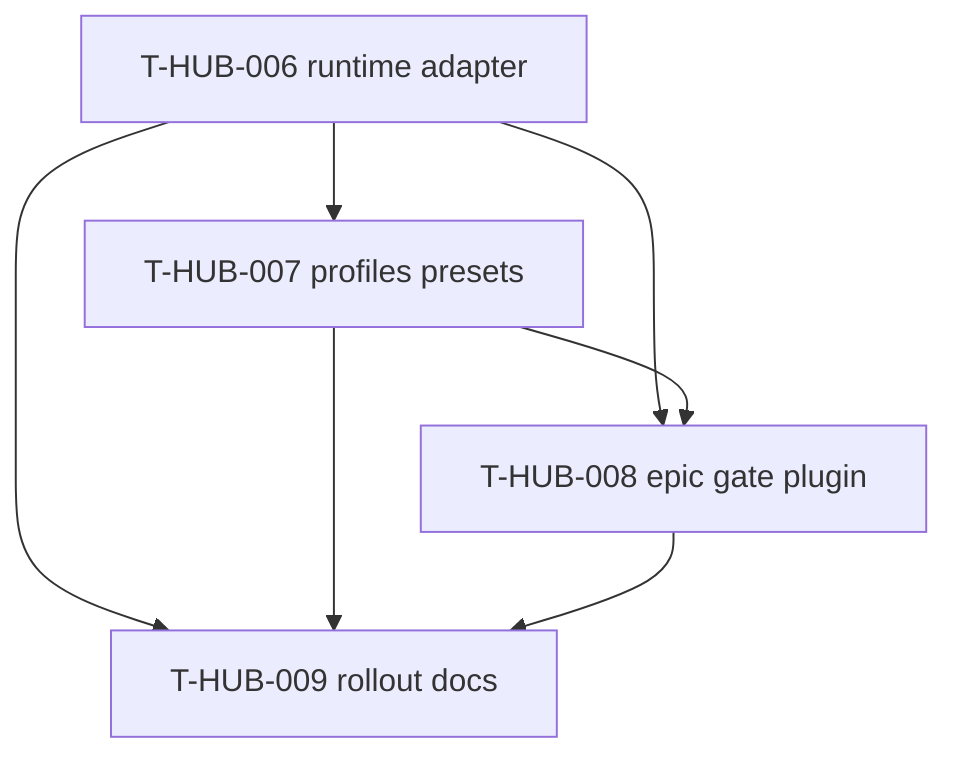

# Roadmap: dsh-loop-backend epics (единый канон)

**Дата:** 2026-08-22  
**Роль:** BACK PLAN  
**Назначение:** карта «что за чем» для опционального DSH-backend в loop; **не** заменяет полные `plan-T-HUB-006…009-*.md`.  
**Machine queue (slug, источник):** [`roadmap-dsh-loop-backend-epics.queue.yaml`](roadmap-dsh-loop-backend-epics.queue.yaml)  
**Loop canon (после MERGE):** [`roadmap-epics.queue.yaml`](roadmap-epics.queue.yaml) — @.cursor/rules/shared/workflow-roadmap-merge.mdc  
**Research / контекст:** обсуждение 2026-08-22 (loop → DSH headless; memory-bank workflow остаётся каноном; subagents/presets/gates — в DSH)

---

## 0. Epic cut

| Порядок | ID | План | Суть | In scope | Out of scope |
|---------|-----|------|------|----------|--------------|
| 1 | T-HUB-006 | [plan-T-HUB-006-dsh-loop-runtime-adapter.md](plan-T-HUB-006-dsh-loop-runtime-adapter.md) | `EPIC_RUNTIME=dsh`, вызов headless DSH из `loop.sh`, adapter `record-session` | runtime switch, session log parse, scaffold `dsh/` | Cordis plugins, presets, gate parity |
| 2 | T-HUB-007 | [plan-T-HUB-007-dsh-profiles-presets.md](plan-T-HUB-007-dsh-profiles-presets.md) | Profiles per phase + presets verify/reviewer/explorer из `.claude/agents` | cordis.patch, phase→profile map, model routing | turn-stopping / stop-gate parity |
| 3 | T-HUB-008 | [plan-T-HUB-008-dsh-epic-gate-plugin.md](plan-T-HUB-008-dsh-epic-gate-plugin.md) | Cordis plugin `dsh-epic-gate`: bridge к `epic_resolve.py`, subagent policy | pre-execute, turn-stopping, mirror verify | Замена Claude path по умолчанию |
| 4 | T-HUB-009 | [plan-T-HUB-009-dsh-rollout-docs.md](plan-T-HUB-009-dsh-rollout-docs.md) | Runbook pilot, architecture, deps Node/DSH | docs, pilot checklist, architecture shard | Production default `EPIC_RUNTIME=dsh` |

---

## 1. Зависимости

| От | К | Тип | Почему |
|----|---|-----|--------|
| T-HUB-006 | T-HUB-007 | hard | profiles бессмысленны без вызова DSH из loop |
| T-HUB-006 | T-HUB-008 | hard | gate plugin монтируется в profile, который вызывает loop |
| T-HUB-007 | T-HUB-008 | hard | gate тестируется с presets verify/reviewer/explorer |
| T-HUB-006 | T-HUB-009 | hard | docs описывают собранный runtime path |
| T-HUB-007 | T-HUB-009 | hard | docs per-phase profiles |
| T-HUB-008 | T-HUB-009 | hard | pilot runbook требует gate parity checklist |

**Soft (narrative):** T-HUB-002…005 (workflow-loop-hardening) — не блокируют старт 006; рекомендуется завершить T-HUB-003 (halt parity) до production pilot DSH.

---

## 2. Архитектурный принцип (канон)

| Слой | Владелец | Не меняется при DSH |
|------|----------|---------------------|
| Epic orchestration | `loop/` + `context_loop.py` | да |
| Cursor / transitions | `memory-bank/activeContext.md` + decompose index | да |
| FINISH / finalize | `epic_resolve.py` | да (DSH plugin **вызывает**, не заменяет) |
| Session executor | `EPIC_RUNTIME=claude\|dsh` | **swap point** |
| Subagent prompts | `.claude/agents/*.md` | content reuse; mount в DSH presets |
| Subagent enforce | Claude hooks → DSH Cordis plugin | **перенос механизма** |

Default остаётся **`EPIC_RUNTIME=claude`**. DSH — opt-in до явного pilot sign-off в T-HUB-009.

---

## 3. Порядок выполнения (канon)

1. **T-HUB-006** → QA → REFLECT  
2. **T-HUB-007** → QA → REFLECT  
3. **T-HUB-008** → QA → REFLECT  
4. **T-HUB-009** → QA → REFLECT  

Один эпик за раз. После MERGE slug queue в canon — `roadmap-advance` может chain при `EPIC_CHAIN_ROADMAP=1`.

---

## 4. Статус (human mirror)

| Артефакт | Статус |
|----------|--------|
| **Этот roadmap** | active |
| **`.queue.yaml`** | machine canon (pre-MERGE slug) |
| plan-T-HUB-006…009 | PLAN done · next ROADMAP MERGE → DECOMPOSE 006 |

---

## 5. Handoff

- **Next:** `BACK ROADMAP MERGE` (slug `dsh-loop-backend`) → затем `BACK DECOMPOSE T-HUB-006`
- **Параллельно:** T-HUB-002 IMPLEMENT s02 не блокируется этим roadmap (отдельная queue)
