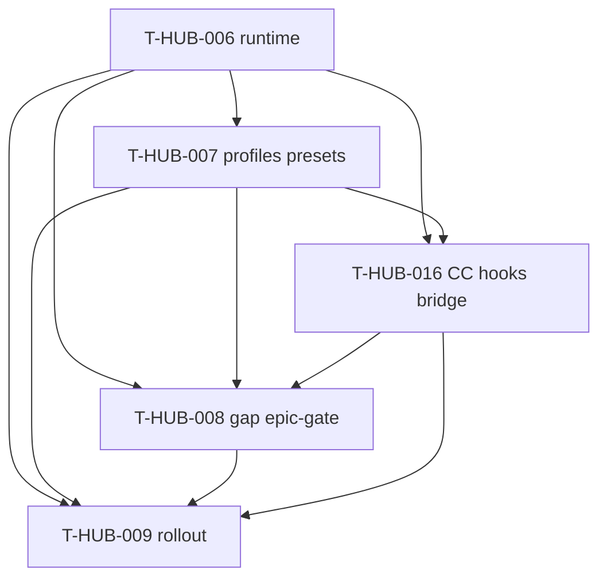

# Roadmap: dsh-loop-backend epics (единый канон)

**Дата:** 2026-08-22 · **Revision:** 2026-08-27 (+T-HUB-016 CC hooks bridge)  
**Роль:** BACK PLAN  
**Назначение:** карта «что за чем» для опционального DSH-backend в loop; **не** заменяет полные `plan-T-HUB-006…009,016-*.md`.  
**Machine queue (slug, источник):** [`roadmap-dsh-loop-backend-epics.queue.yaml`](roadmap-dsh-loop-backend-epics.queue.yaml)  
**Loop canon (после MERGE):** [`roadmap-epics.queue.yaml`](roadmap-epics.queue.yaml) — @.cursor/rules/shared/workflow-roadmap-merge.mdc  
**Research / контекст:** обсуждение 2026-08-22 (loop → DSH); 2026-08-27 — официальный `@deepseek-ai/dsh-hooks-claude-code` + gap-fill вместо полного порта hooks.

---

## 0. Epic cut

| Порядок | ID | План | Суть | In scope | Out of scope |
|---------|-----|------|------|----------|--------------|
| 1 | T-HUB-006 | [plan-T-HUB-006-dsh-loop-runtime-adapter.md](plan-T-HUB-006-dsh-loop-runtime-adapter.md) | `EPIC_RUNTIME=dsh`, adapter | runtime switch, log parse | Cordis plugins, presets |
| 2 | T-HUB-007 | [plan-T-HUB-007-dsh-profiles-presets.md](plan-T-HUB-007-dsh-profiles-presets.md) | Profiles + presets verify/reviewer/explorer | cordis profiles, agent.md sync | hooks bridge mount |
| 3 | T-HUB-016 | [plan-T-HUB-016-dsh-cc-hooks-bridge.md](plan-T-HUB-016-dsh-cc-hooks-bridge.md) | Official CC hooks bridge + optional claude-compat + stop self-limit | settings.json hooks as-is | full native gate rewrite |
| 4 | T-HUB-008 | [plan-T-HUB-008-dsh-epic-gate-plugin.md](plan-T-HUB-008-dsh-epic-gate-plugin.md) | **Gap-fill only** after bridge | updatedInput, agent_type, VERDICT mirror | full stop-gate TS port |
| 5 | T-HUB-009 | [plan-T-HUB-009-dsh-rollout-docs.md](plan-T-HUB-009-dsh-rollout-docs.md) | Rollout docs + pilot | docs, checklist | default EPIC_RUNTIME=dsh |

---

## 1. Зависимости

| От | К | Тип | Почему |
|----|---|-----|--------|
| T-HUB-006 | T-HUB-007 | hard | profiles без invoke бессмысленны |
| T-HUB-006 | T-HUB-016 | hard | bridge тестируется на DSH invoke |
| T-HUB-007 | T-HUB-016 | hard | mount в epic-* profiles |
| T-HUB-006 | T-HUB-008 | hard | |
| T-HUB-007 | T-HUB-008 | hard | presets + typed subagents |
| T-HUB-016 | T-HUB-008 | hard | gap-fill после bridge |
| T-HUB-006…008,016 | T-HUB-009 | hard | docs полного path |

---

## 2. Архитектурный принцип (канон)

| Слой | Владелец | При DSH |
|------|----------|---------|
| Epic orchestration | loop + memory-bank | без изменений |
| Session executor | EPIC_RUNTIME | swap |
| Command hooks (.py) | `.claude/hooks` via **dsh-hooks-claude-code** (016) | reuse |
| Skills/rules | optional dsh-claude-compat (016) | reuse |
| Real subagents | presets (007) | не skill-shim |
| Bridge gaps | epic-gate thin (008) | только дыры |

Default **`EPIC_RUNTIME=claude`**.

---

## 3. Порядок выполнения

1. T-HUB-006 → QA → REFLECT  
2. T-HUB-007 → QA → REFLECT  
3. **T-HUB-016** → QA → REFLECT  
4. T-HUB-008 → QA → REFLECT  
5. T-HUB-009 → QA → REFLECT  

---

## 4. Статус (human mirror)

| Артефакт | Статус |
|----------|--------|
| Этот roadmap | active (rev 2026-08-27) |
| plan-T-HUB-016 | PLAN done · next DECOMPOSE after MERGE |
| plan-T-HUB-008 | PLAN revised gap-fill · next DECOMPOSE after 016 |

---

## 5. Handoff

- Next: `BACK ROADMAP MERGE` → DECOMPOSE по canon order (после текущих SpecKit/005…).
