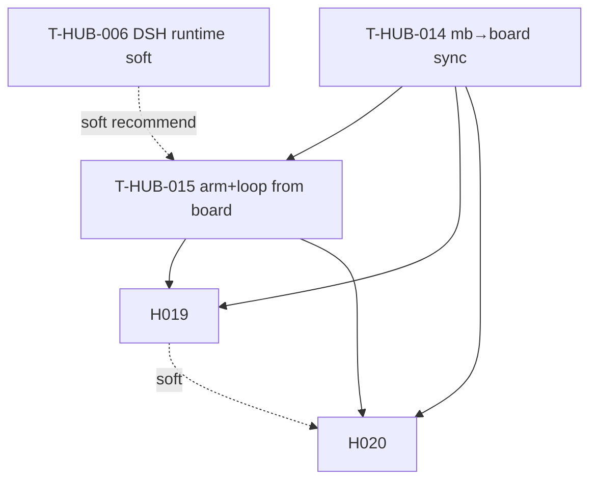

# Roadmap: dsh-mb-board epics (единый канон)

**Дата:** 2026-08-27  
**Роль:** BACK PLAN  
**Назначение:** карта «что за чем» для синхронизации DSH workspaces ↔ memory-bank → Task Board и запуска loop с доски; **не** заменяет полные `plan-T-HUB-014…015-*.md`.  
**Machine queue (slug, источник):** [`roadmap-dsh-mb-board-epics.queue.yaml`](roadmap-dsh-mb-board-epics.queue.yaml)  
**Loop canon (после MERGE):** [`roadmap-epics.queue.yaml`](roadmap-epics.queue.yaml) — @.cursor/rules/shared/workflow-roadmap-merge.mdc  
**Research / контекст:** чат 2026-08-27 (DSH Task Board ≠ SoT; memory-bank канон; нужен sync добавленных проектов + arm + запуск `loop` с доски).

---

## 0. Epic cut

| Порядок | ID | План | Суть | In scope | Out of scope |
|---------|-----|------|------|----------|--------------|
| 1 | T-HUB-014 | [plan-T-HUB-014-dsh-mb-board-sync.md](plan-T-HUB-014-dsh-mb-board-sync.md) | Discover DSH workspaces → scan `memory-bank` → upsert Task Board cards (**step** sNN + **gate** CLARIFY/ANALYZE/QA/…) | registry, scanner, gate lifecycle, board client, CLI sync, dry-run, tests | arm, loop launch, Jira |
| 1 | T-HUB-015 | [plan-T-HUB-015-dsh-board-arm-loop.md](plan-T-HUB-015-dsh-board-arm-loop.md) | Arm + loop + **UI** (workspace filter, model presets, Sync) с доски | Cordis bridge, arm CLI, loop-run, board controls | Jira, stock free-run, upstream task-board fork |
| 2 | T-HUB-019 | [plan-T-HUB-019-dsh-board-sync-enrichments.md](plan-T-HUB-019-dsh-board-sync-enrichments.md) | Rich descriptions (plan/shard body), column mapping (`running`, plan/decompose → **backlog**), HTTP `move` | description.py, status_map, mb-bridge metadata parse | plan FR slicing, board SoT |
| 3 | T-HUB-020 | [plan-T-HUB-020-dsh-board-epic-loop.md](plan-T-HUB-020-dsh-board-epic-loop.md) | Epic-centric board + `resolve_epic_next_action` + `arm_epic` + `plan-next/v1`; Run = roadmap command (PLAN…IMPLEMENT) | epic_next_action, scan_epics, loop `--epic-id` | pending sNN cards; board SoT |

**Cut criteria applied:** (#2) resolver/loop arm vs board UX enrichments; (#3) 020 меняет семантику карточек (sunset step projection); (#4) 019/020 hard-dep 014+015; (#5b) 019 polish, 020 orchestration.

---

## 1. Зависимости

| От | К | Тип | Почему |
|----|---|-----|--------|
| T-HUB-014 | T-HUB-015 | hard | launch/arm требуют стабильный card id + metadata mapping из sync |
| T-HUB-014 | T-HUB-019 | hard | enrichments расширяют card contract из 014 |
| T-HUB-015 | T-HUB-019 | hard | DECOMPOSE backlog Run опирается на arm/loop pipeline |
| T-HUB-014 | T-HUB-020 | hard | epic cards extend mb-* contract из sync |
| T-HUB-015 | T-HUB-020 | hard | Arm+Run pipeline для arm_epic |
| T-HUB-019 | T-HUB-020 | soft | descriptions/move желательны до epic cards |
| T-HUB-006 | T-HUB-015 | soft | loop уже умеет `EPIC_RUNTIME=dsh`; launch работает и на `claude` default |

**Soft (narrative):** T-HUB-007/008 желательны до production DSH-path с доски (presets/gates), но не блокируют CLI arm+loop на Claude.

---

## 2. Архитектурный принцип (канон)

| Слой | Владелец | Правило |
|------|----------|---------|
| Epic / step SoT | `$PROJECT_ROOT/memory-bank/**` | Board **никогда** не становится каноном статуса |
| Project list | `$DSH_HOME/storages/workspace.json` | «Добавленные проекты» = DSH workspaces с `memory-bank/` |
| Board ledger | `$DSH_HOME/task-board/ledger-v2.json` | Витрина + launcher; sync upsert/archive только `mb-*` cards (**step** + **gate**); связь по `epic_id` в metadata |
| Arm | `loop/context_loop.py arm` / `arm_roadmap_entry` | Единственный writer `activeContext` + epic state |
| Executor | `dev-hub/bin/loop` → `loop/loop.sh` | Stock Task Board `kind:run` (agent session) **не** primary path для `mb-*` |

---

## 3. Порядок выполнения (канон)

1. **T-HUB-014** → QA → REFLECT  
2. **T-HUB-015** → QA → REFLECT  
3. **T-HUB-019** → QA → REFLECT (UX polish; deps 014+015)  
4. **T-HUB-020** → QA → REFLECT (epic loop model; deps 014+015; soft 019)

Один эпик за раз (рекомендация); 019 не блокирует T-HUB-016+. После `BACK ROADMAP MERGE` slug queue → canon.

---

## 4. Статус (human mirror)

| Артефакт | Статус |
|----------|--------|
| **Этот roadmap** | active |
| **`.queue.yaml`** | machine canon для MERGE |
| plan-T-HUB-014 | DECOMPOSE done · **active IMPLEMENT s01** |
| plan-T-HUB-015 | PLAN done · deps 014 |

Done для loop = QA pass + REFLECT (+ queue), не текст этой таблицы.

---

## 5. Handoff

- Next: `BACK ROADMAP MERGE` → затем `BACK DECOMPOSE` первого из **canon** `roadmap-epics.queue.yaml` (после MERGE — T-HUB-014, если 006… ещё в очереди раньше — MERGE порядок/позиция по политике merge)
- **Внимание:** на момент PLAN (2026-08-27) в active был armed `T-HUB-006` s08; после MERGE пользователь выбирает порядок в canon. Для продолжения 006: `context_loop arm --epic …/decompose-T-HUB-006-dsh-loop-runtime-adapter`.
- Loop chain: `EPIC_CHAIN_ROADMAP=1` → `roadmap-advance` читает **только** canon `.queue.yaml`
