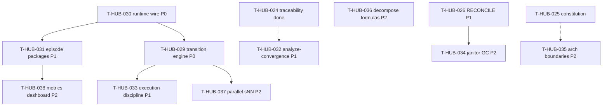

# Roadmap: harness-maturity-borrowings epics (P0–P2)

**Дата:** 2026-08-31  
**Роль:** BACK PLAN  
**Назначение:** карта заимствований из harness engineering (spec-kit, GSD, OpenAI harness, Gas Town, Bernstein, arXiv H3) для **предсказуемости, валидации, observability и incident analysis**; не заменяет полные `plan-*.md` каждого эпика.  
**Machine queue (slug, источник):** [`roadmap-harness-maturity-borrowings-epics.queue.yaml`](roadmap-harness-maturity-borrowings-epics.queue.yaml)  
**Loop canon (после MERGE):** [`roadmap-epics.queue.yaml`](roadmap-epics.queue.yaml)  
**Research / контекст:** чат 2026-08-31 (harness engineering analysis; gap matrix as-built vs industry; P0 wire debt T-HUB-017/018).

---

## 0. Epic cut (P0 → P2)

| Band | Порядок | ID | План | Суть | Borrow source |
|------|---------|-----|------|------|---------------|
| **P0** | 1 | T-HUB-030 | [plan-T-HUB-030-harness-runtime-wire.md](plan-T-HUB-030-harness-runtime-wire.md) | Wire tier0/doctor/incident CLI + EVENT_KINDS + traceability default ON | Internal debt closure (017/018) |
| **P0** | 2 | T-HUB-029 | [plan-T-HUB-029-epic-phase-transition-engine.md](plan-T-HUB-029-epic-phase-transition-engine.md) | Transition Engine + phase registry + verify-per-phase | Internal (ex 028) |
| **P1** | 3 | T-HUB-026 | [plan-T-HUB-026-spec-reconcile-workflow.md](plan-T-HUB-026-spec-reconcile-workflow.md) | BACK RECONCILE + reconcile-spec workflow | Spec-kit drift pattern |
| **P1** | 4 | T-HUB-031 | [plan-T-HUB-031-harness-episode-packages.md](plan-T-HUB-031-harness-episode-packages.md) | Episode package per loop session (auditable bundle) | arXiv Harness H3 |
| **P1** | 5 | T-HUB-032 | [plan-T-HUB-032-harness-analyze-convergence.md](plan-T-HUB-032-harness-analyze-convergence.md) | `analyze-convergence` cross-artifact CLI | GitHub spec-kit `/speckit.analyze` |
| **P1** | 6 | T-HUB-033 | [plan-T-HUB-033-harness-execution-discipline.md](plan-T-HUB-033-harness-execution-discipline.md) | GSD-style atomic commit per sNN + one-shard-one-session | GSD execution |
| **P2** | 7 | T-HUB-034 | [plan-T-HUB-034-harness-janitor-gc.md](plan-T-HUB-034-harness-janitor-gc.md) | Doc gardening / stale artifact janitor | OpenAI harness GC |
| **P2** | 8 | T-HUB-035 | [plan-T-HUB-035-harness-architecture-boundaries.md](plan-T-HUB-035-harness-architecture-boundaries.md) | Architecture boundary tests (import-linter) | OpenAI harness ratchet |
| **P2** | 9 | T-HUB-036 | [plan-T-HUB-036-harness-decompose-formulas.md](plan-T-HUB-036-harness-decompose-formulas.md) | Reusable decompose formula templates | Gas Town formulas |
| **P2** | 10 | T-HUB-037 | [plan-T-HUB-037-harness-parallel-snn.md](plan-T-HUB-037-harness-parallel-snn.md) | Parallel independent sNN (worktree pool) | Bernstein / GSD waves |
| **P2** | 11 | T-HUB-038 | [plan-T-HUB-038-harness-metrics-dashboard.md](plan-T-HUB-038-harness-metrics-dashboard.md) | Metrics + events HTML/JSON dashboard | OpenHands / SRE |

**Cut criteria:** (#1) P0≠P1≠P2 bands; (#2) runtime wire vs transition engine vs observability vs hygiene — разные деревья; (#4) hard-deps 031←030, 033←029, 034←026, 037←029, 038←031; (#5) каждый эпик — independent QA deliverable.

**Existing plans (не переписываются):** T-HUB-029, T-HUB-026 — включены в slug queue для ordering и MERGE.

---

## 1. Зависимости

| От | К | Тип | Почему |
|----|---|-----|--------|
| T-HUB-030 | T-HUB-031 | hard | episode bundle требует wired trace/events/tier0 |
| T-HUB-030 | T-HUB-029 | soft | transition engine стабильнее после doctor/tier0 wire |
| T-HUB-029 | T-HUB-033 | hard | atomic commit hook в `finalize_step` / transition API |
| T-HUB-029 | T-HUB-037 | hard | parallel sNN требует единый `arm_phase` + cursor sync |
| T-HUB-026 | T-HUB-034 | hard | janitor reuse reconcile parsers |
| T-HUB-031 | T-HUB-038 | hard | dashboard агрегирует episode + metrics |
| T-HUB-024 | T-HUB-032 | soft | analyze-convergence reuse traceability parsers |
| T-HUB-025 | T-HUB-035 | soft | constitution paths для boundary rules |

---

## 2. Архитектурный принцип

| Ось | Целевое состояние после roadmap |
|-----|--------------------------------|
| **Предсказуемость** | Любой entry point → Transition Engine; legacy arm = delegate + warning |
| **Повторяемость** | Episode snapshot + one-shard-one-session + atomic sNN commits |
| **Валидация** | Traceability ON by default; analyze-convergence + RECONCILE + phase verify registry |
| **Observability** | Full EVENT_KINDS timeline; episode packages; metrics dashboard |
| **Incidents** | tier0 in check_after; doctor preflight; tier1 + runbooks + postmortem template |

**Anti-scope (весь roadmap):** замена Cursor/Claude inner harness; SaaS observability; product `$PROJECT_ROOT` rollout вне dev-hub; rewrite Gas Town swarm scheduler.

---

## 3. Порядок выполнения (рекомендация)

1. **T-HUB-030** → QA → REFLECT *(P0 wire — разблокирует doctor/tier0)*  
2. **T-HUB-029** → QA → REFLECT *(P0 transition — уже в canon)*  
3. **T-HUB-026** → QA → REFLECT *(P1 reconcile)*  
4. **T-HUB-031** → **T-HUB-032** → **T-HUB-033** *(P1 band, параллель 032/031 после deps)*  
5. **T-HUB-034** … **T-HUB-038** *(P2 — по deps, можно параллелить 035/036)*  

Один эпик за раз в loop. После MERGE slug → canon.

---

## 4. Mapping P0–P2 items → epics

| # | Item (analysis 2026-08-31) | Epic |
|---|---------------------------|------|
| P0-1 | Wire tier0 in check_after | T-HUB-030 |
| P0-2 | Wire doctor subcommand | T-HUB-030 |
| P0-3 | Transition Engine | T-HUB-029 |
| P0-4 | EPIC_TRACEABILITY_CHECK default ON | T-HUB-030 |
| P0-5 | Extend EVENT_KINDS | T-HUB-030 |
| P1-6 | Episode package per session | T-HUB-031 |
| P1-7 | BACK RECONCILE workflow | T-HUB-026 |
| P1-8 | Phase verify registry | T-HUB-029 |
| P1-9 | analyze-convergence | T-HUB-032 |
| P1-10 | GSD atomic commit per sNN | T-HUB-033 |
| P2-11 | Doc gardening janitor | T-HUB-034 |
| P2-12 | Architecture boundary tests | T-HUB-035 |
| P2-13 | Formula decompose templates | T-HUB-036 |
| P2-14 | Parallel independent sNN | T-HUB-037 |
| P2-15 | Metrics dashboard | T-HUB-038 |

---

## 5. Статус

| Артефакт | Статус |
|----------|--------|
| **Этот roadmap** | active |
| **`.queue.yaml`** | machine canon для MERGE |
| plan-T-HUB-030…038 | PLAN done · next DECOMPOSE |
| plan-T-HUB-029, T-HUB-026 | existing · included in queue |

---

## 6. Handoff

- Next: `roadmap-merge` (same session) → `BACK DECOMPOSE` **T-HUB-030** (first new epic in canon after merge policy)
- Parallel allowed: T-HUB-025 AUDIT tail (orthogonal)
