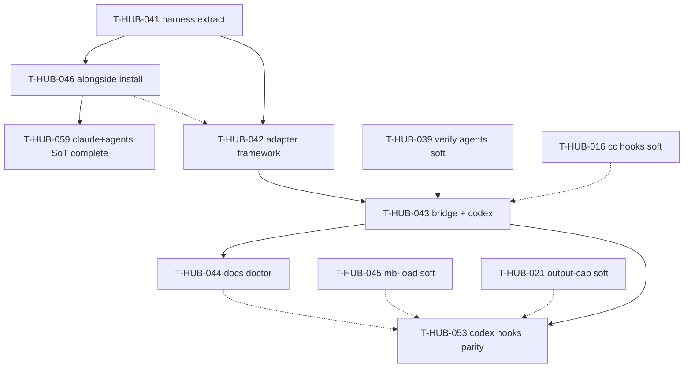

# Roadmap: harness universal runtime epics (единый канон)

**Дата:** 2026-09-01  
**Роль:** BACK PLAN  
**Назначение:** карта «что за чем» для canonical `harness/` + plug-in runtime adapters (claude | dsh | codex); **не** заменяет полные `plan-T-HUB-041…044-*.md`.  
**Machine queue (slug, источник):** [`roadmap-harness-universal-runtime-epics.queue.yaml`](roadmap-harness-universal-runtime-epics.queue.yaml)  
**Loop canon (после MERGE):** [`roadmap-epics.queue.yaml`](roadmap-epics.queue.yaml) — @.cursor/rules/shared/workflow-roadmap-merge.mdc  
**Кontext / решения:** обсуждение 2026-09-01 — harness SoT, RuntimeAdapter protocol, manifest + runtime-sync, workflow/subagents semantics unchanged.

---

## 0. Epic cut

| Порядок | ID | План | Суть | In scope | Out of scope |
|---------|-----|------|------|----------|--------------|
| 1 | T-HUB-041 | [plan-T-HUB-041-harness-canonical-extract.md](plan-T-HUB-041-harness-canonical-extract.md) | Canonical `harness/` + symlinks + loop imports | move hooks/agents/instructions; `.claude/*` thin shell | runtime adapters |
| 1b | T-HUB-046 | [plan-T-HUB-046-harness-alongside-install.md](plan-T-HUB-046-harness-alongside-install.md) | Non-destructive product install (`hub-link --mode=alongside`) | `harness/cursor/` + patch markers + opt-in router | Codex manifest |
| 1c | T-HUB-059 | [plan-T-HUB-059-harness-claude-agents-sot-complete.md](plan-T-HUB-059-harness-claude-agents-sot-complete.md) | Complete hub SoT: `harness/claude/{commands,skills,rules}` + `harness/skills` | git mv leftovers 046 + hub-link full → harness | doctor FR-011 (044); Codex |
| 2 | T-HUB-042 | [plan-T-HUB-042-runtime-adapter-framework.md](plan-T-HUB-042-runtime-adapter-framework.md) | RuntimeAdapter protocol + registry + dispatch refactor | claude/dsh via adapters; generic analyze_log | codex headless |
| 3 | T-HUB-043 | [plan-T-HUB-043-runtime-bridge-codex.md](plan-T-HUB-043-runtime-bridge-codex.md) | manifest + runtime-sync + CodexAdapter + hooks bridge | codex exec; materialize agents/hooks | Cursor IDE subagents |
| 4 | T-HUB-044 | [plan-T-HUB-044-runtime-sync-doctor-docs.md](plan-T-HUB-044-runtime-sync-doctor-docs.md) | hub-link, doctor, README/runbook | operator docs; preflight checks | new runtime beyond codex |
| 4b | T-HUB-053 | [plan-T-HUB-053-codex-claude-hooks-parity.md](plan-T-HUB-053-codex-claude-hooks-parity.md) | Codex ≡ Claude hooks/agents/gates full parity | SessionStart, SubagentStart, PostToolUse Bash cap, matchers, doctor matrix | Cursor IDE Codex; DSH Gap A |

> **Queue note:** T-HUB-053 ставится **после T-HUB-057** и **T-HUB-058** (session JSON contract → sunset-inventory agent → Codex parity); soft deps: 044, 021.

---

## 1. Зависимости

| От | К | Тип | Почему |
|----|---|-----|--------|
| T-HUB-041 | T-HUB-046 | hard | alongside install requires canonical `harness/` package |
| T-HUB-046 | T-HUB-059 | hard | complete leftover Target layout (`claude/*` + `harness/skills`) |
| T-HUB-041 | T-HUB-042 | hard | adapters import `harness/`, not `.claude/hooks` |
| T-HUB-046 | T-HUB-042 | soft | full cursor rules path in harness helps manifest materialize |
| T-HUB-042 | T-HUB-043 | hard | codex adapter plugs into registry |
| T-HUB-043 | T-HUB-044 | hard | docs describe shipped surface |
| T-HUB-043 | T-HUB-053 | hard | parity extends generated hooks / bridge from 043 |
| T-HUB-057 | T-HUB-053 | hard | session mb-load/finish + JSON gate contract до Codex parity |
| T-HUB-058 | T-HUB-053 | hard | sunset-inventory agent materialize до Codex parity |
| T-HUB-044 | T-HUB-053 | soft | runbook/doctor surface to extend |
| T-HUB-021 | T-HUB-053 | soft | bash-output-cap structured LLM path |
| T-HUB-039 | T-HUB-043 | soft | materializer needs verify-* agent files on disk |
| T-HUB-016 | T-HUB-043 | soft | DSH bridge pattern reuse for codex hooks |
| T-HUB-035 | T-HUB-041 | soft | boundaries.yaml should list `harness/` layer after extract |

---

## 2. Архитектурный принцип (канон)

| Слой | Владелец | Меняется? |
|------|----------|-----------|
| Epic orchestration | `loop/` + `memory-bank/` | **нет** (prepare/check-after/record-session/halt) |
| Behavior SoT | `harness/` (agents, hooks, instructions) | **новый** canonical path |
| Runtime shell | `.claude/`, `.codex/` (thin + generated) | symlink / manifest |
| IDE presentation | `.cursor/rules/` | @-refs на harness; формат mdc |
| Session executor | `RuntimeAdapter` via `EPIC_RUNTIME` | plug-in registry |
| Subagent semantics | spawn-hard + phase_registry + stop-gate | **нет** — только delivery bridge |

Default **`EPIC_RUNTIME=claude`**. Unknown runtime / missing binary → **fail-closed**, no silent fallback.

---

## 3. Порядок выполнения

1. T-HUB-041 → QA → REFLECT  
2. T-HUB-046 → QA → REFLECT (может идти параллельно с 042 после 041)  
3. T-HUB-042 → QA → REFLECT  
4. T-HUB-043 → QA → REFLECT  
5. T-HUB-044 → QA → REFLECT  
6. T-HUB-053 → QA → REFLECT (**после 045**; full Codex≡Claude hooks parity)  

---

## 4. Статус (human mirror)

| Артефакт | Статус |
|----------|--------|
| Этот roadmap | active (2026-09-01) |
| plan-T-HUB-041…044,046,053 | PLAN done (053 2026-09-02) · 053 next DECOMPOSE after 044/045 |

---

## 5. Handoff

- Next: `roadmap-merge --role back` (same session) → DECOMPOSE T-HUB-041 first.
