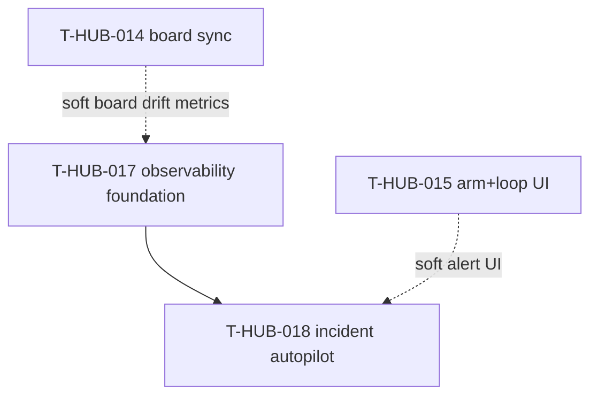

# Roadmap: loop-observability epics (единый канон)

**Дата:** 2026-08-28  
**Роль:** BACK PLAN  
**Назначение:** карта «что за чем» для observability loop + автоматического разбора/починки orchestration-инцидентов; **не** заменяет полные `plan-T-HUB-017…018-*.md`.  
**Machine queue (slug, источник):** [`roadmap-loop-observability-epics.queue.yaml`](roadmap-loop-observability-epics.queue.yaml)  
**Loop canon (после MERGE):** [`roadmap-epics.queue.yaml`](roadmap-epics.queue.yaml) — @.cursor/rules/shared/workflow-roadmap-merge.mdc  
**Research / контекст:** чат 2026-08-28 (observability gap; reflection T-HUB-011/012/013: неполный event trail, stale checkpoint, retry ambiguity; Tier-0 repairs уже в `check_after`, нужен incident pipeline + autopilot).

---

## 0. Epic cut

| Порядок | ID | План | Суть | In scope | Out of scope |
|---------|-----|------|------|----------|--------------|
| 1 | T-HUB-017 | [plan-T-HUB-017-loop-observability-foundation.md](plan-T-HUB-017-loop-observability-foundation.md) | Incident model, registry Tier-0, session-trace, metrics, `loop status`/`doctor`, event completeness | `loop-incident/v1`, incidents.jsonl, registry YAML, trace, metrics, doctor CLI, repair events | Tier-1 agent spawn, webhooks, board UI |
| 2 | T-HUB-018 | [plan-T-HUB-018-loop-incident-autopilot.md](plan-T-HUB-018-loop-incident-autopilot.md) | Tier-1 bounded incident agent + alerting + board/CLI retry | loop.sh incident session, runbooks, NEED_HUMAN alerts, optional board failed status | product code autofix, loop/hooks `.py` self-modify без эпика |

**Cut criteria applied:** (#2) read-mostly telemetry vs spawn bounded agent session; (#3) разные риски — append logs vs mutate orchestration artifacts; (#4) hard-dep 018←017; (#5) 017 shippable без autopilot (doctor + Tier-0 registry дают ценность сразу).

---

## 1. Зависимости

| От | К | Тип | Почему |
|----|---|-----|--------|
| T-HUB-017 | T-HUB-018 | hard | autopilot требует incident schema + registry + trace |
| T-HUB-014 | T-HUB-017 | soft | `board_sync_drift` diagnostic опционален в doctor |
| T-HUB-015 | T-HUB-018 | soft | board failed status + Retry incident button — companion UI |

**Soft (narrative):** T-HUB-014/015 можно продолжать параллельно; observability не блокирует board sync. После MERGE позиция в canon queue — по политике merge (рекомендация: после T-HUB-014 IMPLEMENT tail или после 015 — на усмотрение при MERGE).

---

## 2. Архитектурный принцип (канон)

| Слой | Владелец | Правило |
|------|----------|---------|
| Orchestration SoT | `$PROJECT_ROOT/memory-bank/**` + `runtime/<slug>/epic/` | Инциденты **не** меняют product application code |
| Incident log | `runtime/<slug>/epic/incidents.jsonl` | append-only; open/resolved lifecycle |
| Tier-0 repair | `loop/incidents/registry.yaml` → existing `epic/core.py` repair fns | whitelist `diagnostic_code` only |
| Tier-1 repair | bounded `BACK BUGFIX loop-incident` session | max N attempts; forbidden: hub `loop/*.py` edits |
| Escalation | `NEED_HUMAN` + alert hook | fail-closed; no silent continue |
| Metrics | `runtime/<slug>/epic/metrics.json` rolling | local-first; no SaaS required |
| Board visibility | T-HUB-015 companion (soft) | incident ≠ mb-card SoT |

---

## 3. Порядок выполнения (канон)

1. **T-HUB-017** → QA → REFLECT  
2. **T-HUB-018** → QA → REFLECT  

Один эпик за раз. После `BACK ROADMAP MERGE` slug queue → canon.

---

## 4. Статус (human mirror)

| Артефакт | Статус |
|----------|--------|
| **Этот roadmap** | active |
| **`.queue.yaml`** | machine canon для MERGE |
| plan-T-HUB-017 | PLAN done · next DECOMPOSE |
| plan-T-HUB-018 | PLAN done · deps 017 |

Done для loop = QA pass + REFLECT (+ queue), не текст этой таблицы.

---

## 5. Handoff

- Next: `BACK ROADMAP MERGE` → затем `BACK DECOMPOSE` **T-HUB-017** (если в canon queue после merge)
- Параллельно: **T-HUB-014** IMPLEMENT может продолжаться (orthogonal scope)
