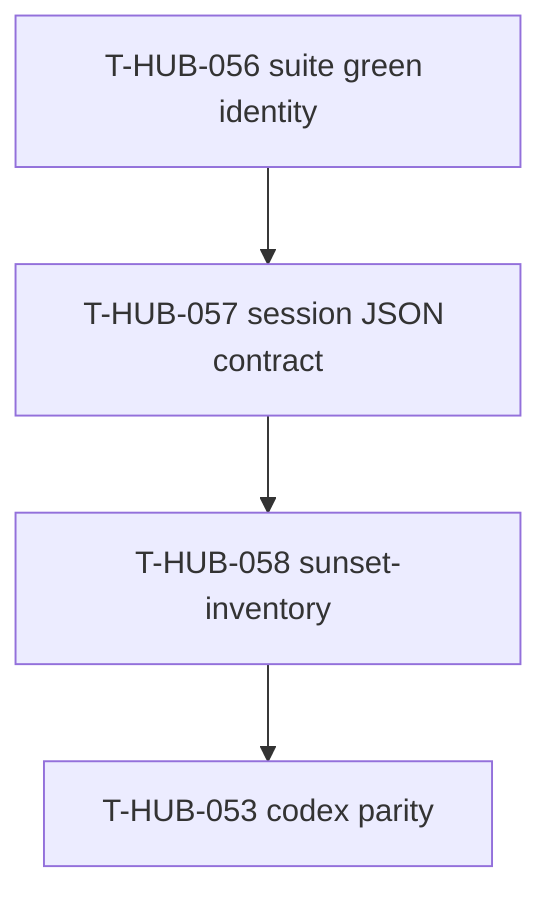

# Roadmap: loop-session-contract epics

**Дата:** 2026-09-02  
**Роль:** BACK PLAN  
**Назначение:** канон сессии loop — mb-load start → JSON agents → verify/repair → mb-finish.  
**Machine queue (slug):** [`roadmap-loop-session-contract-epics.queue.yaml`](roadmap-loop-session-contract-epics.queue.yaml)  
**Loop canon (после MERGE):** [`roadmap-epics.queue.yaml`](roadmap-epics.queue.yaml)

---

## 0. Epic cut

| Порядок | ID | План | Суть | In scope | Out of scope |
|---------|-----|------|------|----------|--------------|
| 1 | T-HUB-057 | [plan-T-HUB-057-loop-session-json-contract.md](plan-T-HUB-057-loop-session-json-contract.md) | Единый machine path сессии: start load + JSON+pydantic + repair + finish hint + mb-finish | loop hooks, mb_load/mb_finish wire, stop-gate | Codex parity (053), suite hygiene (054–056), pack paths (050) |
| 2 | T-HUB-058 | [plan-T-HUB-058-sunset-inventory-agent.md](plan-T-HUB-058-sunset-inventory-agent.md) | Subagent sunset-inventory (as-built → REPLACE JSON); после 057 | agent + schema + decompose scope | дизайн нового SoT |

## 1. Зависимости

| От | К | Тип | Почему |
|----|---|-----|--------|
| T-HUB-056 | T-HUB-057 | hard | Suite/identity green до смены session contract |
| T-HUB-057 | T-HUB-058 | hard | Session contract → затем sunset-inventory agent |
| T-HUB-058 | T-HUB-053 | hard | Agent materialize до Codex parity |

## 2. Порядок выполнения (канон)

После MERGE: … → T-HUB-056 → **T-HUB-057** → **T-HUB-058** → T-HUB-053 → …

## 3. Handoff

- Next после PLAN: `BACK DECOMPOSE T-HUB-057-loop-session-json-contract`
- Soft reuse: `loop/mb_load`, `loop/mb_finish` (T-HUB-040/045 marked done в canon skip — модули есть; 057 = enforce + purge dual path)
