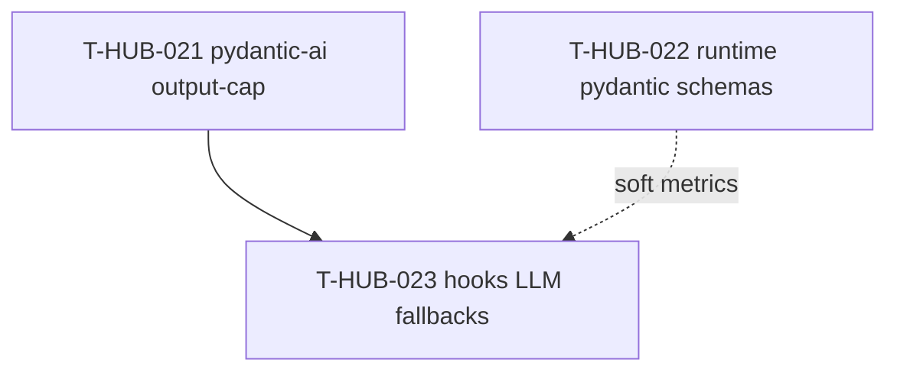

# Roadmap: pydantic-reliability epics

**Дата:** 2026-08-30  
**Роль:** BACK PLAN  
**Назначение:** повышение надёжности hub runtime через **pydantic-ai** (единственный Python LLM-call) и **Pydantic v2 schemas** (state/checkpoint/events/board) + опциональные LLM-fallback в hooks.  
**Machine queue:** [`roadmap-pydantic-reliability-epics.queue.yaml`](roadmap-pydantic-reliability-epics.queue.yaml)  
**Источник:** анализ as-built 2026-08-30 (chat): `bash-output-cap.py`, `epic_yaml.py`, `epic/core.py` state, `board_sync/card_model.py`.

**Skills used (PLAN):** writing-plans · architecture-patterns · python-testing-patterns · brainstorming (batch decisions, no HARD-GATE) · async-python-patterns (pydantic-ai provider)

---

## 0. Epic cut

| Порядок | ID | План | Суть | In scope | Out of scope |
|---------|-----|------|------|----------|--------------|
| 1 | T-HUB-021 | [plan-T-HUB-021-pydantic-ai-output-cap.md](plan-T-HUB-021-pydantic-ai-output-cap.md) | Shared pydantic-ai client + structured `LogSummary` в `bash-output-cap`; pin deps; OmniRoute OpenAI-compatible | `.claude/hooks/llm_structured.py`, `bash-output-cap.py`, `requirements-hub.txt`, `loop/tests/test_llm_structured.py`, `project.env` contract | Runtime state schemas; hook fallbacks; Claude/DSH agent orchestration |
| 2 | T-HUB-022 | [plan-T-HUB-022-runtime-pydantic-schemas.md](plan-T-HUB-022-runtime-pydantic-schemas.md) | Pydantic models для `loop-state/v2`, checkpoint, `events.jsonl`, `mb-board-card/v1`; validate on read/write | `loop/schemas/**`, `epic/core.py` load/save, `epic_events.py`, `board_sync/card_model.py`, migration helpers | pydantic-ai; LLM fallbacks |
| 3 | T-HUB-023 | [plan-T-HUB-023-hooks-llm-fallbacks.md](plan-T-HUB-023-hooks-llm-fallbacks.md) | Opt-in LLM fallback когда regex/детерминизм не справился (Handoff, abort classify, VERDICT) | `epic/core.py` extractors, `session_resilience.py`, env flags, metrics hook points | Замена happy-path regex; main loop agents; board enrichments (019) |

**Критерии cut (multi-epic):**

1. **Разные полосы приоритета:** P0 structured LLM summary (021) → P0 schema integrity (022) → P1 optional fallbacks (023).
2. **Разные деревья:** LLM client vs validation layer vs optional repair path.
3. **Разные риски:** network/cost/latency (021/023) vs schema migration/backward compat (022).
4. **Hard-dep:** 023 бессмысленен без shared client из 021.
5. **Independent deliverable:** 021 и 022 можно ship/QA отдельно; 023 — только после 021.

---

## 1. Зависимости

| От | К | Тип | Почему |
|----|---|-----|--------|
| T-HUB-021 | T-HUB-023 | hard | Shared `llm_structured` Agent + provider config |
| T-HUB-022 | T-HUB-023 | soft | Fallback может писать `diagnostic_code` в validated state |
| T-HUB-017 | T-HUB-023 | soft | Incident log может принимать `llm_fallback_used` events (если 017 уже в canon) |
| T-HUB-019 | — | — | board descriptions — templates, не LLM; без пересечения |

**Параллелизм:** 021 и 022 могут идти параллельно разными сессиями; queue order 021→022→023 — narrative приоритет (сначала видимый ROI в output-cap).

---

## 2. Порядок выполнения (канон)

1. **T-HUB-021** → DECOMPOSE → IMPLEMENT → AUDIT → QA → REFLECT  
2. **T-HUB-022** → … (можно стартовать параллельно с 021 после s01 pin-deps)  
3. **T-HUB-023** → … (только после 021 EPIC_DONE или минимум s04 client merged)

После PLAN: `BACK ROADMAP MERGE` → canon `roadmap-epics.queue.yaml` → `BACK DECOMPOSE T-HUB-021`.

---

## 3. Статус (human mirror)

| Артефакт | Статус |
|----------|--------|
| **Этот roadmap** | active |
| **`.queue.yaml`** | machine canon для loop (после MERGE) |
| plan-T-HUB-021 | PLAN done · next DECOMPOSE |
| plan-T-HUB-022 | PLAN done · next после 021 (queue) или parallel |
| plan-T-HUB-023 | PLAN done · hard dep 021 |

---

## 4. Do Not Touch (все эпики)

- Epic loop orchestration (Claude Code / DSH) — не переносить в Python agents.
- `epic_yaml.py` / `epic_shard_extra.py` shard schemas — уже Pydantic; не дублировать в 022 без need.
- Parent-only front tests; §0.0 plan economy; ONE Handoff; `finalize-step` canon.
- Не default-on LLM fallbacks на hot path (023).
- Не заменять `extract_verdict` regex на LLM без env flag + happy-path unchanged.

---

## 5. Handoff

- Next: `BACK ROADMAP MERGE` (slug pydantic-reliability) → `BACK DECOMPOSE T-HUB-021`
