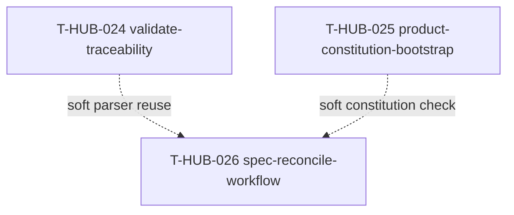

# Roadmap: spec-maturity epics

**Дата:** 2026-08-30  
**Роль:** BACK PLAN  
**Назначение:** закрыть «вторую волну» spec-driven зрелости hub: machine-enforced traceability FR→sNN→tests, bootstrap constitution в продуктах, лёгкий RECONCILE без full AUDIT.  
**Machine queue:** [`roadmap-spec-maturity-epics.queue.yaml`](roadmap-spec-maturity-epics.queue.yaml)  
**Источник:** chat gap-analysis 2026-08-30 (SDD vs dev-hub workflow); as-built T-HUB-011 ANALYZE passes; T-HUB-013 constitution (hub-only); product repos без `memory-bank/constitution.md`.

**Skills used (PLAN):** writing-plans · architecture-patterns · python-testing-patterns · brainstorming (batch epic cut, no HARD-GATE)

---

## 0. Epic cut

| Порядок | ID | План | Суть | In scope | Out of scope |
|---------|-----|------|------|----------|--------------|
| 1 | T-HUB-024 | [plan-T-HUB-024-validate-traceability.md](plan-T-HUB-024-validate-traceability.md) | CLI `validate-traceability`: FR/SC/US → sNN `plan_refs` → implement evidence/tests; optional `@pytest.mark.ac`; loop/CI gate | `epic_resolve.py`, `epic/traceability.py`, `loop/tests/`, workflow DECOMPOSE/PLAN refs | Product-specific inventory (ai-server T-058); full codegen from spec |
| 2 | T-HUB-025 | [plan-T-HUB-025-product-constitution-bootstrap.md](plan-T-HUB-025-product-constitution-bootstrap.md) | `seed-constitution` для `$PROJECT_ROOT`; VAN gate «constitution required L2+»; ANALYZE pass не skip | `epic_resolve.py`, `.cursor/templates/constitution.md`, VAN workflow, loop/tests | Переписывание hub `memory-bank/constitution.md`; product-specific MUST content |
| 3 | T-HUB-026 | [plan-T-HUB-026-spec-reconcile-workflow.md](plan-T-HUB-026-spec-reconcile-workflow.md) | `BACK RECONCILE` read-only + `reconcile-spec` script; appetite fields в plan/decompose schema | новый workflow + template fields + `epic/reconcile.py` | Full AUDIT replacement; deploy/observability DORA; OpenAPI-first |

**Критерии cut (multi-epic):**

1. **Разные полосы:** P0 machine traceability (024) → P0 product constitution onboarding (025) → P1 periodic drift reconcile (026).
2. **Разные деревья:** epic_resolve validation layer vs template/bootstrap vs workflow mode.
3. **Разные риски:** false-positive CI blocks (024) vs product governance (025) vs read-only drift noise (026).
4. **Hard-dep:** нет между 024/025/026 — независимые deliverables.
5. **Soft-dep:** 026 полезнее после 024 (reuse parsers) и 025 (constitution findings in reconcile report).

---

## 1. Зависимости

| От | К | Тип | Почему |
|----|---|-----|--------|
| T-HUB-024 | T-HUB-026 | soft | Reconcile может переиспользовать traceability parsers |
| T-HUB-025 | T-HUB-026 | soft | Reconcile report может включать constitution presence |
| T-HUB-011 | T-HUB-024 | soft | ANALYZE underspecification pass — semantic overlap, не blocker |
| T-HUB-013 | T-HUB-025 | soft | Template + hub starter уже есть |

**Параллелизм:** 024 и 025 могут идти параллельно; queue order 024→025→026 — narrative (сначала enforcement, потом governance, потом maintenance).

---

## 2. Порядок выполнения (канон)

1. **T-HUB-024** → DECOMPOSE → IMPLEMENT → AUDIT → QA → REFLECT  
2. **T-HUB-025** → … (parallel OK с 024)  
3. **T-HUB-026** → … (после или parallel late s01 с 024)

После PLAN: `BACK ROADMAP MERGE` → canon `roadmap-epics.queue.yaml` → `BACK DECOMPOSE T-HUB-024`.

---

## 3. Статус (human mirror)

| Артефакт | Статус |
|----------|--------|
| **Этот roadmap** | active |
| **`.queue.yaml`** | machine canon для loop (после MERGE) |
| plan-T-HUB-024 | PLAN done · next DECOMPOSE |
| plan-T-HUB-025 | PLAN done · next после MERGE |
| plan-T-HUB-026 | PLAN done · next после 024/025 (queue) |

---

## 4. Do Not Touch (все эпики)

- Замена ANALYZE или AUDIT — только дополнение и tooling.
- `finalize-step` / `@verify` canon — не ослаблять.
- Parent-only FRONT tests (MUST-3).
- §0.0 plan economy — plan artifacts не резать.
- Не default-on blocking CI на всех product repos без opt-in flag.

---

## 5. Handoff

- **Next:** `BACK ROADMAP MERGE` → затем `BACK DECOMPOSE T-HUB-024`
- **New chat:** yes после MERGE
