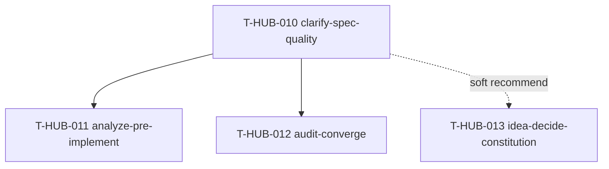

# Roadmap: speckit-workflow-boost epics (единый канон)

**Дата:** 2026-08-23  
**Роль:** BACK PLAN  
**Назначение:** карта «что за чем»; **не** заменяет полные `plan-<epic_id>-*.md`.  
**Machine queue (slug, источник):** [`roadmap-speckit-workflow-boost-epics.queue.yaml`](roadmap-speckit-workflow-boost-epics.queue.yaml)  
**Loop canon (после MERGE):** [`roadmap-epics.queue.yaml`](roadmap-epics.queue.yaml) — @.cursor/rules/shared/workflow-roadmap-merge.mdc  
**Research / вход:** локальный клон [`spec-kit/`](../../../spec-kit/) (github/spec-kit) + сравнительный анализ с `.cursor/rules` / memory-bank hub workflow (чат 2026-08-23).  
**Принцип внедрения:** **паттерны, не vendor.** FORBIDDEN: `specify init`, замена `memory-bank/` на `specs/`, Spec Kit constitution Articles I–IX, install `specify-cli` в product repos. Источник идей: `spec-kit/templates/commands/{clarify,analyze,converge}.md`, `spec-kit/templates/spec-template.md`, `spec-kit/extensions/assess/`.

---

## 0. Re-analysis (кратко → детали в планах эпиков)

### Что уже сильнее у нас

| Зона | Наш канон | Spec Kit |
|------|-----------|----------|
| Роли / wire | BACK · FRONT · INTEG + GAP/CLOSE | один SDD-поток |
| Нарезка | `decompose-*/sNN|eNN.yaml` + AC/TDD/deletes | `tasks.md` checklist |
| Контекст | lean `load_now`, ONE Handoff, session economy | feature-dir dump |
| Сходимость post-impl | `* AUDIT` step_id матрица | `/speckit.converge` code↔FR |
| Автоматизация | loop + roadmap queue + hooks | CLI + slash |
| Code map | graphify | нет |

### Дыры (закрываем этим roadmap)

| # | Дыра | Spec Kit аналог | Эпик |
|---|------|-----------------|------|
| 1 | Нет явного gate «снять ambiguity до PLAN»; агент догадывается | `/speckit.clarify` + `[NEEDS CLARIFICATION]` | T-HUB-010 |
| 2 | PLAN-шаблон слабо разделяет WHAT vs HOW; нет Independent Test / SC | `spec-template.md` | T-HUB-010 |
| 3 | Нет cross-artifact анализа **до** IMPLEMENT (plan↔decompose coverage) | `/speckit.analyze` | T-HUB-011 |
| 4 | AUDIT = step_id presence; слабо: severity, FR/AC trace, `partial`/`contradicts`/`unrequested` | `/speckit.converge` | T-HUB-012 |
| 5 | IDEA PIPELINE нет явного go/kill; нет тонкого MUST-constitution для ANALYZE/AUDIT | assess `decide` + `constitution` | T-HUB-013 |

### Epic cut (критерии multi-epic)

| # критерия | Применение |
|------------|------------|
| 1 Приоритет | P0 foundation (010) → P1 pre-impl gate (011) → P2 post-impl (012) → P3 idea/governance (013) |
| 2 Дерево артефактов | templates+CLARIFY ≠ DECOMPOSE finish ANALYZE ≠ AUDIT schema ≠ IDEA+constitution |
| 4 Hard-dep | 011 и 012 требуют FR/AC/маркеры из 010 |
| 5 Independent deliverable | 013 ship без 011/012; 010 ship без остальных |

---

## 0b. Epic cut table

| Порядок | ID | План | Суть | In scope | Out of scope |
|---------|-----|------|------|----------|--------------|
| 1 | T-HUB-010 | [plan-T-HUB-010-clarify-spec-quality.md](plan-T-HUB-010-clarify-spec-quality.md) | CLARIFY + маркеры + WHAT/HOW в plan templates | rules/templates/slash для CLARIFY (BACK/FRONT/INTEG); plan.md / integration-plan.md секции | ANALYZE, AUDIT schema, IDEA decide, specify-cli |
| 2 | T-HUB-011 | [plan-T-HUB-011-analyze-pre-implement.md](plan-T-HUB-011-analyze-pre-implement.md) | ANALYZE после DECOMPOSE до IMPLEMENT | workflow ANALYZE, artifact, finish-doc-router, DECOMPOSE handoff tip | code-vs-FR (это 012), clarify UX |
| 3 | T-HUB-012 | [plan-T-HUB-012-audit-converge.md](plan-T-HUB-012-audit-converge.md) | AUDIT += converge semantics | epic-audit.yaml v2 fields, workflow-audit×3, lean gates | rewrite AUDIT в отдельный CONVERGE command; git-diff converge |
| 4 | T-HUB-013 | [plan-T-HUB-013-idea-decide-constitution.md](plan-T-HUB-013-idea-decide-constitution.md) | IDEA go/kill + thin constitution | idea-pipeline + template; `memory-bank/constitution.md`; refs из ANALYZE/AUDIT | Spec Kit Articles; PM restore; full assess 5-step clone |

---

## 1. Зависимости

| От | К | Тип | Почему |
|----|---|-----|--------|
| T-HUB-010 | T-HUB-011 | hard | ANALYZE требует FR-/AC- / `[НУЖНО УТОЧНИТЬ]` и Clarifications-секцию |
| T-HUB-010 | T-HUB-012 | hard | converge FR/AC source-ref и severity опираются на ID из шаблонов 010 |
| T-HUB-010 | T-HUB-013 | soft | constitution ссылается на markers; IDEA decide может жить без 010 |
| T-HUB-011 | T-HUB-012 | soft | ANALYZE findings можно цитировать в AUDIT; не обязательно |

`hard` → в `.queue.yaml` `deps`. soft — только здесь.

---

## 2. Порядок выполнения (канон)

Один эпик за раз. Машинный порядок = `.queue.yaml` `queue[]`.

1. **T-HUB-010** → DECOMPOSE → IMPLEMENT → AUDIT → QA → REFLECT  
2. **T-HUB-011** (после 010) → …  
3. **T-HUB-012** (после 010; можно сразу после 011 или параллельно в queue после 010 ready) → …  
4. **T-HUB-013** (deps `[]` — может стартовать параллельно с 010, но **рекомендуемый** порядок после 010; в queue стоит после 012 для предсказуемости loop)

---

## 3. Статус (human mirror)

| Артефакт | Статус |
|----------|--------|
| **Этот roadmap** | active (PLAN done) |
| **`.queue.yaml`** | slug source; ждать `BACK ROADMAP MERGE` |
| plan-T-HUB-010…013 | PLAN done · next MERGE → DECOMPOSE 010 |

Done для loop = QA pass + REFLECT (+ queue), не текст этой таблицы.

---

## 4. Handoff

- Next: `BACK ROADMAP MERGE` → затем `BACK DECOMPOSE` первого из **canon** `roadmap-epics.queue.yaml` (**T-HUB-010**, если MERGE ставит хвост queue после существующих T-HUB-002…009)
- Loop: `EPIC_CHAIN_ROADMAP=1` → `roadmap-advance` читает **только** canon
- New chat после PLAN (context-session-economy)
- Recommend tool: Claude Code + premium-coding для DECOMPOSE/IMPLEMENT этого roadmap (много rules)

---

## 5. Acceptance roadmap (meta)

- [ ] 4 полных `plan-T-HUB-01x-*.md` без telegraph-сжатия  
- [ ] sibling `.queue.yaml` version `roadmap-queue/v1`  
- [ ] В каждом плане: FR/NFR/AC+/AC−, файлы, черновик sNN, Replacement, CREATIVE need, Do Not Touch  
- [ ] Явный FORBIDDEN: install Spec Kit CLI / specs/ migration  
