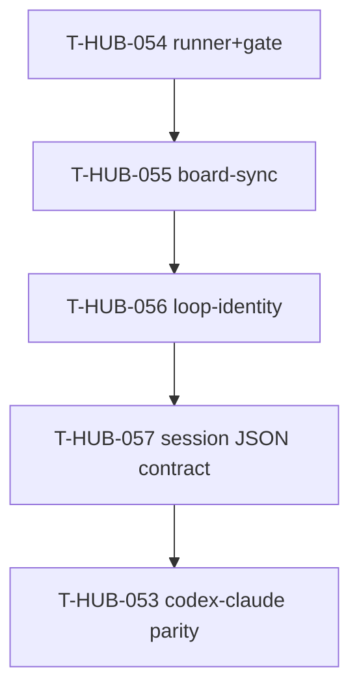

# Roadmap: suite-hygiene epics (единый канон)

**Дата:** 2026-09-02  
**Роль:** BACK PLAN  
**Назначение:** карта эпиков восстановления зелёного full suite после leftover’ов прошлых cutover (T-HUB-020/023/029/039/040/041/044).  
**Machine queue (slug, источник):** [`roadmap-suite-hygiene-epics.queue.yaml`](roadmap-suite-hygiene-epics.queue.yaml)  
**Loop canon (после MERGE):** [`roadmap-epics.queue.yaml`](roadmap-epics.queue.yaml)

**Исходный анализ (PLAN session):**

| Источник | Результат |
|----------|-----------|
| QA T-HUB-044 | `bin/pytest` — 59 failed (устаревший снимок; BUGFIX suite не чинил) |
| `/tmp/pytest-full.txt` (ранний) | 67 failed — pollution + hang без `pytest-timeout` |
| Inventory isolation (64 alive nodeids) | 6 hard-fail |
| **Fresh full suite 2026-09-02** | **`19 failed, 1551 passed, 2 skipped`** ← **канон fail-list для эпиков** |

---

## 0. Epic cut

| Порядок | ID | План | Суть | In scope | Out of scope |
|---------|-----|------|------|----------|--------------|
| 1 | T-HUB-054 | [plan-T-HUB-054-suite-hygiene-runner-gate.md](plan-T-HUB-054-suite-hygiene-runner-gate.md) | Runner hygiene + gate-contract leftovers (JSON verdict / phase agents / stop-gate) | `pytest-timeout`, sc006, stop_gate VERDICT-first, phase_verify stubs | board_sync, doctor, arm stem |
| 2 | T-HUB-055 | [plan-T-HUB-055-suite-green-board-sync.md](plan-T-HUB-055-suite-green-board-sync.md) | Добить sunset step→epic cards (T-HUB-020 s06) | `run_sync` desired set, archive step-era, regression/CLI tests | gate JSON, doctor |
| 3 | T-HUB-056 | [plan-T-HUB-056-suite-green-loop-identity.md](plan-T-HUB-056-suite-green-loop-identity.md) | Loop identity / prepare / drift / doctor / episode | epic_id plan stem, context_loop fixtures, drift_display, incidents_doctor, episode_wire | board archive pipeline |

**Критерии cut:** разные деревья кода (hooks/agents vs `board_sync/` vs `context_loop`/doctor); разный риск (contract assert vs sync mutation vs process/path fixtures). Порядок в canon: **054 → 055 → 056 → 057 → 053 → …** (057 после suite green; 053 hard-dep на 057).

---

## 1. Зависимости

| От | К | Тип | Почему |
|----|---|-----|--------|
| T-HUB-054 | T-HUB-055 | hard | Стабильный per-test timeout + единый fail-list protocol до board e2e |
| T-HUB-055 | T-HUB-056 | hard | Board green до loop-identity/full-suite SC |
| T-HUB-056 | T-HUB-057 | hard | Suite green до session JSON contract |
| T-HUB-057 | T-HUB-053 | hard | Session contract до Codex≡Claude parity; canon: 054→055→056→057→053→… |

---

## 2. Порядок выполнения (канон)

1. **T-HUB-054** → DECOMPOSE → IMPLEMENT → AUDIT → QA  
2. **T-HUB-055** → … → QA  
3. **T-HUB-056** → … → QA (**SC: `bin/pytest` 0 failed**)  
4. **T-HUB-053** → … (и дальше queue: 046…)

---

## 3. Статус (human mirror)

| Артефакт | Статус |
|----------|--------|
| **Этот roadmap** | active |
| **`.queue.yaml`** | machine source → merge в canon |
| plan-T-HUB-054 | PLAN done · next DECOMPOSE |
| plan-T-HUB-055 | PLAN done · queued |
| plan-T-HUB-056 | PLAN done · queued |

---

## 4. Handoff

- Next после PLAN: `BACK DECOMPOSE T-HUB-054-suite-hygiene-runner-gate` (первый в canon после merge)
- Не `ROADMAP MERGE` отдельной командой — merge выполнен в сессии PLAN
- T-HUB-053 остаётся в canon; suite-hygiene вставляется как P0 hygiene хвост (merge append/order — см. queue)

---

## 5. Method lock (все 3 эпика)

Для **каждого** падающего теста:

1. Найти implement yaml (`rg` по `tests:` / `files:` / имени теста в `memory-bank/back/implement/**`).  
2. Прочитать AC/checkpoints/deletes того шага.  
3. Класс: **LEGACY** (удалить/rewrite тест) · **REGRESSION** (подтянуть assert под новый контракт) · **PROD** (чинить код под implement AC).  
4. **FORBIDDEN:** чинить prod под obsolete assert; silent skip; dual-path «чтобы green».
