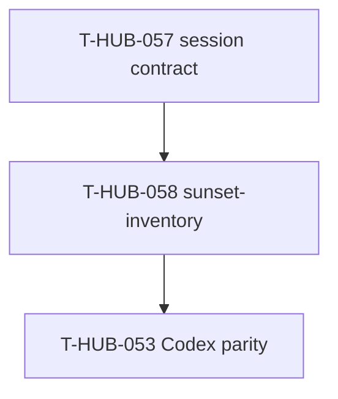

# Roadmap: sunset-inventory-agent epics

**Дата:** 2026-09-03  
**Роль:** BACK PLAN  
**Назначение:** карта эпиков агента sunset-inventory (as-built → REPLACE inventory, без design contamination).  
**Machine queue (slug):** [`roadmap-sunset-inventory-agent-epics.queue.yaml`](roadmap-sunset-inventory-agent-epics.queue.yaml)  
**Loop canon (после MERGE):** [`roadmap-epics.queue.yaml`](roadmap-epics.queue.yaml)

---

## 0. Epic cut

| Порядок | ID | План | Суть | In scope | Out of scope |
|---------|-----|------|------|----------|--------------|
| 1 | T-HUB-058 | [plan-T-HUB-058-sunset-inventory-agent.md](plan-T-HUB-058-sunset-inventory-agent.md) | Subagent `sunset-inventory`: READ-ONLY inventory as-built → JSON report с mark REPLACE; scope в decompose; parent не проектирует от старого кода | agent + schema + registry/manifest + workflow/decompose field + tests | Дизайн нового SoT; auto-delete кода; замена explorer |

---

## 1. Зависимости

| От | К | Тип | Почему |
|----|---|-----|--------|
| T-HUB-057 | T-HUB-058 | hard | После session JSON contract / wire-complete canon |
| T-HUB-058 | T-HUB-053 | hard | Новый agent должен materialize в Codex parity |

---

## 2. Порядок выполнения (канон)

1. **T-HUB-058** → DECOMPOSE → IMPLEMENT → QA  

---

## 3. Статус (human mirror)

| Артефакт | Статус |
|----------|--------|
| roadmap + queue slug | PLAN done |
| plan-T-HUB-058 | PLAN done → next DECOMPOSE |

---

## 4. Next

- После MERGE: `BACK DECOMPOSE T-HUB-058-sunset-inventory-agent`
