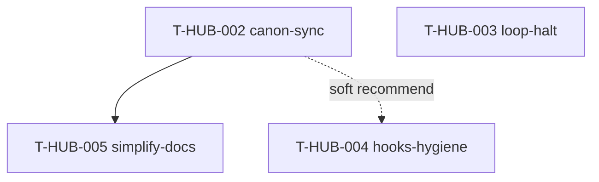

# Roadmap: workflow-loop-hardening epics

**Дата:** 2026-08-16  
**Роль:** BACK PLAN  
**Назначение:** карта эпиков по аудиту `memory-bank/audit/workflow-loop-20260816/` — канон docs/rules, halt loop, hygiene hooks, упрощение DX.  
**Machine queue:** [`roadmap-workflow-loop-hardening-epics.queue.yaml`](roadmap-workflow-loop-hardening-epics.queue.yaml)  
**Research:** [audit index](../../audit/workflow-loop-20260816/index.md) · [contradictions](../../audit/workflow-loop-20260816/contradictions.md) · [hooks-legacy](../../audit/workflow-loop-20260816/hooks-legacy.md) · [loop-reliability](../../audit/workflow-loop-20260816/loop-reliability.md) · [audit roadmap](../../audit/workflow-loop-20260816/roadmap.md)

**Skills used (PLAN):** writing-plans · brainstorming (batch decisions, no HARD-GATE) · python-testing-patterns (для AC тестов loop/hooks)

---

## 0. Epic cut

| Порядок | ID | План | Суть | In scope | Out of scope |
|---------|-----|------|------|----------|--------------|
| 1 | T-HUB-002 | [plan-T-HUB-002-canon-sync.md](plan-T-HUB-002-canon-sync.md) | Единый канон docs/rules: CLAUDE leftovers, dual role-command, front-tests.mdc, archive FAIL-fast, graphify exceptions | `.cursor/rules`, `CLAUDE.md`, `.claude/skills|rules|commands` (тексты), `.agents/skills/role-command`, IDEA archive gate text | Код loop/hooks; vendor полного `_archive/`; split monoliths |
| 2 | T-HUB-003 | [plan-T-HUB-003-loop-halt.md](plan-T-HUB-003-loop-halt.md) | Halt-parity `check-after` + единый runtime root `last-session` + docs runtime + architecture gaps | `loop/loop.sh`, `session_resilience.last_session_path`, loop tests, runtime docs, `architecture/workers.md` | Policy spawn/verdict; удаление epic re-exports; Cursor hooks wiring |
| 3 | T-HUB-004 | [plan-T-HUB-004-hooks-hygiene.md](plan-T-HUB-004-hooks-hygiene.md) | `extract_verdict`, NEED_HUMAN messaging, registry dual-path, dead re-exports, posttool swallow, alias explore | `.claude/hooks/**`, связанные `loop/tests`, spawn-hard text sync | Архитектурный split `_lib`/`epic/core`; Cursor hooks epic parity |
| 4 | T-HUB-005 | [plan-T-HUB-005-simplify-docs.md](plan-T-HUB-005-simplify-docs.md) | Cheatsheets, меньше hop-count дублей, IDEA gate, `projects/` README | Cheatsheet files, pointer-дубли SUSPENSION, IDEA gate, projects README | Split `epic/core` / `_lib`; изменение поведения gates |

**Критерии cut (audit):**  
1) полосы P0 vs P1 vs P2;  
2) разные деревья (rules/docs vs loop runtime vs hooks code vs DX docs);  
3) разные риски (ложные команды / бесконечный loop / false PASS / сопровождение);  
5) независимый ship (002 docs можно QA без 003).

---

## 1. Зависимости

| От | К | Тип | Почему |
|----|---|-----|--------|
| T-HUB-002 | T-HUB-005 | hard | cheatsheets/pointers должны ссылаться на уже выровненный канон |
| T-HUB-002 | T-HUB-004 | soft | единый текст NEED_HUMAN в docs до/вместе с кодом; код может идти параллельно |
| T-HUB-003 | — | — | независим от 002/004 |

---

## 2. Порядок выполнения (канон)

Один эпик за раз. Машинный порядок = `.queue.yaml` `queue[]`.

1. **T-HUB-002** → DECOMPOSE → IMPLEMENT → AUDIT → QA → REFLECT  
2. **T-HUB-003** → …  
3. **T-HUB-004** → …  
4. **T-HUB-005** → …  

---

## 3. Статус (human mirror)

| Артефакт | Статус |
|----------|--------|
| **Этот roadmap** | active |
| **`.queue.yaml`** | machine canon для loop |
| plan-T-HUB-002 | PLAN done · next DECOMPOSE |
| plan-T-HUB-003 | PLAN done · next после 002 (queue) |
| plan-T-HUB-004 | PLAN done · next после 003 |
| plan-T-HUB-005 | PLAN done · next после 004 (+ hard dep 002) |

---

## 4. Do Not Touch (все эпики)

См. audit roadmap §«Не трогать»: §0.0, plan-artifact, load_now, ONE Handoff, yaml FINISH+verify+finalize, multi-epic queue, parent-only front tests (смысл), graphify single root, silent tools, loop flock + model_substitution HALT, agents verify/reviewer/explorer defs.

---

## 5. Handoff

- Next: `BACK DECOMPOSE T-HUB-002`  
- Loop chain: `EPIC_CHAIN_ROADMAP=1` → `roadmap-advance` читает **только** `.queue.yaml`
