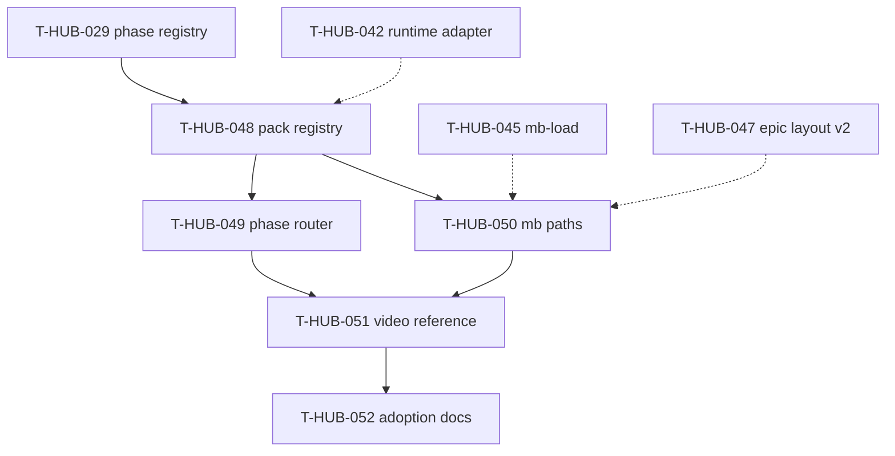

# Roadmap: workflow-pack-framework epics (единый канон)

**Дата:** 2026-09-02  
**Роль:** BACK PLAN  
**Назначение:** карта «что за чем» для plug-in **Workflow Pack** — подключение любого производственного pipeline (software, video, content, ops) к harness engine без fork loop/orchestration. **Не** заменяет полные `plan-T-HUB-048…052-*.md`.  
**Machine queue (slug, источник):** [`roadmap-workflow-pack-framework-epics.queue.yaml`](roadmap-workflow-pack-framework-epics.queue.yaml)  
**Loop canon (после MERGE):** [`roadmap-epics.queue.yaml`](roadmap-epics.queue.yaml) — @.cursor/rules/shared/workflow-roadmap-merge.mdc  
**Кontext / решения:** чат 2026-09-02 — Workflow Pack Gate поверх harness engine; ортогонально RuntimeAdapter (T-HUB-042); default pack = текущий dev-hub-software (BACK/FRONT/INTEG).

---

## 0. Epic cut

| Порядок | ID | План | Суть | In scope | Out of scope |
|---------|-----|------|------|----------|--------------|
| 1 | T-HUB-048 | [plan-T-HUB-048-workflow-pack-registry.md](plan-T-HUB-048-workflow-pack-registry.md) | `workflow_pack_registry.yaml` + pydantic loader + `resolve_workflow_pack()` + default `dev-hub-software` | registry schema, CLI resolve, fail-closed, project config hook | command router, mb-load paths |
| 2 | T-HUB-049 | [plan-T-HUB-049-workflow-pack-phase-router.md](plan-T-HUB-049-workflow-pack-phase-router.md) | Pack-scoped phase registry + dynamic role prefixes + harness command gate | `load_phase_registry(pack)`, purge `_ROLE_PREFIXES` hardcode, gates_from_phase pack-aware | memory-bank path resolver |
| 3 | T-HUB-050 | [plan-T-HUB-050-workflow-pack-memory-bank-paths.md](plan-T-HUB-050-workflow-pack-memory-bank-paths.md) | Pack-scoped memory-bank + mb-load/mb-finish/mb-scaffold integration | `resolve_mb_root(pack)`, forbidden policy per pack, activeContext shape | reference non-software pack |
| 4 | T-HUB-051 | [plan-T-HUB-051-workflow-pack-reference-video.md](plan-T-HUB-051-workflow-pack-reference-video.md) | Reference pack `video-production` + external tool gate pattern + rules skeleton | phases BRIEF→PUBLISH, verify agents, ffmpeg gate adapter, e2e pytest | Premiere/DaVinci UI, cloud render farm |
| 5 | T-HUB-052 | [plan-T-HUB-052-workflow-pack-adoption-docs.md](plan-T-HUB-052-workflow-pack-adoption-docs.md) | IDEA PIPELINE pack routing + doctor + runbook + hub-link pack install | intent→pack table, preflight, operator docs | marketplace / remote pack registry |

---

## 1. Зависимости

| От | К | Тип | Почему |
|----|---|-----|--------|
| T-HUB-029 | T-HUB-048 | hard | pack default embeds existing `phase_registry.yaml`; transition engine must be registry-driven |
| T-HUB-042 | T-HUB-048 | soft | pattern parity (registry + pydantic loader); not blocking |
| T-HUB-048 | T-HUB-049 | hard | phase router reads pack row |
| T-HUB-048 | T-HUB-050 | hard | mb paths read pack row |
| T-HUB-045 | T-HUB-050 | soft | mb-load integration extends existing API |
| T-HUB-047 | T-HUB-050 | soft | epic layout v2 resolver should be pack-aware |
| T-HUB-049 | T-HUB-051 | hard | video phases need dynamic prefix routing |
| T-HUB-050 | T-HUB-051 | hard | video artifacts under pack memory-bank root |
| T-HUB-051 | T-HUB-052 | hard | adoption docs describe shipped reference pack |
| T-HUB-044 | T-HUB-052 | soft | doctor/runbook pattern reuse |

---

## 2. Архитектурный принцип (канон)

| Слой | Владелец | Меняется при новом pack? |
|------|----------|--------------------------|
| Epic orchestration | `loop/` prepare/check-after/halt | **нет** |
| Subagent semantics | spawn-hard + stop-gate + verify | **нет** |
| Session executor | `RuntimeAdapter` (`EPIC_RUNTIME`) | **нет** — ортогональная ось |
| **Domain pack** | `workflow_pack_registry.yaml` + pack manifest | **plug-in row** |
| Phase gates | pack's `phase_registry.yaml` | **да** — per pack |
| Role commands | pack's `rules_root` + prefixes | **да** — per pack |
| Memory-bank layout | pack's `memory_bank` + `artifact_layout` | **да** — per pack |

Default **`WORKFLOW_PACK=dev-hub-software`** (unset). Unknown pack → **fail-closed**, no silent fallback to software.

---

## 3. Порядок выполнения (канon)

Машинный порядок = `.queue.yaml` `queue[]`.

1. **T-HUB-048** → QA → REFLECT  
2. **T-HUB-049** → QA → REFLECT  
3. **T-HUB-050** → QA → REFLECT  
4. **T-HUB-051** → QA → REFLECT  
5. **T-HUB-052** → QA → REFLECT  

---

## 4. Статус (human mirror)

| Артефакт | Статус |
|----------|--------|
| Этот roadmap | active (2026-09-02) |
| `.queue.yaml` | machine canon для loop |
| plan-T-HUB-048…052 | PLAN done · next DECOMPOSE T-HUB-048 |

---

## 5. Handoff

- Next: `roadmap-merge --role back` (same session) → `BACK DECOMPOSE T-HUB-048-workflow-pack-registry`
